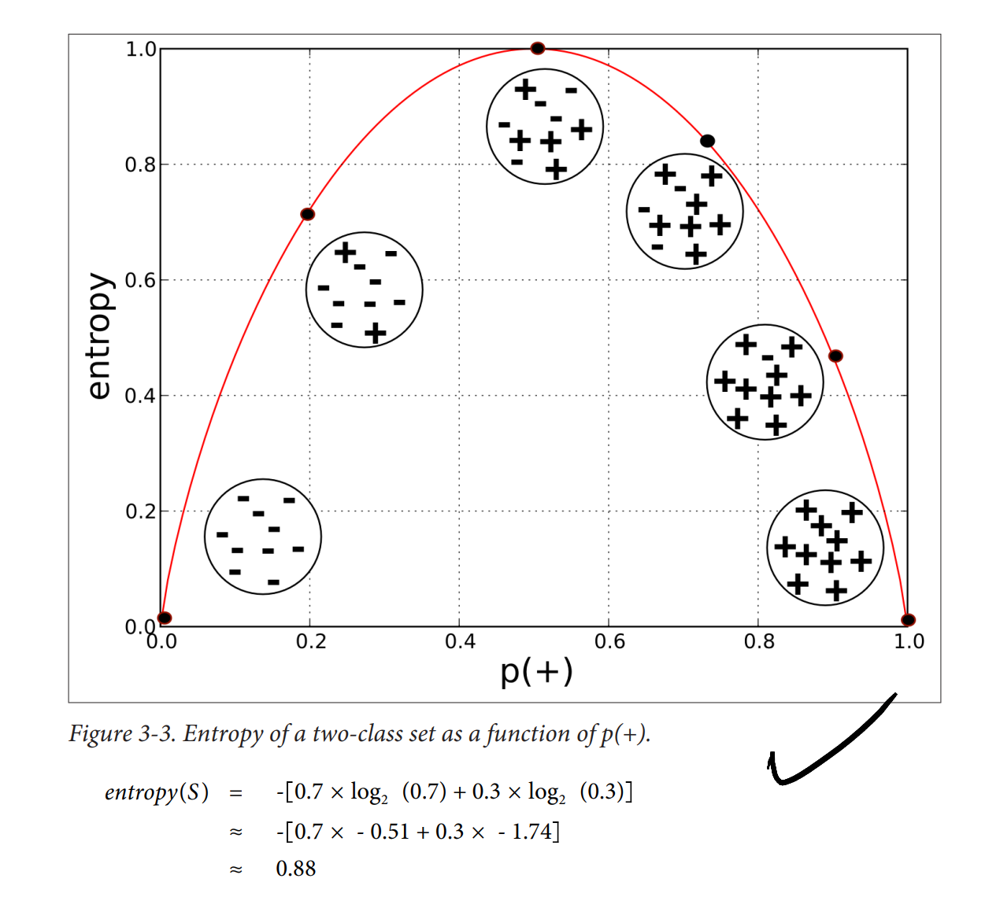

# Notes on Data Science for Business by Foster Provost and Tom Fawcett (2013)
- Notes by David Reinstein

This (2013) book seems to have some slightly outdated focus (terms like 'data-mining') but it is nonetheless very useful, both conceptually and in many specifics. It does a good job of giving actual insight into mathematical, statistical, and data-science techniques, and uses a reasonable amount of actual maths and some literal code. There is 'meat in this sandwich'.

## Terms like 'lift'

> As another example, in evaluating the utility of a pattern, we see a notion of lift— how much more prevalent a pattern is than would be expected by chance—recurring broadly across data science. It is used to evaluate very different sorts of patterns in different contexts. Algorithms for targeting advertisements are evaluated by computing the lift one gets for the targeted population. Lift is used to judge the weight of evidence for or against a conclusion. Lift helps determine whether a co-occurrence (an association) in data is interesting, as opposed to simply being a natural consequence of popularity.

## Introduction: Data-Analytic Thinking

Example: Hurricane Frances... predicting demand to gear inventory ... lead to huge profit for Wal-Mart...

> ‘We didn’t know in the past that strawberry PopTarts increase in sales, like seven times their normal sales rate, ahead of a hurricane"

> 1. Classification and class probability estimation attempt to predict, for each individual in a population, which of a (small) set of classes this individual belongs to. Usually the classes are mutually exclusive. An example classification question would be: “Among all the customers of MegaTelCo, which are likely to respond to a given offer?” In this example the two classes could be called will respond and will not respond.

### Example: Predicting Customer Churn

> Customers switching from one company to another is called churn,

> Your task is to devise a precise, step-by-step plan for how the data science team should use MegaTelCo’s vast data resources to decide which customers should be offered the special retention deal prior to the expiration of their contracts

### Data Science, Engineering, and Data-Driven Decision Making

> They show that statistically, the more data-driven a firm is, the more productive it is—even controlling for a wide range of possible confounding factors. And the differences are not small. One standard deviation higher on the DDD scale is associated with a 4%–6% increase in productivity. DDD also is correlated with higher return on assets, return on equity, asset utilization, and market value, and the relationship seems to be causal.

DR: I am still somewhat skeptical of the causality here

>  two types: (1) decisions for which “discoveries” need to be made within data, and (2) decisions that repeat, especially at massive scale, and so decision-making can benefit from even small increases in decision-making accuracy based on data analysis

Getting the jump on the competition ...

> Target wanted to get a jump on their competition. They were interested in whether they could predict that people are expecting a baby. If they could, they would gain an advantage by making offers before their competitors. Using techniques of data science, Target analyzed historical data on customers who later were revealed to have been pregnant, and were able to extract information that could predict which consumers were pregnant. For example, pregnant mothers often change their diets, their ward‐ robes, their vitamin regimens, and so on. These indicators could be extracted from historical data, assembled into predictive models, and then deployed in marketing campaigns.

### Data Processing and “Big Data”

### Data and Data Science Capability as a Strategic Asset

> a science: data, and the capability to extract useful knowledge from data, should be regarded as key strategic assets.

Signet Bank from the 1990s ... key example

> , but at the time, credit cards essentially had uniform pricing, for two reasons: (1) the companies did not have adequate information systems to deal with differential pricing at massive scale, and (2) bank management believed customers would not stand for price discrimination.

> could do more sophisti‐ cated predictive modeling—using the sort of techniques that we discuss throughout this book—and offer different terms (nowadays: pricing, credit limits, low-initial-rate bal‐ ance transfers, cash back, loyalty points, and so on)

> convinced that modeling profitability, not just default probability, was the right strategy. They knew that a small proportion of customers actually account for more than 100% of a bank’s profit from credit card operations (because the rest are break-even or money-losing). If they could model profitability, they could make better offers to the best customers and “skim the cream” of the big banks’ clientele

> fundamental strategy of data science: acquire the necessary data at a cost

 > Different terms were offered at random to different cus‐ tomers. This may seem foolish outside the context of data-analytic thinking: you’re likely to lose money! This is true. In this case, losses are the cost of data acquisition. Losses continued for a few years while the data scientists worked to build predictive models from the data,

> Studies giving clear quantitative demonstrations of the value of a data asset are har find, primarily because firms are hesitant to divulge results of strategic value. One

> The huge val‐ uation of Facebook has been credited to its vast and unique data assets (Sengupta, 2012), including both information about individuals and their likes, as well as information about the structure of the social network. Information about network structure has been shown to be important to predicting and has been shown to be remarkably helpful in building models of who will buy certain products (Hill, Provost, & Volinsky, 2006).
\

### Data-Analytic Thinking

**Why business people need to understand data science**

E.g., in making valuations:

> venture capitalists must be able to invest wisely in businesses with substantial data assets, and business strategists must be able to devise plans that exploit data.

> As a few examples, if a consultant presents a proposal to mine a data asset to improve your business, you should be able to assess whether the proposal makes sense. If a competitor announces a new data partnership, you should recognize when it may put you at a strategic disadvantage. Or, let’s say you take a position with a venture firm and your first project is to assess the potential for investing in an advertising company. The founders present a convincing argument that they will realize significant value from a unique body of data they will collect, and on that basis are arguing for a substantially higher valuation. Is this reasonable? With an understanding of the fundamentals of data science you should be able to devise a few probing questions to determine whether their valuation arguments are plausible.

And employees interact with it:

> Data analytics projects reach into all business units. Employees throughout these units must interact with the data science team. If these employees do not have a fundamental grounding in the principles of dataanalytic thinking, they will not really understand what is happening in the business

### Data Mining and Data Science, Revisited

> extraction of useful (nontrivial, hopefully actionable) patterns or models from large bodies of data

> Fundamental concept: Extracting useful knowledge from data to solve business problems can be treated systematically by following a process with reasonably well-defined stages. The Cross Industry Standard Process for Data Mining, abbreviated CRISP-DM (CRISPDM Project, 2000), is one codification of this process

**Overfitting**

>  The concept of overfitting and its avoidance permeates data science processes, algorithms, and evaluation methods

**Quantify benefits of using data**

> For our churn-management example, how exactly are we going to use the patterns extracted from historical data? Should the value of the customer be taken into account in addition to the likelihood of leaving? More generally, does the pattern lead to better decisions than some reasonable alterna‐ tive? How well would one have done by chance? How well would one do with a smart “default” alternative?

\

## Ch 2 Business Problems and Data Science Solutions

> A critical skill in data science is the ability to decompose a data analytics problem into pieces such that each piece matches a known task for which tools are available.

**Classification and class probability estimation**

*“Among all the customers of MegaTelCo, which are likely to respond to a given offer?”*

> 1. Classification and class probability estimation attempt to predict, for each individual in a population, which of a (small) set of classes this individual belongs to. Usually the classes are mutually exclusive. An example classification question would be: “Among all the customers of MegaTelCo, which are likely to respond to a given offer?” In this example the two classes could be called will respond and will not respond.

Logit, Mnlogit, etc

> A closely related task is scoring or class probability estimation. A scoring model applied to an indi‐ vidual produces, instead of a class prediction, a score representing the probability (or some other quantification of likelihood) that that individual belongs to each class. In our customer response scenario, a scoring model would be able to evaluate each individual customer and produce a score of how likely each is to respond to the offer

\

**Regression (“value estimation”)**

*“How much will a given customer use the service?”*

> 2. Regression (“value estimation”) attempts to estimate or predict, for each individual, the numerical value of some variable for that individual. An example regression question would be: **“How much will a given customer use the service?”** The property (variable) to be predicted here is service usage, and a model cou

**Similarity matching**

> Similarity matching attempts to identify similar individuals based on data known about them. Similarity matching can be used directly to find similar entities. For example, IBM is interested in finding companies similar to their best business cu tomers, in order to focus their sales force on the best opportunities

> > one of the most popular methods for making product recommendations (finding people who are similar to you in terms of the products they have liked or have purchased)

\
**Clustering**

> ... attempts to group individuals in a population together by their similarity, but not driven by any specific purpose. An example clustering question would be: “Do our customers form natural groups or segments?” Clustering is useful in pre‐ liminary domain exploration to see which natural groups exist because these groups in turn may suggest other data mining tasks or approaches

\

**Co-occurrence grouping**

*What items are commonly purchased together?*

> 5. Co-occurrence grouping (also known as frequent itemset mining, association rule discovery, and market-basket analysis) attempts to find associations between enti‐ ties based on transactions involving them.

> would be: What items are commonly purchased together? While clustering looks at similarity between objects based on the objects’ attributes, co-occurrence grouping considers similarity of objects based on their appearing together in transactions.

**Profiling**

*“What is the typical cell phone usage of this customer segment?”*

> Profiling (also known as behavior description) attempts to characterize the typical
behavior of an individual, group, or population.

> Profiling is often used to establish behavioral norms for anomaly detection applications such as fraud detection ...

\

**Link prediction**

*“Since you and Karen share 10 friends, maybe you’d like to be Karen’s friend?*

> attempts to predict connections between data items, usually by
suggesting that a link should exist,

\

**Data reduction**

> attempts to take a large set of data and replace it with a smaller set of data that contains much of the important information in the larger set.

\

**Causal modeling**

> Tsechniques for causal modeling include those involving a substantial in‐
vestment in data, such as randomized controlled experiments (e.g., so-called “A/B
tests”), as well as sophisticated methods for drawing causal conclusions from ob‐
servational data

> In all cases, a careful data scientist should always include with a causal conclusion the exact assumptions that must be made in order for the causal conclusion to hold (there always are such assumptions—always ask)

### Supervised Versus Unsupervised Methods

> Metaphorically, a teacher “supervises” the learner by carefully providing target information along with a set of examples.

The term 'label'

> Technically, another condition must be met for supervised data mining: there must be data on the target.

> The value for the target variable for an individual is often called the indi‐ vidual’s label, emphasizing that often (not always) one must incur expense to actively label the data.

\

Like 'ask a question with a question mark', perhaps:

> A vital part in the early stages of the data mining process is (i) to decide whether the line of attack will be supervised or unsupervised, and (ii) if supervised, to produce a precise definition of a target variable.

### The Data Mining Process

"The CRISP data mining process"

Iterative... questions, data, answers, lather, rinse repeat

### Business Understanding

> often the key to a great success is a creative problem formulation by some analyst regarding how to cast the business problem as one or more data science problems.

### Data Understanding

>  Those who commit fraud are a subset of the legitimate users; there is no separate disinterested party who will declare exactly what the “correct” charges should be. Consequently the Medicare billing data have no reliable target variable indicating fraud, and a supervised learning approach that could work for credit card fraud is not applicable. Such a problem usually requires unsupervised approaches such as profiling, clustering, anomaly detection, and co-occurrence grouping.

### Data Preparation

"Leaks" -- variables used in building the model that you can't actually use in decision-making

> One very general and important concern during data preparation is to beware of “leaks” (Kaufman et al. 2012). A leak is a situation where a variable collected in historical data gives information on the target variable—information that appears in historical data but is not actually available when the decision has to be made. As an example, when predicting whether at a particular point in time a website visitor would end her session or continue surfing to another page, the variable “total number of webpages visited in the session” is predictive. However, the total number of webpages visited in the session would not be known until after the session was over (Kohavi et al., 2000)—at which point one would know the value for the target variable! As another illustrative example, consider predicting whether a customer will be a “big spender”; knowing the categories of the items purchased (or worse, the amount of tax paid) are very predictive, but are not known at decision-making time (Kohavi & Parekh, 2003).

### Evaluation

> assess the data mining results rigorously and to gain confidence that they are valid and reliable before moving

> test a model first in a controlled laboratory setting. Equally important, the evaluation stage also serves to help ensure that the model satisfies the original business goal

> A model may be extremely accurate (> 99%) by laboratory standards, but evaluation in the actual business context may reveal that it still produces too many false alarms to be economically feasible. (How much would it cost to provide the staff to deal with all those false alarms?

> Think about the comprehensibility of the model to stakeholders (not just to the data scientists).

\

Use an experiment to test the model:

>  in some cases we may want to extend evaluation into the development environment, for example by instrumenting a live system to be able to conduct random‐ ized experiments. In our churn example, if we have decided from laboratory tests that a data mined model will give us better churn reduction, we may want to move on to an “in vivo” evaluation, in which a live system randomly applies the model to some cus‐ tomers while keeping other customers as a control group (recall our discussion of causal modeling from Chapter 1).

... noting

>  behavior can change—in some cases, like fraud or spam, in direct response to the deployment of models.

\

### Deployment

> In deployment the results of data mining—and increasingly the data mining techniques themselves—are put into real use in order to realize some return on investment. The

You may need to 'deploy the whole data mining system' (i.e., rebuild the model using newer data?)

> Two main reasons for deploying the data mining system itself rather than the models produced by a data mining system are (i) the world may change faster than the data science team can adapt, as with fraud and intrusion detection, and (ii) a business has too many modeling tasks for their data science team to manually curate each model individually.

\

Difficulties with 'over the wall' transfers:

> “Your model is not what the data scientists design, it’s what the engineers build.” From a management perspective, it is advisable to have members of the development team involved early on in the data science project.

### Database Querying

> s are available to answer one-off or repeating queries about data posed by an analyst. These tools are usually frontends to database systems, based on Structured Query Language (SQL) or a tool with a graphical user interface (GUI) to help formulate queries (e.g., query-by-example, or QBE).

> On-line Analytical Processing (OLAP) provides an easy-to-use GUI to query large data collections, for the purpose of facilitating data exploration.

### Regression Analysis

>  Here we are less interested in explaining a particular dataset as we are in extracting patterns that will generalize to other data, and for the purpose of improving some business process.

 **DR: The above seems wrong** -- this is not what regression analysis *does*, without many further assumptions!

\

### Machine Learning and Data Mining

> because Machine Learning is concerned with many types of per‐ formance improvement, it includes subfields such as robotics and computer vision that are not part of KDD. It also is concerned with issues of agency and cognition—how will an intelligent agent use learned knowledge to reason and act in its environment—which are not concerns of Data Mining.

### Answering Business Questions with These Techniques

> consider a set of questions that may arise and the technologies that would be appropriate for answering them. These questions are all related but each is subtly different.

> 1. Who are the most profitable customers?
2. Is there really a difference between the profitable customers and the average customer?
3. But who really are these customers? Can I characterize them?
4. Will some particular new customer be profitable? How much revenue should I expect
this customer to generate?

## Introduction to Predictive Modeling: From Correlation to Supervised Segmentation

we will begin by thinking of predictive modeling as supervised segmentation—how can we segment the population into groups that differ from each other with respect to some quantity of interest. In particular, how can we segment the population with respect to something that we would like to predict or estimate.

 Tree induction incorporates the idea of supervised segmentation in an elegant manner, repeatedly selecting informative attributes

 A descriptive model must be judged in part on its intelligibility, and a less accurate model may be preferred if it is easier to understand. A predictive model may be judged solely on its predictive performance, although we will discuss why intelligibility is nonetheless important

The creation of models from data is known as model induction. Induction is a term
from philosophy that refers to generalizing from specific cases to general rules (or laws,
or truths).

### Supervised Segmentation

 If the segmentation is done using values of variables that
will be known when the target is not, then these segments can be used to predict the
value of the target variable

a formula that evaluates how well each attribute splits a set of examples into segments, with
respect to a chosen target variable. Such a formula is based on a purity measure. A purity measure measures the purity of a given set.
The most common splitting criterion is called information gain, and it is based on a
purity measure called entropy.

 Disorder corresponds
to how mixed (impure) the segment is with respect to these properties of interest. So,
for example, a mixed up segment with lots of write-offs and lots of non-write-offs would
have high entropy. We can think of entropy as being related to the probability of an outcome:
- High probability: Low entropy (we know what the output is going to be)
- Low probability: High entropy

More technically, entropy is defined as:

$$entropy = - p_1 log (p_1) - p_2 log (p_2) - ... $$

\

Each $p_i$ is the probability (the relative percentage) of property i within the set. The logarithm is generally taken as base 2 which gives entropy in the units of "bits". If we were to use base $e$ this would give us the "natural units" and base 10 would give us entropy in "dits".   

> Strictly speaking, information gain measures the change in entropy due to any amount of new information being added; here, in the context of supervised segmentation, we consider the information gained by splitting the set on all values of a single attribute.

\

> Information gain resulting from some partitioning of the parent set—how much information has this attribute provided? That depends on how much purer the children are than the parent

> the entropy for each child $(c_i)$ is weighted by the proportion of instances be‐ longing to that child, $p(c_i)$

## Contents

### 1. Introduction: Data-Analytic Thinking                     . {-}

The Ubiquity of Data Opportunities 1
Example: Hurricane Frances 3
Example: Predicting Customer Churn 4
Data Science, Engineering, and Data-Driven Decision Making 4
Data Processing and “Big Data” 7
From Big Data 1.0 to Big Data 2.0 8
Data and Data Science Capability as a Strategic Asset 9
Data-Analytic Thinking 12
This Book 14
Data Mining and Data Science, Revisited 14
Chemistry Is Not About Test Tubes: Data Science Versus the Work of the Data
Scientist 15
Summary 16

### 2. Business Problems and Data Science Solutions                 {-}
Fundamental concepts: A set of canonical data mining tasks; The data mining process;
Supervised versus unsupervised data mining.
From Business Problems to Data Mining Tasks 19
Supervised Versus Unsupervised Methods 24
Data Mining and Its Results 25
The Data Mining Process 26
Business Understanding 27
Data Understanding 28
Data Preparation 29
Modeling 31
Evaluation 31
Implications for Managing the Data Science Team 34
Other Analytics Techniques and Technologies 35
Statistics 35
Database Querying 37
Data Warehousing 38
Regression Analysis 39
Machine Learning and Data Mining 39
Answering Business Questions with These Techniques 40
Summary 41

### 3. Introduction to Predictive Modeling: From Correlation to Supervised Segmentation. {-}

Fundamental concepts: Identifying informative attributes; Segmenting data by
progressive attribute selection.
Exemplary techniques: Finding correlations; Attribute/variable selection; Tree
induction.
Models, Induction, and Prediction 44
Supervised Segmentation 48
Selecting Informative Attributes 49
Example: Attribute Selection with Information Gain 56
Supervised Segmentation with Tree-Structured Models 62
Visualizing Segmentations 67
Trees as Sets of Rules 71
Probability Estimation 71
Example: Addressing the Churn Problem with Tree Induction 73
Summary 78

#### 4. Fitting a Model to Data                           {-}

Fundamental concepts: Finding “optimal” model parameters based on data; Choosing
the goal for data mining; Objective functions; Loss functions.
Exemplary techniques: Linear regression; Logistic regression; Support-vector machines.
Classification via Mathematical Functions 83
Linear Discriminant Functions 85
Optimizing an Objective Function 87
An Example of Mining a Linear Discriminant from Data 88
Linear Discriminant Functions for Scoring and Ranking Instances 90
Support Vector Machines, Briefly 91
Regression via Mathematical Functions 94
Class Probability Estimation and Logistic “Regression” 96
* Logistic Regression: Some Technical Details 99
Example: Logistic Regression versus Tree Induction 102
Nonlinear Functions, Support Vector Machines, and Neural Networks 105

#### 5. Overfitting and Its Avoidance {-}

Fundamental concepts: Generalization; Fitting and overfitting; Complexity control.
Exemplary techniques: Cross-validation; Attribute selection; Tree pruning;
Regularization.
Generalization 111
Overfitting 113
Overfitting Examined 113
Holdout Data and Fitting Graphs 113
Overfitting in Tree Induction 116
Overfitting in Mathematical Functions 118
Example: Overfitting Linear Functions 119
* Example: Why Is Overfitting Bad? 124
From Holdout Evaluation to Cross-Validation 126
The Churn Dataset Revisited 129
Learning Curves 130
Overfitting Avoidance and Complexity Control 133
Avoiding Overfitting with Tree Induction 133
A General Method for Avoiding Overfitting 134
* Avoiding Overfitting for Parameter Optimization 136
Summary 140

#### 6. Similarity, Neighbors, and Clusters                     . {-}

Fundamental concepts: Calculating similarity of objects described by data; Using
similarity for prediction; Clustering as similarity-based segmentation.
Exemplary techniques: Searching for similar entities; Nearest neighbor methods;
Clustering methods; Distance metrics for calculating similarity.
Similarity and Distance 142
Nearest-Neighbor Reasoning 144
Example: Whiskey Analytics 144
Nearest Neighbors for Predictive Modeling 146
How Many Neighbors and How Much Influence? 149
Geometric Interpretation, Overfitting, and Complexity Control 151
Issues with Nearest-Neighbor Methods 154
Some Important Technical Details Relating to Similarities and Neighbors 157
Heterogeneous Attributes 157
* Other Distance Functions 158
* Combining Functions: Calculating Scores from Neighbors 161
Clustering 163
Example: Whiskey Analytics Revisited 163
Hierarchical Clustering 164
Example: Clustering Business News Stories 174
Understanding the Results of Clustering 177
* Using Supervised Learning to Generate Cluster Descriptions 179
Stepping Back: Solving a Business Problem Versus Data Exploration 182
Summary 184

#### 7. Decision Analytic Thinking I: What Is a Good Model?              {-}

Fundamental concepts: Careful consideration of what is desired from data science
results; Expected value as a key evaluation framework; Consideration of appropriate
comparative baselines.
Exemplary techniques: Various evaluation metrics; Estimating costs and benefits;
Calculating expected profit; Creating baseline methods for comparison.
Evaluating Classifiers 188
Plain Accuracy and Its Problems 189
The Confusion Matrix 189
Problems with Unbalanced Classes 190
Problems with Unequal Costs and Benefits 193
Generalizing Beyond Classification 193
A Key Analytical Framework: Expected Value 194
Using Expected Value to Frame Classifier Use 195
Using Expected Value to Frame Classifier Evaluation 196
Evaluation, Baseline Performance, and Implications for Investments in Data 204
Summary 207

#### 8. Visualizing Model Performance                       {-}

Fundamental concepts: Visualization of model performance under various kinds of
uncertainty; Further consideration of what is desired from data mining results.
Exemplary techniques: Profit curves; Cumulative response curves; Lift curves; ROC
curves.
Ranking Instead of Classifying 209
Profit Curves 212
ROC Graphs and Curves 214
The Area Under the ROC Curve (AUC) 219
Cumulative Response and Lift Curves 219
Example: Performance Analytics for Churn Modeling 223
Summary 231

#### 9. Evidence and Probabilities                         {-}

Fundamental concepts: Explicit evidence combination with Bayes’ Rule; Probabilistic
reasoning via assumptions of conditional independence.
Exemplary techniques: Naive Bayes classification; Evidence lift.
Combining Evidence Probabilistically 235
Joint Probability and Independence 236
Bayes’ Rule 237
Applying Bayes’ Rule to Data Science 239
Conditional Independence and Naive Bayes 240
Advantages and Disadvantages of Naive Bayes 242
A Model of Evidence “Lift” 244
Example: Evidence Lifts from Facebook “Likes” 245
Evidence in Action: Targeting Consumers with Ads 247
Summary 247

#### 10. Representing and Mining Text                       . {-}

Fundamental concepts: The importance of constructing mining-friendly data
representations; Representation of text for data mining.
Exemplary techniques: Bag of words representation; TFIDF calculation; N-grams;
Stemming; Named entity extraction; Topic models.
Why Text Is Important 250
Why Text Is Difficult 250
Representation 251
Bag of Words 252
Term Frequency 252
Measuring Sparseness: Inverse Document Frequency 254
Combining Them: TFIDF 256
Example: Jazz Musicians 256
* The Relationship of IDF to Entropy 261
Beyond Bag of Words 263
N-gram Sequences 263
Named Entity Extraction 264
Topic Models 264
Example: Mining News Stories to Predict Stock Price Movement 266
The Task 266
The Data 268
Data Preprocessing 270
Results 271
Summary 275

#### 11. Decision Analytic Thinking II: Toward Analytical Engineering          {-}

Fundamental concept: Solving business problems with data science starts with
analytical engineering: designing an analytical solution, based on the data, tools, and
techniques available.
Exemplary technique: Expected value as a framework for data science solution design.
The Expected Value Framework: Decomposing the Business Problem and
Recomposing the Solution Pieces 278
A Brief Digression on Selection Bias 280
Our Churn Example Revisited with Even More Sophistication 281
The Expected Value Framework: Structuring a More Complicated Business
Problem 281
Assessing the Influence of the Incentive 283
From an Expected Value Decomposition to a Data Science Solution 284
Summary 287

#### 12. Other Data Science Tasks and Techniques                  . {-}

Fundamental concepts: Our fundamental concepts as the basis of many common data
science techniques; The importance of familiarity with the building blocks of data
science.
Exemplary techniques: Association and co-occurrences; Behavior profiling; Link
prediction; Data reduction; Latent information mining; Movie recommendation; Biasvariance decomposition of error; Ensembles of models; Causal reasoning from data.
Co-occurrences and Associations: Finding Items That Go Together 290
Measuring Surprise: Lift and Leverage 291
Example: Beer and Lottery Tickets 292
Associations Among Facebook Likes 293
Profiling: Finding Typical Behavior 296
Link Prediction and Social Recommendation 301
Data Reduction, Latent Information, and Movie Recommendation 302
Bias, Variance, and Ensemble Methods 306
Data-Driven Causal Explanation and a Viral Marketing Example 309
Summary 310

#### 13. Data Science and Business Strategy                     {-}

Fundamental concepts: Our principles as the basis of success for a data-driven
business; Acquiring and sustaining competitive advantage via data science; The
importance of careful curation of data science capability.
Thinking Data-Analytically, Redux 313
Achieving Competitive Advantage with Data Science 315
Sustaining Competitive Advantage with Data Science 316
Formidable Historical Advantage 317
Unique Intellectual Property 317
Unique Intangible Collateral Assets 318
Superior Data Scientists 318
Superior Data Science Management 320
Attracting and Nurturing Data Scientists and Their Teams 321
Be Ready to Accept Creative Ideas from Any Source 324
Be Ready to Evaluate Proposals for Data Science Projects 324
Example Data Mining Proposal 325
Flaws in the Big Red Proposal 326
A Firm’s Data Science Maturity 327

#### 14. Conclusion                                {-}

The Fundamental Concepts of Data Science 331
Applying Our Fundamental Concepts to a New Problem: Mining Mobile
Device Data 334
Changing the Way We Think about Solutions to Business Problems 337
What Data Can’t Do: Humans in the Loop, Revisited 338
Privacy, Ethics, and Mining Data About Individuals 341
Is There More to Data Science? 342
Final Example: From Crowd-Sourcing to Cloud-Sourcing 343
Final Words 344
A. Proposal Review Guide                           347
B. Another Sample Proposal                          351
Glossary                                   355
Bibliography                                 359
Index                                    367
