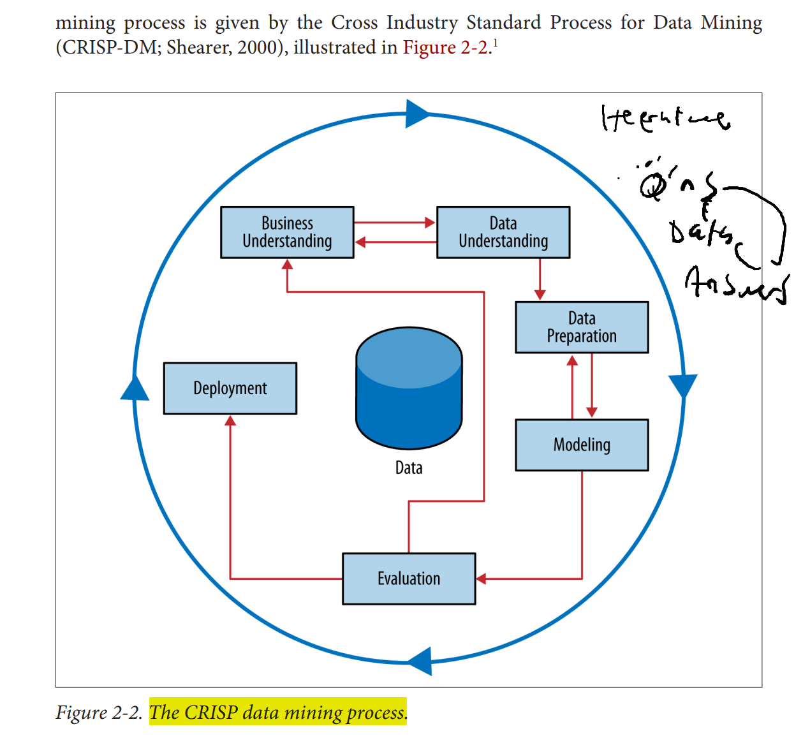
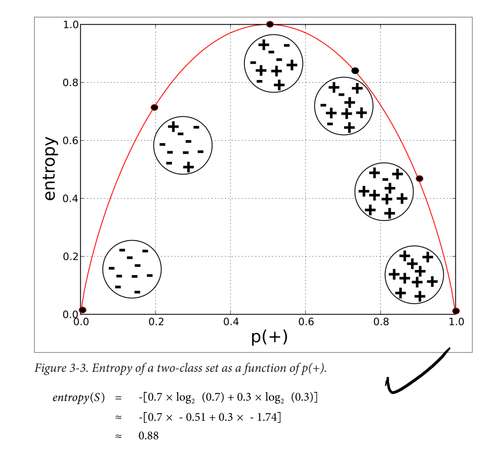
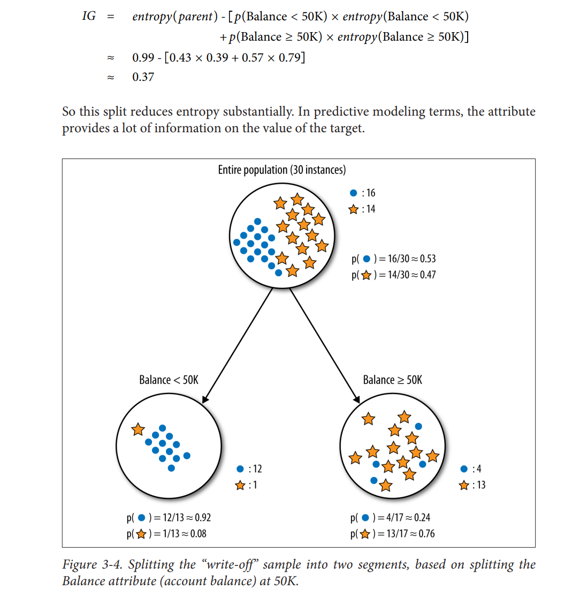

# Notes on Data Science for Business by Foster Provost and Tom Fawcett (2013) {#n_ds4bs}

-   Notes by David Reinstein

This (2013) book seems to have some slightly outdated focus (terms like 'data-mining') but it is nonetheless very useful, both conceptually and in many specifics. It does a good job of giving actual insight into mathematical, statistical, and data-science techniques, and uses a reasonable amount of actual maths and some literal code. There is 'meat in this sandwich'.

Terms like 'lift'

> As another example, in evaluating the utility of a pattern, we see a notion of lift--- how much more prevalent a pattern is than would be expected by chance---recurring broadly across data science. It is used to evaluate very different sorts of patterns in different contexts. Algorithms for targeting advertisements are evaluated by computing the lift one gets for the targeted population. Lift is used to judge the weight of evidence for or against a conclusion. Lift helps determine whether a co-occurrence (an association) in data is interesting, as opposed to simply being a natural consequence of popularity.

## Introduction: Data-Analytic Thinking {.unnumbered}

Example: Hurricane Frances... predicting demand to gear inventory ... lead to huge profit for Wal-Mart...

> 'We didn't know in the past that strawberry PopTarts increase in sales, like seven times their normal sales rate, ahead of a hurricane"

> 1.  Classification and class probability estimation attempt to predict, for each individual in a population, which of a (small) set of classes this individual belongs to. Usually the classes are mutually exclusive. An example classification question would be: "Among all the customers of MegaTelCo, which are likely to respond to a given offer?" In this example the two classes could be called will respond and will not respond.

### Example: Predicting Customer Churn

> Customers switching from one company to another is called churn,

> Your task is to devise a precise, step-by-step plan for how the data science team should use MegaTelCo's vast data resources to decide which customers should be offered the special retention deal prior to the expiration of their contracts

### Data Science, Engineering, and Data-Driven Decision Making

> They show that statistically, the more data-driven a firm is, the more productive it is---even controlling for a wide range of possible confounding factors. And the differences are not small. One standard deviation higher on the DDD scale is associated with a 4%--6% increase in productivity. DDD also is correlated with higher return on assets, return on equity, asset utilization, and market value, and the relationship seems to be causal.

::: {.marginnote}
DR: I am still somewhat skeptical of the causality here
:::

> two types: (1) decisions for which "discoveries" need to be made within data, and (2) decisions that repeat, especially at massive scale, and so decision-making can benefit from even small increases in decision-making accuracy based on data analysis

Getting the jump on the competition ...

> Target wanted to get a jump on their competition. They were interested in whether they could predict that people are expecting a baby. If they could, they would gain an advantage by making offers before their competitors. Using techniques of data science, Target analyzed historical data on customers who later were revealed to have been pregnant, and were able to extract information that could predict which consumers were pregnant. For example, pregnant mothers often change their diets, their ward‐ robes, their vitamin regimens, and so on. These indicators could be extracted from historical data, assembled into predictive models, and then deployed in marketing campaigns.

### Data Processing and "Big Data"

### Data and Data Science Capability as a Strategic Asset

> a science: data, and the capability to extract useful knowledge from data, should be regarded as key strategic assets.

Signet Bank from the 1990s ... key example

> , but at the time, credit cards essentially had uniform pricing, for two reasons: (1) the companies did not have adequate information systems to deal with differential pricing at massive scale, and (2) bank management believed customers would not stand for price discrimination.

> could do more sophisti‐ cated predictive modeling---using the sort of techniques that we discuss throughout this book---and offer different terms (nowadays: pricing, credit limits, low-initial-rate bal‐ ance transfers, cash back, loyalty points, and so on)

> convinced that modeling profitability, not just default probability, was the right strategy. They knew that a small proportion of customers actually account for more than 100% of a bank's profit from credit card operations (because the rest are break-even or money-losing). If they could model profitability, they could make better offers to the best customers and "skim the cream" of the big banks' clientele

> fundamental strategy of data science: acquire the necessary data at a cost

> Different terms were offered at random to different cus‐ tomers. This may seem foolish outside the context of data-analytic thinking: you're likely to lose money! This is true. In this case, losses are the cost of data acquisition. Losses continued for a few years while the data scientists worked to build predictive models from the data,

> Studies giving clear quantitative demonstrations of the value of a data asset are har find, primarily because firms are hesitant to divulge results of strategic value. One

> The huge val‐ uation of Facebook has been credited to its vast and unique data assets (Sengupta, 2012), including both information about individuals and their likes, as well as information about the structure of the social network. Information about network structure has been shown to be important to predicting and has been shown to be remarkably helpful in building models of who will buy certain products (Hill, Provost, & Volinsky, 2006).\

### Data-Analytic Thinking

**Why business people need to understand data science**

E.g., in making valuations:

> venture capitalists must be able to invest wisely in businesses with substantial data assets, and business strategists must be able to devise plans that exploit data.

> As a few examples, if a consultant presents a proposal to mine a data asset to improve your business, you should be able to assess whether the proposal makes sense. If a competitor announces a new data partnership, you should recognize when it may put you at a strategic disadvantage. Or, let's say you take a position with a venture firm and your first project is to assess the potential for investing in an advertising company. The founders present a convincing argument that they will realize significant value from a unique body of data they will collect, and on that basis are arguing for a substantially higher valuation. Is this reasonable? With an understanding of the fundamentals of data science you should be able to devise a few probing questions to determine whether their valuation arguments are plausible.

And employees interact with it:

> Data analytics projects reach into all business units. Employees throughout these units must interact with the data science team. If these employees do not have a fundamental grounding in the principles of dataanalytic thinking, they will not really understand what is happening in the business

### Data Mining and Data Science, Revisited

> extraction of useful (nontrivial, hopefully actionable) patterns or models from large bodies of data

> Fundamental concept: Extracting useful knowledge from data to solve business problems can be treated systematically by following a process with reasonably well-defined stages. The Cross Industry Standard Process for Data Mining, abbreviated CRISP-DM (CRISPDM Project, 2000), is one codification of this process

**Overfitting**

> The concept of overfitting and its avoidance permeates data science processes, algorithms, and evaluation methods

**Quantify benefits of using data**

> For our churn-management example, how exactly are we going to use the patterns extracted from historical data? Should the value of the customer be taken into account in addition to the likelihood of leaving? More generally, does the pattern lead to better decisions than some reasonable alterna‐ tive? How well would one have done by chance? How well would one do with a smart "default" alternative?

\

## Ch 2 Business Problems and Data Science Solutions {.unnumbered}

> A critical skill in data science is the ability to decompose a data analytics problem into pieces such that each piece matches a known task for which tools are available.

**Classification and class probability estimation**

*"Among all the customers of MegaTelCo, which are likely to respond to a given offer?"*

> 1.  Classification and class probability estimation attempt to predict, for each individual in a population, which of a (small) set of classes this individual belongs to. Usually the classes are mutually exclusive. An example classification question would be: "Among all the customers of MegaTelCo, which are likely to respond to a given offer?" In this example the two classes could be called will respond and will not respond.

Logit, Mnlogit, etc

> A closely related task is scoring or class probability estimation. A scoring model applied to an indi‐ vidual produces, instead of a class prediction, a score representing the probability (or some other quantification of likelihood) that that individual belongs to each class. In our customer response scenario, a scoring model would be able to evaluate each individual customer and produce a score of how likely each is to respond to the offer

\

**Regression ("value estimation")**

*"How much will a given customer use the service?"*

> 2.  Regression ("value estimation") attempts to estimate or predict, for each individual, the numerical value of some variable for that individual. An example regression question would be: **"How much will a given customer use the service?"** The property (variable) to be predicted here is service usage, and a model cou

**Similarity matching**

> Similarity matching attempts to identify similar individuals based on data known about them. Similarity matching can be used directly to find similar entities. For example, IBM is interested in finding companies similar to their best business cu tomers, in order to focus their sales force on the best opportunities

> > one of the most popular methods for making product recommendations (finding people who are similar to you in terms of the products they have liked or have purchased)

\
**Clustering**

> ... attempts to group individuals in a population together by their similarity, but not driven by any specific purpose. An example clustering question would be: "Do our customers form natural groups or segments?" Clustering is useful in pre‐ liminary domain exploration to see which natural groups exist because these groups in turn may suggest other data mining tasks or approaches

\

**Co-occurrence grouping**

*What items are commonly purchased together?*

> 5.  Co-occurrence grouping (also known as frequent itemset mining, association rule discovery, and market-basket analysis) attempts to find associations between enti‐ ties based on transactions involving them.

> would be: What items are commonly purchased together? While clustering looks at similarity between objects based on the objects' attributes, co-occurrence grouping considers similarity of objects based on their appearing together in transactions.

**Profiling**

*"What is the typical cell phone usage of this customer segment?"*

> Profiling (also known as behavior description) attempts to characterize the typical behavior of an individual, group, or population.

> Profiling is often used to establish behavioral norms for anomaly detection applications such as fraud detection ...

\

**Link prediction**

*"Since you and Karen share 10 friends, maybe you'd like to be Karen's friend?*

> attempts to predict connections between data items, usually by suggesting that a link should exist,

\

**Data reduction**

> attempts to take a large set of data and replace it with a smaller set of data that contains much of the important information in the larger set.

\

**Causal modeling**

> Techniques for causal modeling include those involving a substantial in‐ vestment in data, such as randomized controlled experiments (e.g., so-called "A/B tests"), as well as sophisticated methods for drawing causal conclusions from ob‐ servational data

> In all cases, a careful data scientist should always include with a causal conclusion the exact assumptions that must be made in order for the causal conclusion to hold (there always are such assumptions---always ask)

### Supervised Versus Unsupervised Methods

> Metaphorically, a teacher "supervises" the learner by carefully providing target information along with a set of examples.

The term 'label'

> Technically, another condition must be met for supervised data mining: there must be data on the target.

> The value for the target variable for an individual is often called the indi‐ vidual's label, emphasizing that often (not always) one must incur expense to actively label the data.

\

Like 'ask a question with a question mark', perhaps:

> A vital part in the early stages of the data mining process is (i) to decide whether the line of attack will be supervised or unsupervised, and (ii) if supervised, to produce a precise definition of a target variable.

### The Data Mining Process

"The CRISP data mining process"

Iterative... questions, data, answers, lather, rinse repeat

### Business Understanding

> often the key to a great success is a creative problem formulation by some analyst regarding how to cast the business problem as one or more data science problems.

### Data Understanding

> Those who commit fraud are a subset of the legitimate users; there is no separate disinterested party who will declare exactly what the "correct" charges should be. Consequently the Medicare billing data have no reliable target variable indicating fraud, and a supervised learning approach that could work for credit card fraud is not applicable. Such a problem usually requires unsupervised approaches such as profiling, clustering, anomaly detection, and co-occurrence grouping.

### Data Preparation

"Leaks" -- variables used in building the model that you can't actually use in decision-making

> One very general and important concern during data preparation is to beware of "leaks" (Kaufman et al. 2012). A leak is a situation where a variable collected in historical data gives information on the target variable---information that appears in historical data but is not actually available when the decision has to be made. As an example, when predicting whether at a particular point in time a website visitor would end her session or continue surfing to another page, the variable "total number of webpages visited in the session" is predictive. However, the total number of webpages visited in the session would not be known until after the session was over (Kohavi et al., 2000)---at which point one would know the value for the target variable! As another illustrative example, consider predicting whether a customer will be a "big spender"; knowing the categories of the items purchased (or worse, the amount of tax paid) are very predictive, but are not known at decision-making time (Kohavi & Parekh, 2003).

### Evaluation

> assess the data mining results rigorously and to gain confidence that they are valid and reliable before moving

> test a model first in a controlled laboratory setting. Equally important, the evaluation stage also serves to help ensure that the model satisfies the original business goal

> A model may be extremely accurate (\> 99%) by laboratory standards, but evaluation in the actual business context may reveal that it still produces too many false alarms to be economically feasible. (How much would it cost to provide the staff to deal with all those false alarms?

> Think about the comprehensibility of the model to stakeholders (not just to the data scientists).

\

Use an experiment to test the model:

> in some cases we may want to extend evaluation into the development environment, for example by instrumenting a live system to be able to conduct random‐ ized experiments. In our churn example, if we have decided from laboratory tests that a data mined model will give us better churn reduction, we may want to move on to an "in vivo" evaluation, in which a live system randomly applies the model to some cus‐ tomers while keeping other customers as a control group (recall our discussion of causal modeling from Chapter 1).

... noting

> behavior can change---in some cases, like fraud or spam, in direct response to the deployment of models.

\

### Deployment

> In deployment the results of data mining---and increasingly the data mining techniques themselves---are put into real use in order to realize some return on investment. The

You may need to 'deploy the whole data mining system' (i.e., rebuild the model using newer data?)

> Two main reasons for deploying the data mining system itself rather than the models produced by a data mining system are (i) the world may change faster than the data science team can adapt, as with fraud and intrusion detection, and (ii) a business has too many modeling tasks for their data science team to manually curate each model individually.

\

Difficulties with 'over the wall' transfers:

> "Your model is not what the data scientists design, it's what the engineers build." From a management perspective, it is advisable to have members of the development team involved early on in the data science project.

### Implications for Managing the Data Science Team {.unnumbered}

> data mining is an exploratory undertaking closer to research and development than it is to engineering

### Other analytics techniques and methods {.unnumbered}

Data Warehousing

#### Database Querying {.unnumbered}

> s are available to answer one-off or repeating queries about data posed by an analyst. These tools are usually frontends to database systems, based on Structured Query Language (SQL) or a tool with a graphical user interface (GUI) to help formulate queries (e.g., query-by-example, or QBE).

> On-line Analytical Processing (OLAP) provides an easy-to-use GUI to query large data collections, for the purpose of facilitating data exploration.

#### Regression Analysis {.unnumbered}

> Here we are less interested in explaining a particular dataset as we are in extracting patterns that will generalize to other data, and for the purpose of improving some business process.

::: {.marginnote}
**DR: The above seems wrong** -- this is not what regression analysis *does*, without many further assumptions!
:::

**OF:** This section notes that regression analysis is used for prediction rather than inference. Hence the use of models to *predict* new cases rather than provide inference. \

#### Machine Learning and Data Mining {.unnumbered}

> because Machine Learning is concerned with many types of per‐ formance improvement, it includes subfields such as robotics and computer vision that are not part of KDD. It also is concerned with issues of agency and cognition---how will an intelligent agent use learned knowledge to reason and act in its environment---which are not concerns of Data Mining.

#### Answering Business Questions with These Techniques {.unnumbered}

> consider a set of questions that may arise and the technologies that would be appropriate for answering them. These questions are all related but each is subtly different.

> 1.  Who are the most profitable customers?
> 2.  Is there really a difference between the profitable customers and the average customer?
> 3.  But who really are these customers? Can I characterize them?
> 4.  Will some particular new customer be profitable? How much revenue should I expect this customer to generate?

## Ch 3: Introduction to Predictive Modeling: From Correlation to Supervised Segmentation {.unnumbered}

> we will begin by thinking of predictive modeling as supervised segmentation---how can we segment the population into groups that differ from each other with respect to some quantity of interest. In particular, how can we segment the population with respect to something that we would like to predict or estimate.

> Tree induction incorporates the idea of supervised segmentation in an elegant manner, repeatedly selecting informative attributes

> A descriptive model must be judged in part on its intelligibility, and a less accurate model may be preferred if it is easier to understand. A predictive model may be judged solely on its predictive performance, although we will discuss why intelligibility is nonetheless important

### Models, Induction, and Prediction

> The creation of models from data is known as model induction. Induction is a term from philosophy that refers to generalizing from specific cases to general rules (or laws, or truths).

> Probability Estimation may be overly optimistic about the probability of class membership for segments with very small numbers of instances. At the extreme, if a leaf happens to have only a single instance, should we be willing to say that there is a 100% probability that members of that segment will have the class that this one instance happens to have?

> Example: Addressing the Churn Problem with Tree InductionLaplace correction, the purpose of which is to moderate the influence of leaves with only a few instances

> However, the order in which features are chosen for the tree doesn-t exactly correspond to their ranking in Figure 3-17. Why is this? The answer is that the table ranks each feature by how good it is independently, evaluated separately on the entire population of instances. Nodes in a classification tree depend on the instances above them in the tree. Therefore, except for the root node, features in a classification tree are not evaluated on the entire set of instances

### Supervised Segmentation

> If the segmentation is done using values of variables that will be known when the target is not, then these segments can be used to predict the value of the target variable

> a formula that evaluates how well each attribute splits a set of examples into segments, with respect to a chosen target variable. Such a formula is based on a purity measure. The most common splitting criterion is called information gain, and it is based on a purity measure called entropy.

> Disorder corresponds to how mixed (impure) the segment is with respect to these properties of interest. So, for example, a mixed up segment with lots of write-offs and lots of non-write-offs would have high entropy. More technically, entropy is defined as:

$$entropy = - p_1 log (p_1) - p_2 log (p_2) - ... $$

\

> Each $p_i$ is the probability (the relative percentage) of property i within the set. the logarithm is generally taken as base 2.

> Strictly speaking, information gain measures the change in entropy due to any amount of new information being added; here, in the context of supervised segmentation, we consider the information gained by splitting the set on all values of a single attribute.

\

> Information gain resulting from some partitioning of the parent set---how much information has this attribute provided? That depends on how much purer the children are than the parent

> the entropy for each child $(c_i)$ is weighted by the proportion of instances be‐ longing to that child, $p(c_i)$

### Summary

> Tree induction recursively finds informative attributes for subsets of the data. In so doing it segments the space of instances into similar regions

> The resulting tree-structured model partitions the space of all possible instances into a set of segments with different predicted values for the target

### NOTE -- check if there is a gap here

## Ch. 4: Fitting a Model to Data {.unnumbered}

> The data miner specifies the form of the model and the attributes; the goal of the data mining is to tune the parameters so that the model fits the data as well as possible. This general approach is called parameter learning or parametric modeling

> What exactly do we mean when we say a model fits the data well ?

> The methods here can all be generalized to work with multiple (nonbinary) classes, but the generalization com- plicates the description unnecessarily

### Classification via Mathematical Functions

> because if we take away the axis-parallel boundaries (see Figure 4-2) we can see that there clearly are other, possibly better, ways to partition

example, we can separate the instances almost perfectly (by class) if we are allowed to introduce a boundary that is still a straight line, but is not perpendicular to the axes (

dataset of Figure 4-2 with a single linear split. This is called a linear classifier and is essentially a weighted sum of the values for the various attributes, as we will describe next.

Linear Discriminant Functions

> Equation 4-1. Classification function class(-) = { + if 1.0 - Age - 1.5 × Balance + 60 \> 0 - if 1.0 × Age - 1.5 × Balance + 60 ≤ 0 This is called a linear discriminant because it discriminates between the classes, and the function of the decision boundary is a linear combination-a weighted sum---of the attributes

f (ᅴ) = 60 + 1.0 × Age - 1.5 × Balance To use this model as a linear discriminant, for a given instance represented by a feature vector x, we check whether f(x) is positive or negative. As discussed above, in the twodimensional case, this corresponds to seeing whether the instance x falls above or below the line

We now have a parameterized model: the weights of the linear function (wi ) are the parameters.

Roughly, the larger the magnitude of a feature's weight, the more important that feature is for classifying the target with standardization

> Optimizing an Objective Function. In fact, there are infinitely many lines (models) that classify this training set perfectly. Which should we pick? underdetermined

for Scoring and Ranking InstancesIn other applications, we do not need a precise probability estimate. We simply need a score that will rank cases by the likelihood of belonging to one class or the other. For example, for targeted marketing we may have a limited budget for targeting prospective customers. We would like to have a list of consumers ranked by their predicted likeli- hood of responding positively to our offer

for Scoring and Ranking InstancesThus f(x) itself---the output of the linear discriminant function---gives an intuitively satisfying ranking of the instances by their (estimated) likelihood of belong- ing to the class of interest.

Support Vector Machines, Briefly

> In short, support vector machines are linear discriminants

> SVMs choose based on a simple, elegant idea: instead of thinking about separating with a line, first fit the fattest bar between the classes

> Then once the widest bar is found, the linear discriminant will be the center line through the bar

> distance between the dashed parallel lines is called the margin around the linear discriminant, and thus the objective is to maximize the margin.

> Hopefully they will be distributed similarly to the training data, but they will in fact be different points. In particular, some of the positive examples will likely fall closer to the discriminant boundary than any positive example we have yet seen. All else being equal, the same applies to the negative examples. In other words, they may fall in the margin. The margin-maximizing boundary gives the maximal lee- way for classifying such points

> original example of Figure 4-2 shows a situa‐ tion in which a single line cannot perfectly separate the data into classes. This is true of most data from complex real-world applications

> In the case where the data indeed are linearly separable, we incur no penalty and simply maximize the margin. If the data are not linearly separable, the best fit is some balance between a fat margin and a low total error penalty. The penalty for a misclassified point is proportional to the distance from the decision boundary, so if possible the SVM will make only -small" errors

> known as hinge loss

### Regression via Mathematical Functions

> Errors have positive distances from the separator in Figure 4-9, while correct classifications have negative distances

> The hinge loss only becomes positive when an example is on the wrong side of the boundary and beyond the margin. Loss then increases linearly with the example-s distance from the margin, thereby penalizing points more the farther they are from the separating boundary. Zero-one loss, as its name implies, assigns a loss of zero for a correct decision and one for an incorrect decision

-   not sure I get what the margin means here

> For classification, this would apply large penalties to points far over on the "wrong side" of the separating boundary. Unfortunately, using squared error for classification also penalizes points far on the correct side of the decision boundary

> principle of thinking carefully about whether the loss function is aligned with the business goal

### Class Probability Estimation and Logistic Regression

"More pragmatically, analysts often claim to prefer squared error because it strongly penalizes very large errors. Whether the quadratic penalty is actually appro- priate is specific to each application

> For least squares regression a serious drawback is that it is very sensitive to the data: erroneous or otherwise outlying data points can severely skew the resultant linear func- tion. For some business applications, we may not have the resources to spend as muchfor systems that build and apply models totally automatically, the modeling needs to be much more robust than when doing a detailed regression analysis -by hand." Therefore, for the former application we may want to use a more robust modeling procedure (e.g., use as the objective function absolute error instead of squared error

> The director of the fraud control operation may want the analysts to focus not simply on the cases most likely to be fraud, but on the cases where the most money is at stake-that is, accounts where the company's monetary loss is expected to be the highest. For this we need to estimate the actual probability of fraud

> model designed to give accurate esti‐ mates of class probability. The most common procedure by which we do this is called logistic regression

> What exactly is an accurate estimate of class membership probability is a subject of debate beyond the scope of this book. Roughly, we would like (i) the probability estimates to be well calibrated, meaning that if you take 100 cases whose class membership probability is estimated to be 0.2, then about 20 of them will actually belong to the class. We would also like (ii) the probability estimates to be discriminative, in that if possible they give meaningfully different probability estimates to different examples.

> there another representation of the likelihood of an event that we use in everyday life? If we could come up with one that ranges from -∞ to ∞, then we might model this other notion of likelihood with our linear equation

> The odds of an event is the ratio of the probability of the event occurring to the probability of the event not occurring

> Again, the distance from the boundary is between -∞ and ∞, but as we can see from the example, the odds range from 0 to -. Nonetheless, we can solve our garden-path problem simply by taking the logarithm of the odds (called the -log-odds"), since for any number in the range 0 to - its log will be between --∞ to ∞. These

> The output of the logistic regression model is interpreted as the log-odds of class membership

### Logistic Regression: Some Technical Details

> Recall that the distinction between classification and regression is whether the value for the target variable is categorical or numeric

> Equation 4-4. The logistic function p+ (-) = 1

> The model can be applied to the training data to produce estimates that each of the training data points belongs to the target class. What would we want? Ideally, any positive example x+ would have p+ (-+) = 1 and any negative example x•

> model (set of weights) that gives the highest sum is the model that gives the highest -likelihood" to the data---the "maximum likeli‐ hood- model. The maximum likelihood model "on average" gives the highest proba‐ bilities to the positive examples and the lowest probabilities to the negative examples

### Example: Logistic Regression versus Tree Induction

> Though classification trees and linear classifiers both use linear decision boundaries, there are two important differences between them: 1. A classification tree uses decision boundaries that are perpendicular to the instancespace axes (see Figure 4-1), whereas the linear classifier can use decision boundaries of any direction or orientation (see Figure 4-3). This is a direct consequence of the fact that classification trees select a single attribute at a time whereas linear classifiers use a weighted combination of all attributes

classification tree is a "piecewise" classifier that segments the instance space re‐ cursively when it has

> linear classifier places a single decision surface through the entire space. It has great freedom in the orien- tation of the surface, but it is limited to a single division into two segments

practically speaking, what are the consequences of these differences?

A de‐ cision tree, if it is not too large, may be considerably more understandable to someone without a strong statistics or mathematics background. I'm not convinced. but I can imagine it's easier to implement in production

### Nonlinear Functions, Support Vector Machines, and Neural NetworksThe two most common families of techniques that are based on fitting the parameters of complex, nonlinear functions are nonlinear supportvector machines and neural networks.

Support vector machines have a so-called "kernel function" that maps the original features to some other feature space. Then a linear model is fit to this new feature space, just as

implement a nonlinear support vector machine with a "polynomial ker‐ nel,- which essentially means it would consider "higher-order" combinations

One can think of a neural network as a -stack" of models. On the bottom of the stack are the original features. From these features are learned a variety of relatively simple models. Let-s say these are logistic regressions. Then, each subsequent layer in the stack applies a simple model (let-s say, another logistic regression) to the outputs of the next layer down

We could think of this very roughly as first creating a set of -experts" in different facets of the problem (the first-layer models), and then learning how to weight the opinions of these different experts (the second-layer model).

more generally with neural networks target labels for training are provided only for the final layer (the actual target variable).

The stack of models can be represented by one big parameterized numeric function. The so why consider it in many layers?

we can then apply an optimization procedure to find the best parameters to this very complex numeric function

When we're done, we have the parameters to all the models, and thereby have learned the -best" set of lower-level experts and also the best way to com‐ bine them, all simultaneously "

**OF:** Neural Networks are made up of layers of *perceptrons.* These models are given an input vector and assign weights to each input. The inputs are combined into a weighted sum which is passed through an "activation function" that decides on the outcome classification. This method is known as "forward propagation". A useful analogy from (Melania, 2019):

> For example, you might get input from several friends on how much they liked a particular movie, but you trust some of those friends' taste in movies more than others. If the total amount of "friend enthusiasm"---giving more weight to your more trusted friends---is high enough (that is, greater than some unconscious threshold), you decide to go to the movie. This is how a perceptron would decide about movies, if only it had friends.

\
It is the way in which these weights are learned that is both mentally and computationally strenuous. The "back-propagation" algorithm is key to the way that weights are learned. The procedure involves multiple stages. Essentially we initialize our model with a random state, feed our input data in and compute the error that our model has made. Then our model works backwards and updates the weights in a manner which provides a prediction consistent with the true data. This updating process can and often is done multiple times.

## Ch 5: Overfitting and its avoidance {.unnumbered}

### Generalization

Generalization is the property of a model or modeling process, whereby the model applies to data that were not used to build the model

### Holdout Data and Fitting Graphs

> These are not the actual use data, for which we ultimately would like to predict the value of the target variable. Instead, creating holdout data is like creating a -lab test" of generalization performance. We will simulate the use scenario on these holdout data: we will hide from the model (and possibly the modelers) the actual values for the target on the holdout data. The

> This is known as the base rate, and a classifier that always selects the majority class is called a base rate classifier. A corresponding baseline for a regression model is a simple model that always predicts the mean or median value of the target variable

**OF:** Holdout data focuses around the need to train models on data that is separate from the data a model is tested on. If we didn't use holdout validation then our data would always seem to perform incredibly well in testing and would perform poorly on new data.

### Example: Overfitting Linear Functions

> In many modern applications, where large numbers of models are built automatically, and/or where there are very large sets of attributes, manual selection may not be feasible. For example, companies that do data science-driven targeting of online display advertisements can build thousands of models each week, sometimes with mil- lions of possible features. In such cases there is no choice but to employ automatic feature selection (or to ignore feature selection all together).

### Example: Why Is Overfitting Bad?

-   It does not explain why overfitting often causes models to become worse I guess this is because the meaningless information that is incorporated causes less attention paid to more meaningful information

> From Holdout Evaluation to Cross-ValidationWhile a holdout set will indeed give us an estimate of generalization performance, it is just a single estimate. Should we have any confidence in a single estimate of model accuracy? It might have just been a single particularly lucky (or unlucky) choice of training and test data

### From Holdout Evaluation to Cross-Validation

> Building the infrastructure for a modeling lab may be costly and time consuming, but after this investment many aspects of model performance can be evaluated quickly in a controlled environment

> 5-9. An illustration of cross-validation

### Learning Curves

> plot of the generalization performance against the amount of training data is called a learning curve. The

> asset. The learning curve may show that generalization perforance has leveled off so investing in more training data is probably not worthwhile

### Avoiding Overfitting with Tree Induction

> Overfitting Avoidance and Complexity Control

> To avoid overfitting, we control the complexity of the models induced from the data.

> The main problem with tree induction is that it will keep growing the tree to fit the training data until it creates pure leaf nodes

> (i) to stop growing the tree before it gets too complex, and (ii) to grow the tree until it is too large, then "prune" it back **OF:** Pruning also has the advantage of improved model interpretation.

> specify a minimum number of instances that must be present in a leaf.

> this value is below a threshold (often 5%, but problem specific), then the hypothesis test concludes that the difference is likely not due to chance somewhat imprecise

> So, for stopping tree growth, an alternative to setting a fixed size for the leaves is to conduct a hypothesis test at every leaf to determine whether the observed difference in (say) information gain could have been due to chance. If the hypothesis test concludes that it was likely not due to chance, then the split is accepted and the tree growing continues. (See -Sidebar: Beware of -multiple comparisons"" on page 139.) Overfitting Avoidance and Complexity

### A General Method for Avoiding Overfitting

> One general idea is to estimate whether replacing a set of leaves or a branch with a leaf would reduce accuracy

> have a collection of models with different complexities, we could choose the best simply by estimating the generalization performance of each. But how could we estimate their generalization performance? On the (labeled) test data? There-s one big problem with that: test data should be strictly independent of model building so that we can get an independent estimate of model accuracy

> The key is to realize that there was nothing special about the first training/test split we made. Let-s say we are saving the test set for a final assessment. We can take the training set and split it again into a training subset and a testing subset. Then we can build models on this training subset and pick the best model based on this testing subset. Let-s call the former the subtraining set and the latter the validation set for clarity. The validation set is separate from the final test set, on which we are never going to make any modeling decisions. This procedure is often called nested holdout testing. sorts out a key point of confusion

### A General Method for Avoiding Overfitting

> we can induce trees of many complexities from the subtraining set, then we can estimate the generalization performance for each from the validation set

> Then we could use this model as our best choice, possibly estimating the actual generalization performance on the final holdout

> But once we-ve chosen the complexity, why not induce a new tree with 122 nodes from the whole, original training set? Then we might get the best of both worlds: using the subtraining/ validation split to pick the best complexity without tainting the test set, and building a model of this best complexity on the entire training set (subtraining plus validation)

> nested holdout procedure

> Nested cross-validation

> example, sequential forward selection (SFS) of features uses a nested holdout pro‐ cedure to first pick the best individual feature, by looking at all models built using just one feature. After i don't entirely get how the nesting works

### Avoiding Overfitting for Parameter Optimization

> equations, such as logistic regression, that unlike trees do not automatically select what attributes to include, complexity can be controlled by choosing a -right" set of attributes

> The general strategy is that instead of just opti‐ mizing the fit to the data, we optimize some combination of fit and simplicity. Models will be better if they fit the data better, but they also will be better if they are simpler. This general methodology is called regularization, a term that is heard often in data science discussions. The rest of

> Complexity control via regularization works by adding to this objective function a pen‐ alty for complexity: arg max - weight that determines how much importance the optimization procedure should place on the penalty, compared to the data fit. At this point, the mod- eler has to choose - and the penalty function

> To learn a "regularized" logistic regression model we would instead compute: arg max -

> most commonly used penalty is the sum of the squares of the weights, sometimes called the -L2-norm" of w ridge like model

> linear support vector machine learning is almost equivalent to the L2-regularized logistic re- gression just discussed; the only difference is that a support vector machine uses hinge loss instead of likelihood in its optimization. The support vector machine optimizes this equation: arg max - hinge loss term, is negated because lower hinge loss is better.

> cross-validation would es‐ sentially conduct automated experiments on subsets of the training data and find a good - value. Then this λ would be used to learn a regularized model on all the training data

> to optimizing the parameter values of a data mining procedure is known as grid search

> Sidebar: Beware of "multiple comparisons"

> index, some will be worse, and some will be better. The best one might be a lot better. Now, you liquidate all the funds but the best few, and you present these to the public. You can -honestly" claim that their 5-year return is substantially better than the return of the Russell 2000 index.

> The underlying reasons for overfitting when building models from data are essentially problems of multiple comparisons (Jensen & Cohen, 2000)

> if the fitting graph truly has an inverted-U-shape, one can be much more confident that the top represents a -good" complexity than if the curve jumps around randomly

> e model performance on the training and testing data as a function of model complexity

> Summary learning curve shows model per‐ formance on testing data plotted against the amount of training data used

**OF:** Note the importance of the bias-variance trade-off. As we increase the flexibility of a model, by for example adding more tree nodes, we decrease the bias but increase the variability. This means that the model will tend to perform poorly on newer data. The relative change of bias and variance helps determine whether the mean-squared error increases or decreases. These will vary across models. Highly non-linear models tend to have higher variation.

## Ch 6.: Similarity, Neighbors, and Clusters {.unnumbered}

> Fundamental concepts: Calculating similarity of objects described by data; Using simi‐ larity for prediction; Clustering as similarity-based segmentation. Exemplary techniques: Searching for similar entities; Nearest neighbor methods; Clus- tering methods; Distance metrics for calculating similarity.

> example, IBM wants to find companies that are similar to their best business customers, in order to have the sales staff look at them as prospects

> Hewlett-Packard maintains many highperformance servers for clients; this maintenance is aided by a tool that, given a server configuration, retrieves information on other similarly configured servers. Advertisers often want to serve online ads to consumers who are similar to their current good customers. production function example

### Similarity and Distance

unsupervised segmentation

### Similarity and Distance

> similarity to provide recommen‐ dations of similar products or from similar people

> The field of Artificial Intelligence has a long history of building systems to help doctors and lawyers with such case-based reasoning. Sim- ilarity judgments are a key component

> Euclidean distance

**OF:** Because of the mechanics of distance measures we **should** range-normalize data before using methods such as KNN. This is because the distance measure is affected by the distance between variables, if variables are all on a different scale then this is equivalent to them having different variances. Data doesn't need to be normalized for methods such as decision trees as information gain is calculated for each individual variable, thus not taking into account the relationship with other variables.

The Euclidean and Manhattan distance are special cases of the **Minkowski** distance. Where the higher the value of $p$ the more emphasis is placed on features with a large difference in the values due to these differences being raised to the $p^{th}$ power

$$
\text{Minkowski}(\textbf{a}, \textbf{b}) = (\sum_{i=1}^m abs(\textbf{a}[i]-\textbf{b}[i])^p)^{1/p}
$$

### Example: Whiskey Analytics

> 19. This distance is just a number---it has no units, and no meaningful interpretation this needs more explanation... at least discuss standardising these features

How can we describe single malt Scotch whiskeys as feature vectors, in such a way that we think similar whiskeys will have similar taste

### Nearest Neighbors for Predictive Modeling

> Legendre's representation of whiskeys with Euclidean distance to find similar ones for him. how to do with categorical variables?

> Figure 6-2. Nearest neighbor classification. The point to be classified, labeled with a question mark, would be classified + because the majority of its nearest (three) neigh- bors are +

> have some combining function (like voting or averaging) operating on the neighbors- known target values

> His nearest neighbors (Rachael, John, and Norah) have classes of No, Yes, and Yes, respectively. If we score for the Yes class, so that Yes=1 and No=0, we can average these into a score of 2/3 for David. If we were to do this in practice, we might want to use more than just three nearest neighbors

### How Many Neighbors and How Much Influence?

> assume that David's three nearest neighbors were again Rachael, John, and Norah. Their respective incomes are 50, 35, and 40 (in thousands). We then use these values to generate a prediction for David-s income. We could use the average (about 42) or the median (40). nn for 'regression,,. kernel models would be an extension of this

> important to note that in retrieving neighbors we do not use the target variable because we-re trying to predict it

> Nearest neighbor algorithms are often referred to by the shorthand k-NN, where the k refers to the number of neighbors used, such as 3-NN.

> nearest-neighbor methods often use weighted voting or similarity moderated voting such that each neighbor-s contribution is scaled by its sim‐ ilarity

> other sorts of prediction tasks, for example regression and class probability estimation. Generally, we can think of the procedure as weighted scor- ing

**OF:** For classification purposes it is a common rule of thumb to use an odd number as the value for $k$. This is done in order to avoid ties between two label classes.

### Geometric Interpretation, Overfitting, and Complexity Control

> related technique in artificial intelligence is Case-Based Reasoning (Kolodner, 1993; Aamodt & Plaza, 1994), abbreviated CBR relevant to meta analysis?!!

> Although no explicit boundary is created, there are implicit regions created by instance neighborhoods

> Figure 6-3. Boundaries created by a 1-NN classifier

> Note also the one negative instance isolated inside the positive in‐ stances creates a -negative island" around itself. This point might be considered noise or an outlier, and another model type might smooth over it.

> generally, irregular concept bound‐ aries are characteristic of all nearest-neighbor classifiers, because they do not impose any particular geometric form on the classifier

> The 1-NN classifier predicts perfectly for training examples, but it also can make an often reason- able prediction on other examples: it uses the most similar training example.

> k in a k-NN classifier is a complexity parameter. At one extreme, we can set k = n and we do not allow much complexity at all in our

### Issues with Nearest-Neighbor Methods

> in some fields such as medicine and law, reasoning about similar historical cases is a natural way of coming to a decision about a new case

> other areas, the lack of an explicit, interpretable model may pose a problem. There are really two aspects to this issue of intelligibility: the justification of a specific decision and the intelligibility of an entire model.

> With k-NN, it usually is easy to describe how a single instance is decided: the set of neighbors participating in the decision can be presented, along with their contributions.

> The movie Billy Elliot was recommended based on your interest in Amadeus, The Con‐ stant Gardener and Little Miss Sunshine-

> e got a recommendation. On the other hand, a mortgage applicant may not be satisfied with the explanation, -We declined your mortgage application because you remind us of the Smiths and the Mitchells, who both defaulted.- Indeed, some legal regulations restrict the sorts of mod‐ els that can be used for credit scoring to models for which very simple explanations can be given based on specific, important variables. For example, with a linear model, one may be able to say: -all else being equal, if your income had been \$20,000 higher you would have been granted this particular mortgage.

> What is difficult is to explain more deeply what "knowledge" has been mined from the data. If a stakeholder asks -What did your system learn from the data about my cus‐ tomers? On what basis does it make its decisions?- there may be no easy answer because there is no explicit model

> numeric attributes may have vastly different rang‐ es, and unless they are scaled appropriately the effect of one attribute with a wide range can swamp the effect of another with a much smaller range. But scaling

> example, in the credit card offer domain, a customer database could contain much incidental information such as number of children, length of time at job, house size, median income, make and model of car, average education level, and so on. Conceivably

> probably most would be irrelevant

> curse of dimensionality---and this poses problems for nearest neighbor methods

> feature selection

> domain knowledge

> is to tune the similarity/distance function manually. We may know, for example, that the attribute Number of Credit Cards should

> training is very fast because it usually involves only storing the instances. No effort is expended in creating a model

> The main computational cost of a nearest neighbor method is borne by the prediction/classifica- tion step, when the database

> Heterogeneous AttributesThere are techniques for speeding up neighbor retrievals. Specialized data structures like kd-trees and hashing methods (Shakhnarovich, Darrell, & Indyk, 2005; Papadopoulos & Manolopoulos, 2005) are employed in some commerical database and data mining systems to make nearest neighbor queries more efficient

### Other Distance Functions

> Euclidean distance

> general, intuitive and computationally very fast

> Euclidean(ᅚ, ᅛ) = ֫ ᅚ - ᅛ ֫ 2 = (x1 - y1) 2 + (x2 - y2) -ٴ + 2 Though

> Manhattan distance or L1-norm is the sum of the (unsquared) pairwise distances,

> or taxicab

> Jaccard distance treats the two objects as sets of characteristics

> Jaccard distance is the proportion of all the characteristics (that either has) that are shared by the two

> appropriate for problems where the possession of a common characteristic between two items is important, but the common absence of a characteristic is not

> Cosine distance is often used in text classification to measure the similarity of two docu‐ ments how different from L2 with normalization?

> three occurrences of transition, and two occurrences of monetary. Docu‐ ment B contains two occurrences of performance, three occurrences of transition, and no occurrences of monetary. The two documents would be represented as vectors of counts of these three words: A = \<7,3,2\> and B = \<2,3,0\>. The cosine distance of the two documents is: dcosine(A, B) = 1 - 7, 3, 2 - 2, 3, 0 - 7, 3, 2 ֫ 2 - ֫ 2, 3, 0 ֫ 2 = 1 - 7 - 2 + 3 · 3 + 2 · 0 49 + 9 + 4 - 4 + 9 = 1 - 23 28.4 - 0.19

> is particularly useful when you want to ignore differences in scale across instances-technically, when you want to ignore the magnitude of the vectors. As a concrete example, in text classification you may want to ignore whether one document is much longer than another, and just concentrate on the textual content

> -   Other Distance Functions distance or the Levenshtein metric. This metric counts the minimum number of edit operations required to convert one string into the other

### Stepping Back: Solving a Business Problem Versus Data Exploration

> Recall the CRISP data mining process, replicated in Figure 6-15. We should spend as much time as we can in the business understanding/ data understanding mini-cycle, until we have a concrete, specific definition of the prob- lem we are trying to solve. In predictive modeling applications, we are aided by our need to define the target variable precisely, and

> In our similarity-matching examples, again we had a very concrete notion of what exactly we were looking for: we want to find similar companies to optimize our efforts, and we will define specifically what it means to be similar.

> What do we do when in the business understanding phase we conclude: we would like to explore our data, possibly with only a vague notion of the exact problem we are solving? The problems to which we apply clustering often fall into this category. We want to perform unsupervised segmentation

> igure 6-15. The CRISP data mining process

> finding groups that "naturally" occur (subject, of course, to how we define our similarity measures).

### Summary

that for problems where we did not achieve a precise formulation of the problem in the early stages of the data mining process, we have to spend more time later in the process-in the Evaluation stage

> Therefore, for clustering, additional creativity and business knowledge must be applied in the Evaluation stage of the data mining process

> they settled on five clusters that represented very different consumer credit behavior (e.g., those who spend a lot but pay off their cards in full each month versus those who spend a lot and keep their balance near their credit limit). These different sorts of customers can tolerate very different credit lines (in the two examples, extra care must be taken with the latter to avoid default)

> They used the knowledge to define a precise predictive mod‐ eling problem: using data that are available at the time of credit approval, predict the probability that a customer will fall into each of these clusters

## Ch. 7. Decision Analytic Thinking I: What Is a Good Model? {.unnumbered}

> Fundamental concepts: Careful consideration of what is desired from data science results; Expected value as a key evaluation framework; Consideration of appropriate comparative baselines. Exemplary techniques: Various evaluation metrics; Estimating costs and benefits; Cal- culating expected profit; Creating baseline methods for comparison economics connection

> Often it is not possible to measure perfectly one-s ultimate goal, for example because the systems are inadequate, or because it is too costly to gather the right data, or because it is difficult to assess causality. So, we might conclude that we need to measure some surrogate for what we-d really like to measure. It is nonetheless crucial to think carefully about what we-d really like to meas‐ ure. If we have to choose a surrogate, we should do it via careful, data-analytic thinking.

### Evaluating Classifier

> we discussed how for evaluation we should use a holdout test set to assess the generalization performance of the model. But how should we measure generalization performance?

### The Confusion Matrix

> Here we will reserve accuracy for its specific technical meaning as the proportion of correct decisions: accuracy = Number of correct decisions made Total number of decisions made This is equal to 1-error rate

> class con‐ fusion and the confusion matrix, which is one sort of contingency table. A confusion matrix for a problem involving n classes is an n - n matrix with the columns labeled with actual classes and the rows labeled with predicted classes. Each example in a test set has an actual class label as well as the class predicted by the classifier (the predicted class), whose combination determines which matrix cell the instance counts into. For simplicity we will deal with two-class problems having 2 - 2 confusion matrices.

> making explicit how one class is being confused for another

### Problems with Unbalanced Classes

> Table 7-1. The layout of a 2 × 2 confusion matrix showing

> Because the unusual or interesting class is rare among the general population, the class distribution is unbal- anced or skewed

> Consider a domain where the classes appear in a 999:1 ratio. A simple rule-always choose the most prevalent class---gives 99.9% accuracy

> Chap‐ ter 5 mentioned the -base rate" of a class, which corresponds to how well a classifier would perform by simply choosing that class for every instance

> Consider again our cellular-churn example. Let-s say you are a manager at MegaTelCo and as an analyst I report that our churnprediction model generates 80% accuracy. This sounds good, but is it? My coworker reports that her model generates an accuracy of 37%. That-s pretty bad, isn't it? You might say, wait-we need more information about the data

> say you know that in these data the baseline churn rate is approximately 10% per month. Let-s consider a customer who churns to be a positive example, so within our population of customers we expect a positive to negative class ratio of 1:9. So if we simply classify everyone as negative we could achieve a base rate accuracy of 90%!

> My coworker calculated the accuracy on a representative sample from the population, whereas I created artificially balanced datasets for training and testing (both common practices). Now my coworker-s model looks really bad---she could have achieved 90% accuracy, but only got 37%. However, when she applies her model to my balanced data set, she also sees an accuracy of 80% a good practice problem

> 7-1. Two churn models, A and B, can make an equal number of errors on a bal‐ anced population used for training (top) but a very different number of errors when tes- ted against the true population (bottom

> accuracy: we don't know how much we care about the different errors and correct decisions. This

### Generalizing Beyond Classification

> Another problem with simple classification accuracy as a metric is that it makes no distinction between false positive and false negative errors

> Compare this with the opposite error: a patient who has cancer but she is wrongly told she does not. This is a false negative. This second type of error would mean a person with cancer would miss early detection, which could have far more serious consequences

> consider the cost of giving a customer a re‐ tention incentive which still results in departure (a false positive error). Compare this with the cost of losing a customer because no incentive was offered (a false negative). Whatever costs you might decide for each, it is unlikely they would be equal; and the errors should be counted separately regardless.

> hard to imagine any domain in which a decision maker can safely be in‐ different to whether she makes a false positive or a false negative

> Once aggregated, these will produce an expected profit (or expected benefit or expected cost) estimate for the classifier

> vital to return to the question: what is important in the application? What is the goal? Are we assessing the results of data mining appropriately given the actual goal?

> Generalizing Beyond Classification recommendation model predicts how many stars a

### A Key Analytical Framework: Expected Value

> 1.  A course in decision theory would lead you into a thicket of interesting related issues ecoonomics tie in

> user will give an unseen

> Why is the mean-squared-error on the predicted number of stars an appro‐ priate metric for our recommendation problem? Is it meaningful? Is there a better met- ric? Hopefully, the analyst has thought this through carefully. It is surprising how often one finds that an analyst has not, and is simply reporting some measure he learned about in a class in school.

> expected value computation provides a framework that is extremely useful in organizing thinking about data-analytic problems. Specifically, it decomposes data-analytic thinking into (i) the structure of the problem, (ii) the elements of the analysis that can be extracted from the data, and (iii) the elements of the analysis that need to be acquired from other sources (e.g., business knowledge of subject matter experts)

> In an expected value calculation the possible outcomes of a situation are enumerated. The expected value is then the weighted average of the values of the different possible outcomes, where the weight given to each value is its probability of occurrence. For example, if the outcomes represent different possible levels of profit, an expected profit calculation weights heavily the highly likely levels of profit, while unlikely levels of profit are given little weight. For this book, we will assume that we are considering repeated tasks (like targeting a large number of consumers, or diagnosing a large number of problems) and we are interested in maximizing expected profit.1

> Equation 7-1. The general form of an expected value calculation EV = p(o1)- v(o1) + p(o2)· v(o2) + p(o3)· v(o3) ... Each oi its probability and v(oi ) is its value

> The probabilities often can be estimated from the data (ii), but the business values often need to be acquired from other sources (

### Using Expected Value to Frame Classifier Use

targeted marketing often the probability of response for any individual consumer is very low-maybe one or two percent---so no consumer may seem like a likely responder. If we choose a -common sense" threshold of 50% for deciding what a likely responder is, we would probably not target anyone.

> targeted marketing scenario

> If the offer is not made to a con‐ sumer, the consumer will not buy the product. We have a model, mined from historical data, that gives an estimated probability of response pR (-) for any consumer whose feature vector description x is given as input so it's all lift

> whether to target a particular consumer

> provides a framework for carrying out the analysis. Specifically, let's calculate the expected benefit (or cost) of targeting consumer x: Expected benefit of targeting = pR (-)· vR + 1 - pR (-) · vNR where vR is the value we get from a response and vNR is the value we get from no response

> To be concrete, let's say that a consumer buys the product for \$200 and our productrelated costs are \$100. To target the consumer with the offer, we also incur a cost. Let's say that we mail some flashy marketing materials, and the overall cost including postage is \$1, yielding a value (profit) of vR = \$99 if the consumer responds (buys the product). Now, what about vNR, the value to us if the consumer does not respond? We still mailed the marketing materials, incurring a cost of \$1 or equivalently a benefit of -\$1. Now we are ready to say precisely whether we want to target this consumer: do we expect to make a profit? Technically, is the expected value (profit) of targeting greater than zero concrete example

### Using Expected Value to Frame Classifier Evaluation

> With these example values, we should target the consumer as long as the estimated probability of responding is greater than 1% is this not obvious to business people?

> It is likely that each model will make some decisions better than the other model. What we care about is, in aggregate, how well does each model do: what is its expected value.

> Figure 7-2. A diagram of the expected value calculation.

> may be that data on customers' prior usage can be helpful in this estimation. In many cases, average estimated costs and benefits are used rather than individual-specific costs and benefits, for simplicity of problem formulation and calculation but benefits may be correlated to observables and unobservable s

> Figure 7-4. A cost-benefit matrix for the targeted marketing example

> Given a matrix of costs and benefits, these are multiplied cell-wise against the matrix of probabilities, then summed into a final value representing the total expected profit

> A common way of expressing expected profit is to factor out the probabilities of seeing each class, often referred to as the class priors

> rule of basic probability is: p(x, y) = p(y)- p(x \| y)

> Equation 7-2. Expected profit equation with priors p(p) and p(n) factored. Expected profit

[Formula here]

-   how does better information and forecasting boost payoffs?
-   better to commit or wait to learn?

> easy mistake in formulating cost-benefit matrices is to "dou‐ ble count- by putting a benefit in one cell and a negative cost for the same thing in another cell (or vice versa).

> useful practical test is to compute the benefit improvement for changing the decision on an example test instance

> improvement in benefit

> True positive rate and False negative rate refer to the frequency of being correct and incorrect, respectively, when the instance is actually positive: TP/(TP + FN) and FN/(TP + FN).

> Precision and Recall are often used, especially in text classification and information retrieval. Recall is the same as true positive rate, while precision is TP/(TP

### Evaluation, Baseline Performance, and Implications for Investments in Data

> -   FP), which is the accuracy over the cases predicted to be positive

> The F-measure is the harmonic mean of precision and recall at a given point, and is: F-measure = 2 - precision -recall precision + recall Practitioners in many fields such as statistics, pattern recognition, and epidemiology speak of the sensitivity and specificity of a classifier: Sensitivity = TN /(TN + FP) = True negative rate = 1 - False positive rate Specificity = TP /(TP + FN ) = True positive rate You may also hear about the positive predictive value, which is the same as precision.

> Accuracy, as mentioned before, is simply the count of correct decisions divided by the total number of decisions, or: Accuracy = TP + TN

> what would be a reasonable baseline against which to compare model performance

> For classification models it is easy to simulate a completely random model and measure its performance

> There are two basic tests that any weather forecast must pass to demonstrate its merit: It must do better than what meteorologists call persistence: the assumption that the weather will be the same tomorrow (and the next day) as it was today. It must also beat climatology, the long-term historical average of conditions on a particular date in a particular area.

> For classification tasks, one good baseline is the majority classifier, a naive classifier that always chooses the majority class of the training dataset

> For regression problems we have a directly analogous baseline: predict the average value over the population (usually the mean or median

> . If we find the one variable that correlates best with the target, we can build a classification or regression model that uses just that variable, which gives another view of baseline performance: how well does a simple -conditional" model perform?

> "decision stump" --- a decision tree with only one internal node, the root node

> Robert Holte (1993) showed that decision stumps often produce quite good baseline performance on many of the test datasets used in machine learning research.

> data as an asset to be invested in. If you are considering building models that integrate data from various sources, you should compare the result to models built from the individual sources. Often

> To be thorough, for each data source the data science team should compare a model that uses the source to one that does not

> Beyond comparing simple models (and reduced-data models), it is often useful to implement simple, inexpensive models based on domain knowledge or -received wisdom" and evaluate their performance. For example, in one fraud detection application it was commonly believed that most defrauded accounts would experience a sudden increase in usage, and so checking accounts for sudden jumps in volume was sufficient for catching a large proportion of fraud.

### Summary

> They were able to demonstrate that their data mining added significant value beyond this simpler strategy

### Ranking Instead of Classifying

> discussed how the score assigned by a model can be used to compute a decision for each individual case based on its expected value. A different strategy for making decisions is to rank a set of cases by these scores, and then take actions on the cases at the top of the ranked list

> some reason we may not be able to obtain accurate probability estimates from the classifier. This happens, for example, in targeted marketing applications when one cannot get a sufficiently representative training sample. The classifier scores may still be very useful for deciding which prospects are better than others

> A common situation is where you have a budget for actions, such as a fixed marketing budget for a campaign, and so you want to target the most promising candidates

> With a ranking classifier, a classifier plus threshold produces a single confusion matrix.

### Profit Curves

> with a ranking classifier, we can produce a list of instances and their predicted scores, ranked by decreasing score, and then measure the expected profit that would result from choosing each successive cut-point in the list

> Graphing these values gives us a profit curve

> Among the classifiers tested here, the one labeled Clas‐ sifier 2 produces the maximum profit of \$200 by targeting the top-ranked 50% of con- sumers. If your goal was simply to maximize profit and you had unlimited resources, you should choose Classifier 2, use it to score your population of customers, and target the top half (highest 50%) of customers on the list. If you believe the validation exercise and the cost benefit estimates

> Now consider a slightly different but very common situation where you're constrained by a budget.

> ROC Graphs and Curves The best-performing model at this performance point is Classifier 1. You should use it to score the entire population, then send offers to the highest-ranked 8,000 cus- tomers. justifying the use of a curve

## Contents

#### 1. Introduction: Data-Analytic Thinking {.unnumbered}

::: {.marginnote}
This introduction is extremely relevant and nontechnical
:::

The Ubiquity of Data Opportunities 1 Example: Hurricane Frances 3 Example: Predicting Customer Churn 4 Data Science, Engineering, and Data-Driven Decision Making 4 Data Processing and "Big Data" 7 From Big Data 1.0 to Big Data 2.0 8 Data and Data Science Capability as a Strategic Asset 9 Data-Analytic Thinking 12 This Book 14 Data Mining and Data Science, Revisited 14 Chemistry Is Not About Test Tubes: Data Science Versus the Work of the Data Scientist 15 Summary 16

#### 2. Business Problems and Data Science Solutions {.unnumbered}

::: {.marginnote}
Very useful, not too technical)
:::

Fundamental concepts: A set of canonical data mining tasks; The data mining process; Supervised versus unsupervised data mining. From Business Problems to Data Mining Tasks 19 Supervised Versus Unsupervised Methods 24 Data Mining and Its Results 25 The Data Mining Process 26 Business Understanding 27 Data Understanding 28 Data Preparation 29 Modeling 31 Evaluation 31 Implications for Managing the Data Science Team 34 Other Analytics Techniques and Technologies 35 Statistics 35 Database Querying 37 Data Warehousing 38 Regression Analysis 39 Machine Learning and Data Mining 39 Answering Business Questions with These Techniques 40 Summary 41

#### 3. Introduction to Predictive Modeling: From Correlation to Supervised Segmentation {.unnumbered}

::: {.marginnote}
Gets somewhat technical; maybe too much so for C-Suite?
:::

Fundamental concepts: Identifying informative attributes; Segmenting data by progressive attribute selection. Exemplary techniques: Finding correlations; Attribute/variable selection; Tree induction. Models, Induction, and Prediction 44 Supervised Segmentation 48 Selecting Informative Attributes 49 Example: Attribute Selection with Information Gain 56 Supervised Segmentation with Tree-Structured Models 62 Visualizing Segmentations 67 Trees as Sets of Rules 71 Probability Estimation 71 Example: Addressing the Churn Problem with Tree Induction 73 Summary 78

#### 4. Fitting a Model to Data {.unnumbered}

::: {.marginnote}
Mostly too technica for C-Suite?
:::

Fundamental concepts: Finding "optimal" model parameters based on data; Choosing the goal for data mining; Objective functions; Loss functions. Exemplary techniques: Linear regression; Logistic regression; Support-vector machines. Classification via Mathematical Functions 83 Linear Discriminant Functions 85 Optimizing an Objective Function 87 An Example of Mining a Linear Discriminant from Data 88 Linear Discriminant Functions for Scoring and Ranking Instances 90 Support Vector Machines, Briefly 91 Regression via Mathematical Functions 94 Class Probability Estimation and Logistic "Regression" 96 \* Logistic Regression: Some Technical Details 99 Example: Logistic Regression versus Tree Induction 102 Nonlinear Functions, Support Vector Machines, and Neural Networks 105

#### 5. Overfitting and Its Avoidance {.unnumbered}

::: {.marginnote}
Should be discussed only in part; largely too technical for C-Suite?
:::

Fundamental concepts: Generalization; Fitting and overfitting; Complexity control. Exemplary techniques: Cross-validation; Attribute selection; Tree pruning; Regularization. Generalization 111 Overfitting 113 Overfitting Examined 113 Holdout Data and Fitting Graphs 113 Overfitting in Tree Induction 116 Overfitting in Mathematical Functions 118 Example: Overfitting Linear Functions 119 \* Example: Why Is Overfitting Bad? 124 From Holdout Evaluation to Cross-Validation 126 The Churn Dataset Revisited 129 Learning Curves 130 Overfitting Avoidance and Complexity Control 133 Avoiding Overfitting with Tree Induction 133 A General Method for Avoiding Overfitting 134 \* Avoiding Overfitting for Parameter Optimization 136 Summary 140

#### 6. Similarity, Neighbors, and Clusters {.unnumbered}

::: {.marginnote}
Should be discussed only briefly; largely too technical for C-Suite?
:::

Fundamental concepts: Calculating similarity of objects described by data; Using similarity for prediction; Clustering as similarity-based segmentation. Exemplary techniques: Searching for similar entities; Nearest neighbor methods; Clustering methods; Distance metrics for calculating similarity. Similarity and Distance 142 Nearest-Neighbor Reasoning 144 Example: Whiskey Analytics 144 Nearest Neighbors for Predictive Modeling 146 How Many Neighbors and How Much Influence? 149 Geometric Interpretation, Overfitting, and Complexity Control 151 Issues with Nearest-Neighbor Methods 154 Some Important Technical Details Relating to Similarities and Neighbors 157 Heterogeneous Attributes 157 \* Other Distance Functions 158 \* Combining Functions: Calculating Scores from Neighbors 161 Clustering 163 Example: Whiskey Analytics Revisited 163 Hierarchical Clustering 164 Example: Clustering Business News Stories 174 Understanding the Results of Clustering 177 \* Using Supervised Learning to Generate Cluster Descriptions 179 Stepping Back: Solving a Business Problem Versus Data Exploration 182 Summary 184

\

#### 7. Decision Analytic Thinking I: What Is a Good Model? {.unnumbered}

::: {.marginnote}
Very relevant for C-suite, if they don't already know these concepts
:::

Fundamental concepts: Careful consideration of what is desired from data science results; Expected value as a key evaluation framework; Consideration of appropriate comparative baselines. Exemplary techniques: Various evaluation metrics; Estimating costs and benefits; Calculating expected profit; Creating baseline methods for comparison. Evaluating Classifiers 188 Plain Accuracy and Its Problems 189 The Confusion Matrix 189 Problems with Unbalanced Classes 190 Problems with Unequal Costs and Benefits 193 Generalizing Beyond Classification 193 A Key Analytical Framework: Expected Value 194 Using Expected Value to Frame Classifier Use 195 Using Expected Value to Frame Classifier Evaluation 196 Evaluation, Baseline Performance, and Implications for Investments in Data 204 Summary 207

\

#### 8. Visualizing Model Performance {.unnumbered}

Fundamental concepts: Visualization of model performance under various kinds of uncertainty; Further consideration of what is desired from data mining results. Exemplary techniques: Profit curves; Cumulative response curves; Lift curves; ROC curves. Ranking Instead of Classifying 209 Profit Curves 212 ROC Graphs and Curves 214 The Area Under the ROC Curve (AUC) 219 Cumulative Response and Lift Curves 219 Example: Performance Analytics for Churn Modeling 223 Summary 231

#### 9. Evidence and Probabilities {.unnumbered}

Fundamental concepts: Explicit evidence combination with Bayes' Rule; Probabilistic reasoning via assumptions of conditional independence. Exemplary techniques: Naive Bayes classification; Evidence lift. Combining Evidence Probabilistically 235 Joint Probability and Independence 236 Bayes' Rule 237 Applying Bayes' Rule to Data Science 239 Conditional Independence and Naive Bayes 240 Advantages and Disadvantages of Naive Bayes 242 A Model of Evidence "Lift" 244 Example: Evidence Lifts from Facebook "Likes" 245 Evidence in Action: Targeting Consumers with Ads 247 Summary 247

#### 10. Representing and Mining Text {.unnumbered}

::: {.marginnote}
Probably less relevant.
:::

Fundamental concepts: The importance of constructing mining-friendly data representations; Representation of text for data mining. Exemplary techniques: Bag of words representation; TFIDF calculation; N-grams; Stemming; Named entity extraction; Topic models. Why Text Is Important 250 Why Text Is Difficult 250 Representation 251 Bag of Words 252 Term Frequency 252 Measuring Sparseness: Inverse Document Frequency 254 Combining Them: TFIDF 256 Example: Jazz Musicians 256 \* The Relationship of IDF to Entropy 261 Beyond Bag of Words 263 N-gram Sequences 263 Named Entity Extraction 264 Topic Models 264 Example: Mining News Stories to Predict Stock Price Movement 266 The Task 266 The Data 268 Data Preprocessing 270 Results 271 Summary 275

#### 11. Decision Analytic Thinking II: Toward Analytical Engineering {.unnumbered}

::: {.marginnote}
Seems very relevant and not technical.
:::

Fundamental concept: Solving business problems with data science starts with analytical engineering: designing an analytical solution, based on the data, tools, and techniques available. Exemplary technique: Expected value as a framework for data science solution design. The Expected Value Framework: Decomposing the Business Problem and Recomposing the Solution Pieces 278 A Brief Digression on Selection Bias 280 Our Churn Example Revisited with Even More Sophistication 281 The Expected Value Framework: Structuring a More Complicated Business Problem 281 Assessing the Influence of the Incentive 283 From an Expected Value Decomposition to a Data Science Solution 284 Summary 287

#### 12. Other Data Science Tasks and Techniques . {.unnumbered}

::: {.marginnote}
Mostly relevant and not too technical.
:::

Fundamental concepts: Our fundamental concepts as the basis of many common data science techniques; The importance of familiarity with the building blocks of data science. Exemplary techniques: Association and co-occurrences; Behavior profiling; Link prediction; Data reduction; Latent information mining; Movie recommendation; Biasvariance decomposition of error; Ensembles of models; Causal reasoning from data. Co-occurrences and Associations: Finding Items That Go Together 290 Measuring Surprise: Lift and Leverage 291 Example: Beer and Lottery Tickets 292 Associations Among Facebook Likes 293 Profiling: Finding Typical Behavior 296 Link Prediction and Social Recommendation 301 Data Reduction, Latent Information, and Movie Recommendation 302 Bias, Variance, and Ensemble Methods 306 Data-Driven Causal Explanation and a Viral Marketing Example 309 Summary 310

#### 13. Data Science and Business Strategy {.unnumbered}

::: {.marginnote}
Seems very relevant and not technical.
:::

Fundamental concepts: Our principles as the basis of success for a data-driven business; Acquiring and sustaining competitive advantage via data science; The importance of careful curation of data science capability. Thinking Data-Analytically, Redux 313 Achieving Competitive Advantage with Data Science 315 Sustaining Competitive Advantage with Data Science 316 Formidable Historical Advantage 317 Unique Intellectual Property 317 Unique Intangible Collateral Assets 318 Superior Data Scientists 318 Superior Data Science Management 320 Attracting and Nurturing Data Scientists and Their Teams 321 Be Ready to Accept Creative Ideas from Any Source 324 Be Ready to Evaluate Proposals for Data Science Projects 324 Example Data Mining Proposal 325 Flaws in the Big Red Proposal 326 A Firm's Data Science Maturity 327

#### 14. Conclusion {.unnumbered}

::: {.marginnote}
Seems very relevant and not technical. Some references to tech tools may be outdated, however.
:::

The Fundamental Concepts of Data Science 331 Applying Our Fundamental Concepts to a New Problem: Mining Mobile Device Data 334 Changing the Way We Think about Solutions to Business Problems 337 What Data Can't Do: Humans in the Loop, Revisited 338 Privacy, Ethics, and Mining Data About Individuals 341 Is There More to Data Science? 342 Final Example: From Crowd-Sourcing to Cloud-Sourcing 343 Final Words 344

#### Proposal Review Guide {.unnumbered}

#### Another Sample Proposal {.unnumbered}

Glossary 355
