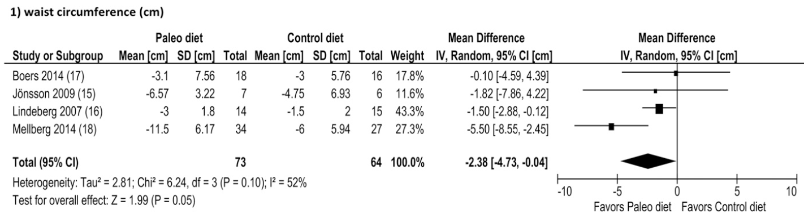

---
output:
  html_document:
    df_print: paged
  tufte::tufte_handout: default
  pdf_document: default
bibliography: "`r rbbt::bbt_write_bib('biblio.json', overwrite = TRUE, library_id = rbbt::bbt_libraries()[rbbt::bbt_libraries()$name == 'reinstein_research_and_impact_collabs', 1])`"
link-citations: yes
---

# Meta-analysis arbitrary example: the 'Paleo diet' {#paleo-example}

Introduction and discussion

> Summarize the evidence base for the effectiveness of the Paleo diet in reducing obesity (as measured by waist circumference). Please cover: a) the basics of the intervention being studied; b) the research methodology; c) the results.

> What is your conclusion on how effective the Paleo diet is at reducing waist circumference? What do you regard as the key strengths and limitations of the evidence and why?

> Briefly, what are the major uncertainties in your analysis? How could your conclusion be wrong? This will likely involve saying what you explicitly chose not to do and what you do not know.

There is some evidence supporting the claim that the 'Paleo diet' reduces obesity as measured by waist circumference, at least for certain targeted groups relative to certain 'standard recommended diets. At least a small set of randomized trials have concluded that participants in the "Paleo diet treatment" groups reduced their waist circumference more than those in control groups.

This evidence is summarized in the meta-analysis of @manheimerPaleolithicNutritionMetabolic2015a who report:

> The Paleolithic diet resulted in greater short-term improvements in metabolic syndrome components than did guideline-based control diets. The available data warrant additional evaluations of the health benefits of Paleolithic nutrition.

More recent meta-analyses in reputable journals have also found favorable results (@ghaediEffectsPaleolithicDiet2019, @demenezesInfluencePaleolithicDiet2019a).

<div class="marginnote">
According to [Scimago](https://www.scimagojr.com/journalrank.php?category=2916), American Journal of Clinical Nutrition (@manheimerPaleolithicNutritionMetabolic2015a) ranked second among Nutrition and Dietetics journals, Advances in Nutrition (@ghaediEffectsPaleolithicDiet2019) is ranked fourth, and Nutrition Journal (@demenezesInfluencePaleolithicDiet2019a) is ranked 35th.
</div>

However, the Paleo diet remains controversial; it is still referred to as a 'fad diet' on [Wikipedia](https://en.wikipedia.org/wiki/Paleolithic_diet) (accessed 20 Dec 2020), which claims 'there is no good evidence that following a paleolithic diet lessens the risk of cardiovascular disease or metabolic syndrome'.\*

<div class="marginnote">
\* However, this Wikipedia article references [@ghaediEffectsPaleolithicDiet2019; @manheimerPaleolithicNutritionMetabolic2015]; both of these meta-analyses would more accurately be characterized as stating that there is some evidence but the results are not yet definitive.
</div>

[@fentonPaleoDietStill2016] criticized the @manheimerPaleolithicNutritionMetabolic2015a meta-analysis, arguing it overstated the findings and citing limitations of the included original studies. \*\*\*

<div class="marginnote">
\*\*\* While I agree with some of the conceptual issues [@fentonPaleoDietStill2016] raise, I find their criticism of the statistics a bit imprecise as well as arbitrary in citing statistical norms without justification.  I return to these issues below.
</div>

\

In this brief review I:

- [Consider conceptual issues in defining and measuring the 'impact of a diet' through standard study methodologies](#conceptual)

- [Focus (as suggested) on the meta-analysis of @manheimerPaleolithicNutritionMetabolic2015a considering its methods, findings, and limitations](#limitations-p),
    - considering key conceptual and statistical issues,
    - considering the [critiques of @fentonPaleoDietStill2016 and Manheimer's responses](#critiques), as well as other evaluations of this meta-analysis,
    - weighing this evidence in light of a (shallow survey of) the consensus and other meta-analyses.

- [Assess a particularly promising study](#boers) [@boersFavourableEffectsConsuming2014] (incorporated into @manheimerPaleolithicNutritionMetabolic2015a)

*Disclaimers:* (See ['limitations'](#limitations-p) below).


## Conceptual: Thoughts on nutritional studies and meta-analysis issues {#conceptual}

### Limited compliance; 'what are we aiming to measure and why?' {#compliance}

Randomized controlled trials on nutrition and diet have important limitations not faced by many other medical RCTs, such as drug trials.
<div class="marginnote">
Another important limitation: "RCTs of dietary interventions
cannot be controlled with true placebos, but rather with certain constraints on nutrient compositions, food groups, or dietary patterns" @schwingshacklPerspectiveNutriGradeScoring2016. They also cite
"lack of double blinding... crossover bias, and high dropout rates"; although dropout (attrition) is not an exclusive problem for dietary studies.
</div>


*Limited compliance* is a particularly important issue: not all participants who are assigned to a particular diet will carefully follow this diet. There are ways of *tracking* compliance (e.g. "Diet-associated biomarkers" such as 24-hour urine checks, which are highly-rated  by @schwingshacklPerspectiveNutriGradeScoring2016's Nutrigrade). There are also ways of encouraging and incentivizing compliance, such as providing free food (as in @boersFavourableEffectsConsuming2014).

However, our consideration of this issue depends on what exactly itis we want to measure, and for what purpose. For example may want to consider either, what I will call... \*

<div class="marginnote">
\* Note that my terminology below comes from the "treatment effect" literature in statistics and econometrics, with some slight abuses of terminology. See, e.g., @angristIdentificationEstimationLocal1995.
</div>


1. "Average Treatment Effect (ATE)": The difference in some medical outcome, averaged over the population of interest... for the 'Treatment diet' if consumed exactly as proposed relative to a 'Control diet.'\*\*

<div class="marginnote">
\*\* Even here, there may be some ambiguities that need to be clarified. Should these diets specify exact amounts/calories consumed ('isocaloric'), or only the types of foods, allowingconsumption as desired? Do we need to ensure that other patterns, such as exercise, are held constant across diets?  (One might imagine that with random treatment exercise patterns will be identical on average, however, some diet may give people more energy to do exercise. We need to decide whether this is part of the effect we wish  to consider.)
</div>

*or the*

2. "Intention to Treat (ITT)" effect:  The difference in some medical outcome, averaged over the population of interest...  for those *assigned* to the treatment diet relative to the control diet.


The ATE measure would seem to be more relevant:

- if we want to get at basic biological mechanisms or
- if we believe we should recommed a 'best diet' without adjusting for compliance. \*
<div class="marginnote">
E.g., perhaps we are making recommendations for a context where compliance is not particularly difficult (e.g. perhaps school or military meals).  It may also be reasonable to assume that people reading our analysis (e.g., dieters), will already make these self-control considerations themselves, and simply wish to know which diet would ve best, if they could live up to it.
</div>

On the other hand the ITT measure might be more relevant if we want to consider which diet to propose "for real people to achieve their best outcomes."  However:

- while the impact of the diet itself (the ATE)  might be expected to be fairly uniform, as the basic biological mechanisms will be similar for similar groups of people,

- I would expect that the ITT measure to have more heterogeneity and variation, as compliance with a particular diet might be expected to vary greatly for a variety of psychological and cultural/lifestyle  reasons.

Thus the ITT may  be more sensitive to the representativeness of our sample of dieters. Given self selection and other issues, it may be extremely difficult to recruit a "nationally representative" sample of the targeted group.

In the discussion of @manheimerPaleolithicNutritionMetabolic2015, it is not clear to me which measure of the studies are targeting. The discussion ("whether Paleolithic *nutrition* has any effect in improving metabolic risk factors", emphasis added) seems to suggest that they are considering the ATE. However most of the designs seem to involve simply different *recommendations* for treatment and control groups; these would seem much more likely to pick up the ITT for their study sample.


### Control group: what is being measured?

(Time-permitting, I would more carefully consider which 'control group' diets are being administered or recommended.)

\

### What is being tested and how broadly should we interpret the results?

Broadly, the Paleo diet involves:

1. Multiple differences relative to more traditional diets

2. A series of connected claims about the *mechanism* by which it achieves benefits, and about nutrition and health in general

\

It is important to note that even if there is clear evidence that (recommending or implementing)  the 'Paleo diet' causes positive health benefits relative to an older diet:

1. There is some inconsistency and much heterogeneity in the definition of the Paleo diet, as noted by @zazpeScopingReviewPaleolithic2020, who propose a particular 'PaleoDiet' score

2. We don't know *which* of the components of the Paleo diet were beneficial (some may even have been harmful, but outweighed by others which were even more strongly beneficial.

3. We don't have evidence that narrowly supports the claims made by Paleo advocates. Even if elements of the Paleo diet are beneficial, it may be through other mechanisms and channels than those proposed.


## Manheimer et al {#manheimer}

### Strengths and limitations

The authors follow standard protocols and recommendations. However, these systems themselves may merit some further examination.\*
<div class="marginnote">
\*  E.g., I would like to better understand how the GRADE system used to asses the quality of evidence has *determined* the weights for different categories of 'quality' chosen. @Quintana2015 note "there are more than 80 tools available to assess the quality and risk of bias in observational studies"... Perhaps there are a similar number of tools for RCT studies.
</div>

They have:

1. Prospectively (in advance) [registered their protocol with PROSPERO](http://www.crd.york.ac.uk/PROSPERO\*\*
<div class="marginnote">
\*\*
This reduces the risk of "hypothesizing after the results are known" ... 'HARKing' @kerrHARKingHypothesizingResults1998", as noted by @Quintana2015.
However it is difficult to verify when a meta-analysis was actually started, even privately. Here pre-registration partially depends on an honor and trust system.
</div>


2. Searched a broad collection of appropriate databases:

- both literature databases such as PubMed
- and databases of clinical trials

They also claim to have contacted "experts in the field" (these should have been named) to consider whether any trials had been overlooked. This seems to have been a well-planned and adequate search, not neglecting the "gray literature" (@paezGrayLiteratureImportant2017) and limiting "file drawer" bias (@kennedyOldFiledrawerProblem2004). They carefully explained their selection method, and illustrated it in a flow diagram.

3. Broadly assessed the quality of the evidence following the GRADE protocol, finding the overall evidence to be of 'moderate' quality (for waist circumference).

4. Analyzed the overall evidence using a frequentist Random-Effects model, estimating both a mean effect and a heterogeneity term. I find this approach to be reasonably appropriate, but I would prefer a *Bayesian* meta-analysis.

5. Plotting the evidence for each outcome with the standard recommended tree plots, clearly depicting the (frequentist) confidence intervals for each study and overall.

**Presentation, transparency and characterization**: My general impression is that they have clearly and cleanly stated their approach and methods, and reasonably characterized their findings, without overstatement.\* E.g., they write:

> Although there is moderate quality evidence from randomized controlled intervention studies to suggest that the Paleolithic diet can improve metabolic syndrome components, we believe that more studies are required before Paleolithic nutrition can be recommended in future guidelines. (p. 928).

<div class="marginnote">
\* However, I would have liked to see their code and data made available, or at least more prominently noted (I may have overlooked it). </div>

#### Limitations

1. Small number of studies, small sample, wide confidence intervals

> Four RCTs that involved 159 participants were included. The 4 control diets were based on distinct national nutrition guidelines but were broadly similar.

As the authors acknowledge, this is a small number of studies and the sample as a whole is rather small. This leads to fairly wide confidence intervals by most measures.

As noted below, the evidence does not allow us to rule out heterogeneity across studies. With only a few studies presented, we do not have  good sense of how robust these results would be to considering other populations, control diet comparisons, etc.

\

***
**Note**: This suggests the limitations of the evidence, not a weakness of the authors' analysis. To me their inclusion criteria seem reasonable. I agree, e.g.,  with their decision that:

> Crossover RCTs were eligible for inclusion, but we used data from only the first phase before the crossover occurred because we considered the risk of carryover effects to be high

However, particularly in line with the points made in @schwingshacklPerspectiveNutriGradeScoring2016, I would like to see a meta-analysis considering not only RCTs but also other reasonable approaches, such as cohort studies.
***

\


2. Possible signs of authors' pre-judgement and funding pressure

- The study was 'Supported in part by the National Center for Complementary and Alternative Medicine of the US NIH (grant R24 AT001293; EWM)', a group that I might suspect to be somewhat sympathetic to the anti-establishment linked 'back to nature' philosophy of the Paleo diet.


### Overall results, interpretation, consideration of evidence presented in  @manheimerPaleolithicNutritionMetabolic2015

I reproduce the most relevant part of @manheimerPaleolithicNutritionMetabolic2015's results below:

```{r  fig.cap = 'Forest plot from Manheimer et al: Waist circumference', out.width='90%', fig.asp=.8, fig.align='center',  echo = FALSE}
 

```


In the individual studies, the Paleo diet participants reduced their waist circumference ('WC') by an average of 3-11cm, with some differences across studies. For control diet participants the reduction was between 3 and 6 cm on average. The 'difference in loss' ranged from

- a virtual zero with a 95% confidence interval of [-4cm, +4cm] in Boers et al (the study where food was provided)
- to a 5.5 cm greater loss for Paleo diets (in Mellberg et al).

The reported meta-analytic estimate is an average of 2.38 cm greater loss in Paleo relative to the control diet, with a 95% confidence interval [-4.73, -0.04], thus a 'just significant' difference at the standard NHST threshold of $p<0.05$.

\

*Does this imply a large relative effect of Paleo?* *Does it bound the effect as 'small at best'*?

To consider the magnitude of an effect such as this, it is helpful to consider overall averages and spreads.
The average US male WC is roughly 102 cm (@fryarMeanBodyWeight2018) and 98 cm for women...\*
<div class="marginnote">
\* I could not quickly find a reputable source for averages in Sweden and Netherlands, where most of the studies were conducted, but [secondhand reports](https://www.dailymail.co.uk/health/article-2441250/Average-BMI-Artist-compares-sizes-men-various-countries.html) suggest it is somewhat smaller, perhaps 90 cm.
</div>

... which (for men) is also approximately the [threshold circumference  considered a risk factor for metabolic syndrome](https://www.heart.org/en/health-topics/metabolic-syndrome/about-metabolic-syndrome) (accessed 29 Dec 2020). I quickly, (and perhaps incorrectly) imputed a standard-deviation of roughly 52 cm.\*\*
<div class="marginnote">
\*\* Drawing from @fryarMeanBodyWeight2018 statistics, I multiplied the square root of the reported sample size ($\sqrt(43169
)$) by the reported standard error of 0.1 (for the table in inches, the figure in the centimeter table didn't make sense), and converted back to cm. This calculation may be incorrect; I would like to check it, or better still, find some scientific estimates of dispersion measures for this (SD, quantile, IQR, etc.) I would also like to read more about what WC losses are considered normal, reasonable, and substantial in this context.
</div>

\

**Heterogeneity**

The evidence also suggest between-study heterogeneity; at least we do not have strong evidence that would allow us to rule this out. Prima facie, we see strong differences between the studies. In particular, the one study with a strongly  different methodology (Boers et al), finds a much smaller (near-zero effect). In their formal measures, we see an $I^2$ of 52%, conventionally classified as "moderate heterogeneity". I believe $\tau^2 of 2.81$  can be interpreted as a 'standard deviation in true effect size between studies' of $\tau =$ `r sqrt(2.81)`, which seems, again, 'moderate'.\*\*\*
<div class="marginnote">
\*\*\* I  suspect that if we allowed a variety of other methods of estimating and reporting this (including Bayesian) and we reported the confidence/credible intervals on this between-study variance, the results might suggest the possibility of more substantial heterogeneity.
</div>

Although the NHST for heterogeneity is not significant by standard measures ($P=0.10$), a simple 'failure to reject in a diagnostic test' does not constitute substantial reason to ignore a potentially-important concern.\*
<div class="marginnote">
A 'failure to reject the null' is not in itself, strong evidence for the null hypothesis. Among other things, I suspect a lack of power to detect heterogeneity with only four studies.
</div>


### My rough conclusions from Manheimer et al

1. The above evidence suggests some relative benefit of the Paleo diet, but not an extremely large benefit. To the extent

2. These (3) studies that find greater benefits are ones where compliance is particularly important, while the one study where food is provided (isocaloric for both diets) Does not seem to find a benefit. This casually suggests that 'easier compliane' may be one of the major benefits of the Paleo diet relative to a traditional diet, but obviously, more evidence would be needed to support this conclusion.


### External critiques and evaluations of Manheimer et al, (esp Fenton) authors' response {#critiques}

<!--
### Ghaedi et al meta-analysis
-->

[@fentonPaleoDietStill2016]'s critique of @manheimerPaleolithicNutritionMetabolic2015's focal statistical comparisons appears to result from a mis-reading.\*<div class="marginnote">
\* "We did not report separate tests against baseline within groups as Fenton and Fenton suggest but rather a comparison of the differences in change from baseline between groups." [@manheimerReplyTRFenton2016]
</div>


@schwingshacklPerspectiveNutriGradeScoring2016 develops the 'Nutrigrade' scoring system for the strength of the evidence presented in a meta-analysis, specifically for nutrition research.\*
<div class="marginnote">
\* Note that these scores are not a verdict on the quality of the meta-analysis itself but of the evidence strength presnted within.
</div>
Their system and relative points system was independently developed; a major point of contrast with GRADE (@guyattGRADEEmergingConsensus2008) seems to be Nutrigrade's greater valuation of cohort studies relative to RCTs, reflecting some of the rationales mentioned above, such as [limited compliance](#compliance). They 'Nutrigrade' the evidence in  @manheimerPaleolithicNutritionMetabolic2015 as 5.75, or 'Low', explained as "there is low confidence in the effect estimate; further research will provide important evidence on the confidence and likely change the effect estimate." Of 10 randomly meta-analysis studies they rated, this was the fifth-highest 'Nutrigrade'.


Overall, the 'reviews' of the strength of evidence meta-analysis are fair to middling. All, including the original authors, seem to agree that the  "the current evidence on the paleo diet might be considered early or preliminary and that further research is critically needed" (@manheimerReplyTRFenton2016), although there seems to be some disagreement about how promising an avenue this is for further inquiry.


## Other meta-analyses and consideration of the Paleo diet

As noted, the Paleo diet is controversial and not widely accepted in the medical profession. As @manheimerPaleolithicNutritionMetabolic2015 note

> a 2015 US News and World Report ranking of 35 diets with input from a panel of health experts placed the Paleolithic diet dead last, citing a lack of research evidence that showed clinical benefits.

However, more work also seems to  support a claim such as 'recommending  the Paleo diet is succesful in reducing waist circumference in the short-term, relative to recommending more traditional diets.'

In particular, @ghaediEffectsPaleolithicDiet2019 perform a meta-analysis of eight RCT studies (the four considered by Mannheimier et al, plus four more that were conducted since 2015) and find "a [Paleo diet] significantly reduced ...  waist circumference (WMD = -2.90 cm; 95% CI: -4.51, -1.28 cm)". These results are rather similar to those of @manheimerPaleolithicNutritionMetabolic2015. Time-permitting, I would like to examine this meta-analyis in more detail.


### Process of finding relevant work (informal)

*Notes*: In the limited time I had available, I did some keyword searches on Google scholar, such as `'paleo diet' AND 'meta-analysis`'` and `paleo diet` AND `randomized controlled trial`. I also followed a 'snowball' approach to consider which studies were cited, and which studies cited @manheimerPaleolithicNutritionMetabolic2015, and the papers most prominently cited within.  I did not do the systematically nor did I keep track of my process (as I would do if I were doing this more seriously, e.g., for my own meta-analysis).


## Focus: Boers et al {#boers}

Unlike the other trials considered in @manheimerPaleolithicNutritionMetabolic2015, @boersFavourableEffectsConsuming2014  "provided home-delivered Paleolithic and control diet meals to participants". This permits a more direct examination of what I called the [ATE](#compliance). I expect this effect to be less variable and more generalizable across populations, because issues of differential compliance will be reduced.

This study is also particular strong because it has (apparently) a zero attrition rate ('34/34 analyzed'), while attrition in the other cited studies is substantial. Particular forms of non-random attrition can strongly bias estimated treatment effects, biasing both the ATE and ITT mentioned above.\*
<div class="marginnote">
\* See @leeTrainingWagesSample2009 for a clear discussion of this, as well as an approach to 'bounding this bias' under a particular monotonicity assumption.
</div>

## Overall analysis

My overall impression from the above is that the meta-analytic results do suggest some benefit of the Paleo diet in reducing waist circumference for groups that are vulnerable to the metabolic syndrome.

However:

- The evidence plausibly suggests that the benefit of this diet comes largely through greater adherence, rather than through a direct nutritional advantage. Perhaps, as is popular conventional wisdom "eating more proteinssimply makes it easier to feel full and thus not overeat".

- The studies I have seen compare the diet only to a traditional diet, rather than to another low carbohydrate diet. Thus, I do not see any strong evidence that the Paleo diet offers advantages (or disadvantages) over, e.g., the 'South Beach' or 'Keto' diets. Thus the evidence does not support (nor refute) the *mechanism and diet philopsophy* behind Paleo.
\

Furthermore, there also appears to be **limited evidence**;  I am not highly confident in even the above claim.  I did not see aa wide array of high-quality studies  evaluating the Paleo diet for the relevant large and diverse populations in natural settings.

### Limitations and uncertainties to my own analysis; proposed future steps {#limitations-p}

> Briefly, what are the major uncertainties in your analysis? How could your conclusion be wrong? This will likely involve saying what you explicitly chose not to do and what you do not know.

**Caveats:** I am an economist, not a nutritionist or a life scientist. While I am working to build up my expertise in this area I have only limited experience conducting and for evaluating meta-analyses. The evaluation here was only a limited and shallow exercise done in a 10 hour window for a specific purpose. I did not do a broad and systematic review of the literature.

I was only able to take a narrow focus for this exercise, mainly considering only@manheimerPaleolithicNutritionMetabolic2015  review, as well as some connected work. To gain a more reliable answer to this question, there are a number of further , involving gaining better understanding, digging deeper into the data and analysis, and consulting a range of experts.

\

**Some steps I would take**

1. Better understand: *What is the relevant question?*

As I suggested above, the nature of evidence that is appropriate will depend on what question is being asked, and what purpose this is being put to. Why do we care about the answer to this? Are we considering recommending this diet to a particular population? How strong incentive/food provision will we be able to provide? Are we deeply interested in the biological mechanisms or the behavioral ones? What do we intend to do with the results of this analysis, i.e., what policy choices will it inform?

If I had better answers to question like these, I would know which types of studies to focus on, and how to better consider their results.


2. Pursue a more systematic consideration of the literature and evidence

- documenting my protocol
- carefully considering which fields and subfields to focus on
- discussing my approaches with experts in these fields, seeking their consideration of the points I have made in this essay

3. Pursue a better understanding of

- the reasoning behind standardized protocols for meta-analysis and 'bias-assessment', consulting, e.g., the ['Cochrane Handbook for Systematic Reviews of Interventions'](https://training.cochrane.org/handbook/current)

- How nutritionists and dieticians differentiate (what I call above) the ITT and ATE

- The argument for particular meta-analytic approaches in nutrition and health studies (in comparison to my area of greater expertise, economics and social science)

\

4. More closely inspect and evaluate

- @manheimerPaleolithicNutritionMetabolic2015's code used for doing the (frequentist) Random-effects meta-analysis, to understand the specific inclusion, variable-coding, and estimator choices, and the sensitivity of the results to this.\*
<div class="marginnote">
\* For example, as explained in the excellent tutorial @harrerDoingMetaanalysisHandson2019, [there are a range of popular estimators for $\tau^2$](https://bookdown.org/MathiasHarrer/Doing_Meta_Analysis_in_R/random.html#tau2), the variance of the distribution of true effect sizes. There is also some debate over whether random effects is appropriate, particularly because of its sensitivity to small studies.
</div>

- The particularly promising @boersFavourableEffectsConsuming2014 study  as [noted above](#boers)

- @ghaediEffectsPaleolithicDiet2019, and  @demenezesInfluencePaleolithicDiet2019a, and any other promising analyses that come from the aforementioned systematic literature survey.
