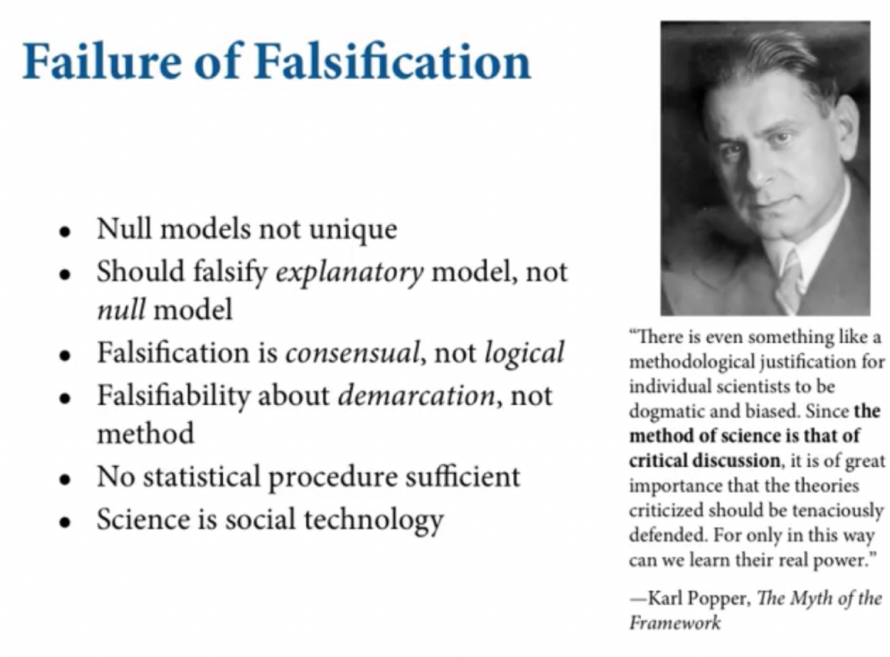

Try downloading and accessing some functions here:

```{r}

   try_download <- function(url, path) {
      new_path <- gsub("[.]", "X.", path)
      tryCatch({
        download.file(url = url,
                      destfile = new_path)
      }, error = function(e) {
        print("You are not online, so we can't download")
      })
      tryCatch(
        file.rename(new_path, path
        )
      )
    }

    library(here)
    here <- here::here()
    try_download("https://raw.githubusercontent.com/daaronr/dr-rstuff/master/functions/project_setup.R", here::here("code","project_setup.R"))

source(here::here("code", "project_setup.R"))

```


#Basic options used across files and shortcut functions, e.g., 'pp()' for print
#functions grabbed from web and created by us for analysis/output


```{r eval=FALSE}
install.packages("bookdown")
install.packages("tufte")
# or the development version
# devtools::install_github("rstudio/bookdown")
```


**Pulling in key files from other repos; don't edit them here**

```{r pull-in-docs}

try_download("https://raw.githubusercontent.com/daaronr/data_acad_materials/main/other_content_notes/ds_for_bsns_notes.Rmd?token=AB6ZCMECAFDEIYJ72VEGU4K74YGOE", here::here("data_sci","ds_for_bsns_notes_remote.Rmd"))

```


```{r include=FALSE}
# automatically create a bib database for R packages
knitr::write_bib(c(
  .packages(), 'bookdown', 'knitr', 'rmarkdown'
), 'packages.bib')
```


```{r html, echo=FALSE}
# globally set chunk options

knitr::opts_chunk$set(fig.align='center', out.width='80%', warning=FALSE, message = FALSE, error=TRUE)

my_output <- knitr::opts_knit$get("rmarkdown.pandoc.to")


```{r html, echo=FALSE}
# globally set chunk options
knitr::opts_chunk$set(fig.align='center', out.width='80%')

my_output <- knitr::opts_knit$get("rmarkdown.pandoc.to")

knitr::knit_hooks$set(
  evaluate.inline = function (code, envir = knit_global()) {
    v = try(eval(xfun::parse_only(code), envir = envir))
    knitr::knit_print(v, inline = TRUE, options = knitr::opts_chunk$get())
  },
  inline = function(x) {
  if (any(class(x) == "try-error")) {
    as.vector(x)
  } else x
})
```


<!-- BUILDING IT? SERVING IT?
bookdown::serve_book(dir = ".", output_dir = "_book", preview = TRUE,
           in_session = TRUE, quiet = FALSE)
-->

<!---
Can define text blocks here, refer to them again and again if desired
-->

<!-- Global site tag (gtag.js) - Google Analytics -->


<!-- <html> -->

<!-- <script async src="https://www.googletagmanager.com/gtag/js?id=G-QLKFNFTGXX"></script> -->
<!-- <script> -->
<!--   window.dataLayer = window.dataLayer || []; -->
<!--   function gtag(){dataLayer.push(arguments);} -->
<!--   gtag('js', new Date()); -->

<!--   gtag('config', 'G-QLKFNFTGXX'); -->
<!-- </script> -->
<!-- </html> -->

<!--chapter:end:index.Rmd-->

# Introduction

My goal in putting this resource is to focus on the practical tools I use and the challenges I ([David Reinstein](https://daaronr.github.io/markdown-cv/)) face. But I am open to collaboration with others on this. (Other contributors so far include Gerhard Riener, Oska Fentem, and Scott Dickerson.)

\

*My focus:* Microeconomics, behavioral economics, focus on charitable giving and 'returns to education' type of straightforward problems. (Minimal focus on structural approaches.)

What I care about: Where we can *add value* to real econometric (and statistical,  experimental, survey design, and data science) practice?


\

The data I focus on:

- Observational (esp. web-scraped and API data and national surveys/admin data)

- Experimental: esp.  with multiple crossed arms, and where the 'cleanest design' may not be possible

\

I will assume familiarity with most basic statistical concepts like 'bias', 'consistency', and 'null hypothesis testing.' However, I will focus on some concepts that seem to often be misunderstood and mis-applied, and I will give and link definitions as time permits.

```{block2,  type='note'}

If you are involved with this project, you can find a brief guide (somewhat WIP) on how to add content (HERE)[https://daaronr.github.io/ea_giving_barriers/bookdown-appendix.html].  This is from a different project but the setup is basically the same.

```

## [Basic statistical approaches and frameworks](#conceptual) {-}

-  Bayesian vs. frequentist approaches

<div class="marginnote">
Folder: bayesian
Notes: [bayes_notes](bayesian/bayes_notes.Rmd)
</div>
 

-  Causal vs. descriptive; 'treatment effects' and the potential outcomes causal model

<!-- #### DAGs and Potential outcomes -->

-  Theory, restrictions, and 'structural vs reduced form'

## [Regression and control approaches, robustness](#reg_control) {-}

<!--

[Getting, cleaning and using data; project management and coding](#data-sci) {-}

<div class="marginnote">
This will build on my content [here](https://daaronr.github.io/writing_econ_research/economic-theory-modeling-and-empirical-work.html#getting-and-using-data), and integrate with it.
</div>
 
- Data: What/why/where/how
- Organizing a project
- Dynamic documents (esp Rmd/bookdown)
- Good coding practices
- Data sharing and integrity

-->
<!--- #### New tools and approaches to data (esp 'tidyverse')

#### Style and consistency

Indenting, snake-case, etc

#### Using functions, variable lists, etc., for clean, concise, readable code

--> 

<!--
## Basic regression and statistical inference: Common mistakes and issues {-}

Simple identification issues: "Bad control" ("colliders"); Endogenous control: Are the control variables you use endogenous? (E.g., because FDI may itself affect GDP per capita)

odMeling choices: Choices of lhs and rhs variables, choice of control variables and interactions, which outcome variable/variables; i

Functional form: Logs and exponentials, Nonlinear modeling (and interpreting coefficients), 'Testing for nonlinear terms'

Missing data


OLS and heterogeneity:  OLS does *not* identify the ATE. See: ['your go-to regression specification is biased...'](http://blogs.worldbank.org/impactevaluations/your-go-regression-specification-biased-here-s-simple-way-fix-it?cid=SHR_BlogSiteShare_XX_EXT). Modeling heterogeneity: the limits of Quantile regression.

Interpretation and inference: 

- "Null effects" (or move to previous 'conceptual' chapter), confidence intervals and Bayesian credible intervals
-  Interaction terms and pitfalls
- Comparing relative parameters
-  Multiple hypothesis testing (MHT)
- 'Moderators', confusion with nonlinearity
- Choice of test statistics (including nonparametric)
-->

<!-- (Or get to this in the experimetrics section) 

How to display and write about regression results and tests

Bayesian interpretations of results (see also '[Bayesian Approaches](#bayes)')

--> 


<!-- ## LDV and discrete choice modeling {-}

## Robustness and diagnostics, with integrity {-}

- (How) can diagnostic tests make sense? Where is the burden of proof?
- Estimating standard errors
-  Sensitivity analysis: Interactive presentation

## [Control strategies and prediction; Machine Learning approaches](#control-ml) {-}

-  Machine Learning (statistical learning): Lasso, Ridge, and more
-  Limitations to inference from learning approaches

--> 


## Causal inference through observation{-#caus_inf_obs} {-}


<!-- 
##  [Causal inference: IV (instrumental variables) and its limitations]  {-#iv_limitations}

- Instrument validity
- Exogeneity vs. exclusion
- Very hard to 'powerfully test'
-  Heterogeneity and LATE

*Basic consideration: what does IV identify and when:*?

-  Weak instruments, other issues
- Reference to the use of IV in experiments/mediation

## [Causal inference: Other paths to observational identification](#other_paths) {-}

- Fixed effects and differencing
-  DiD
-  RD
-  Time-series-ish panel approaches to micro


-->


## Causal paths and levels of aggregation {-}

<!-- 
## Causal paths: [Mediation modeling and its massive limitations](#mediators) {-}

An applied review

## Causal paths: [selection, corners, hurdles, and 'conditional on' estimates](#selection_cop) {-}

'Corner solution' or hurdle variables and 'Conditional on Positive'

"Conditional on positive"/"intensive margin" analysis ignores selection

\

Bounding approaches (Lee, Manski, etc). See [Notes on Lee bounds](#notes_lee)
-->


## Experiments and surveys: design and analysis {-} 

<!-- 
## [Survey design and implementation; analysis of survey data](-#surveys)

## [(Experimental) Study design: Identifying meaningful and useful (causal) relationships and parameters](#why_experiment_etc) {-}

-->

<!-- experiments_and_study_design/why_experiment_design.Rmd 
Why run an experiment or study?

- Sugden and Sitzia critique here, give more motivation -->

<!--
Causal channels and identification, ruling out alternative hypotheses, etc

Types of experiments, 'demand effects' and more artifacts of artifical setups

Generalizability (and heterogeneity)


## (Experimental) Study design: Background and quantitative issues {-}
-->
<!-- experiments_and_study_design/quant_design_power.Rmd -->
<!-- 
- Pre-registration and Pre-analysis plans
- The hazards of specification-searching
- Sequential and adaptive designs
- Efficient assignment of treatments

(Links back to [power analyses](#power))


## (Experimental) Study design: (Ex-ante) Power calculations {-}

- What sort of 'power calculations' make sense, and what is the point?
- The 'harm to science' from running underpowered studies
- Power calculations without real data
- Power calculations using prior data

## ['Experimetrics' and measurement of treatment effects from RCTs](-#experimetrics_te) {-}
-->

<!-- Which error structure? Random effects?

- Randomization inference?

- Parametric and nonparametric tests of simple hypotheses

- Adjustments for exogenous (but non-random) treatment assignment


-  IV in an experimental context to get at 'mediators'?

- Heterogeneity in an experimental context

--> 

# [Other approaches, techniques, and applications](#other_approaches) {-}

<!--
## [Making inferences from previous work; Meta-analysis, combining studies](-#metaanalysis)

- Publication bias 

- Combining a few (your own) studies/estimates

- Full meta-analyses

- Models to address publication biases

## The Bayesian approach {-}

-->

## Some key resources and references {-}

[@angrist2008mostly]

'The Mixtape' (Cunningham)

[@kennedyGuideEconometrics2003]

Tibshirani, Robert. n.d. “Statistical Learning with Sparsity the Lasso and Generalizations.”

<!--[Tibshirani] -->

OSF guides

Christensen ea "Transparent and Reproducable Social Science Research"

[@wooldridgeEconometricAnalysisCross2002; @wooldridgeIntroductoryEconometricsModern2008]

Gentzkow and Shapiro (2013) <!-- Add reference -->


An Introduction to Statistical Learning with Applications in R

R for Data Science Garrett Grolemund Hadley Wickhamr r4ds.org

Statistical Rethinking: A Bayesian Course with Examples in R and Stan


<div class="marginnote">

Consider:

Paul R. Rosenbaum. Observation and Experiment: An Introduction to Causal Inference . Harvard University Press, 2017

Guido Imbens and Donald Rubin. Causal Inference for Statistics, Social and Biomedical Sciences: An Introduction . Cambridge University Press, 2015

Judea Pearl

Imbens: Potential Outcomes versus DAGs

</div>

<!--chapter:end:metrics_outline.Rmd-->

# **BASIC STATISTICAL APPROACHES AND FRAMEWORKS**  {#conceptual}


The first theme in this book: *what is statistics and what is trying to do?* 

After a conceptual discussion, we go over some 

*Conceptual: approaches to statistics/inference and causality*

## 'Learning and optimization' as an alternative to statistical inference

In many real-world cases we use data and 'statistics' *not* to learn about the world for its own sake, but simply in order to make the 'best' decision.  

These 'decision optimization' cases are referred to as 'reinforcement learning' (I think). In collecting data and planning our analysis and experimental interventions (if any), we need not be directly concerned with 'statistical power' nor with hypothesis testing for its own sake. We might prefer to learn *a little bit* about each of many possible options, with a very low chance of finding a 'statistically significant result', over learning a lot about one or two particular options. See the 'movie titles' example discussed in section \@ref{#lift-test}.

<!-- also see https://docs.google.com/document/d/1v_LflrtZP8ZEP8Xk_L8pKqHazmKcqEn6j4MYrTKrir4/edit -->

## Statistical inference 

## Bayesian vs. frequentist approaches


<!-- 
Folder: bayesian
Notes: [bayes_notes](bayesian/bayes_notes.Rmd)
-->


### Interpretation of frequentist CI's (aside)

<blockquote class="twitter-tweet"><p lang="en" dir="ltr">The fact that 95% of all (correct) CIs contain the true value does not mean that 95% of those that exclude zero do so correctly. You could have (say) 59% correct coverage for 10% excluding zero and 99% for 90% including zero.</p>&mdash; Stephen John Senn (\@stephensenn) <a href="https://twitter.com/stephensenn/status/1219680319114227714?ref_src=twsrc%5Etfw">January 21, 2020</a></blockquote> <script async src="https://platform.twitter.com/widgets.js" charset="utf-8"></script>


## Causal vs. descriptive; 'treatment effects' and the potential outcomes causal model

### DAGs and Potential outcomes

## Theory, restrictions, and 'structural vs reduced form'

## 'Hypothesis testing' 

### McElreath's critique 

### Bayesian vs. frequentist hypothesis 'testing'

### Individual vs. joint hypothesis testing: what does it mean?

### Other issues

(Mention, link to later discussion: issues of the overall false error rate/coverage with MHT)


<!--chapter:end:conceptual/conceptual.Rmd-->

# Hypothesis testing, statistical comparisons and inferences

Note that ['Common statistical tests are linear models'](https://lindeloev.github.io/tests-as-linear/)

Many of the 'univariate' tests presented below can be extended to multiple-variable models (e.g., regression coefficients).

Further discussion, examples, and tables comparing the statistics by [Oska Fentem in his Notion here](https://www.notion.so/Hypothesis-testing-049768b23f3e44de96950121effbfcbe).

## Frequentist

### Parametric

### Nonparametric

## Randomization and permutation-based

Some relevant discussion of the difference between randomization inference and bootstrapping [here](https://jasonkerwin.com/nonparibus/2017/09/25/randomization-inference-vs-bootstrapping-p-values/)


My concern:

> ... we nearly always want to make inferences about the population that the treatment and control groups are taken from (even thinking about a hypothetical super-population), not about the impact on the sampled groups themselves. So, with this in mind, when would I still want to use randomization inference.

## Bayesian and hybrid

Hybrid: See 'Bayes Factor'

### Bayes factor -- what is it, what can it do? {#b-factor}

Anyone use Bayes factors? What I don't understand is which alternative hypothesis is chosen to compare to the null, or how I would be supposed to choose such an alternative hypothesis. Should I choose some minimal effect size of interest (MESOI)?

The Bayes factor is a likelihood ratio of the marginal likelihood of two competing hypotheses, usually a null and an alternative. (Wikipedia)

Don't I need to know which alternative we are considering to compute this?

> Response: Not sure what the MESOI is, but the choice of "null" or "alternative" hypothesis is arbitrary w/ Bayes factors, since you can interpret them in both directions.

DR: I agree about the arbitrariness (and I think that's a good thing) but I am mainly confused because our standard null hypothesis is a point null ('exactly zero effect') while our standard prior puts no mass on any points as far as I know.

Over [here](https://www.statisticshowto.com/bayes-factor-definition/) they say

> the Bayes factor gives us a way to evaluate the data in favor of a null hypothesis, and to use external information to do so. It tells us what the weight of the evidence is in favor of a given hypothesis.

But clearly there can be no way to express the 'evidence in favor of a null hypothesis relative to an alternative' if the alternative is allowed to include 'an extremely small effect'? (Or am I wrong... see further)

[Here](https://easystats.github.io/bayestestR/articles/bayes_factors.html) (more credible) they talk about a 'null region':

> One way of operationalizing the null-hypothesis is by setting a null region, such that an effect that falls within this interval would be practically equivalent to the null (Kruschke, 2010). In our case, that means defining a range of effects we would consider equal to the drug having no effect at all.

Or maybe I am wrong in my statement above. Reading further:

> comparing the estimated model against the a model in which the parameter of interest has been restricted to a point-null: Testing against the point-null (0) What if we don't know what region would be practically equivalent to 0? Or if we just want the null to be exactly zero? Not a problem - as the width of null region shrinks to a point, the change from the prior probability to the posterior probability of the null can be estimated by comparing the density of the null value between the two distributions.1 This ratio is called the Savage-Dickey ratio, and has the added benefit of also being an approximation of a Bayes factor

Tbh I'm confused here. I see how we can compare the density of the prior and posterior at this 'point null' point (e.g., 'B=0'), and see that (e.g.) the evidence suggests we update at least somewhat in favor of (or against) the null.

But I'm not sure how we could meaningfully express the 'posterior odds' if the prior distribution didn't put any point mass on a particular value, including the null.

So perhaps this works if we use a prior that puts some strictly positive probability on the exact effect $B=0$ (say, $pr(B=0)=1/2$) as well as a non-degenerate distribution of probabilities over the other effect sizes (say, normal/2) ?

\

Nik:

> Hmm, so BF are also known as ratios of marginal likelihoods, i.e., where the likelihood is marginalized (integrated over) the prior.

Define terms (notation from Wikipedia "Marginal likelihood')

IID points $\mathbf{X}=(x_1,\ldots,x_n),$ where $x_i \sim p(x_i|\theta)$ and $\theta$ is a random variable described by $\theta \sim p(\theta|\alpha)$

"the marginal likelihood in general asks what the probability $p(\mathbf{X}|\alpha)$ is, where $\theta$ has been ... integrated out"

DR first stab at it, doesn't make sense (unfold)

```{block2,  type='fold'}
"Marginal likelihoods": the sum of the likelihood of the data given each possible value of the parameter, weighted by the prior probability of that parameter. This should yield "the probability of the data given the prior". 

> > If there is a "single prior used for considering the null and alternative hypothesis" this would then be identical for each. So we must be doing something else here. Are we considering H0 and HA as distinct *priors*? I don't think so.

```

This makes more sense I guess:

"Marginal likelihood under H0" = $L_0= p\big(p(\mathbf{X}|\theta \in H_0\big)| \alpha)$ (not sure this notation is correct):

The sum of the likelihood of the data given each possible value of the parameter that is consistent with $H_0$, weighted by the prior probability of that parameter. This should yield "the probability of the data (given the prior) if H0 holds".

"Marginal likelihood under HA" = $L_A$: ...

(replace HA in above). This should yield "the probability of the data (given the prior) if HA holds"

Nik:

> The marginal likelihood is also the denominator term in Bayes theorem, and is basically a normalizing constant, there to re-scale the numerator to make sure everything integrates / sums to 1 according to the law of total probability.

DR: So with my second interpretation above we have "Marginal likelihood under H0" + "Marginal likelihood under HA" $L_0 + L_A= 1$

> In the discrete case, it's just taking the likelihood at every point in the prior, and then averaging them all together, weighted in proportion to the prior mass (in the continuous case, this is an integration step). It's basically giving a value proportional to your probability of observing the data, under the model in question (the model being composed of all the relations between parameters, the priors on those parameters, the distribution from which the data are drawn, etc.).

DR: OK, but how would these be different under H0 and HA... these both 'use the same prior' I presume. Is my take above approximately correct? (Can you correct it if not?)

> Nik: To get posterior odds, you're right that you'd need to have prior odds / probabilities on the models under consideration. Then it's just multiplying things out (and rescaling, if need be). The two (or more) models could indeed be a model that allows a parameter some distribution vs. a model that fixes that parameter to some number (like your B = 0), equivalent to giving the latter a point-mass prior at that value.

DR: Can we replace 'models' in the statement above with 'range of parameters given weight in the null and alternative hypotheses?'

> In that case, you wouldn't need to do do any integration / summation over that point mass prior, since it's not free to vary (and in practice, we're approximating all these integrals / averages numerically through a hodgepodge of algorithms)

DR: But if we were to use a 'point mass prior only' (e.g., we put $P=1$ on $B=0$) for both H0 and HA and H0 were that $B=0$ and HA that $B \neq 0$ this would not make sense. The prior must be something such as

$$Pr(B=0)=1/2$$ $$Pr(B=x \neq 0) \sim N(0,1)/2$$ Is that a reasonable way to frame it?

\

Nik:

> The question being asked by the marginal likelihood is "what is the probability of the data, averaged over the joint prior distribution from which model parameters are drawn", and then these marginal likelihoods can be used in the same way usual likelihoods can be used (it's just when we take their ratio, we call them 'Bayes Factors')

> Calculating a marginal likelihood is not unlike calculating a conventional likelihood in many cases, too, e.g., in models that allow overdispersion, you're averaging a Poisson mass over a Gamma, or a Binomial mass over a Beta, or whatever

DR: By 'conventional likelihood' are you referring to 'the likelihood of the data given a specific parameter' ... the thing that maximum likelihood procedures will express as a function, and then (take the log and) try to find the highest value of?

\

Nik:

> Another way to think about it is just to forget the terms likelihood, prior, posterior, Bayes, etc. Instead, just consider the probability model $M$, and its implied joint distribution of variables.

> Some of these variables are observed, and we call them observations, $X$. Some are unobserved, and we call them parameters, $\theta$.

> We can compute the density or mass of $X$ in this joint distribution, marginalizing / integrating over the unobserved variables $\theta$. Back in jargonland, this is the marginal likelihood of the model $P(X|M)$, though usually the $M$ is implied and we just write $P(X)$ to stick in the denominator of Bayes theorem.

> We can also ask the joint distribution the conditional distribution of $\theta$ given \$X, $P(\theta|X,M)$, or $P(\theta|X)$ for short, in an exactly analogous way to how we might compute, say, the conditional distribution of other joint distributions, like multivariate normals or more exotic stuff. This is also known as the "posterior distribution" of $\theta$, since it's the conditional distribution of $\theta$, i.e. conditional on the observed data. In this particular context though, we're interested in $P(X|M)$, and maybe also the corresponding value for some other model $P(X|M_{other})$. We can take the ratio of these -- a ratio of marginal likelihoods -- to get a Bayes Factor, and interpret it according to some IMO silly table. Or we could multiply them by model priors and rescale so things sum to 1 to get model posterior probabilities.

DR: This makes sense but it seems equivalent to the previous discussion; I don't see the distinction.

But the major question I have is sort of 'what approach will work to meaningfully asses the evidence for and against the null hypothesis'. "Against" -- this is what the standard p-value NHST presents. "For the null"... seems like it might work in a setup involving a prior putting positive probability mass on a point, but I'm not quite there yet.

## Packages: The "Infer" package in R

### Overview {.unnumbered}

Notes from [vignette](https://infer.tidymodels.org/articles/infer.html)

> we start by assuming that the observed data came from some world where "nothing is going on" (i.e. the observed effect was simply due to random chance), and call this assumption our null hypothesis.

> ... If this probability is below some pre-defined significance level $\alpha$, then we can reject our null hypothesis.

-   very much classical frequentist NHST
-   can this tool accommodate more informative measures like Bayes Factors (as I understand them) that do more than just 'accept vs reject' and get at the *strength of evidence*?

> `specify()` allows you to specify the variable, or relationship between variables, that you're interested in.

> `hypothesize()` allows you to declare the null hypothesis. generate() allows you to generate data reflecting the null hypothesis.

> `calculate()` allows you to calculate a distribution of statistics from the generated data to form the null distribution. ...

Vignette uses 'GSS' (a small extract from the US GSS)

```{r}

pacman::p_load(infer)

# load in the dataset
data(gss)

# take a look at its structure
dplyr::glimpse(gss)

```

### `specify()`: Specifying response (and explanatory) variables

**If we care about a single variable...**

```{r}
gss %>%
  specify(response = age)
```

```{r}
gss %>%
  specify(response = age) %>%
  class()

gss %>%
  specify(response = age) %>%
  str()
```

`specify` isn't just selecting a row; it's a special "S3 class object"

> the `infer` class has been appended on top of the dataframe classes

and it stores some extra meta-data. We see above something suggesting a particular null hypothesis test statistic distribution maybe?

\

"If you're interested in [the relationship between] two variables" we can specify this in one of two equivalent ways:

As a formula:

```{r, results='hide', message=FALSE}

gss %>%
specify(age ~ partyid)

```

Or with named arguments

```{r, results='hide', message=FALSE}

gss %>%
  specify(response = age, explanatory = partyid)

```

If we're doing inference on proportions we need to "use the success argument to specify which level of your response variable is a success."

```{r, results='hide', message=FALSE}
gss %>%
  specify(response = college, success = "degree") 

```

Or, with two variables ...

```{r, message=FALSE}

gss %>%
  specify(response = college, explanatory = partyid, success = "degree") %>% str()

```

Here it seems to be choosing a 'Chi-sq test of independence' perhaps?

### `hypothesize()`: Declaring the null hypothesis {.unnumbered}

> supply one of "independence" or "point" to the null argument.

```{r, results='hide', message=FALSE}

gss %>%
  specify(college ~ partyid, success = "degree") %>%
  hypothesize(null = "independence")

```

(This just adds another 'attribute' to the infer object)

> If you're doing inference on a point estimate, you will also need to provide one of $p$ (the true proportion of successes, between 0 and 1), \$mu\$ (the true mean), \`med (the true median), or $\sigma$ (the true standard deviation). For instance, if the null hypothesis is that the mean number of hours worked per week in our population is 40, we would write:

```{r, results='hide', message=FALSE}

gss %>%
  specify(response = hours) %>%
  hypothesize(null = "point", mu = 40)
```

::: {.marginnote}
This adds three attributes: `null`="point", `params`=40, and `names`="mu".
:::

### `generate()`: Generating the null distribution {.unnumbered}

```{block2,  type='note'}

I believe this step is skipped for 'theory-based inference' (where we  the null distribution has been proven with maths, and so we don't need to do any simulation work).

```

> construct a null distribution based on this hypothesis ... using one of several methods, supplied in the type argument:

> `bootstrap`: for each replicate ... a sample of size equal to the input sample size is drawn (with replacement) from the input sample data.

> `permute`: For each replicate, each input value will be randomly reassigned (without replacement) to a new output value in the sample.

> `simulate`: A value will be sampled from a theoretical distribution with parameters specified in `hypothesize()` for each replicate. (... currently only applicable for testing point estimates.)

```{r}

try_point_null_bootstrap <- gss %>%
  specify(response = hours) %>%
  hypothesize(null = "point", mu = 40) %>%
  generate(reps = 1000, type = "bootstrap")

try_point_null_bootstrap %>% filter(replicate<=5) %>% sumtab(hours, replicate)
```

> To generate a null distribution for the independence of two variables, we could also randomly reshuffle the pairings of explanatory and response variables to break any existing association. For instance, to generate 1000 replicates that can be used to create a null distribution under the assumption that political party affiliation is not affected by age:

I did it with only 3 reps and 4 obs just to be able to see it better:

```{r}

gss[1:4,]

try_indep_null_permute <- gss[1:4,] %>%
  specify(partyid ~ age) %>%
  hypothesize(null = "independence") %>%
  generate(reps = 3, type = "permute")

try_indep_null_permute

try_indep_null_permute %>% str()

```

### `calculate()`: ... Summary statistics {.unnumbered}

> Depending on whether you're carrying out computation-based inference or theory-based inference, you will either supply calculate() with the output of generate() or hypothesize, respectively.

As noted above, it seems the `generate` step is skipped when the null distribution is known from theory.

`calculate` takes a `stat` argument

> which is currently one of "mean", "median", "sum", "sd", "prop", "count", "diff in means", "diff in medians", "diff in props", "Chisq", "F", "t", "z", "slope", or "correlation".

> For example, continuing our example above to calculate the null distribution of mean hours worked per week:

```{r}
gss %>%
  specify(response = hours) %>%
  hypothesize(null = "point", mu = 40) %>%
  generate(reps = 1000, type = "bootstrap") %>%
  calculate(stat = "mean")
```

> The output of calculate() here shows us the sample statistic (in this case, the mean) for each of our 1000 replicates.

Note that if we change the point null being tested the replication values and the statistics both change:

```{r}
gss[1:3,] %>%
  specify(response = hours) %>%
  hypothesize(null = "point", mu = 200) %>%
  generate(reps = 10, type = "bootstrap") %>%
  calculate(stat = "mean")
```

I raised this [issue](https://github.com/tidymodels/infer/issues/407)

... continuing and trying to ignore this....

\

> If you're carrying out inference on differences in means, medians, or proportions, or t and z statistics, you will need to supply an order argument, giving the order in which the explanatory variables should be subtracted. For instance, to find the difference in mean age of those that have a college degree and those that don't, we might write:

```{r}
gss %>%
  specify(hours ~ sex) %>%
  hypothesize(null = "independence") %>%
  generate(reps = 100, type = "permute") %>%
  calculate("diff in medians", order = c( "male", "female"))

```

I'm guessing it is doing something like sampling from the empirical deviations from the mean ('residuals) and adding these to the point null? Or maybe estimating a standard error and doing similar?

### Other utilities: `visualize`, `get_p_value`, `get_confidence_interval()`

```{r}

# find the point estimate
point_estimate <- gss %>%
  specify(response = hours) %>%
  calculate(stat = "mean")

point_estimate %>% str()
```

This calculates a single statistic using a similar syntax, creating a similar object... even if we skip the hypothesize (and generate) steps.

```{r}

# generate a null distribution
null_dist <- gss %>%
  specify(response = hours) %>%
  hypothesize(null = "point", mu = 40) %>%
  generate(reps = 1000, type = "bootstrap") %>%
  calculate(stat = "mean")

```

> Our point estimate 41.382 seems pretty close to 40, but a little bit different. We might wonder if this difference is just due to random chance, or if the mean number of hours worked per week in the population really isn't 40.

> Where does our sample's observed statistic lie on this distribution? We can ... visualize the null distribution ... [and] use the obs_stat argument to specify this.

```{r}

null_dist %>%
  visualize() +
  shade_p_value(obs_stat = point_estimate, direction = "two-sided")
```

(Note that visualize() yields a ggplot object; I wonder if we can use ggplot2 more directly?)

Trying another example:

```{r}

null_hours <- gss %>% 
  specify(hours ~ partyid) %>%
  hypothesize(null = "independence") %>%
  generate(reps = 1000, type = "permute") %>%
  calculate("diff in means", order = c( "dem", "rep", "ind"))

point_estimate_hours <- (mean(gss$hours[gss$sex=="male"]) - mean(gss$hours[gss$sex=="female"]))

null_wt %>%
  visualize() +
  shade_p_value(obs_stat = point_estimate_hours, direction = "two-sided")
```

\`\`\`

<!--chapter:end:statistical_testing_plus/hyp_testing_and_more.Rmd-->

# **REGRESSION AND CONTROL APPROACHES, ROBUSTNESS** {-#reg_control}

# Basic statistical inference and regressions: Common mistakes and issues {#reg-follies}

## Basic regression and statistical inference: Common mistakes and issues briefly listed


Peer effects: Self-selection, Common environment, simultaneity/reflection (Manski paper)	Identification

Random effects estimators show a lack of robustness	Specification	Clustering SE  is more standard practice

OLS/IV estimators not 'mean effect' in presence of heterogeneity

Power calculations/underpowered

Selection bias due to attrition

Selection bias due to missing variables -- impute these as a solution

Signs of p-hacking and specification-hunting

Weak diagnostic/identification tests

Dropping zeroes in a "loglinear" model is problematic

Random effects estimators show a lack of robustness

Dropping zeroes in a "loglinear" model is problematic

Random effects estimators show a lack of robustness

-(Some notes on multi-level modeling) and RE linked [in this Twitter thread](https://twitter.com/DavidPoe223/status/1239447381172727809)

With heterogeneity the simple OLS estimator is not the 'mean effect'

P_augmented may *overstate* type-1 error rate

Impact size from regression of "log 1+gift amount"

Lagged dependent variable and fixed effects --> 'Nickel bias'

Peer effects: Self-selection, Common environment, simultaneity/reflection (Manski paper)

Weak IV bias

Bias from selecting instruments and estimating using the same data

Failure to adjust for multiple-hypothesis testing

### Bad control

From MHE:

> some variables are bad controls and should not be included in a regression model even when their inclusion might be expected to change the short regression coefficients. Bad controls are variables that are themselves outcome variables in the notational experiment at hand. That is, bad controls might just as well be dependent variables too."

– They could also be interpreted as endogenous variables.

Example of looking at a regression of wages in schooling, controlling for college degree completion:

> Once we acknowledge the fact that college affects occupation, comparison of wages by college degree status within occupation are no longer apples to apples, even if college degree completion is randomly assigned."

– The question here was whether to control for the category of occupation, not the college degree.

> It is also incorrect to say that the conditional comparison captures the part of the effect of college that is 'not explained by occupation' ... so we would do better to control only for variables that are not themselves caused by education."


### Does 'controlling for more' increase the probability that a (controlled) difference between too groups represents a causal effect? Not really (Informal discussion in fold)

```{block2,  type='fold'}

Claim: ‘controlling for more factors does not make it more likely that the (remaining) observed association between factors A and D represents a causal relationship’

Suppose we want to know ‘does being raised in Australian culture make you donate more’?  The ‘do this, change that’ hypothesis is ‘if we moved an individual, from birth, into an Australian culture, holding all else constant’, he/she would donate more.
Suppose that 90% share of Australians have a university degree, because Australian culture also encouraged education, while only 50% of non-Australians did.
That raises the first issue: do we want to try to get at only ‘direct effects’ of Australian culture (e.g., on generous spirit) without considering the ‘indirect effects’ on education, which itself might increase concern for others and thus charitable giving? This is not clear. But suppose we only wanted to consider the former. And suppose that Australian culture in fact does increase generosity through this direct channel. But how can we measure it?
We could compare the average donation of Australians and non-Australians overall.  But here we would not be able to disentangle this from  ’“the effect of education --> concern --> giving”
alternatively
2. We could compare the  average donation of Australians and non-Australians “with the same levels of education” i.e., down-weight the Australians with a university degree, counting them only 1/5 as much as Australians without a university degree.
However, we would then be overweighting (fivefold!) Australians who, in spite of the big Australian cultural pressure towards university, nonetheless decided not to get a degree. These people may have other (potentially unmeasured) characteristics tied to their hatred for education, that caused them not to go to Uni. these characteristics may also make them less generous.
The average donations from these ‘extreme anti-education’ Australians may in fact be lower than the the donations of the average non-Australian.  This would then be masking the impact of Australian culture on donations, which (we assumed above) was positive,
```


### "Bad control" ("colliders")

Endogenous control: Are the control variables you use endogenous? (E.g., because FDI may itself affect GDP per capita)

### Choices of lhs and rhs variables

- Missing data
- Choice of control variables and interactions
- Which outcome variable/variables

### Functional form

- Logs and exponentials
- Nonlinear modeling (and interpreting coefficients)


#### 'Testing for nonlinear terms'

Quadratic regressions are not diagnostic regarding u-shapedness: 	Simonsohn18

http://datacolada.org/62

### OLS and heterogeneity

#### OLS does *not* identify the ATE {-}

In general, with heterogeneity, OLS does *not* identify the ATE. It weights observations from different parts of the sample differently. Parts with greater residual variation in the treatment (outcome) variable are more (less) heavily weighted.

<div class="marginnote">
E.g., if the treatment is binary, the estimator will most heavily weight those parts of the sample where the probability of treatment is closest to 1/2.
</div>

The formula is ...

\

```{block2,  type='note'}
**Some intuition**

Why is this the case?  The OLS type estimators we are taught in Econometrics are 'BLUE'  under the assumption of a *single homogenous 'effect'* (the 'slope'...  although the discussion itself is often agnostic as to whether this represents a causal effect).

\

It is 'best' in a minimizing MSE sense under certain assumptions;  in particular, we must also know the true functional form and the set of variables to be included. See 'overfitting' issues.

In  order to have the estimate of the true slope that minimizes the squared errors, OLS (and related estimators like FGLS; as well as 2SLS in a more complicated sense) weights  some observations more than others. The 'influence' of an observation on the estimated slope depends on the nature of the variation in the  dependent and independent variables in the region that observation is drawn from.  Think of drawing a line  through a set of points  that were drawn with some noise from the true distribution.  If you drew it based on a bunch of points (from a region where) the treatment varies very little and the outcomes have a lot of noise,  the line you draw will be very sensitive to the latter noise and thus unreliable. So,  would optimally 'down-weight'  these observations in drawing the line.

\

However, if the *actual* slope varies by region, this also means you are under-representing certain regions, and  thus getting a biased  estimate of the average slope.

```

How can we deal with this?  If we think  that the  treatment effect varies with *observable* variables, we could include 'interactions';  essentially making separate estimates of the slope for each share of the population (but potentially  allowing other control variables to have a homogenous effects, and pooled or clustered estimation of underlying variance.)

<div class="marginnote">
 ...Although we may want to consider both overfitting here and the idea that there may be *some* shared component, so the fully-interacted model may be sub-optimal. See mixed modeling (?)
</div>

\

However, this does not tell us how to recover the *average* of these slopes (approximately, the ATE).  Should we weight each of the slopes by the share of the population that this group represents?

Mechanically,  the standard way of estimating and representing these  interactions and economics has been with simple dummies (0,1) for each compared group. This yields a 'base group' (e.g., males aged 35-60) --  this obviously does not recover the average slope-- as well as the 'adjustment' coefficients.

\

Another way of expressing interactions, particularly helpful with multi-level interactions is called 'effect coding': each group is coded as a 'difference from 0' (e.g,. with bunarybinary gender data males are -1/2 and females +1/2), before doing the interactions. This could allow for a more straightforward interpretation: at each level, the uninteracted term represents the average treatment effects, and the interacted terms represent adjustments relative to this average. *But under which conditions is this in fact the case?*

<div class="marginnote">
[There are various forms of 'effect coding' of which 'effect contrast coding' is one.](https://stats.idre.ucla.edu/spss/faq/coding-systems-for-categorical-variables-in-regression-analysis/#:~:text=Unlike%20dummy%20coding%2C%20effect%20coding,variable%20must%20sum%20to%20zero.)
</div>


[insert here].

[WB blog - your-go-to regression-specification is -biased-here-s-simple-way-fix-it](http://blogs.worldbank.org/impactevaluations/your-go-regression-specification-biased-here-s-simple-way-fix-it?cid=SHR_BlogSiteShare_XX_EXT)

A key paper: http://www.jcsuarez.com/Files/Suarez_Serrato-BFE.pdf

> In particular, we compare treatment effect estimates using a fixed effects estimator (FE) to the average treatment effect (ATE) by replicating eight influential papers from the American Economic Review published between 2004 and 2009.1 Using these examples, we consider a randomized experiment in Section 1 as a case study and, in Section 3, we show generally that heterogeneous treatment effects are common and that the FE and ATE are often different in statistically and economically significant degrees. In all but one paper, there is at least one statistically significant source of treatment effect heterogeneity. In five papers, this heterogeneity induces the ATE to be statistically different from the FE estimate at the 5% level (7 of 8 are statistically different at the 10% level). Five of these differences are economically significant, which we define as an absolute difference exceeding 10%. Based upon these results, we conclude that methods that consistently estimate the ATE offer more interpretable results than standard FE models

By "FE" here I think they mean group dummies; they are focused on cross-sectional and not panel data!

> While fixed effects permit different mean outcomesamong groups,  the estimates of treatment effects are typically required to be the same;  in more colloquial  terms,  the  intercepts  of  the  conditional  expectation  functions  may  differ,  but  not  the slopes

DGP

$$y_i = x_i \beta_{g(i)} + \mathbf{z_i}' \gamma + \epsilon_i$$

> where $y_i is the outcome for observation i among N [N what?],
$x_i$ is treatment or another variable of interest, and $z_i$ contains control variables, including group-specific fixed effects.

> The treatment effects aregroup-specific  for  each  of  the $g=1,...,G$ groups,  where  group  membership  is  known  for  each observation.

Defining ATE

$$\beta^{ATE}=\sum_g \pi_g \beta_g $$

where the $\pi$ terms are population frequencies

\


The use of interaction terms is delicate...

<!--
On the book, I saw the section on the problems of using OLS as an estimator of FE without fully interacting the variables (4.2.4, this blog post), but d
By idn’t really understand the issue/intuition behind the problem/solution – I would be keen to chat about what it means.. and if I then get it, would more than happily contribute a lay summary for the book. Also there are three papers by Ferraro (links below) that I think you might find interesting/offer well explained insights into difficulties in how to do empirical econ/problems within it for the Book.

Plus there is this paper – https://www.nber.org/papers/w25636 which applies the changes-in-changes method of Athey and Imbens 2006 a method which (proponents claims) is able to get at heterogeneous treatment effects better than simple DiD by bin/something similar.
-->


<!-- #TODO: recover conversations with Winston Lin and write these up -->

- Modeling heterogeneity: the limits of Quantile regression

### "Null effects"

While the classical statistical framework is not terribly clear about when one should 'accept' a null hypothesis, we clearly should distinguish strong evidence for a small or zero effect from the evidence and consequent imprecise estimates. If our technique and identification strategy is valid, and we find estimates with confidence intervals closely down around zero, we may have some confidence that any effect, if it exists, is small, at least in this context. To more robustly assert a 'zero or minimal effect' one would want to find these closely bounded around zero under a variety of conditions for generalizability.

In general it is important to distinguish a lack of statistical power from a “tight” and informative null result; essentially by considering confidence intervals (or Bayesian credible intervals). See, e.g., Harms and Lakens (2018), “Making 'null effects' informative: statistical techniques and inferential frameworks” @harmsMakingNullEffects2018.


> Psychologists must be able to test both for the presence of an effect and for the absence of an effect. In addition to testing against zero, researchers can use the two one-sided tests (TOST) procedure to test for equivalence and reject the presence of a smallest effect size of interest (SESOI). The TOST procedure can be used to determine if an observed effect is surprisingly small, given that a true effect at least as extreme as the SESOI exists. We explain a range of approaches to determine the SESOI in psychological science and provide detailed examples of how equivalence tests should be performed and reported. Equivalence tests are an important extension of the statistical tools psychologists currently use and enable researchers to falsify predictions about the presence, and declare the absence, of meaningful effects.
(Lakens et al, 2018)


#### Confidence intervals and Bayesian credible intervals

#### Comparing relative parameters

E.g., "the treatment had a heterogeneous effect... we see a statistically significant positive effect for women but not for men".   This doesn't cut it: we need to see a *statistical test* for the *difference* in these effects. (And also see caveat about multiple hypothesis testing and ex-post fishing).


See [@gelmanDifferenceSignificantNot2006]


### Multivariate tests and 'tests for non-independence' {#multi-var-tests}


'Multiple' tests typically consider

H0: "None of the following coefficients are different from 0"

H1: "At least one of these coefficients are different from 0"

But of course, 'rejecting H0' doesn't tell us *which* of these coefficients are distinct from 0, nor how different from zero we should expect the average coefficients to be
\


Other tests look for 'associations' between categorical variables, each potentially involving many categories.

From a discussion on the appropriate adjustment of Chi-Sq tests for categorical variables, and the possible adjustments to this test for [multiple response categorical variables](https://experts.nebraska.edu/en/publications/mrcv-a-package-for-analyzing-categorical-variables-with-multiple-)

> If I am correct, I don’t see a huge value in doing/adjusting any ‘aggregate tests for association between (e.g.) ethnicity and involve mode’.
> I say this because I think most people would have a strong belief that there will be at least some association here overall, even if it is a small one, and even if it isn’t ‘caused by ethnicity’, whatever that could mean.o


The general idea that 'we expect an association in most cases, so finding one is not particularly informative (without further results) ... is mentioned [HERE](http://sumsar.net/blog/2014/06/bayesian-first-aid-prop-test/) and discussed by Gelman [here](https://statmodeling.stat.columbia.edu/2011/04/02/so-called_bayes/) (context of 'Bayesian hypothesis testing') and [here](https://statmodeling.stat.columbia.edu/2004/12/29/type_1_type_2_t/) (in terms of a new typeology of 'errors').


### Multiple hypothesis testing (MHT) {#mht}

A typical conversation (unfold)

```{block2,  type='fold'}

Namely that when we have multiple hypotheses testing in a paper how do we control for that and what do our p-values really mean. Particulary, there is [this paper](https://academic.oup.com/qje/article/134/2/557/5195544) by Alwyn Young which (I think) is basically saying that when we have a load of hypotheses within a study and then one has a significant p value we are quite a lot of the time picking up a false result. Obviously that isn't very much of a surprise. But I think it also talks somewhat to the Steffano DellaVigna paper that was presented at the VAFE - that the publication bias really creeps in when we are publishing studies that have just one or two p values around 0.05. After all, it is those studies which have a real pay-off from getting that significant result.

```


\

From List et al (2019), discussing experiments reporting tests of multiple treatments, on multiple subgroups, and considering multiple outcomes:

>  it is uncommon for the analyses of these data to account for the multiple hypothesis testing. As a result, the probability of a false rejection may be much higher than desired. To illustrate this point, consider testing $N$ null hypotheses simultaneously. Suppose that for each null hypothesis a p value is available whose distribution is uniform on the unit interval when the corresponding null hypothesis is true. Suppose further that all null hypotheses are true and that the p values are independent. In this case, if we were to test each null hypothesis in the usual way at level $\alpha \in  (0, 1)$, then the probability of one or more false rejections equals $1 − (1 − \alpha)N$, which may be much greater than $\alpha$ and in fact tends rapidly to one as $N$ increases. For instance, with $\alpha = 0.05$, it equals $0.226$ when $N = 5$ equals 0.401 when N = 10 and 0.994 when N = 100. In order to control the probability of a false rejection, it is therefore important to account appropriately for multiplicity of null hypotheses being tested.

\


Winston Lin’s response to an email:

```{block2,  type='fold'}

>  On multiple comparisons corrections, there are some thorny philosophical issues and there isn’t one right answer:

>  mixed feelings about the recent popularity of multiplicity corrections in the social sciences. I think there’s a tendency to fetishize p-values and null-hypothesis significance testing, and multiplicity-corrected p-values can be hard to interpret. (In principle, one could also report multiplicity-corrected confidence intervals, but I haven’t seen people doing that.) To me, the real value of p-values and NHST (if there is any) is as a restraining device, and if this restraining device isn’t working because of the multiple comparisons issue, there’s more than one way to address the problem. In medical research, people often pre-specify one or two primary comparisons (which implies a commitment that these are the comparisons that’ll be highlighted in the abstract, and the rest are basically treated as exploratory) without doing multiplicity corrections.

>  On the other hand, maybe you have to do multiplicity corrections because your reviewers want them, or maybe you don’t have one or two primary comparisons between your 7 treatments. When I last followed the multiple comparisons literature (about 4 years ago), my feeling was that if I had to report multiplicity-corrected p-values, I’d use either the Westfall-Young or the Romano-Wolf procedure.

[There are some explanations and references in section 7 and footnotes 5-12 of this EGAP guide that Al Fang, Don Green, and I worked on](https://combinatronics.com/egap/methods-guides/master/hte/heteffects.html#multiple-comparisons)
                            DR: I will try to start a hypothes.is or forum conversation in that Egap guide.

```

\

**Considerations:**

Frequentist NHST: Understated type-one error rate overall if no adjustment, overly narrow confidence intervals (coverage)

- "Family-wise error rate" (FWER)

- "False discovery rate" (FDR)

\

**Responses:**

'FWER Control methods'

- Bonferroni correction: divides the threshold p-value by the number of tests ($k$)
  -  Extremely conservative, assumes independence of hypotheses/outcomes

- [Holm-Bonferroni](https://en.wikipedia.org/wiki/Holm%E2%80%93Bonferroni_method#:~:text=The%20Holm%E2%80%93Bonferroni%20method%20is%20%22uniformly%22%20more%20powerful%20than,always%20at%20least%20as%20powerful.&text=Thus%2C%20The%20Hochberg%20procedure%20is,powerful%20than%20the%20Holm%20procedure)
  - slightly less conservative than Bonferroni -- orders p-values, applies Bonferroni to  the "most significant" result (smallest p-value), and the correction reduces the denominator by 1 for each 'remaining result'

- Westfall-Young Step-down:
  - Rank-orders p-values, simulate p-values with random assignment of 'null treatments'; adjusted p-value share of 'k-ranked simulated p-value is below k'th rank of original p-value'
  - ["Romano and Wolf note that the Westfall-Young procedure requires an additional assumption of subset pivotality"](https://blogs.worldbank.org/impactevaluations/overview-multiple-hypothesis-testing-commands-stata)

- List, Shaikh, Xu (2019): "bootstrap-based procedure for testing these null hypotheses simultaneously using experimental data in which simple random sampling is used to assign treatment status to units."
<div class="marginnote">
 (Does it apply to blocked sampling?)
</div>

> our procedure (1) asymptotically controls the familywise error rate—the probability of one or more false rejections—and (2) is asymptotically balanced in that the the marginal probability of rejecting any true null hypothesis is approximately equal in large samples. Importantly, by incorporating information about dependence ignored in classical multiple testing procedures, such as the Bonferroni (1935) and Holm (1979) corrections, our pro- cedure has much greater ability to detect truly false null hypotheses. In the presence of multiple treatments, we additionally show how to exploit logical restrictions across null hypotheses to further improve power.

\

False discovery rate (FDR) Control

- Benjamini and Hochberg ... but this one seems to be conservative in the sense that it implicitly assumes independent hypotheses in making the correction (?)
\

Considering some of Nik Vetr's work below (genetics-related)

```{r, eval=FALSE}

library(mvtnorm)

rlkj <- function (K, eta = 1) {
  alpha <- eta + (K - 2)/2
  r12 <- 2 * rbeta(1, alpha, alpha) - 1 #generates n=1 random 'deviates' from the beta function with parameters alpha ... what does this mean in context?
  R <- matrix(0, K, K) #a K by K matrix of 0's
  R[1, 1] <- 1
  R[1, 2] <- r12
  R[2, 2] <- sqrt(1 - r12^2)
  if (K > 2)
    for (m in 2:(K - 1)) {
      alpha <- alpha - 0.5
      y <- rbeta(1, m/2, alpha)
      z <- rnorm(m, 0, 1)
      z <- z/sqrt(crossprod(z)[1])
      R[1:m, m + 1] <- sqrt(y) * z
      R[m + 1, m + 1] <- sqrt(1 - y)
    }
  return(crossprod(R))
}

d <- 500
n <- 100
FT_SE <- 1 / sqrt(n-3)
zscore_thresh_2t <- abs(qnorm(0.025, 0, 1)) #for 2-tailed test

corrmat <- rlkj(K = d, eta = 1)
x <- rmvnorm(n, sigma = corrmat)
obs_corrmat <- cor(x)

#let's just keep it in symmetric matrix form for clarity's sake
atanh_corrmat <- atanh_obs_corrmat <- diag(d)

atanh_corrmat[upper.tri(atanh_corrmat)] <- atanh(corrmat[upper.tri(corrmat)])
atanh_corrmat <- atanh_corrmat + t(atanh_corrmat)

atanh_obs_corrmat[upper.tri(atanh_obs_corrmat)] <- atanh(obs_corrmat[upper.tri(obs_corrmat)])
atanh_obs_corrmat <- atanh_obs_corrmat + t(atanh_obs_corrmat)

diag(atanh_corrmat) <- diag(atanh_obs_corrmat) <- NA

#compute sample z-scores
abs_zscores <- abs(atanh_corrmat - atanh_obs_corrmat) / FT_SE

#look at false positive rate
sum(abs_zscores > zscore_thresh_2t, na.rm = T) / 2 / choose(d, 2)
#huh look at that

#let's just more explicitly confirm in a linear modeling context
y <- x*0 + matrix(rnorm(d*n), nrow = nrow(x), ncol = ncol(x))
Bs <- sapply(1:d, function(i) (solve(t(cbind(1, x[,i])) %*% cbind(1, x[,i])) %*% t(cbind(1, x[,i])) %*% t(t(y[,i])))[2])
Bs_SEs <- sqrt(sapply(1:d, function(i) var(y[,i]) / var(x[,i]) * (1-cor(x[,i], y[,i])^2) / (n-3)))
Bs_Zs <- abs(Bs / Bs_SEs)
sum(Bs_Zs > zscore_thresh_2t) / d

#~~~~~~~~~~~~~~~~~~~~~~~~~~~~~~~~~~~~~~~~~~~~~~~~~~~~~~~~~~~~#
#let's just do one more quick confirmation replicated at low d
#~~~~~~~~~~~~~~~~~~~~~~~~~~~~~~~~~~~~~~~~~~~~~~~~~~~~~~~~~~~~#
#doing this cos lkj(eta=1) concentrates probability density around identity which might throw things off

low_d_replicate <- function(d, n, bonf = F){

  FT_SE <- 1 / sqrt(n-3)
  zscore_thresh_2t <- abs(qnorm(0.025, 0, 1)) #for 2-tailed test
  zscore_thresh_2t_pairwise_bonf <- abs(qnorm(0.025 / choose(d,2), 0, 1)) #for 2-tailed test
  zscore_thresh_2t_totalD_bonf <- abs(qnorm(0.025 / d, 0, 1)) #for 2-tailed test


  corrmat <- rlkj(K = d, eta = 1)
  x <- rmvnorm(n, sigma = corrmat)
  obs_corrmat <- cor(x)

  #let's just keep it in symmetric matrix form for clarity's sake
  atanh_corrmat <- atanh_obs_corrmat <- diag(d)

  atanh_corrmat[upper.tri(atanh_corrmat)] <- atanh(corrmat[upper.tri(corrmat)])
  atanh_corrmat <- atanh_corrmat + t(atanh_corrmat)

  atanh_obs_corrmat[upper.tri(atanh_obs_corrmat)] <- atanh(obs_corrmat[upper.tri(obs_corrmat)])
  atanh_obs_corrmat <- atanh_obs_corrmat + t(atanh_obs_corrmat)

  diag(atanh_corrmat) <- diag(atanh_obs_corrmat) <- NA

  #compute sample z-scores
  abs_zscores <- abs(atanh_corrmat - atanh_obs_corrmat) / FT_SE

  #let's just more explicitly confirm in a linear modeling context
  y <- x*0 + matrix(rnorm(d*n), nrow = nrow(x), ncol = ncol(x))
  Bs <- sapply(1:d, function(i) (solve(t(cbind(1, x[,i])) %*% cbind(1, x[,i])) %*% t(cbind(1, x[,i])) %*% t(t(y[,i])))[2])
  Bs_SEs <- sqrt(sapply(1:d, function(i) var(y[,i]) / var(x[,i]) * (1-cor(x[,i], y[,i])^2) / (n-3)))
  Bs_Zs <- abs(Bs / Bs_SEs)

  if(bonf){
    return(c(sum(abs_zscores > zscore_thresh_2t_pairwise_bonf, na.rm = T) / 2, sum(Bs_Zs > zscore_thresh_2t_totalD_bonf)))
  } else {
    return(c(sum(abs_zscores > zscore_thresh_2t, na.rm = T) / 2, sum(Bs_Zs > zscore_thresh_2t)))
  }

}

nrep <- 1E4
d = 5
n = 100
apply(replicate(nrep, low_d_replicate(d, n)), 1, sum) / c(choose(d, 2) * nrep, nrep * d)
apply(replicate(nrep, low_d_replicate(d, n, T) > 0), 1, sum) / nrep
#yep yep seems to hold still! okie-dokie

```


### Interaction terms and pitfalls

See also 'effect coding' or 'contrast coding'.

#### 'Moderators' and their confusion with nonlinearity

Moderators: Heterogeneity mixed with nonlinearity/corners

In the presence of nonlinearity, e.g., diminishing returns, if outcome  'starts' at a higher level for one group (e.g., women), it is hard to disentangle a heterogeneous response to the treatment from 'the diminishing returns kicking in'.  Related to https://datacolada.org/57 [57] Interactions in Logit Regressions: Why Positive May Mean Negative


### Choice of test statistics (including nonparametric)

(Or get to this in the experimetrics section)

See also ['Common statistical tests are linear models'](https://lindeloev.github.io/tests-as-linear/)

### How to display and write about regression results and tests

### Bayesian interpretations of results

## Aside: effect and contrast coding of categorical variables

Suppose we want to do a simple 'descriptive model of income.'  Suppose we have three groups, North, Central, and South (think US regions).

Comparing otherwise similar groups, auppose average income in the North is 130, Central is 80, and South is 60.  Suppose equal group sizes, so mean is 90

There should be a way, in a (linear regression) model, to report coefficients as differences from overall means (in a multivariate context, ‘all else equal’) and get one for each
.
$\beta_{North} = 40$

$\beta_{Central} = -10$
$\beta_{South} = -30$

And skip the intercept, obviously.

This seems most intuitive to me. But I can’t for the life of me figure out how to get this with R’s ‘contrast coding’. (And also, that seems to mess up the variable names).

Set parameters

```{r}

m_inc <- 90
b_n <- 40
b_c  <- -10
b_s <- -30

sd_prop <- 0.5 #sd as share of mean

pop_per <- 1000
```

Simulated data
```{r}

set.seed(100)

#later, do this with a list for good code practice
n_income <- rnorm(pop_per, m_inc + b_n, (m_inc + b_n)*sd_prop)
c_income <- rnorm(pop_per, m_inc + b_c, (m_inc + b_s)*sd_prop)
s_income <- rnorm(pop_per, m_inc + b_s, (m_inc + b_s)*sd_prop)

noise_var <- rnorm(pop_per*3, 0, (m_inc + b_s)*sd_prop)

i_df <- tibble::tibble(
  region = rep( c("n", "c", "s"), c(pop_per, pop_per, pop_per) ),
  income = c(n_income, c_income, s_income),
  noise_var
) %>%
  mutate(region = as.factor(region))

i_df %>% group_by(region) %>%
    dplyr::summarise(n = n() ,
              mean = mean(income),
              sd = sd(income))


i_df %>%                               # Summary by group using purrr
  split(.$region) %>%
  purrr::map(summary)


```
Looks close enough.

Now I want to 'model income' to examine the differences by region 'controlling for other factors' (which here are noise, but let's do it anyways; will make this exercise richer later).

Just to be difficult, let's make the south the base group.

```{r}
options(contrasts = rep ("contr.treatment", 2))

i_df <- i_df %>%   mutate(region = relevel(region, ref="s"))

(
  basic_lm <- i_df %>% lm(income ~ region + noise_var, .)
)
```
The standard thing: intercept is (approximately) the mean for the 'base group', the south, and the coefficients 'regionc' and 'regionn' represent the relative adjustments for these, roughly +20 and +70.

This is standard 'dummy coding', i.e.,  'treatment coding.' This is the default in R:

```{r}

options("contrasts")

```

We can adjust this default (for unordered variables) to something called 'sum contrast coding' for both unordered and ordered

```{r}
options(contrasts = rep ("contr.sum", 2))
```

Running the regression again

```{r}
(
  basic_lm_cc <- i_df %>% lm(income ~ region + noise_var, .)
)

```

Now this seems to get us the adjustment coefficients we are looking for, but

1. The names of the regions are lost; how do I know which is which?
2. It is apparently reporting the adjustment coefficients for s (south) and c (central). Not very intuitive.

This seems to be the case no matter how we relevel the region to set a particular base group (I tried it) ... the coefficients don't change.

What if we de-mean the outcome (income) variable, and force a 0 intercept?

```{r}

i_df %>%
  mutate(m_inc = mean(income)) %>%
 lm(income - m_inc ~ 0  + region + noise_var, .)

```
Yay! This is what I wanted, and miraculously the variable names are preserved. But it seems a weird way to do it. Also note that, with the above code, this set of coefficients appears no matter which contrast matrix I force, whether sum or treatment.

However, this does not carry over easily to multiple dimensions of contrast coding (illustrate).


<!--chapter:end:regression_follies/regression_follies.Rmd-->

# Robustness and diagnostics, with integrity; Open Science resources {#robust-diag}

## (How) can diagnostic tests make sense? Where is the burden of proof?

Where a particular assumption is critical to identification and inference ... iFailure to reject the violation of an assumption is not sufficient to give us confidence that it is satisfied and the results are credible. Authors frequently cite insignificant statistical tests as evidence in support of a substantive model, or of evidence that they do not need to worry about certain confounds. Although the problem of induction is difficult, I find this approach inadequate. Where a negative finding is given as an important result, the authors should also show that their parameter estimate is tightly bounded around zero. Where it is cited as evidence they can ignore a confound, they should provide evidence that they can statistically bound that effect is small enough that it should not reasonably cause an issue (e.g., as using Lee or McNemar bounds for selective attrition/hurdles).

I am concerned with the interpretation of diagnostic testing, both in model selection, and in the defense of the exclusion restrictions or identification assumptions. It is problematic, when the basic consistency of the estimator (or a main finding of the paper) critically depends on such tests failing to reject a null hypothesis, to merely state that the 'test failed to reject, therefore we maintain the null hypothesis'.


\

- How powerful are these tests?

- I.e. what is the probability of a false negative Type II error?
- How large a bias would be compatible with reasonable confidence intervals for these tests?


### Further discussion: the DiD approach and 'parallel trends'

BB 17/06:

> [In general] economists do ...  suggest that they have evidence which allows them to accept null hypotheses. The motivating example would be in the case of DiD estimation, where we have to assume parallel trends.  My hunch is that fairly frequently people just say "yes we have evidence the trends were parallel pre-intervention" and then point away to something that shows a $p>0.05$ on pre-interenvetion differences in trend. Sometimes this is done better where they say 'yeah here is a (relatively) tightly estimated zero effect.' But what do we accept as good enough to show that?

\

> Building on that point, it seems that we do need something to tell us when DiD is valid and yet don't yet have something. My hunch is that the answer may well lie in Bayesian approaches. DR's suggestion was, I think, that we could maybe simultaneously try and estimate the difference in trends both before and after intervention simultaneously.

DR: My idea was that a Bayesian approach would have involve a parameter for 'differential trend', with a prior (and then posterior) distribution over both this parameter and the ultimate estimate. I'll look to find comparable approaches in the literature.

>  BB: I was wondering about a less sophisticated approach in which we set up the prior to be not-parallel trends and see over what range of "not parallel" priors the posterior is pulled closer to the idea of there actually being a parallel trend.

DR: It's an interesting reframe, to place the burden of proof on the researcher; sort of 'rejecting the null of a non-parallel trend'. But how can this work? And how to deal with the idea that the null could be a differential trend *in either direction*? 

<div class="marginnote">
\@BB: And perhaps we should try to have this discussion using the specific equations and assumptions of DiD?
</div>
 

> BB: I think similar to what DR suggested above is what we used in the Bayesian approaches to do for Covid. Seems to me that the intervention in this case is the lockdown. There we assume that when a country locks down it reduces the R, and we estimate two different Rs. 

DR: Can you define this with a few equations to fix ideas? It's hard to follow.

> BB: Thinking about that approach here, we could try and estimate a pre-intervention relationship between the two groups, and then introduce a post-intervention term which is asked to explain the residual of the variation in the intervention group post-treatment. 

> BB:  Again, I think they key would be trying to establish 'over what prior assumptions for the pre-treatment trend is the posterior outcome for post-treatment effect in a particular direction.'

DR: Yes, essentially, we need to consider the sensitivity of the estimates to the assumption! 

> But I think before we get into this we should definitely look at the tweet on DiD that you included as well as the drive folder of Patrick Button

Just to add that there seem to some further papers we should take a look at. 

Specifically:
[This one](https://www.nber.org/papers/w25018)
[and this one](https://academic.oup.com/qje/article-abstract/119/1/249/1876068)


## Estimating standard errors

## Sensitivity analysis: Interactive presentation

## Supplement: open science resources, tools and considerations

<blockquote class="twitter-tweet"><p lang="en" dir="ltr">I&#39;m in psychology research (just finished PhD) and I want to get into <a href="https://twitter.com/hashtag/OpenScience?src=hash&amp;ref_src=twsrc%5Etfw">#OpenScience</a> to make sure I&#39;m following best practices. But this is something that wasn&#39;t explicitly taught to me. What are some good resources? Thanks! <a href="https://twitter.com/AcademicChatter?ref_src=twsrc%5Etfw">\@AcademicChatter</a> <a href="https://twitter.com/OSFramework?ref_src=twsrc%5Etfw">\@OSFramework</a> <a href="https://twitter.com/OpenAcademics?ref_src=twsrc%5Etfw">\@OpenAcademics</a> <a href="https://twitter.com/dsquintana?ref_src=twsrc%5Etfw">\@dsquintana</a></p>&mdash; Alessa Teunisse (\@alessateunisse) <a href="https://twitter.com/alessateunisse/status/1252481892240125952?ref_src=twsrc%5Etfw">April 21, 2020</a></blockquote> <script async src="https://platform.twitter.com/widgets.js" charset="utf-8"></script>

\


<blockquote class="twitter-tweet"><p lang="en" dir="ltr">A couple of months ago I made a guide on how to use Binder to make our <a href="https://twitter.com/hashtag/RStats?src=hash&amp;ref_src=twsrc%5Etfw">#RStats</a> code <a href="https://twitter.com/hashtag/reproducible?src=hash&amp;ref_src=twsrc%5Etfw">#reproducible</a>. E.g., Binder will make your code runnable using the versions of R and r-packages used when you analyzed your data. <a href="https://t.co/srYNazwy0q">https://t.co/srYNazwy0q</a> <a href="https://twitter.com/hashtag/reproducibility?src=hash&amp;ref_src=twsrc%5Etfw">#reproducibility</a> <a href="https://twitter.com/hashtag/openscience?src=hash&amp;ref_src=twsrc%5Etfw">#openscience</a> <a href="https://t.co/gcTlVFpaY5">pic.twitter.com/gcTlVFpaY5</a></p>&mdash; Erik Marsja (Emarsja) <a href="https://twitter.com/Emarsja/status/1206850126444204032?ref_src=twsrc%5Etfw">December 17, 2019</a></blockquote> <script async src="https://platform.twitter.com/widgets.js" charset="utf-8"></script>


## Diagnosing p-hacking and publication bias (see also [meta-analysis](#metaanalysis))

<blockquote class="twitter-tweet"><p lang="en" dir="ltr">Ever wonder &quot;Were those results p-hacked?&quot; Brodeur et al. propose a useful new check (&quot;speccheck&quot; on Stata. R/etc. coming soon). <a href="https://twitter.com/hashtag/ASSA2020?src=hash&amp;ref_src=twsrc%5Etfw">#ASSA2020</a> <a href="https://t.co/NCZ1jZTaO5">pic.twitter.com/NCZ1jZTaO5</a></p>&mdash; Eva Vivalt (evavivalt) <a href="https://twitter.com/evavivalt/status/1213608282486525952?ref_src=twsrc%5Etfw">January 4, 2020</a></blockquote> <script async src="https://platform.twitter.com/widgets.js" charset="utf-8"></script>

### Publication bias -- see also  [considering publication bias in meta-analysis](#pubbias)

## [Multiple hypothesis testing - see above](#mht)

<!--chapter:end:meta_anal_and_open_science/robust_diagnos.Rmd-->

---
editor_options:
  markdown:
    wrap: 72
---

# Control strategies and prediction, Machine Learning (Statistical Learning) approaches {#control-ml}

## See also ["notes on Data Science for Business"](#n_ds4bs)

> 'Identification' of causal effects with a control strategy not
> credible

Essentially a 'control strategy' is "control for all or most of the
reasonable determinants of the independent variable so as to make the
remaining unobservable component very small, minimizing the potential
for bias in the coefficient of interest". All of the controls must still
be exogenous, otherwise this itself can lead to a bias. There is some
discussion of how to validate this approach; see, e.g.,
[@osterUnobservableSelectionCoefficient2019]. \#\# Machine Learning
(statistical learning): Lasso, Ridge, and more

Machine learning seeks to fit models to data in order to *learn*
patterns and thus make predictions about the future. This learning is
split into categories:

-   **Supervised learning**: Here our data consists of *labelled*
    examples. This means that we have data on the outcome variable of
    interest. Linear regression is a form of supervised learning
    algorithm as the data used will contain values for $Y$ and is thus
    labeled.

-   **Unsupervised learning**: In this type of learning data has no
    label. Clustering algorithms are examples of unsupervised learning,
    where the model seeks to group objects into collections with other
    similar observations.

-   **Semi-supervised learning**: This method is used in order to
    account for the high cost of labeling data. Where a data set may
    have labels for some observations and not for others we use
    semi-supervised learning.

-   **Reinforcement learning**: Reinforcement learning works by
    assigning rewards (or errors) to actions taken by an algorithm.
    Typically this reward will be an estimate of how much reward is
    received at the end of a *round*. This method is popular in
    artificial intelligence programs, such as the AlphaGo algorithm by
    DeepMind. <!-- Add example for economics -->

### Limitations to inference from learning approaches

From a discussion on the EA forum about predicting donation choices

> ... the ML approaches Greg is suggesting here are all about
> **prediction**, not about drawing meaningful inferences.For prediction
> it's good to start with the largest amount of features (variables) you
> can find (as long as they are truly ex-ante) and then do a fancy dance
> of cross-validation and regularisation, before you do your final
> 'validation' of the model on set-aside data.But that doesn't easily
> give you the ability to make strong inferential statements (causal or
> not), about things like 'age is likely to be strongly associated with
> satisfaction measures in the true population'. Why not? If I
> understand correctly:*The model you end up with, which does a great
> job at predicting your outcome*\
>
> 1.  ... may have dropped `age` entirely or "regularized it" in a way
>     that does not yield an unbiased or consistent estimator of the
>     actual impact of `age`  on your outcome. Remember, the goal here
>     was prediction, not making inferences about the relationship
>     between of any particular variable or sets of variables ...
>
> 2.  ... may include too many variables that are highly correlated with
>     the `age`  variable, thus making the age coefficient very
>     imprecise
>
> 3.  ...  may include variables that are actually 'part of the age
>     effect you cared about, because they are things that go naturally
>     with age, such as mental agility'
>
> 4.  Finally, the standard 'statistical inference' (how you can
>     quantify your uncertainty) does not work for these learning models
>     (although there are new techniques being developed)

### Tree models

::: {.marginnote}
This section was mainly written by Oska Fentem.
:::

Decision trees are a type of supervised machine learning algorithm.
While they are very simple and intuitive to understand, they form the
basis for a variety of more complex models. Here we will discuss the
model in the context of a classification problem; however they can also
be used for continuous outcome ('regression') settings.

Decision trees are a type of supervised machine learning algorithm.
"Recursive binarry splitting" is used; the algorithm repeatedly splits
the data into subsets and subsets of these subsets, finally making a
prediction based on the dominant group in each subset.
<!-- Guess who example --> A decision tree consists of:

1.  **Root node**: this is the first node in the tree.
2.  **Interior nodes**: these are the nodes on which the data is split.
3.  **Leaf nodes**: these contain the final classifications made by the
    model.

In splitting a data set by it's features (variables) the decision tree
algorithm seeks to split using the most informative features first. In
order to calculate which features are the most informative we can
calculate **information gain** or **Gini impurity**.

\

#### Information Gain

Information gain is used to measure the feature which provides the
largest increase in information about the classification of our outcome
variable. This metric is based on the notion of entropy, a measure of
set impurity as well as the remaining information.

**Entropy**: For $X = x_1,…, x_n$ occurring with probability
$P(x_1),…, P(x_n)$ entropy is defined as:
$$\text{Entropy} = -\sum_{i=1}^n P(x_i)\log_2 P(x_i)$$ Entropy is high
when there is more uncertainty around the result if we were to guess a
member of the set at random. An example of a set with high entropy would
be a pack of playing cards. Each card in the set has a low probability
of being picked. This means that we would be very uncertain about the
outcome of picking a card at random. By graphing the function
$- P(x_i) \log_2 P(x_i)$ we see that as the probability of an each
outcome decreases the total entropy increases:

```{r, echo=FALSE}
entropy <- function(x_i){-log2(x_i)} # Describe or remove

plot(x = seq(0, 1, by = 0.001), y=entropy((0:1000)/1000), type='l', xlab="p(x)", ylab="Entropy")
```

Using the entropy function we are able to compute information gain with
the following three equations:

$$
\begin{aligned}&\operatorname{rem}(d, \mathcal{D})=\sum_{I \in \text {levels}(d)} \underbrace{\frac{\left|\mathcal{D}_{d=I}\right|}{|\mathcal{D}|}}_{\text {weighting }} \times \underbrace{H\left(t, \mathcal{D}_{d=I}\right)}_{\text {entropy of partition} \space \mathcal{D}_{d=I}}\\&I G(d, \mathcal{D})=H(t, \mathcal{D})-\operatorname{rem}(d, \mathcal{D})\end{aligned}
$$

Source: [@kelleherFundamentalsMachineLearning2015]

#### Ensemble learning

Decision trees provide an easy and intuitive way to represent a complex
relationships between $X$ and $Y$. While these models have very low bias
they have high variance. This means that changes in the training data
may cause large changes in the predictions made by the model.

**Random forests** are a form of ensemble learning. This method works by
combining multiple weaker classifiers into one strong one. By doing this
we average the predictions made across all the decision trees, which can
often result in better performance than a single tree. In a random
forest we fit multiple decision tree models on random bootstrap
sub-samples of our data, limiting ourselves, in each forest, to a
randomly-restricted subset of variables (features). The algorithm works
as follows:

For $b=1$ to $B$:

1.  Draw a bootstrap sample $Z^*$ of size $N$ from our training data

    -   Select a subset of $m$ variables by random out of a total of $p$
        variables

2.  Use this sample to fit a tree, $T_b$:

    i.  Pick the best variable to split the data on out of $m$

    ii. Split the node

    Steps i-ii are repeated until the minimum node size is reached.

3.  Output ensemble

Note that this procedure is similar to bagging. However, by using a
random set of $m$ variables to consider for splitting our nodes the
random forest algorithm achieves lower correlation between the
individual trees. Standard bagging instead makes use of all $p$
variables when deciding on tree splits, which could result in trees that
are correlated. If we have a collection of identically distributed trees
then the expectation of all these models is equal to the expectation of
any one of them. If one tree is more likely to make a wrong prediction
this is averaged out by the lack of correlation between this and the
other models.

As forests contain a collection of smaller trees the prediction process
is slightly different than for individual trees. Consider that each tree
gives a prediction $\hat{C}_b(X)$. Our random forest prediction is thus:
$$\hat{C}_{rf}^B = \text{Majority vote} \{ \hat{C}_n)x_i \}^B_1$$

Source: [@friedmanElementsStatisticalLearning2001]

## Notes Hastie: Statistical Learning with Sparsity

[google books
link](https://books.google.co.uk/books?hl=en&lr=&id=f-A_CQAAQBAJ&oi=fnd&pg=PP1&ots=G4RMC-gZU-&sig=u_EoI3-ZcX0phwsZgLt2Ux7DXyc#v=onepage&q&f=true)

### Introduction

> One form of simplicity is sparsity, the central theme of this book.
> Loosely speaking, a sparse statistical model is one in which only a
> relatively small number of parameters (or predictors) play an
> important role.

"the $\ell_1$ norm is special" (abs value). Other norms yield nonconvex
problems, hard to minimize.

> "bet on sparsity" principle: Use a procedure that does well in sparse
> problems, since no procedure does well in dense problems.

-   Examples from gene mapping

#### Book roadmap

-   Chapter 2 ... lasso for linear regression, and a simple coordinate
    descent algorithm for its computation.

-   Chapter 3 application of $\ell_1$ [lasso-type] penalties to
    generalized linear models such as multinomial and survival models,
    as well as support vector machines. [?]

-   Chapter 4: Generalized penalties such as the elastic net and group
    lasso are discussed in Chapter 4.

-   Chapter 5: numerical methods for optimization (skip for now]

-   Chapter 6: statistical inference for fitted (lasso) models,
    including the bootstrap, Bayesian methods and more recent stuff

-   Chapter 7: Sparse matrix decomposition [?] (Skip?)

-   Ch 8: sparse multivariate analysis of that (Skip?)

-   Ch 9: Graphical models and their selection (Skip?)

-   Ch 10: compressed sensing (Skip?)

-   Ch 11: a survey of theoretical results for the lasso (Skip?)

### Ch2: Lasso for linear models

-   N samples (?N observations), want to approx the response variable
    using a linear combination of the predoctors

------------------------------------------------------------------------

**OLS** minimizes squared-error loss but

1.  Prediction accuracy

-   OLS unbiased but 'often has large variance'

-   prediction accuracy can be improved by shrinking coefficients (even
    to zero)

    -   yielding biased but perhaps better predictive estimators

2.  Interpretation: too many predictors hard to interpret

-   DR: I do not care about this for fitting background noise in
    experiments

#### 2.2 The Lasso Estimator

Lasso bounds the sum of the abs values of coefficients, an "\$\ell\_1"
constraint.

Lasso is OLS subject to

\

$\sum_{j=1..p}{\abs(\beta_j)}\leq t$

\

"compactly" $||\beta||_1\leq t$

with notation for the "$\ell_1$ norm"

\

-   Bound $t$ acts as a 'budget', must be specified by an 'external
    procedure' such as cross-validation

-   typically we must *standardize the predictors* \$\mathbf{X}\*\* so
    that each column is centered with unit variance ... as well as the
    outcome variables (?) ... can ignore intercept

    -   DR: Not clear here whether standardisation is necessary for the
        procedure to be valid or just convenient for explaining and
        deriving its properties.

\

::: {.marginnote}
Aside: Can re-write Lasso minimization st constraint as a Lagrangian.
$\lambda$ plays the same role as $t$ in the constraint. Thus we can
speak of the solution to the Lagrangian minimisation problem
$\hat{\beta)_{\lambda}$ which also solves the bound problem with
$t=||\hat_{\lambda}||_1$.
:::

::: {.marginnote}
Aside: We often remove the $1/2n$ term at the beginning of the
minimization problem. Same minimization, minimizing sum of squared
deviations rather than something like an average of this.
:::

\

Express (Karush-Kuhn-Tucker) optimisation conditions for this ...

------------------------------------------------------------------------

Example from Thomas (1990) on crime data

> Typically ... lasso is most useful for much larger problems, including
> "wide" data for which $p>>N$

\

Fig 2.1: Lasso vs ridge regression; coefficients of each for a set of
considered variables plotted against their respective norms (as shares
of maximal bound on coefficient sum measure, i.e., ols, for each)

-   Note ridge regression penalises *squared* sums of betas

    -   Fig 2.2., in $\beta_1,\beta_2$ space illustrates the difference
        well: contour lines of Resid SS elipses, 'budget constraint' for
        each (disc vs diamond)

(Note: lasso bound was chosen via cross-validation)

-   No analytical statistical inference after lasso (some being
    developed?), bootstrap is common

> lasso sets two of the five coefficients to zero, and tends to shrink
> the coefficients of the others toward zero relative to the full
> least-squares estimate.

-   DR: analytically and intuitively, I do not yet understand why lasso
    should shrink coefficients but not all the way to zero.

    -   The penalty is linear in the coefficient size, so I would think
        the solution would be bang-bang, either drop a coeficient or
        leave it unchanged. But it is not.
    -   Adding an increment to a $\hat{\beta}$ when it is below the OLS
        estimate should have a linear effect on the RSS (according to my
        memory and according to Sebastian).
    -   But that would mean that shrinking one parameter always yields a
        better benefit to cost ratio. Thus I should shrink each
        parameter to zero before beginning to shrink any others. This
        cannot be right!

I looked up this derivative wrt the beta vector (one needs to set this
to 0 to get the ols estimates

[stackexchange](https://stats.stackexchange.com/questions/46151/how-to-derive-the-least-square-estimator-for-multiple-linear-regression)

$\frac{d RSS}{d \beta}=-2X^{T}(y-X\beta}$

or

$−\frac{d e'e}{d b}=2X′y+2X′Xb$

The answer to this question: while the impact of changing each
coefficient on SSR is in fact constant (a constant own-derivative),
there is *also* an impact of changing one coefficient on the *other*
derivatives. As one coefficient shrinks to zero the marginal impact of
the other coefficients on the SSR may (will?) increase.

    - At the same time, we need that the effect of increasing it from zero need not be infinite, so it might not outweigh the linear penalty, thus some coefficients might be set to zero

**Relaxed lasso**

> the least-squares fit on the subset of the three predictors tends to
> expand the lasso estimates away from zero. The nonzero estimates from
> the lasso tend to be biased toward zero, so the debiasing in the right
> panel can often improve the prediction error of the model. This
> two-stage process is also known as the relaxed lasso (Meinshausen
> 2007).

-   DR: When is this likely to help/hurt relative to pure lasso?

-   [Stackexchange
    discussion](https://stats.stackexchange.com/questions/285501/why-do-we-use-ols-to-estimate-the-final-model-chosen-by-lars/285518#285518)
    Contrasts a 'relaxed-lasso' from a 'lars-ols'

------------------------------------------------------------------------

Aside: which seems better for *Control variable selection for
prediction/reducing noise to enable better inference of treatment
effects*?

Ridge? better than Lasso here? We do not care about *interpreting* the
predictors here... so if we allow $\beta$'s to be shrunk towards zero
for each coefficient maybe that should yield better prediction than
making them exactly zero?

\

On the other hand if we know the true model is 'parsimonious' (as in the
genes problem) it might boost efficiency to allow inference about
coefficients that should be exactly zero (edited)

------------------------------------------------------------------------

#### 2.3 Cross-Validation and Inference

Generalization ability

:   accuracy for predicting independent test data from the same
    population

... find the value of t that does best

\*\*Cross-validation procedure\*

1.  randomly divide ... dataset into K groups.

"Typical choices ... might be 5 or 10, and sometimes N."

2.  One 'test', remaining K-1 'training'

3.  Apply lasso to training data for a range of t values,

    -   use each fitted model to predict the responses in the test set,
        recording mean-squared prediction errors for each value of t.

4.  Repeat the previous step K times

    -   each time, one of the K groups is the test data, remaining K − 1
        are training data.
    -   yields K different estimates of the prediction error over a
        range of t values.

5.  Average K estimates of prediction error for each value of t
    $\rightarrow$ cross-validation error curve.

Fig 2.3 plots an example with K=10 splits for cross validation

-   ... of the estimated MS prediction error vs the relative bound
    $\tilde{t}$(summed absolute value of Lasso betas divided by summed
    abs value of OLS betas).
-   Also draw dotted line at the 1-std-error rule choice of $\tilde{t$}
-   Number of nonzero coefficients plotted at top

#### 2.4 Computation of the Lasso solution

DR: I think I will skip this for now

least angle/LARS is mentioned at the bottom as a 'homotopy method' which
"produce the entire path of solutions in a sequential fashion, starting
at zero"

#### 2.5 Degrees of freedom

...

Jumping to

#### 2.10 Some perspective

**Good properties of the Lasso (**$\ell_1$ penalty)

-   Natural interpretation (enforce sparsity and simplicity)

-   Statistical efficiency ... if the underlying true signal is sparse
    (but if it is not sparse "no method can do well relative to the
    Bayes error")

-   Computational efficiency, as $\ell_1$ penalties are convex

### Chapter 3: Generalized linear models

### Chapter 4: Generalizations of the Lasso penalty

> lasso does not handle highly correlated variables very well; the
> coefficient paths tend to be erratic and can sometimes show wild
> behavior.

The elastic net makes a compromise between the ridge and the lasso
penalties (Zou and Hastie 2005)1] is a parameter that can be varied.

For an individual coefficient the penalty is
$\frac{1}{2} (1-\alpha)\beta_j^2 + \alpha|\beta_j|$

(a convex combo of the lasso and ridge penalties)

multiplied by a 'regularization weight' $\lambda>0$ which plays the same
role (I think) as in lasso

-   elastic net is also *strictly convex*

## Notes: Mullainathan

> The fundamental insight behind these breakthroughs is as much
> statistical as computational. Machine intelligence became possible
> once researchers stopped approaching intelligence tasks procedurally
> and began tackling them empirically. Face recognition algorithms, for
> example, do not consist of hard-wired rules to scan for certain pixel
> combinations, based on human understanding of what constitutes a face.
> Instead, these algorithms use a large dataset of photos labeled as
> having a face or not to estimate a function f (x) that predicts the
> presence y of a face from pixels x

(p2) \> supervised- machine learning, the focus of this article)
revolves around the problem of prediction: produce predictions of y from
x

...

> manages to fit complex and very flexible functional forms to the data
> without simply overfitting; it finds functions that work well
> out-of-sample

> danger in using these tools is taking an algorithm built for
> [predicting $y$-] and presuming their [parameters $\beta$] - have the
> properties we typically associate with estimation output

> One category of such applications appears when using new kinds of data
> for traditional questions; for example, in measuring economic activity
> using satellite images or in classifying industries using corporate
> 10-K filings. Making sense of complex data such as images and text
> often involves a prediction pre-processing step

::: {.marginnote}
This middle category is most relevant for me
:::

> In another category of applications, the key object of interest is
> actually a parameter ... but the inference procedures (often
> implicitly) contain a prediction task. For example, the first stage of
> a linear instrumental variables regression is effectively prediction.
> The same is true when estimating heterogeneous treatment effects,
> testing for effects on multiple outcomes in experiments, and flexibly
> controlling for observed confounders

> A final category is in direct policy applications. Deciding which
> teacher to hire implicitly involves a prediction task (what added
> value will a given teacher have?), one that is intimately tied to the
> causal question of the value of an additional teacher.

(p3)

**A useful (interactive?) example:**

> We consider 10,000 randomly selected owner-occupied units from the
> 2011 metropolitan sample of the American Housing Survey. In addition
> to the values of each unit, we also include 150 variables that contain
> information about the unit and its location, such as the number of
> rooms, the base area, and the census region within the United States.
> To compare different prediction techniques, we evaluate how well each
> approach predicts (log) unit value on a separate hold-out set of
> 41,808 units from the same sample. All details on the sample and our
> empirical exercise can be found in an online appendix available with
> this paper at <http://e-jep.org>

> In-sample performance may overstate performance; this is especially
> true for certain machine learning algorithms like random forests that
> have a strong tendency to overfit. Second, on out-of-sample
> performance, machine learning algorithms such as random forests can do
> significantly better than ordinary least squares, even at moderate
> sample sizes and with a limited number of covariates

(p4)

> algorithms are fitted on the same, randomly drawn training sample of
> 10,000 units and evaluated on the 41,808 remaining held-out units.

> Simply including all pairwise interactions would be infeasible as it
> produces more regressors than data points (especially considering that
> some variables are categorical

> Machine learning searches for these interactions automatically

(p5)

> Shallow Regression Tree Predicting House Values

::: {.marginnote}
not sure what's going on here. is this the random forest thing?
:::

> The prediction function takes the form of a tree that splits in two at
> every node. At each node of the tree, the value of a single variable
> (say, number of bathrooms) determines whether the left (less than two
> bathrooms) or the right (two or more) child node is considered next.
> When a terminal node-a leaf---is reached, a prediction is returned. An

So how does machine learning manage to do out-of-sample prediction? The
first part of the solution is regularization. In the tree case, instead
of choosing the -best" overall tree, we could choose the best tree among
those of a certain depth.

(p5) Tree depth is an example of a regularizer. It measures the
complexity of a function. As we regularize less, we do a better job at
approximating the in-sample variation, but for the same reason, the
wedge between in-sample and out-of-sample

(p6) how do we choose the level of regularization (-tune the
algorithm")? This is the second key insight: empirical tuning.

(p6) -tuning within the training sample In empirical tuning, we create
an out-of-sample experiment inside the original sample. We fit on one
part of the data and ask which level of regularization leads to the best
performance on the other part of the data.4 We can increase the
efficiency of this procedure through cross-validation: we randomly
partition the sample into equally sized subsamples (-folds"). The
estimation process then involves successively holding out one of the
folds for evaluation while fitting the prediction function for a range
of regularization parameters on all remaining folds. Finally, we pick
the parameter with the best estimated average performance.5 The

(p6) -! This procedure works because prediction quality is observable:
both predictions y- and outcomes y are observed. Contrast this with
parameter estimation, where typically we must rely on assumptions about
the data-generating process to ensure consistency

(p7) Some Machine Learning Algorithms Function class - (and its
parametrization) Regularizer R( f ) Global/parametric predictors Linear
-′x (and generalizations) Subset selection\|

(p7) -very useful table Some Machine Learning Algorithms Function class
- (and its parametrization) Regularizer R( f ) Global/parametric
predictors Linear -′x (and generalizations) Subset selection\|\|β\|

(p7) Random forest (linear combination of trees

(p7) -kernel in an ml framework! Kernel regression

(p6) -but can we make inferences about the structure? hypothesis
testing? Regularization combines with the observability of prediction
quality to allow us to fit flexible functional forms and still find
generalizable structure.

(p7) Picking the prediction function then involves two steps: The first
step is, conditional on a level of complexity, to pick the best
in-sample loss-minimizing function.8 The second step is to estimate the
optimal level of complexity using empirical tuning (as we saw in
cross-validating the depth of the tree).

(p8) -but they forgot to mention that others are shrunk linear
regression in which only a small number of predictors from all possible
variables are chosen to have nonzero values: the absolute-value
regularizer encourages a coefficient vector where many are exactly zero.

(p4) -why no ridge or elastic net? LASSO

(p8) -ensembles usually win contests While it may be unsurprising that
such ensembles perform well on average- after all, they can cover a
wider array of functional forms-it may be more surprising that they come
on top in virtually every prediction competition

(p8) -neural nets broadly explained neural nets are popular prediction
algorithms for image recognition tasks. For one standard implementation
in binary prediction, the underlying function class is that of nested
logistic regressions: The final prediction is a logistic transformation
of a linear combination of variables (-neurons") that are themselves
such logistic transformations, creating a layered hierarchy of logit
regressions. The complexity of these functions is controlled by the
number of layers, the number of neurons per layer, and their
connectivity (that is, how many variables from one level enter each
logistic regression on the next)

(p9) These choices about how to represent the features will interact
with the regularizer and function class: A linear model can reproduce
the log base area per room from log base area and log room number
easily, while a regression tree would require many splits to do so.

(p9) In a traditional estimator, replacing one set of variables by a set
of transformed variables from which it could be reconstructed would not
change the predictions, because the set of functions being chosen from
has not changed. But with regularization, including these variables can
improve predictions because-at any given level of regularization-the set
of functions might change

(p9) -!! Economic theory and content expertise play a crucial role in
guiding where the algorithm looks for structure first. This is the sense
in which -simply throw it all in- is an unreasonable way to understand
or run these machine learning algorithms

(p9) -I need hear of using adjusted r square for this Should
out-ofsample performance be estimated using some known correction for
overfitting (such as an adjusted R2 when it is available) or using
cross-validation

(p9) -big unknowns available finite-sample guidance on its
implementation-such as heuristics for the number of folds (usually five
to ten) or the -one standard-error rule" for tuning the LASSO (Hastie,
Tibshirani, and Friedman 2009)-has a more ad-hoc flavor

(p9) firewall principle: none of the data involved in fitting the
prediction function-which includes crossvalidation to tune the
algorithm---is used to evaluate the prediction function that is produced

(p10) -how? First, econometrics can guide design choices, such as the
number of folds or the function class

(p10) with the fitted function. Why not also use it to learn something
about the -underlying model

(p10) -!! the lack of standard errors on the coefficients. Even when
machine-learning predictors produce familiar output like linear
functions, forming these standard errors can be more complicated than
seems at first glance as they would have to account for the model
selection itself. In fact, Leeb and P-tscher (2006, 2008) develop
conditions under which it is impossible to obtain (uniformly) consistent
estimates of the distribution of model parameters after data-driven
selection

(p11) -lasso chosen variables are unstable because of multicollinearity.
a problem for making inferences from estimated coefficients the
variables are correlated with each other (say the number of rooms of a
house and its square-footage), then such variables are substitutes in
predicting house prices. Similar predictions can be produced using very
different variables. Which variables are actually chosen depends on the
specific finite sample

(p11) this creates an Achilles- heel: more functions mean a greater
chance that two functions with very different

(p12) coefficients can produce similar prediction quality

(p12) In econometric terms, while the lack of standard errors
illustrates the limitations to making inference after model selection,
the challenge here is (uniform) model selection consistency itself

(p12) -is this equally a problem for non sparsity based procedures like
ridge? First, it encourages the choice of less complex, but wrong
models. Even if the best model uses interactions of number of bathrooms
with number of rooms, regularization may lead to a choice of a simpler
(but worse) model that uses only number of fireplaces. Second, it can
bring with it a cousin of omitted variable bias, where we are typically
concerned with correlations between observed variables and unobserved
ones. Here, when regularization excludes some variables, even a
correlation between observed variables and other observed (but excluded)
ones can create bias in the estimated coefficients

(p12) Some econometric results also show the converse: when there is
structure, it will be recovered at least asymptotically (for example,
for prediction consistency of LASSO-type estimators in an approximately
sparse linear framework, see Belloni, Chernozhukov, and Hansen 2011).

(p12) -unrealistic for micro economic applications Zhao and Yu (2006)
who establish asymptotic model-selection consistency for the LASSO.
Besides assuming that the true model is -sparse"---only a few variables
are relevant-they also require the "irrepresentable condition" between
observables: loosely put, none of the irrelevant covariates can be even
moderately related to the set of relevant ones. In practice, these
assumptions are strong.

(p13) Machine learning can deal with unconventional data that is too
high-dimensional for standard estimation methods, including image and
language information that we conventionally had not even thought of as
data we can work with, let alone include in a regression

(p13) satellite data

(p13) they provide us with a large x vector of image-based data; these
images are then matched (in what we hope is a representative sample) to
yield data which form the y variable. This translation of satellite
images to yield measures is a prediction problem

(p13) particularly relevant where reliable data on economic outcomes are
missing, such as in tracking and targeting poverty in developing
countries (Blumenstock 2016

(p13) cell-phone data to measure wealth

(p13) Google Street View to measure block-level income in New York City
and Boston

(p13) online posts can be made meaningful by labeling them with machine
learning

(p14) extract similarity of firms from their 10-K business description
texts, generating new time-varying industry classifications for these
firms

(p14) and imputing even in traditional datasets. In this vein,
Feigenbaum (2015a, b) applies machine-learning classifiers to match
individuals in historical records

(p13) -the first prediction applications New Data

(p14) Prediction in the Service of Estimation

(p14) linear instrumental variables understood as a two-stage procedure

(p14) The first stage is typically handled as an estimation step. But
this is effectively a prediction task: only the predictions x- enter the
second stage; the coefficients in the first stage are merely a means to
these fitted values. Understood this way, the finite-sample biases in
instrumental variables are a consequence of overfitting

(p14) -ll overfitting. Overfitting means that the in-sample fitted
values x- pick up not only the signal -′z, but also the noise δ. As a
consequence, xˆ is biased towards x, and the second-stage instrumental
variable estimate - - is thus biased towards the ordinary least squares
estimate of y on x. Since overfit will be larger when sample size is
low, the number of instruments is high, or the instruments are weak, we
can see why biases arise in these cases

(p14) same techniques applied here result in split-sample instrumental
variables (Angrist and Krueger 1995) and -jackknife" instrumental
variables (Angrist, Imbens, and Krueger 1999)

(p15) -worth referencing In particular, a set of papers has already
introduced regularization into the first stage in a high-dimensional
setting, including the LASSO (Belloni, Chen, Chernozhukov, and Hansen
2012) and ridge regression (Carrasco 2012; Hansen and Kozbur 2014). More
recent extensions include nonlinear functional forms, all the way to
neural nets (Hartford, Leyton-Brown, and Taddy 2016

(p15) Practically, even when there appears to be only a few instruments,
the problem is effectively high-dimensional because there are many
degrees of freedom in how instruments are actually constructed

(p15) -a note of caution It allows us to let the data explicitly pick
effective specifications, and thus allows us to recover more of the
variation and construct stronger instruments, provided that predictions
are constructed and used in a way that preserves the exclusion
restriction

(p15) -this seems similar to my idea of regularising on a subset
Chernozhukov, Chetverikov, Demirer, Duflo, Hansen, and Newey (2016) take
care of high-dimensional controls in treatment effect estimation by
solving two simultaneous prediction problems, one in the outcome and one
in the treatment equation

(p15) the problem of verifying balance between treatment and control
groups (such as when there is attrition

(p15) -! Or consider the seemingly different problem of testing for
effects on many outcomes. Both can be viewed as prediction problems
(Ludwig, Mullainathan, and Spiess 2017). If treatment assignment can be
predicted better than chance from pretreatment covariates, this is a
sign of imbalance. If treatment assignment can be predicted from a set
of outcomes, the treatment must have had an effect

(p15) prediction task of mapping unit-level attributes to individual
effect estimates

(p15) Athey and Imbens (2016) use sample-splitting to obtain valid
(conditional) inference on

(p16) treatment effects that are estimated using decision trees,

(p16) -look into the implication for treatment assignment with
heterogeneity heterogenous treatment effects can be used to assign
treatments; Misra and Dub- (2016) illustrate this on the problem of
price targeting, applying Bayesian regularized methods to a large-scale
experiment where prices were randomly assigned

(p16) -caveat Suppose the algorithm chooses a tree that splits on
education but not on age. Conditional on this tree, the estimated
coefficients are consistent. But that does not imply that treatment
effects do not also vary by age, as education may well covary with age;
on other draws of the data, in fact, the same procedure could have
chosen a tree that split on age instead

(p16) Prediction in Policy

(p16) -no .. can we predict who will gain most from admission? but even
if we can what can we report? Prediction in Policy


## Classification models and precision/recall stuff

Incorporate discussion from [this Slack thread](https://rethinkpriorities.slack.com/archives/G01BDCD2QPR/p1631711106084100)

THREAD trying to explain “Classification problems”, “Precision and Recall”, and ROC and ROC-AUC (machine learning validation) by analogy …
I will probably add this to my ‘metrics tools’ rough bookdown and link it in the EA Survey bookdown stuff. (edited)
15 replies

Spy-detection
We have been asked to come up with a method for classifying spies based on observable characteristics of a suspect population (‘population’ in the statistical sense). For example, some of them have mustaches, some wear pointed hats, some have sinister cackles and lapdogs to a greater or less or degree, and some appear to be more wealthy than others…
Let us suppose that:
We have previous similar suspect populations that we know to be the same in nature (‘drawn from an identical pool’) to the future suspect populations that we will need to make these predictions for
We ultimately learned with certainty which of the previous suspect populations turned out to be spies
(To keep intuition and calculation simple) suppose that in these populations know that half of all of these people are spies, and half are completely innocent. (This is called ‘balanced classes’).


We are asked to come up with a method to use the observable characteristics to classify each individual as more or less likely to be a spy.
If we are given a group of individuals’ characteristics our method needs to assign a number to each one that might be interpreted as the “likelihood this person is a spy”. For example our ‘model’ we might say “anyone with a mustache is 75% likely to be a spy, and anyone without a mustache is 25% likely to be a spy.”
(If half of the population wears mustaches, this would also give us an average prediction in line with the known overall 50% spy rate.)
Or, let’s make the ‘model’ a bit more complicated  (but to allow ‘ordering’ predictions) … we might say … we give the probability  of being a spy as


$0.75 -  0.25*wtdev$

if they wear a moustache
and

$0.25 -  0.25*wtdev$
otherwise.

where $wtdev$ represents some “normalized” measure of the person’s weight relative to the average weight in the sample, We predict skinnier people are slightly more likely to be spies.

Note that, since everyone’s weight is slightly different, this will yield a slightly different projected probability for any observed individual. Thus, our model could also be seen as a “ranking” where, for any group of individuals we are given we can order them from least likely to be a spy (the fattest clean-shaven people) to most likely to be a spy (the skinniest moustache-wearer).

How should we evaluate a model, in absolute terms, or against other models? This depends on how the models predictions will be used and on the cost of getting it right or wrong in either direction.


Our model might be applied by a very soft judge (think Mr. Van Driessen from B&B)  who thinks it is much worse to convict an innocent person then to set free many spies. On the other hand it might be applied by a very tight-ass judge (think the gym coach) who puts almost no cost on convicting the innocent … he just wants to cath spies.
How can we conceive of the ‘success’ of our model? (edited)


We could compare across different models to see if one does ‘universally better or worse’ in a sense to be defined.
Suppose each model both gives a probability of being a spy for each person. As noted, this implies that each model “rank-orders” a population of individuals in terms of most to least likely being a spy.

image.png


In a given (test) set of data, we might see something like the number line dots thing above. The person our model claims is most likely to be a spy is on the right and the one predicted least likely is on the left.
In application the liberal judge (“vDriessen”) might convict only the “top 1/3" of the distribution, while the tight-ass (“Coach”) might put 2/3 of these ‘dots’ in prison.
Each have made different types of mistakes in practice. vDriessen let a bunch of spies free (and falsely convicted only a few), while the Coach put a lot of innocent people in prison (and, in practice, but not in the dots example above, also let a few spies free). (edited)

We might consider that our model has some probability of being applied by various types of judges. It might be that our model performs “better” than an alternative model when applied by the liberal vDriessen but “worse” when applied by the strict Coach.
On the other hand, we can imagine that some models might perform better for nearly all types of judge! How could we measure this? The ROC curve can be helpful:


Above we see models that are strictly ordered from best to worse … the lines do not cross (this need not always be the case).
The blue line to picks or model that is strictly better than the orange line, which is itself strictly better than a “random classifier”.
A ‘random classifier’ give us no information. If we use this we can only choose some probability to convict everyone. Using this, if we increase the rate we can convict people by 2 per 100, then on average we are convicting one more spy and one more innocent person, in our example.
So, by what measure is the blue classifier ‘better’ than the orange one (and both are better than the random classifier)? (edited)

Remember, each classifier gives a ‘ranked ordering’ of the population.
Suppose that we consider going down the list from the most guilty looking to the most innocent looking, and increasing the number of people that we choose to convict.
As we go down the ranking in general and decide to convict a larger share of the population we are adding some possibility of convicting and innocent person (the ‘cost’) to gain the ‘benefit’ of convicting some true spies.
As depicted in the ROC curves above, as we do this the blue curve (classifier) is achieving a better tradeoff than the orange, green or red curve … (this is because it gives us a ‘better ordered list of who us more likely to be guilty’) …
As the judge using the blue curve decides to go further down the ‘blue curve list’ (paying the cost of convicting more innocent people) he also catches more spies than if he had used the ‘orange, green, or red curve list’ .  The benefit to cost ratio is higher at all ‘rates of conviction’ here. (edited)

This is fine in a relative sense … we know blue is better here (better than all the others except for the purple ‘perfect classifier’ … which is equivalent to a tool that always ‘perfectly orders’ guilt so there is no tradeoff)

But:
What if the curves cross? and
How do we consider the “overall” success of these classifier models? Maybe they are all doing a terrible job.

(gotta run now, will try to get back to this … for question 2 the ‘area under the curve’ seems like a decent measure that somehow ‘averages’ the gain in insight over the random classifier for all possible types of judge, if I understand correctly)

<!--chapter:end:ml-and-mlreading-group/control_prediction_ml.Rmd-->

# **CAUSAL INFERENCE THROUGH OBSERVATION** {-#caus_inf_obs}

# Causal inference: IV (instrumental variables) and its limitations {#iv_limitations}


### Some casual discussion {-}


Ben Balmford:

> ...  IV really is pretty unreliable

> So [@ConsistencyInferenceInstrumental] [Young,  2019](http://scholar.google.co.uk/scholar_url?url=https://uh-ir.tdl.org/bitstream/handle/10657/4338/2019_ConsistencyWithoutInferenceInstrumentalVariables.pdf%3Fsequence%3D1&hl=en&sa=X&scisig=AAGBfm05pDW1C-mrVX9Sdp5WUPHeqmXSdQ&nossl=1&oi=scholarr) by Young highlights that the point estimates seem to not differ that much from OLS estimates...
which i think suggests that IV is not (generally) dealing with the problem of OVB that it claims to.

\

DR: My concerns tend to be more:

1. With heterogeneity IV is not capturing the *average* effect, and often finds results that are very much driven by a particular subsample, often accentuating the supposed bias

2. Many IV's are not defensible and testing the identifying assumptions is basically impossible

\

BB:

> And then [@brodeurMethodsMatterPhacking2018] ([link](https://papers.ssrn.com/sol3/papers.cfm?abstract_id=3249910)) is I think quite a neat comparison of IV and other methods. The general point being that IV seems to have more publication bias than the other approaches to causal inference. Not sure that is that much of a surprise. In my chat with one of the authors he pointed out that in IV any changes are less obvious - in DiD (which doesnt perform great either)/RD the assumptions are much clearer to visualise on a graph. I also think that - in kind of a related way - there are many more places where there is  [researcher] discretion in the IV approach.

<div class="marginnote">
 
BB: Whereas in DiD (which doesn't perform great either)/RD the its really easy to just graph the basic data and you can kind of eyeball that to see if there is any effect and if the assumptions are met (I actually think this kind of speaks somewhat for the need to really be able to test the assumptions at the heart of DiD and RD - it's so hard to provide a valid statistical test that just the fact we can eye-ball test the assumptions is useful). DR: Don't always trust your eyeballs!

</div>

\
  
## Instrument validity

- Exogeneity vs. exclusion
- Very hard to 'powerfully test'

IV not credible?	Note that for an instrument to be valid it needs to both be exogenously determined (i.e., not selected in a way related to the outcome of interest) and to also not have a *direct* effect on the outcome (only an indirect effect through the endogenous variable

## Heterogeneity and LATE

*Basic consideration: what does IV identify and when:*?

Focusing on a binary endogenous 'treatment' variable

- With heterogeneity
- With imperfect compliance
- With one-way compliance

## Weak instruments, other issues

- With a 'weak instrument' ... why does that matter?

## Instrumenting Interactions 

In randomized controlled trials it sometimes arises the issue that one is particularly interested in a potentially endogeneous explanatory variable and its interaction with the experimental treatments, that are exogenous by construction. From the stata list and mostly harmless econometrics [](http://www.mostlyharmlesseconometrics.com/2010/02/multiple-endogenous-variables-what-now/)
>If you have \(X_1\) endogenous and an exogenous instrument \(Z\) , and your model includes two terms involving \(X_1\) and \(X_1 \times X_2\), then you should use two instruments: \(Z\), and \(Z \times X_2\). 

## Reference to the use of IV in experiments/mediation


<!--chapter:end:causal_inference_general_notes/iv-issues.Rmd-->

# [Causal inference: Other paths to observational identification]{#other_paths}


## Fixed effects and differencing

## DiD

Key issue: FE/DiD does not rule out a correlated dynamic unobservable, causing a bias

\

Helpful links from a Twitter thread:

<blockquote class="twitter-tweet"><p lang="en" dir="ltr">Ok, let’s say you’ve neither written nor refereed a Diff-in-Diff paper in the last two yeasts. What are the key methodological papers I need to brush up on? <a href="https://twitter.com/hashtag/EconTwitter?src=hash&amp;ref_src=twsrc%5Etfw">#EconTwitter</a><br><br>Didn’t someone put together a list?</p>&mdash; Damon Jones (nomadj1s) <a href="https://twitter.com/nomadj1s/status/1263225306275614722?ref_src=twsrc%5Etfw">May 20, 2020</a></blockquote> <script async src="https://platform.twitter.com/widgets.js" charset="utf-8"></script>


Some other resources and discussion  (unfold)

```{block2,  type='fold'}

BB: 
  
From that Twitter thread i also found this really useful [google drive folder](https://drive.google.com/drive/folders/14VgSFPsmv2H8ZngW-P2xEQE7g4WbWXfH) of recent developments.

This Freyaldenhoven [paper](https://www.aeaweb.org/articles?id=10.1257/aer.20180609) might also be handy. And it looks like there is quite a lot by Susan Athey that we should look at too.

Re Athey, she has a paper with Imbens (2006) which proposes the change in changes approach which allows estimation of hetergoenous treatment effects in a "better" way than quantile DiD. The assumptions of CiC are pretty similar to those of DiD.

That method (CiC) is applied by [this Assuncao paper](https://www.nber.org/papers/w25636) to the Amazon. We actually looked at this paper at the journal club in LEEP and the point was raised that actually you could see the observed effect (reduced deforestation in targetted municipalities) simply owing to the fact there is very little other forest left to harvest.

On DiD more generally, I think it suffers from the flaw that we have to somehow establish pre-treatment parallel trends which is basically an issue of 'accepting a null hypothesis' which is clearly not possible with traditional statistical inference.

DR: Yes, the problem of [diagnostic testing](#robust-diag) the assumption that the identification entirely relies on. Does CiC suffer from the same issue?

```

## RD

## Time-series-ish panel approaches to micro

See esp:

- Wooldridge on distinct structures in panel data, First differences vs Fixed effects, etc.

- Nickell bias and Arellano-Bond and related procedures

- Diagnosing structural breaks... outside of Macroeconomics


<div class="marginnote">
Ben: Ferraro has a couple of paper which together i think basically just caution against just accepting panel regression approaches on the basis that the covariates are matched well. They are [here](https://www.journals.uchicago.edu/doi/10.1086/689868) and [here](https://www.sciencedirect.com/science/article/pii/S016517651630489X)
</div>


### Lagged dependent variable and fixed effects --> 'Nickel bias'

### Age-period-cohort effects {#apc-effects}

From [Columbia Public health](https://www.publichealth.columbia.edu/research/population-health-methods/age-period-cohort-analysis), in the context of epidemiology:

> **Age effects** are variations linked to biological and social processes of aging specific to individuals ... unrelated to the time period or birth cohort to which an individual belongs.

We might want to further disentangle this (at least conceptually) into:

```{block2,  type='fold'}
 
- overall-age effects:  effect of an individual, organization, or any "unit's"  age in years *vs* 

- 'tenure effects': the effect of time spent participating (e.g., time in the labor force or as part of a political movement)


```
 

> **Period effects**  result from external factors that equally affect all age groups at a particular calendar time. ... [e.g.] environmental, social and economic factors, e.g. war, famine, economic crisis.

> **Cohort effects**  are variations resulting from the unique experience/exposure of a group of subjects (cohort) as they move across time. The most commonly defined group in epidemiology is the birth cohort based on year of birth and it is described as difference in the risk of a health outcome based on birth year. 


> "identification problem” in APC... s due to the exact linear dependency among age, period, and cohort: Period – Age = Cohort; that is, given the calendar year and age, one can determine the cohort (birth year)


[This apc package writeup looks promising both as a tool and an explanation](https://www.nuffield.ox.ac.uk/economics/Papers/2014/nielsen_apc_package.pdf)


\

A standard APC model of the age-period-specific statistic (e.g., the average income) for age group $i$ in period $j$: (O'Brien et al, 2008)


$$Y_{ij} = \mu  + \alpha_i + \pi_j + \chi_k + \epsilon_{ij} $$
They refer to the "effect of the ith age group" $\alpha_i$ but this need not be interpreted causally.

$\pi_j$ captures period  $j$, $\chi_k$  the kth cohort $\mu$ the intercept, and $\epsilon_{ij}$  the
 "random disturbance". 
 

> [The] linear dependency among the variables representing age, period, and cohort, since knowing the values of any two of these variables allows one to know the value of the third ...  means that we cannot estimate the A – 1 age effects, the P − 1 period effects, and the A + P – 1 cohort effects in a single OLS model.

(I believe) this holds whether or not we restrict the age, period, or cohort effects to being linear in a time variable.
 
 
\
 
The above equation also depicts the "age–period–cohort-characteristic (APCC)" model, letting $\chi_k$ represent "the value of [here, a single] cohort characteristic for the kth cohort."
In other words, we replace a set of simple cohort dummies with (I presume) a variable meant to capture the meaningful characteristic of the cohort leading to the aforementioned 'cohort effects'.

" This formulation eliminates the linear dependency ... since the cohorts’ values on the cohort characteristic are unlikely to be perfectly linearly related to the age and period."


\

They next depict an 'age-period' model: 

$$Y_{ij} = \mu + \alpha_i + \pi_j + \epsilon_{ij}$$

Estimating this model leads to the 'observed residuals' $e_{ij}$

> We could then examine the pattern of these residuals to see if they indicate an effect of cohort membership (after controlling for the effects of age and period).


<!--chapter:end:causal_inference_general_notes/other_paths.Rmd-->

# **CAUSAL PATHS AND LEVELS OF AGGREGATION** {-}

# Mediation modeling and its massive limitations {#mediators}

## Mediators (and selection and Roy models): a review, considering two research applications

<div class="marginnote">
Originally focused on issues relevant to Parey et al project on 'returns to HE institution' using data from the Netherlands (flagged as \@NL); also relevant to Reinstein et al work on substitution in charitable giving (flagged as \@subst).
</div>

## DR initial thoughts (for NL education paper)

<div class="marginnote">
Here were my initial thoughts as pertaining to our paper on the returns to university. </div>

Suppose we observe treatment $T$ (e.g., 'allowed to enter first-choice institution and course'),

intermediate outcome $M$ (e.g., completion of degree in first-choice course and institution),

and final outcome $Y$ (e.g., lifetime income.)\


*Alternately, in the "substitution between charities" (\@subst) context... (unfold)*

```{block2,  type='fold'}

The treatment $T$ is

1. 'asked to donate in the first round' (in Reinstein, Riener and Vance-McMullen, henceforth 'RRV' experiments, and perhaps in Schmitz 2019)',

2. a greater incentive or a nudge to donate in round 1 (Heger and Slonim, 2020; others?),

3. the inclusion of (an incentive to donate to) an additional charity in that same round (Reinstein 2006; Filiz-Ozbay and Uler; many others),

the intermediate outcome $M$ is the amount given to that (first-round) charity,

and the final outcome $Y$ is the amount given to that charity (or other charities) in round 2 (experiments "3": other charities in that round ).

```

The treatment $T$ (may) directly affect the final outcome $Y$.

<div class="marginnote">
Do: show a diagram here
</div>


$$T\rightarrow Y$$

\

$T$ also may affect an intermediate outcome $M$.

$$T \rightarrow M$$

The intermediate outcome also may affect the final outcome $Y$.

$$M \rightarrow Y$$

\

With exogenous variation in $T$ *and* $M$ (or identified instruments for each of these), we should be able to estimate each of these three relationships as functions.

With homogeneous (and in a simplest case linear and separate) effects we can then use these functions to compute the total (direct plus indirect) effect of $T$ on $Y$.

We could also compute the share of this effect that occurs *via* the intermediate effect, i.e., $T \rightarrow M\rightarrow Y$.
This should be merely the composition of these two functions, or, in the linear case, the product of the slope coefficients.

\

However, there are two major challenges to this estimation.

1. We (may) have a valid instrument for (exogenous variation in) $T$ only, and $M$ may arise through a process involving selection on unobserved variables.

2. Each of the three above relationships (as well as the selection equation) may involve heterogeneous functions; i.e., differential treatment effects.

Thus we consult the relevant literature, discussed below.

The most influential paper in Economics has been [@Heckman2013].

It is cited in more recent applied work such as Fagereng, 2018  (unfold).

```{block2,  type='fold'}

 ... We follow Heckman et al. (2013) and Heckman and Pinto (2015) in using mediation analysis. The goal of this analysis is to disentangle the average causal effect on outcomes that operate through two channels: a) Indirect effects arising from the effect of treatment on measured mediators, and b) direct effects that operate through channels other
than changes in the measured mediators (including changes in mediators that are not observed by the analyst and changes in the mapping between mediators and outcomes).

 It is therefore necessary to assume that the mediators we do not
observe are uncorrelated with both $\mathbf{X}$ and the measured mediators for all values of $D$.

```

\

Antonakis, coming from the Psychology and Leadership disciplines, considers the mediation question in a much simpler set of models.


## Econometric Mediation Analyses (Heckman and Pinto)

**Econometric Mediation Analyses: Identifying the Sources of Treatment Effects from Experimentally Estimated Production Technologies with Unmeasured and Mismeasured Inputs**

\

### Relevance to Parey et al {-}

We have an instrument for admission to one's first-choice institution (and course-subject). Our result show an impact of this admission on future income, for at least some groups. However, this effect could come through any of a number of channels. We observe some of these 'intermediate outcomes', including course enrollment, course completion, medical specialization, and location of residence, but we do not have specific instruments for each of these.

<div class="marginnote">
a lot of work might yield an instrument for specialization; I hear there is a lottery at that level as well
</div>


### Summary and key modeling

There is a 'production function'

- cf income as a function of human capital, opportunities, etc.

- cf donation as a function of income, prices, mood, framing, etc.

\

Treatments (e.g., RCTs) may affect outcomes through the following channels:

1.  observable or proxied inputs

- Cf degree obtained, specialization entered, years of study, moving away from parents, location of residence as proxy for job opportunities

- Cf donation in first stage (to targeted charity), measured/self reported attitudes towards charities, self-reported mood
\

2.  unobservable/unmeasured inputs

-  cf human capital, social connections
- cf unobservable generosity, wealth, or temporary mood

\

3.  the production function itself, the 'map between inputs and outputs for treatment group members'

- Cf does the institution itself directly shift the income?, does it change the impact of entering a specialization, does human capital 'matter more' at some institutions?

- Cf Does he treatment affect the impact of having made the first donation on later donations , or the effect of mood on donating.. ; what else?


If treatments affect unmeasured inputs in a way not statistically independent of measured inputs, this biases estimates of the effect of measured inputs.

> RCTs unaided by additional assumptions do not allow the analyst to identify the causal effect of increases in measured inputs on outputs \... [nor distinguish effects from changes in production functions].

\

Here "we can test some of the strong assumptions implicitly invoked".

"Direct effects" as commonly stated refer to the impact of both channels 2 and 3 above.


<div class="marginnote">
 DR: Channel 2 isn't really a direct effect imho (what was this?)
</div>

\

**Standard potential outcomes framework:**

$$Y=DY_{1}+(1-D)Y_{0}$$

$$ATE=E(Y_{1}-Y_{0})$$

**Production function**

$$Y_{d}=f_{d}(\mathbf{\mathbf{{\theta}}}_{d}^{p},\mathbf{\mathbf{{\theta}}}_{d}^{u},\mathbf{{X}}),d\in\left\{ 0,1\right\}$$

\... the function under treatment $d$; of proxied and unobserved inputs that occur under state $d$, and baseline variables.\

The production function implies:

$$ATE=E\Big(f_{1}(\mathbf{\mathbf{{\theta}}}_{1}^{p},\mathbf{\mathbf{{\theta}}}_{1}^{u},\mathbf{{X}})-f_{0}(\mathbf{\mathbf{{\theta}}}_{0}^{p},\mathbf{\mathbf{{\theta}}}_{0}^{u},\mathbf{{X}})\Big)$$\

We also consider counterfactual outputs, fixing treatment status and
proxied inputs:

$$Y_{d,\bar{\theta_{d}}^{p}}=f_{d}(\mathbf{\mathbf{{\bar{{\theta}}}}}_{d}^{p},\mathbf{\mathbf{{\theta}}}_{d}^{u},\mathbf{{X}}),d\in\left\{ 0,1\right\}$$\

This allows us to decompose ('as in the mediation literature'):

$$ATE(d)=IE(d)+DE(d)$$

-   *IE, Indirect effect*: allows only the proxied inputs to vary with the treatment (holds the rest fixed at one of the two treatment
    statuses)

-   *DE, Direct effect*: allows technology and the distribution of unobservables to vary with the treatment (holds proxied inputs fixed
    at one of the two treatment statuses)\

    \

HP further decompose the direct effect into:

-   $DE'(d,d')$: The impact of letting the treatment vary the map only
    (fixing the rest at one of the two appropriate values)

-   $DE''(d,d')$: The impact of letting the treatment vary the
    unmeasured inputs only (fixing the rest at one of the two
    appropriate values)

They use this to give two further ways of decomposing the ATE.\

### Common assumptions and their implications

"The [standard literature]{.underline} on mediation analysis in psychology regresses outputs on mediator inputs" \... often adopts the strong assumptions of:

1.  no variation in unmeasured inputs conditional on the treatment (implying the effects of these are summarized by a treatment dummy)
    and
    
<div class="marginnote">

Cf 'winning institution' impacts human capital, social networks,
    etc identically for everyone; e.g., not a greater effect for men
    then for women, nor a greater effect for those entering particular
    specializations.
    
</div>

2.  full invariance of the production function: $f_{1}=f_{0}$.

\... which implies $Y_{d}=f(\mathbf{\theta}_{d}^{p},d,\mathbf{X})$.\

[Sequential ignorability (Imai et al, 10, '11)]{.underline}:
Essentially, independent randomization of both treatment status and measured inputs.

<div class="marginnote">
Cf 'winning institution' does not effect the specialization
    entered nor the location of residence, nor are both determined by a
    third factor.
    
</div>


\


*This sentence is hard to follow:*

> In other words, input $\theta_{d'}^{p}$ is statistically independent of potential outputs when treatment is fixed at $D=d$ and measured inputs are fixed at $\bar{\theta_{d'}^{p}}$ conditional on treatment assignment $D$ and same preprogram characteristics $X$.


\

This assumption yields the 'mediation formulas':

\begin{aligned}
E(IE(d)|X)= & \int E(Y|\theta^{p}=t,D=d,X)\underbrace{\Big(dF_{(\theta^{p}|D=1,X)}(t)-dF_{(\theta^{p}|D=1,X)}(t)\Big)}_{{\text{Difference in distribution of proxy inputs}}} & (9)\\
E(DE(d)|X)= & \int\underbrace{\Big(E(Y|\theta^{p}=t,D=1,X)-E(Y|\theta^{p}=t,D=0,X)\Big)}_{\text{Dfc in expectations (unobservables, function) between treatments given proxy inputs }}expe\underbrace{{dF_{(\theta^{p}|D=1,X)}(t)}}_{\text{Distn proxy inputs for D=1}} & (10)
\end{aligned}

*(??F is presumably the distribution over the observables; where did the
unobservables go? They are in the expectations, I guess.)*\
[Difference from RCT]{.underline}

*What RCT doesn't do:*

> [sequential ignorability] translates into \... [no confounding
> effects]{.underline} on both treatments and measured inputs \... does
> not follow from a randomized assignment of treatment \...[which]
> ensures independence between treatment status and counterfactual
> inputs/outputs \... [but *not*] between proxied inputs
> $\theta_{d}^{p}$ and unmeasured inputs $\theta_{d}^{u}$. [Thus *not*
> between counterfactual outputs and measured inputs is assumed in
> condition (ii).]

Cf, randomizing 'win first-choice institution' does not guarantee that the choice (potential choice under winning/losing institution) to enter a particular specialty is independent of (potential after winning/losing institution) unobserved human capital gains at an institution. The (potential) choiceof specialty is alsonot guaranteed choice independent of potential incomes (holding proxy inputs like specialty constant) if winning/losing institution.

*What RCT* *[does]{.underline}* *do:*

RCT ensures "independence between treatment status and counterfactual
inputs/outputs", thus identifying 'treatment effects for proxied inputs
and for outputs.

CF, we can identify the impact of the treatment 'win first chosen
institution' on proxied input like 'enters a specialization' and on
outputs like 'income in observed years.'

\

## Pinto (2015), Selection Bias in a Controlled Experiment: The Case of Moving to Opportunity

### Summary {-}

-   \... 4000+ families targeted, incentive to relocate from projects to
    better neighbourhoods.

-   Easy to identify impact of vouchers

-   Challenge (here) is to assess impact of *neighborhoods* on outcomes.

-   Method here to decompose the TEOT into unambiguously interpreted
    effects. Method applicable to 'unordered choice models with
    categorical instrumental variables and multiple treatments'

-   Finds significant causal effect on labour market outcomes

### Relevance to Parey et al {-}

1.  We also have an instrument (DUO lottery numbers) cleanly identifying
    the effect of the 'opportunity to do something' (in our case, to
    enter the course at your preferred institution). However, we also
    want to measure the impact of choices 'encouraged' by the
    instrument, such as (i) attending the first choice course and
    institution and (ii) completing this course. We also deal with
    unordered choices (i. enter course and institution, enter course at
    other institution, enter other course at institution, enter neither)
    (ii. choice of medical specialisation)

2.  The geographic outcome is relevant to our second paper (impact on
    'lives close to home')

### Introduction  {-}

The causal link between neighborhood characteristics and resident's
outcomes has seldom been assessed.

**Treatments:**

-   Control (no voucher)

-   Experimental: could use voucher to lease in low-poverty neighborhood

-   Section 8: Could use voucher in any () neighborhood

*Many papers evaluate the ITT or TOT effects of MTO.*

-   ITT: effect of being *offered* voucher
    -   estimated as difference in average outcome of experimental vs control families

-   TOT: effect for 'voucher compliers' (assuming no effect of simply
    being *offered* voucher on those who don't use it)

    -   estimated as ITT/compliance rate

> [ITT and TOT] are the most useful parameters to investigate the
> effects of *offering* [EA] rent subsidising vouchers to families.

### Identification strategy brief {-}

-   Vouchers as IVs for choice among 3 neighborhood alternatives (no
    relocation, relocate bad, relocate good)

<div class="marginnote">
Cf \@NL: enter course and
    fp-institution, enter course at other institution, do not enter
    course
</div>

-   Neighborhood causal effects as difference in counterfactual outcomes
    among 3 categories

-   Challenge: "MTO vouchers are insufficient to identify the expected
    outcomes for all possible counterfactual relocation decisions"

    -   \... "compliance with the terms of the program was highly
        selective [Clampet-Lundquist and M, 08]"

-   Solution: Uses theory and 'tools of causal inference. Invokes SARP
    to identify 'set of counterfactual relocation choices that are
    economically justifiable'

-   [Identifying assumption]{.underline}: "the overall quality of the
    neighborhood is not directly caused by the unobserved family
    variables even though neighborhood quality correlates with these
    unobserved family variables due to network sorting"

-   'Partition sample \... into unobserved subsets associated with
    economically justified counterfactual relocation choices and
    estimate the causal effect of neighborhood relocation conditioned on
    these partition sets.' [*what does this mean?*]

### Results in brief {-}

"Relocating from housing projects to low poverty neighborhoods generates statistically significant results on labor market outcomes \... 65% higher than the TOT effect for adult earnings."

### Framework: first for binary/binary (simplification) {-}

**First, for binary outcomes (simplified)**

$Z_{\omega}$: whether family $\omega$ receives a voucher *(cf
institution-winning lottery number)*

$T_{\omega}$: whether family $\omega$ relocates (*cf enters first choice
institution and course)*\

**Counterfactuals**

-   $T_{\omega}(z)$: relocation decision $\omega$ would choose if it had
    been assigned voucher $z\in{0,1}$': vector of potential relocation
    decisions (*cf education choices)* for each voucher assignment (*cf
    lottery number)*

    -   Can partition into never-takers, compliers, always takers, and
        defiers

-   $(Y_{\omega}(0);Y_{\omega}(1$)): (Potential counterfactual) outcomes
    (*cf income, residence, etc*) when relocation decision is fixed at 0
    and 1, respectively

**Key ( standard) identification assumption: instrument independent of
counterfactual variables**

$$(Y_{\omega}(0),Y_{\omega}(1),T_{\omega}(0),T_{\omega}(1))\perp Z_{\omega}$$

**Standard result 1: ITT**

$$\begin{aligned}
ITT=E(Y_{\omega}|Z_{\omega}=1)-(Y_{\omega}|Z_{\omega}=0)\\
=E(Y_{\omega}(1)-Y_{\omega}(0)|S_{\omega}=[0,1]')P(S_{\omega}=[0,1])+E(Y_{\omega}(1)-Y_{\omega}(0)|S_{\omega}=[1,0]')P(S_{\omega}=[0,1])\end{aligned}$$

i.e., ITT computation yields the sum of the 'causal effect for
compliers' and the 'causal effect for defiers, weighted by the
probability of each.

**Standard result 2: LATE**

$$\begin{aligned}
LATE=\frac{{ITT}}{P(T_{\omega}=1|Z_{\omega}=1)-P(T_{\omega}=1|Z_{\omega}=0)}= &  & E(Y_{\omega}(1)-Y_{\omega}(0)|S_{\omega}=[0,1]')\\
if\:P(S_{\omega}=[0,1])=0\end{aligned}$$

i.e., the LATE, computed as the ITT divided by the 'first stage' impact
of the instrument, is the causal effect for compliers if there are no
defiers.

### Framework for MTO multiple treatment groups, multiple choices {-}

-   $Z_{\omega}\in\{z_{1,}z_{2,}z_{3}\}$ for no voucher, experimental
    voucher, and section 8 voucher, respectively

-   $T_{\omega}\in\{1,2,3\}$ \... no relocation, low poverty
    neighborhood relocation, high poverty relocation

-   $T_{\omega}(z)$: relocation decision for family $\omega$ if assigned
    voucher $z$

$\rightarrow$ Response type for each family $\omega$ is  a three-dimensional vector:

$$S_{\omega}=[T_{\omega}(z_{1}),T_{\omega}(z_{2}),T_{\omega}(z_{3})]$$.

$\rightarrow$

**ITT** computation now measures a weighted sum of effects across a subset of those response types whose responses vary between the assignments being compared.\
\

*Cf:*

-   Considering the 'treatments': '1: enter other course at fp-inst, '2:
    enter course at fp-inst', '3: enter course at non-fp inst'

    -   (I ignore other course at other institution for now)

-   Looking among those who won the course lottery (so we have a binary
    instrument: wininst $Z_{\omega}\in{0,1\}}$

-   Our reduced-form estimates (regressions on the 'lottery number wins
    institution' dummy) measures the probablility-weighted sum of:

    -   impact of institution within course ($T_{\omega}=$2 versus 3);
        for those who would 'fully comply' (enter course at institution
        if $Z_{\omega}=1$, enter course at other institution if 0)

    -   impact of the course at fp-institution versus second-best course
        at fp-institution for 'institution-loving' noncompliers; those
        who would enter the course *only* if they get the fp-institution
        and otherwise another course at the same institution

    -   effects for perverse defiers


## Antonakis approaches

Insert notes here

<!--chapter:end:mediation/mediators_lit_pinto_etc.Rmd-->

# Selection, corners, hurdles, and 'conditional on' estimates {#selection_cop}

## 'Corner solution' or hurdle variables and 'Conditional on Positive'

"Conditional on positive"/"intensive margin" analysis ignores selection

"Conditional on positive"/"intensive margin" analysis ignores selection *identification issue* 	See  [@angrist2008mostly] on "Good CoP, bad CoP".  See also bounding approaches such as [@leeTrainingWagesSample2009].

\

## Bounding approaches (Lee, Manski, etc)

See [Notes on Lee bounds](#notes_lee)

 @leeTrainingWagesSample2009.

### Notes: Training, Wages, and Sample Selection: Estimating Sharp Bounds on Treatment Effects, David Lee, 2009, RESTUD

Notes David Reinstein

##### Introduction

> even with the aid of a randomized experiment, the impact of a training program on wages is difficult to study because of sample selection, a pervasive problem in applied microeconometric research

- Intuitive trimming procedure for bounding average treatment effects in the presence of sample selection…

- Requires neither exclusion restrictions nor a bounded support for the outcome of interest."

- (Also) applicable to "nonrandom sample selection/attrition", as well as to the 'conditional on positive'/hurdle/mediation effect discussed here

> analyses and evaluations typically focus on "reduced form impacts on total earnings, a first-order issue for cost-benefit analysis. Unfortunately, exclusively studying the effect on total earnings leaves open the question of whether any earnings gains are achieved through raising individuals hypothesis wage rates (price affects or hours of work (quantity effects).

*Important methodological point to constantly bring up:* "even a randomized experiment cannot guarantee the treatment and control individuals will be comparable conditional on being employed."

Claims that standard "parametric or semi-parametric methods for correcting sample selection require exclusion restrictions that have little justification in this case." Notes that most of the baseline variables could affect employment probabilities or have a direct impact on wage rates.

\

*Summary of the method*: "...amounts to first identifying the excess number of individuals who were induced to be selected (employed) because of the treatment and then trimming the upper and lower tails of the outcome... distribution by this number, yielding a worst-case scenario bound."

Uses same assumptions as in "conventional models for sample selection"

1. regressor of interest is independent of the errors in the outcome and selection models selection equations – this is ensured by random assignment.

2. "the selection equation can be written as a standard latent variable binary response model"

– what meaningful restriction does this impose?

He proves this procedure "yields the tightest bounds for the average treatment effect that are consistent with the observed data."

```{block2,  type='note'}

The bounds estimator is shown to be $\sqrt(n)$ consistent and asymptotically normal with an intuitive expression for its asymptotic variance which depends on the variance of the trimmed outcome and the trimming threshold, an estimated quantifiable; (and an added term accounting for the estimation of which quantile to trim on)

```  


Note for charity experiment (unfold) (\@subst)

```{block2,  type='fold'}

– *DR, Note, charity data: We can make confidence statements over the bounds themselves. Will this procedure be easy to bring into our code?*
    – In our (charity) experiment we in fact do have upper bounds on the outcome variable. Could this yield even greater efficiency?

```

Note for the Netherlands data: (unfold, \@NL)

```{block2,  type='fold'}

it is not immediately clear how this could be adapted to instrumental variables; we shall see. Can we recover something meaningful from the reduced form model they are? Can it be applied to the (instrumental variables) estimates to disentangle the impact of changing courses from the impact of the institution itself?

```

In Lee's paper, the estimate seems to give very narrow and informative bounds even though they have a great many people who do not earn any wages as a share of the population, about 54\%. These are much narrower than the bounds proposed by Horowitz and M then what those bounds produce.

<!-- ask Gerhard whether his Horowitz/Manski estimator incorporated the natural bounds on the outcome. -->


##### The National Job  Corps Study and Sample Selection [prior approaches]

> In the experiment discussed here those in the control  group were embargoed from the program for three years but could join afterwards, thus "when I use the phrase 'effect of the program' I am referring to this reduced-form treatment effect", i.e., the intent to treat effect.

– "some subpopulations were randomized into the program group with differing, but known probabilities. Thus analyzing the data requires the use of design weights."
 
<div class="marginnote">
*Note:* (\\@NL) this bears some resemblance to our Dutch data situation, and we can probably use examples from analyses of these programs. We can check their code against ours.
</div>

– Note also that they impute means of the baseline variables with their means; this seems to be an accepted practice.

<div class="marginnote">
Lee notes that he focuses exclusively on the "sample selection on wages caused by employment" and not the attrition/nonresponse problem, to focus attention on this, but they could have used it for the other as well.
</div>
 

– *DR:* (\@NL) Note again that their desire to separate the employment hours and wage effects of the program is very similar to our desire to separate out different margins of the impact of winning an institution.  ...Namely the impact on completing a course or starting a course versus other impacts and the impact of entering a specialization versus remaining impacts. ...Similar decompositions for the geography outcomes.

    – To do: check whether any papers cite Lee using an IV approach, extending the technique and the estimation of variance.

***

> "the problem of nonrandom sample selection is well-understood in the training literature; ... may be one of the reasons why most evaluations of job-training programs focus on total earnings, including zeros for those without a job, rather than on wages conditional on employment" "of the 24 studies referenced in a survey ... (Heckman et al.)... Most examine annual, quarterly, or monthly earnings without discussing the sample selection problem examining rage rates."

– *DR:* (\@NL)Note that this is relevant to our question of whether to exclude zeros in log models, etc. While there will be less unemployment in our data, it still may be a relevant influence made have a strong effect on the estimates.

***

**...previous conventional approaches to the sample selection problem (skip if desired).** One may explicitly model the process determining selection, such as in Heckman (1979) ...

Separate equations for the wage and the propensity to be employed, where employment occurs if the latter crosses a particular threshold, in which case a wage is observed. It is reasonable to think that the treatment variable can have effects on both terms..

"sample selection bias can be seen as specification error in the conditional expectation..."

The expected wage conditional on treatment exogenous variables and the selection into working (that is the underlying propensity to work variable exceeding zero) his status is equal to the true effect of the treatment an adjustment for the differences in the observable's exogenous variables and a bias term representing the expectation of the idiosyncratic unobservables given the treatment and the exogenous variables exceeding the value necessary to induce work participation. The unobservable term needs to exceed the prediction based on the observable term for the entire term to exceed zero inducing labor force participation.

One may assume the data are missing at random, perhaps conditional on a set of covariates (Rubin, 1976;  essentially assuming the error terms in each equation are independent of one another, here "employment status is unrelated to the determination of wages"… This "is strictly inconsistent with standard models of labor supply that account for the participation decision (Heckman, 1974)."

A more common assumption is that some exogenous variables "determine sample selection but do not have their own direct impact on the outcome of interest.... Exclusion restrictions are used in parametric and semi-parametric models..."

but "there may not exist credible 'instruments... excluded from the outcome equation"


***

– *DR, aside:*  We can return to (our) previous papers to impose these Lee bounds!  One example would be the Siskel and Ebert your reviews paper and perhaps incorporating us with subsequent approaches, considering the "selection to review" equation.

***


**Second approach  "the construction of worst-case scenario bounds of the treatment effect"**

"Impute missing data with either the largest or smallest possible values to compute the largest and smallest possible treatment effects consistent with the data" as in Horwitz and Manski (2000a) who provide a general framework for this.

- Particularly useful with binary outcomes.

This cannot be used when the support is unbounded. ... note in their replication example they are actually using the equivalent of the bottom 5th percentile and the top 95th percentile. Strictly using a procedure would provide even wider bounds.

Lee considers his approach to be a hybrid of the two previous general approaches.

...end of section 2.. .a statement of the Horwitz upper bound for the treatment effect; very intuitive: "what if everyone in the treatment who dropped out would have had the largest possible wage and everyone in the control group that drop out would've had the smallest possible wage; this will give the upper bound." Switching this the other  way  around will give a lower bound.


***

*DR, an aside thought:* (\@NL) Something akin to the Horwitz and M approach (or maybe Lee bounds) could be applied to our issue of swapping into institutions directly. Suppose we only focus on those who *actually* complied: those assigned to an institution who also went to that institution. Our concern was that this would under-represent those who had particularly strong institutional preferences. Suppose you are interested in looking at the impact of winning the lottery (for once preferred institution) itself, as that was our most simply identifiable outcome.

... Let's consider evaluating a treatment effect for those who happened to swap in. Those who swapped in might be assigned a counter-factual outcome of the lowest value of the lifetime income among those who did not get their institution of choice. Similarly, the small group who swapped out might be assigned a counterfactual outcome (had they no swapped out) representing the highest outcome value for those who did get their institution of choice. This should give us an upper bound on the treatment effect for these two groups of what we might call non-compliers. Making the opposite assumptions, precisely that those who swapped *into* their institution of choice would've had a very good counterfactual outcome (if they had not got their institution of choice) that comes from the highest outcomes for those who didn't get their institution of choice (and also reversing this for those who swapped out of their preferred institution) would give us a lower bound for the treatment effect for this group. We can then combine these bounded treatment effects for these non-compliers with the treatment effect for the compliers to get a measure of the average treatment effect with bounds for this sort of behavior.

This will also allow us to come up with estimates with bounds *without* having to use the instrumental variable strategy which has issues of its own.

##### Section 3: identification of bounds on treatment effects; the main meat of the model

He starts with a simple example. He begins with a model with a treatment indicator and no other covariates, and a continuous outcome variable, but notes that this will clearly apply to discrete outcome variables and will also apply conditional on controls.

Nest, he brings forward the statement... from the earlier selection models. In each case the latent variable must overcome a hurdle for the outcome to be observed and in fact *the hurdle differs depending on the impact of the treatment itself*.  In general *when the errors in the selection and outcome equations are correlated the difference in these means differs from the actual treatment effect*. In other words through a slightly complicated story, when those who have unobservables that make them more likely to work also tend to have unobservables that would make them likely to earn more the standard difference in outcomes between control and treatment will *not* describe the true treatment effect.

<br> \bigskip

*A key insight* seems to be that we could identify the treatment effect if we could estimate the expected outcome given treatment *and* given that the unobservable component in the selection equation would lead to an observable outcome had the person *not* been given treatment. If so, we could subtract the observed mean control outcome from the above to yield the true treatment effect (for those who would be observed always). However, we obviously do not observe this because we only observe the outcomes for those who are treated where the selection equation *is* in fact positive and not "where the selection equation *would have* been positive had they not been treated."

However, the insight here is that this term can in fact be bounded. We *do* observe these outcomes for the treated people (note we are assuming without loss of generality that the treatment raises the probability of selection for this discussion) but we don't know exactly which ones they are. In other words, we observe outcomes for more people in the treatment group than we need; we wish we could figure out what is the subset of these that would have *also* been observed had they not been treated, so we could compare like-to-like. The observed treatment mean is a weighted average of the thing we are seeking (to difference from the control) and "the mean for a subpopulation of marginal individuals... that are induced to be selected into the sample *because* of the treatment"

This then gets us the upper bound for the term expressing the treatment outcome for those who would have been observed even if they had been in the control. The upper bound for this is the expected outcome for those in the treated group (who are observed of course) and who are in quantile-p or above of the outcome, where this $p$ is the share of the treated population that are in the marginal group we referred to that were only induced to be selected into the sample because of the treatment.

In other words the worst case scenario is that the smallest share $p$ values of $Y$ are in the marginal group and the largest one (which is share 1-pone are in the inframarginal group. We don't know which observations are inframarginal and which ones are marginal.

$p$:  the share of marginal individuals and (1-p) the share of inframarginal individuals (the latter is group we want the average outcome for). The highest could be would be the average outcomefor the largest (1-p) share of this group.  We are looking for the expectation given that they are at or  above at will at or above percentile p within this group.

In other words we trim the lower tail of the Y distribution by the portion $p$, (so what remains is the 1-p share) to get the upper bound for the inframarginal groups mean. We can then subtract the mean for the control group to get an upper  bound for the treatment effect.

To compute this "trimming proportion  p": this p is equal to the share of the treated group  whose outcome is observed minus the share of the control group whose outcome is deserved is observed, divided by the share of the treatment group where the outcome is observed.
Something like the *increased likelihood of observation that is driven by the treatment, as a share of the total number as a share of the probability of observation in the treatment group*.

The average observed outcome for the treatment group is including too many observations; we need to difference out the share of observations that are observed only because the treatment caused them to be observed; this share is certainly no larger than the increased probability of observation in  the treatment group as a share of the probability of observations the treatment group.

Another much simpler way of saying this is "trimming the data by the known proportion of excess individuals" in the treatment group. (To gain bounds on the mean for the inframarginal group which we can then difference from the control-group mean get the treatment effect).

Perhaps some intuition for why this improves on the Horwitz model: we don't need to assume that those observed in the treatment group that wouldn't have been observed in the control would've had the highest possible outcomes. No, we only need to assume (to get the upper bound) that these came from the highest *distribution*  because they had to come from somewhere. These were the people in the upper tail of the relevant group but they couldn't *all* have been the individual highest achiever.

***

The model is extended to heterogeneity and heteroscedasticity. This begins with the independence of treatment assignment the "potential sample selection indicators" for either treatment or control, in other words whether that individual will have an observed outcome under treatment and whether that the individual would have an observed outcome under control, and the latent potential outcomes.

Experimental or random assignment ensures that each of the potential outcomes (and the correspondence to observability under each treatment) is independent of the actual assigned treatment.

The second assumption is monotonicity: treatment assignment can only affect sample selection in one direction.

\

*Some discussion from my own research projects on this ...  
```{block2,  type='fold'}

DR: For our (substitution) experiments, it is in fact not clear to me whether this should necessarily be the case, as some (less generous?) people may be induced to leave because of having been asked to donate, while potentially other (more generous people) might be induced to return given that they were asked to donate. (This proposed nonmonotonicity implies that the 'asked twice' sample tends to weed out the less generous, which would lead to a bias *against* substitution, strengthening the case for our result.)
 
 DR, aside: However, even though the paper doesn't say it, I suspect this assumption could be weakened and you would still get some similar bounds.
To put it another way, I would imagine that these bounds could be adjusted based on some reasonable ad hoc assumptions about the share of the population who is affected in either direction.


– NL: I'm coming to think that our Dutch data problems are more things involving "hurdle models". Can this technique also be applied to such hurdle models?
     
```

Next proposition 1a states that given these assumptions we can derive sharp lower and upper bounds for the average treatment effect (conditional on 'would be observed in both states'). Note that for this estimator if the probability of observation is greater under the treatment we need to trim the treatment groups outcome distribution and if the probability of observation is greater under the control we need to trim the control group's outcome distribution.

- DR, aside comment: we seem to be throwing out a bit of the data in these estimates, which would suggest that something more efficient could be generated.

(The stated bounds you can estimate are exactly the same as the bounds from the previous specification, at least as I had interpreted the way they would be produced.)

Their remark 2 notes that an implication is that as $P_0$, that as the "difference between the relative probability of observation of an outcome under treatment versus control" tends to zero,
i.e., as the probability of having an observed outcome (or the conditional probability of this) is the same for treatment and control) then there is no sample selection bias.

Their estimate convergences to the estimate he calls an estimate for the "always takers subpopulation... except that taking... is selection into the [outcome-observed] sample."

*So, a very vanilla estimator is acceptable if we find the same conditional probability of selection for each group, under monotonicity, which, for this case, we can test (see Remark 4 below).*

– (DR: To me this suggests that there might be something wrong going on here. Intuitively, If I simply observe the same rate of attrition in the treatment and control groups this *shouldn't* be enough to tell me that attrition did not matter, as it could occur differentially for both groups, but it seems to be a result here; this is probably due to the assumption of monotonicity of the selection/observation term, as well as  the random/exogenous assignment to each group.)

***

Remark 3 discusses the importance of monotonicity for the bounds, saying this assumption is "minimally sufficient" (I think it would be better to say minimally sufficient for these particular bounds that he computed). To demonstrate this he gives an extreme example. Without monotonicity it could be (note: this would seem like a very unlikely outcome!) that every observation in the control group comes from the population in the treatment group that would *not* have been observed had they been treated and every observation in the treatment group happens to come from the set of people that would *not* have been observed had they been in the control group. These two "subpopulations do not overlap, so the difference in the means could not be interpreted as a causal effect."

– DR, aside : there must be some way to impose some restrictions on this even allowing for this non-monotonicity. (He notes that this can be improved upon somewhat by thinking about the total the idea that the total masses of  unobserved that would've been observed in the other group can't be greater than the share that is not observed in the other treatment group, but this doesn't seem like a particularly fruitful route as it in most reasonable cases will still allow for very wide bounds.)

***

Remark 4 suggests that if we can assume (or somehow observe?) that the conditional probabilities of selection are the same for treatment and control, we can *test whether monotonicity in fact holds* and the simple difference in means will be an appropriate estimate of the treatment effect. Here, the assumption implies that everyone in the treatment or control group would have been observed under the opposite treatment as well. This in fact implies that the distribution of the exogenous variables should be the same in the treatment and control groups conditional on being selected. This seems fairly intuitive, we look at whether selection seems to be occurring in different ways are on different margins for the two groups treatment versus control.

Apparently for this test to have *power* we need that the subpopulations of "noncompliant errors in opposite directions" (quotation mine) must have *distinct* distributions of baselines exogenous characteristics. If these were the same then whether or not monotonicity holds the test doesn't tell us anything.

– DR: *I wonder if anyone uses this test for  Monotonicity under non-differential selection?*

Another relevant note that he bundles in this remark is that the technique here only yields estimates *for those who would be with an observed outcome for either treatment or control.* One could *additionally* try to bound this as an estimate for the entire population using the Horwitz and Manski bounds for this latter thing. However, in many contexts there are reasons that the bounded estimates they mainly use are the relevant ones, such as "the impact of the program on wage rates for those whose employment status was not affected by the program."

- DR: In our substitution experiment case, the substitution patterns for those for whom attrition was not affected by the first-round-charity treatment
- \@NL: E.g., the impact of an institution on income for those whose choice to remain in the course was not affected by their institutional assignment

***

"Narrowing bounds using covariates"

All of the above could be done conditional on a particular set of baseline characteristics such as gender or race. The average treatment effect could be estimated separately for each. (Note: and perhaps combined in a fruitful way?)


One can alternately use covariates to reduce the width of these bounds. To give intuition, we can imagine a baseline covariate that perfectly predicts an individual's wage. Because treatments are randomly assigned the maintained assumptions will still hold conditionally on this X. The results  the methods can be applied separately for each value of this covariate, and for each such value the trimming procedure will actually have no impact on the estimate.

DR: I think this is the "estimate and sum things up in a weighted way" procedure I thought about a moment ago.

<br> \bigskip

Proposition 1B gives the balance estimator for a model involving exogenous variables. Essentially, this computes the corresponding bounds estimator at each X, where the differential selection probability is computed for that particular X, the upper quantile value of the outcome is given conditional on the same X and on being in the treatment group. These are then integrated (or summed up) weighted by the distribution or the cdf of this  covariate in the control group. These bounds will necessarily be sharper than the balance without controls.

##### Section 4: estimation and inference

The asymptotic variance depends on components reflecting the variance of the trimmed distribution, the variance of the estimated trimming threshold, and the variance in the estimate of "how much of the distribution to trim" (the relative selection probability differential).

Equation 6 formally defines the estimator

Estimated bounds consistent for 'true bounds' under standard conditions

Two ways to compute CI's -- CI's for the 'true bounds' or CI's for the TE itself. A 95\%  CI for the former will contain the latter with even greater probability.

Imbens and Manski '04 can be used to derive the latter which are 'more apppropriate here' since the object of interest is the TA and not the 'region of all rationalizable treatment effects.
These are built off of a transformation of the estimate UB and LB and max estimated sd of each of these.

- the latter are reported by the 'cie' option in 'leebounds'

Generalisation to monotonicity (without  knowing direction of impact of treatment on selection)...

> As an overall procedure, it is asymptotically valid to estimate p, and if positive, trim the treatment group and conduct inference as discussed in Subsections 4.1 and 4.2. And if negative... [do similar]

> though coverage rates for confidence intervals are asymptotically correct, a large discontinuity in the asymptotic variance suggests coverage rates may be inaccurate when sample sizes are small and p0 is “close” to zero
>...  A simple, conservative approach to combining the trimmed and untrimmed intervals is to compute their union


##### Section 5: Empirical Results

Table 4 gives a step-by-step that is a good way of seeing and understanding the construction of the estimator, and where the 'action' is, in treimming, in components of the SE, etc.

Intervals are 1/14 the width of  the equivalent Horowitz/Manski bounds

#######   5.2 using covariates to narrow bounds

> Any baseline covariate will do, as will any function of all the baseline covariates. In the analysis here, a single baseline covariate—which is meant to be a proxy for the predicted wage potential for each individual—is constructed from a linear combination of all observed baseline characteristics. This single covariate is then discretized, so that effectively five groups are formed according to whether the predicted wage is within intervals defined by $6·75, $7, $7·50, and $8·50.

- (Substitution): this is essentially what I propose we do, but using Ridge Regressions or something similar

> To compute the bounds for the overall average...the group-specific bounds must be averaged, weighted by the proportion (sPr Group J|S0=1,S1=1)

> The estimated asymptotic variance for these overall averages is the sum of (1) a weighted average of the group-specific variances and (2) the (weighted-) mean squared deviation of the group-specific estimates from the overall mean. This second term takes into account the sampling variability of the weights

$\rightarrow$ result: 11\% narrower bounds

<br> \bigskip

*Interesting; possibly do similar for \@NL-ed*:

>By statistically ruling out any effect more negative than −0·037, this suggests that after 4 years, the Job Corps enabled program group members to offset at least 35\% (and perhaps more) of the potential 0·058 loss in wages due to lost labour market experience that could have been caused by the program


#### Section 6: Conclusions: implications and applications

Interesting intuitive argument:

>Another reason to interpret the evidence as pointing to positive wage effects is that the lower bound is based on an extreme and unintuitive assumption—that wage outcomes are perfectly negatively correlated with the propensity to be employed. From a purely theoretical standpoint, a simple labour supply model suggests that, all other things equal, those on the margin of being employed will have lowest wages not the highest wages (i.e., the “reservation wage” will be the smallest wage that draws the individual into the labour force). In addition, the empirical evidence in Table 2 suggests that there is positive selection into employment: those who are predicted to have higher wages are more likely to be employed (i.e., U and V are positively correlated). If this is true, it seems relatively more plausible to trim the lower rather than the upper tail of the distribution to get an estimate of the treatment effect.

<!--chapter:end:sample_selection/selection_models_lee.Rmd-->

# Multi-level models {#mlm}

Sources:

- qstep, Gabriel Katz
- [Statistical rethinking](https://bookdown.org/ajkurz/Statistical_Rethinking_recoded/multilevel-models.html)
@McElreath2015

McElreath:

> Multilevel models… remember features of each cluster in the data as they learn about all of the clusters. 

> When it comes to regression, multilevel regression deserves to be the default approach.


<div class="marginnote">
DR: When I first heard about this MLM stuff, coming from an econometric background, it seemed like trying to 'have your cake and eat it too.' If you 'control' at the level of clusters, how can you also make inferences about things that vary within clusters. I think I was wrong about this.
</div>
 

See also: gelmanChapterMRPNoncensus 


## Introduction (Qstep)

(Gabriel or MLM?) came from test scores modeling, education literature.  Determinants at multiple levels ... e.g,. students' own characteristics and school characteristics

Standard response: clustered standard errors; this is essentially the same as the 'random intercept model'.

NoteThere is not necessarily a hierarchy; school versus neighborhood... may overlap $\rightarrow$ 'cross-nested'/'cross-classified'; can have a hierarchy within some levels, not others

Panel/longitudinal (time/individual)

Accounts for heterogeneity and dependence

- correlated behaviors within the same group (??)

## Some basic theory

Example: student i, score $y_i$, i=1,...l

Characteristics of i $X_i$ and of school j

### Level 1 model

$y_i = \alpha_j + \beta x_i + \epsilon_i$


Intercept varies across schools

New approach allows you to make the random effect term as much of a function of ?? to give it more flexibility


### Level 2

$\alpha_j=\lambda + \delta z_j + v_j$

Together with the level-1 term, a mlm

'Bias-adjusted FE' is that other fancier approach that Sebastian does; requires stronger assumptions

The $v_j$ term allows an explicit heterogeneity of the effect

Total variation in y_i unexplained by observed factors is $\sigma^2_\epsilon + \sigma^2_v$

Proportion of variation in outcome accounted for by 'unobserved contextual factors' (the level-2 stuff): 'Intra-class correlation coefficient'

Any mlm can be written as a sungle level model with a bunch of random effects ... it's a 'variance component model'

Estimating a MLE with only an intercept is like a standard model with clustered se

... the basic mlm allows **correlation ****** between students in the same classroom

Even without a 'measured' second level we still have an mlm


Suppose schools only have an impact on the *average* student score...
Could also have a 'random slope' model; the model with heterogeneity


Could affect the impact of student effort; could affect students' average marks, or both

#### Intra-cluster correlations {-}

From David McKenzie's WorldBank blog. [Tools of the Trade: Intra-cluster Correlations](https://blogs.worldbank.org/impactevaluations/tools-of-the-trade-intra-cluster-correlations) 

You can calculate the ICC using ANOVA estimation.

```
icc_anova <- aov(outcome ~ group,data = df) %>% summary
icc <- icc_anova[[1]][1,2]/sum(icc_anova[[1]][,2])

```


### Alternative/Naive approaches

1. Could also do 'one regression per school'

- some will have very few obs
- In contrast, schools with few obs will have an estimated RE very close to the mean; those further will have a larger RE estimated

2. School-level predictors in the single-level regression

... this assumes the schools influence is merfectly measured by z_j terms

3. Add both? no, these are perfectly collinear (although there are some attempts to relax this)

### 'old way': two-stage regression

- i. school dummies in individual regression
- ii. regress dummies on school covariates

Problems:

- few students/school, imprecise estimates;
- ignoring error terms of dummy estimates $\rightarrow$ spurious significance


### How many higher-level units do you need?

- Debate in the literature ... conventional answers ask for 25; this only pertains to frequentist work, not Bayesian
... because it is not based on asymptotics

?can't you also use simulation in frequentist models (bootstrap the MSE)...?


@juddTreatingStimuliRandom2012
### Other names: Random effects hierarchical, etc.

## Fitting mlm in practice

R and Stata good for simple standard models

Winbugs enables complicated models (there is a package that derives the posteriors for you)

Stata:  'xtreg, re' is random intercept
... there is also 'mreg'


## "Stimuli" (treatments) as a random factor


"Treating Stimuli as a Random Factor in Social Psychology: A New and Comprehensive Solution to a Pervasive but Largely Ignored Problem" - Judd et al, 2012


> In this article, we present a comprehensive solution using mixed models for the
analysis of data with crossed random factors (e.g., participants and stimuli).

(John List talks a lot about 'randomizing across context' maybe there's an experimental econ literature on this too?)


<!--chapter:end:multilevel-models/multilevel_models_qstep.Rmd-->

# **EXPERIMENTS AND SURVEYS: DESIGN AND ANALYSIS** {-} 

# Survey design and implementation; analysis of survey data {#surveys}


The  [Wikipedia entry on 'survey sampling'](https://en.wikipedia.org/wiki/Survey_sampling) provides a good overview.\*


<div class="marginnote">
\* Also see: Carl-Erik Särndal; Bengt Swensson; Jan Wretman (2003). Model assisted survey sampling. Springer. pp. 9–12. ISBN 978-0-387-40620-6. Retrieved 2 January 2011.
</div>


## Survey sampling/intake

### Probability sampling {-}

In the fold below, I offer a rough characterization of the rationale for probabiliity sampling, in my own words, based on my reading of the aforementioned Wikipedia entry:

```{block2,  type='fold'}

'Probability sampling’ has been the standard approach in survey sampling since random-digit dialing was possible.

The basic idea, if I understand correctly, is to define a population of interest and a ‘sample frame’ (the place we are actually drawing from, the empirical analogue of the population of interest perhaps).
Essentially, rather than advertising or trying to recruit everyone, or have people enter by self selection, probability sampling select from the sample frame with a particular probability, and then actively tries to get the selected individuals to complete the survey. As only a smaller number of people are selected to be interviewed/fill out the survey, you can spend more time and money/incentives, trying to make sure they respond.

Probability sampling also allows ‘stratification’, and oversampling of harder to reach groups.  We  potentially divide up (‘stratify’) that frame by observable groups. We randomly draw (sample) within each strata with a certain probability.

*If we have an informative estimate of the TRUE shares in each strata* we can sample/re-weight so that the heterogeneous parameter of interest can be said to represent the average value for the true population of interest.
    
```

\

> A probability-based survey sample is created by constructing a list of the target population, called the sampling frame, a randomized process for selecting units from the sample frame, called a selection procedure, and a method of contacting selected units to enable them to complete the survey, called a data collection method or mode (lookup in [Wiki](https://en.wikipedia.org/wiki/Survey_sampling#Probability_sampling))

<div class="marginnote">
Note that the 'sampling frame', 'the source material or device from which a sample is drawn', e.g, a telephone directory, may not exactly contain all elements of the 'population of interest' (e.g., the population with and without listed numbers).

On the other hand this terminology doesn't seem to be everywhere consistent, e.g., Salganik and H refer to it as 'a list of all of the members in the population'.

See 'Missing elements', 'Foreign elements', 'Duplicate entries' and 'Groups or clusters'

Also note that

> Not all frames explicitly list population elements; some list only 'clusters'. For example, a street map can be used as a frame for a door-to-door survey.

</div>

\

- Simple random versus stratified and cluster sampling

\

*Issues*\*\*

<div class="marginnote">
\*\* Many of these also seem relevant for our ['social movement' case of interest below.](#jazz-case)
</div>


- Non-response bias (biggest issue?)


### Non-probability sampling {-#np-sampling}


> There is a wide range of non-probability designs that include case-control studies, clinical trials, evaluation research designs, intercept surveys, and opt-in panels, to name a few. 

@bakerSummaryReportAAPOR2013

[Non-Probability Sampling - report of the aapor task force on non-probability sampling](https://www.aapor.org/Education-Resources/Reports/Non-Probability-Sampling.aspx)


'River sampling' is closest to the case we are dealing with [below](#jazz-case).

\


#### Respondent-driven sampling (from rare or 'hidden' populations) {-}

 [sampling and estimation in hidden populations using respondent-driven sampling](https://www.bebr.ufl.edu/sites/default/files/Sampling%20and%20Estimation%20in%20Hidden%20Populations.pdf) @salganikSamplingEstimationHidden2004
 
<div class="marginnote">

They suggest a way to use 'RDS' and then recover representativeness, under certain assumptions.
 </div>
 

>  Standard sampling and estimation techniques require the researcher to select sample members with a known probability of selection. In most cases this requirement means that researchers must have a sampling frame, a list of all members in the population. However, for many populations of interest such a list does not exist.
 
- 'Standard' approach ... Construct a sample frame of 'all the injection drug users in a large city'; 'probably impossible' 

- Or 'reach a large number of people via random digit dialing and then screen them for membership in the hidden population. Again, this approach is extremely costly and potentially very inaccurate.' 

- Or "take a sample of target population members in an institutional setting—for example, injection drug users in a drug rehabilitation program."  But "a nonrandom sample from the hidden population, ... impossible to use to ... make accurate estimates about the entire hidden population"

Targeted sampling ('street outreach') is cost-effective but it is very hard to know what you are getting. Time-space sampling can deal with certain limitations to this, but it's far from a complete remedy.

\

The authors propose:  

> respondent-driven sampling, is a variation of chain-referral sampling methods that were first introduced by Coleman (1958) under the name snowball sampling.

> select a small number of seeds who are the first people to participate in the study. These seeds then recruit others to participate in the study. This process of existing sample members recruiting future sample members continues until the desired sample size is reached   

\

While.. 

> chain-referral methods produce samples that are not even close to simple random samples 

> researchers believed that any small bias in selecting the seeds would be compounded in unknown ways as the sampling process continued.

and also ...

>  This research is fairly well summarized by Berg(1988) when he writes, "as a rule, a snowball sample will be strongly biased toward inclusion of those who have many interrelationships with or are coupled to, a large number of individuals." In the absence of knowledge of individual inclusion probabilities in different waves of the snowball sample, unbiased estimation is not possible.

<div class="marginnote">
**"Biased toward inclusion of those who have many interrelationships..."**

This would seem to suggest a solution, perhaps driving the approach the authors use. If we can measure the likelihood that an individual is reached as a function of their network, we may be able to downweight those individuals that are more likely to be sampled.
</div>
 

\

But the authors believe they have a solution

> We believe that previous researchers have been overly pessimistic about chain-referral samples. In this paper we will show that it is possible to make unbiased estimates about hidden populations from
these types of samples. Further, we will show that these estimates are asymptotically unbiased no matter how the seeds are select

How does it work?: 

> First, the sample is used to make estimates about the social network connectingthe population. Then, this information about the social network is used to derive the proportion of the population in different groups (forexample, HIV- or HIV+)

\

There are some intricate and interesting calculations involving network analysis .

They show the unbiasedness of this approach under specified conditions, and its robustness to the seed choice. They also give a monte-carlo simulation illustrating the same. 

Finally, they do some sort of comparison of their approach and previous approaches in real settings.\*\*

<div class="marginnote">
\*\* DR: I didn't read the latter carefully. Worth following up, perhaps.
</div>
 


## Case: Surveying an unmeasured and rare population surrounding a 'social movement' {#jazz-case}

<div class="marginnote">
 
See: [Related question/post on ResearchGate here](https://www.researchgate.net/post/Measuring_composition_attitudes_of_rare_hidden_population_with_convenience_samples_river_sample_opt-in_G-based_what_to_do_read)

</div>


### Background and setup {-}

*Consider a case where:*

1. We have a **population-of-interest** based on an affiliation, certain actions, or a set of ideas. E.g., Vegetarians; 'Tea party conservatives' in the US;  Jews, both religious and 'culturally Jewish', Jazz musicians, "Goths" ('ethnography'; Paul Hodkinson)

For this writeup, we will call the targeted group 'the Jazz Movement' or 'the Jazz population'. Individuals will either be 'Jazzy' (J) or 'non-Jazzy' (NJ).


There are some **disagreements about how to define this group**.

\

2. We have **no 'gold standard' to benchmark against.**

- There is no 'actual targeted and measured outcome' such as voting in an election.
- There are no other surveys or enumerations (e.g., censuses) to inform our results.

\

3. We have collected survey responses from  **self-selected 'convenience' samples** ('internet surveys') across several years; this most resembles *'river sampling'*

... based on advertising and word-of-mouth in a variety of outlets ('referrers') associated with the 'movement'.\*

<div class="marginnote">
\*Particularly:

- A discussion forum
- A newsletter
- A popular website and hub for the movement

</div>


- We can identify *which* 'referrer' lead someone to our survey.
- All participants are given a similar 'donation' incentive, an incentive that might tend to particularly attract members of the Movement.\*\*

<div class="marginnote">
\*\* Given the context, we might reasonably expect that willingness to complete the survey might be associated with depth of support for the movement.
</div>


- We can link some individuals across years.
- Some questions repeat across years.

\

4. We have (self-reported) **measures** of

- Demographics (age, gender, etc),
- Attitudes and beliefs (e.g., support for the death penalty),
- Retrospectives (esp. 'year you became Jazzy'), and
- Behaviors (e.g., charitable donations).


\

5. Our **research goals include** measuring:

The size of the movement (challenging),

... The demographics (and economic status, psychographics, etc) of the movement,

... The attitudes, beliefs and behaviors of people in the movement,

... The (causal) drivers of joining the movement and actively participating in the movement (or leaving the movement),

... and the trends/changes in all of the above.


We are particularly interested in the most avid and engaged Jazzers, and in knowing about self-reported challenges to participation. 

\


**Why do we care?** *We want to know these things for several reasons, including...*

<div class="marginnote">
Our 'theory of change'.
</div>
 
```{block2,  type='fold'}


To find ways to build membership (perhaps 'expand and diversify'), and increase participation in the movement (including specific behaviors like donating), especially through...

- Funding causal drivers (policies) that 'work', and
- Profiling and targeting 'likely Jazzers' from outside the movement


To understand and better represent the attitudes of the movement's members in our movement-wide activities. <!-- See -->


'For general understanding of the movement and its members', to inform a wide range of decisions across the movement, and further research into the movement.

```

\

### Our 'convenience' method; issues, alternatives {-}

Our current approach may be described as a combination of 'convenience sampling' ('river sampling' and 'opt-in') and 'snowball sampling'. The major distinction from probability sampling (as I see it) is...

*Probability sampling* identifies a *population of interest* and a *sample frame* meant to capture this population. Rather than appealing to this entire population/frame, probability sampling randomly (or using stratification/clustering) samples a 'probability share' (e.g., 1/1000) from this frame. Selected participants are (hopefully) given strong incentives to complete the survey. One can carefully analyze ---and perhaps adjust for---the rate of non-response.

In contrast,

<div class="marginnote">
 I have heard that 'internet surveys', if done right, with proper adjustments, are seen as increasingly reliable, especially in the context of electoral polling. Is our approach similar enough to this to be able to adopt these approaches?
</div>

\


Wikipedia entry on 'convenience sampling'

> Another example would be a gaming company that wants to know how one of their games is doing in the market one day after its release. Its analyst may choose to create an online survey on Facebook to rate that game.

> **Bias** The results of the convenience sampling cannot be generalized to the target population because of the potential bias of the sampling technique due to under-representation of subgroups in the sample in comparison to the population of interest. The bias of the sample cannot be measured. Therefore, inferences based on the convenience sampling should be made only about the sample itself.[9] (Wikipedia, on 'Convenience sampling',  cites Borenstein et al, 2017)


*This statement is deeply pessimistic...* 'the bias cannot be measured'. We might dig more deeply to see if there are potential approaches to dealing with this


\

 
### Our methodological questions {-}

**Analysis:** Are there any approaches that would be better than 'reporting the unweighted raw results' (e.g., weighting, cross-validating something or other) to using this “convenience/river” sample to either:
 
i. Getting results (either levels or changes) likely 'to be more 'representative of the movement as a whole' than our unweighted raw measures of the responses in each year?
 
ii. Getting measures of the extent to which our reports are likely to be biased due to undercoverage, ‘overcoverage’, and differential participation rates, ... perhaps bounds on this bias.
 
 \
 
**Survey design:** In designing future years' surveys, is there a better approach?

- Probability sampling of a 'large group' or within each outlet (with larger incentives/inducements), or even a nationally representative sample

- Respondent-driven sampling (with network-analysis based adjustments)

- Comparisons to other data points from other surveys and measures, comparisons to other groups and within groups 


<!-- 
Notes:

- 'Whether we can do better’ sort of questions ... we should try to pin down what our metrics and targets are

- What do we mean when we say the ‘actual Jazz population’?

- What sorts of questions/claims are we interested in most/what ‘parameters’ are we trying to measure?

- For the second point, I think that some methods might yieldplausibly unbiased/reliable estimates of certain parameters (e.g., year-to-year changes) but not others.

-->


<!-- Some flexibility/two-way interaction here in that we have a lot of different goals with the survey (i.e. different kinds of questions being posed) and depending on the answers you discern, we might give up on some of these questions and focus on others
-->


#### Sensitivity testing ideas {-}

As we can separately measure demographics (as well as stated beliefs/attitudes) for respondents from each referrer, we could consider testing the sensitivity of the results to "how we weight responses from each referrer".

- How much would results vary if we compare the widest group to the most motivated “first responders” to our regular posted survey?
- Use demographics derived from some weighted estimate of surveys in all previous years to re-weight the survey data in the present year to be “more representative”? (But how to weight and judge previous surveys and referrers?)

- A Bayesian meta-analytic approach where the ‘true population parameters’ are unknown and each survey provides an imperfect window. 
  - As noted we subjectively think that some referrers are more representative than others, so maybe we can do something with this using Bayesian tools.)
  We may have some measures of the demographics of participants on some of the referrers, which might be used to consider weighting to deal with differential non-response

```{block2,  type='note'}
Weighting may not be appropriate as a means of gaining ‘complete representativeness’, as we have no gold standard. Even if we had a nationally-representative sample/survey this could yield differential response rates among different types of EA-ers. An approach to ‘convergent validation’ may be possible in the future, but it will take time to learn/develop a methodology.
 
However,  we can measure and test the sensitivity of our results to variation along several ‘dimensions’

- Ease of response/dedication (maybe compare first to later responders, responders after reminders, future -- compare those with additional incentives and pressure)

- Referrers with different characteristics (‘large pool’ vs ‘small pool’ or something)


- Demographics and ‘clusters/vectors of demographics’

- (Possibly) re-weighting to match the demographics of some known group 

*We may do this in an a-theoretical ad-hoc way for now, unless we can identify and use a systematic framework for this.*
```  


### Sketched model and approach: Bayesian inference/updating for estimating demographics and attitudes of an rare/hidden population


<!-- Private case-specific work: see https://docs.google.com/document/d/1_z7OcUvhqY3NvdKBfmQhcq_u6cr_zgEt5eqpiaJr3fk/edit#   --> 


<div class="marginnote">

I suspect there must be substantial work on this, but I'm just going to flesh out how I think it would probably go:

</div>
 
\

**Parameters/values:***

We consider both latent/unobservable 'true' population parameters and our observed values.


*Movement population and composition (latent)*: The movement has a population (henceforth 'our population') of unknown size $\Pi$ and composition $\delta$.

'Demographics' $\delta$ can either represent a single proportion, e.g., the female share of our population, or a vector of these proportions for various demographics.\*  For now, for simplicity, we will focus on a single demographic. Let $\delta_0$ be the male share and $\delta_1 = 1- \delta_0$ the non-male share. For indexing this simple case, we refer to demographics $\delta_k$ for $k=0,1$.


<div class="marginnote">
\* ...or even a matrix or array describing each pairing of demographics. 
</div>


E.g., if the male share is 70%, we have  be $\Pi_0= \delta_0 \Pi = 0.7\times 100 = 70$ males in our population.\*\*

<div class="marginnote">
Naturally,  $\Pi_1 = \delta_1 \Pi = (1-\delta_0)\Pi = \Pi - \Pi_0 =  100-30 = 30$ non-males in our population. 
</div>
 
\

As noted below, we will be targeting the population via several "referrers" $r=0,1,...,R$. For now, we will assume each member of the population also only "belongs" to a single referrer. This is also described by *latent* parameters: we do not know what share of the population belongs to each referrer, nor how this breaks down by demographics.

For simplicity, consider only two referrers ($r=0,1$), the 'wide and narrow referrers', respectively, and let $\rho_0$ denote the share of our population that belongs to the wider referrer (and $\rho_1 = 1-\rho_0$ the share belonging to the narrower referrer).\*\*\*

<div class="marginnote">
\*\*\* For the case in mind when I built this example, this embodies in a place of assumption that is too strong. In fact each of our members may belong to one or more referrers, or in fact to none at all.
</div>
 


Thus, supposing 80% of our population belongs to the wider referrer, we  have $R_0= \rho_0 \Pi = 0.8\times 100 = 80$ members of our population belonging to the wider referrer. (Note that we let  $R_0$ denote the 'number of members of our population belonging to the wider referrer.')

Again, we do not know how this breaks down by demographics, and it may not be even. Thus, we need to define *the shares of each demographic belonging to each referrer*:


$\rho_{r_k}=pr(k=k|r=r)$: The share of the 'population of referrer r' that also both belongs to  demographic $k$. 


<div class="marginnote">
(Note -- I'm not sure if I should use this 'cross proportion' or instead use two separate proportions, i.e., conditional probabilities.)
</div>


In general (and defining the corresponding 'number of observations' notation):

$\Pi_{rk}=\Pi\times\rho_r\times\rho_{r_k}$


Thus, e.g., given the shares mentioned above, and assuming that 70% of the narrower referrer's population is male ($\rho_{1_0}=pr(k=0|r=1)) = 0.7$,  our true population of 'males in the narrower referrer' is 

$\Pi_{10}=\Pi\times\rho_1\times\rho_{1_0}=100\times0.2\times0.7 = 14$

 
\


*Surveys/referrers and response/participation rates (observed)*

We have an opt-in web survey that has been administered yearly in years $t=0,...,T$. 

In each year, the survey has been advertised in one of the two referrers noted above.\*.
<div class="marginnote">
More generally, in $R$ referrers ... $r=0,1,...,R$.
</div>

We observe the number of participants coming from each referrer $r$ with each demographic $k$ in each year $t$

$n_{r,k,t} \forall \: r,k,t$

Suppose that the survey has only been run for 2 years. 

Thus, e.g., we may observe $n_{1,0,1}=20$ from the narrower referrer, who are male, in the first year (year '0').

\

*Participation 'model':*

I suggested above, we assume that each member of our population only observes (or only "meaningfully observes") the survey from at most one referrer, the one they 'belong to'. 

If an individual indeed observes the survey, they then decide whether to participate.\* 
<div class="marginnote">
\* In future, we might model these participation decisions as the outcome of optimization problems, perhaps giving us insight into the direction of the bias (e.g., according to opportunity cost and concern for the outcome of the survey).
</div>

This is perhaps a "double hurdle": the individual may or may not observe the survey, and then may or may not decide whether it is worth participating. Separating these two processes would seem to separate the "coverage" and "differential response/participation" issues.  
 
As a result, we may have an unobserved "propensity to participate" for each participant, in each year, which may vary by referrer and by demographic. 

For now, we will simplify things; We will not model the two hurdles separately, but simply refer to a "latent propensity to (observe and) participate" for each subgroup:

$\alpha_{r,k,t}$: The true probability that an individual belonging to referrer $r$, who is in demographic $k$ (in year $t$) participates (returns the survey) in year $t$. 

If we had an (unbiased?) estimate of $\alpha_{r,k,t} \forall r,k,t$ (and if we observe responses from each combination of these, and if the some share of each group belongs to each referrer) we should be able to use inverse probability weighting to gain an unbiased estimate of the true demographic population shares as well as the overall true population size (?).


\

*The parameters and the priors:*

Specify some informative but still somewhat diffuse prior distribution over these parameters; Including true population shares and probabilities of response within each group.  

Update and iterate towards 'our best posteriors'? 

<!--chapter:end:survey_design_weighting/survey_design_weighting.Rmd-->

# Experimental design: Identifying meaningful and useful (causal) relationships and parameters  {#why_experiment_design}

## Why run an experiment or study?

I claim an experiment should:

1. Have a reasonable chance of an outcome that would not have been predicted in advance.

2. The realized outcome should meaningfully inform  our understanding of the world in other words. In other words, if the outcome comes out one way it should cause us to update our beliefs about a particular hypothesis about the world in one direction (and if it comes out the other way we should update in the other direction.)

> Experimenter should always ask: "What uncertainty (about real-world  preferences, decision-making etc.) is 'entangled' (ala Eliezer Yudkowsky) with the results of this experiment?"... i.e., 'how might my beliefs change depending on the results?'

- givingtools on twitter


\

```{block2,  type='note'}

**Example:** ["Giving to charity to signal smarts: evidence from a lab experiment"](https://www.sciencedirect.com/science/article/abs/pii/S2214804318303896)


Highlights: "We propose individuals give to charity to signal smarts. We designed a laboratory experiment to test this hypothesis. We randomize the publicity of a donation and the degree of meritocracy. We find suggestive evidence that donations are used to signal smarts."
  
  
But "what is the thing in the real world that needs testing in the lab?"


It is not 'do people want to signal smarts in general' (or if it is, there is no need for the experiment to link it to charity).

It is more like:

1. 'do people think that donating is a signal of intelligence?' and/or

2. 'do people even consider using donations in this way'?

But in the lab experiment both (1) and (2) are guaranteed just by the setup of the treatment. So they don't offer a way to test these, unless I'm missing something.

This is the "Sugden and Sitzia" critique.

```  

### Sitzia and Sugden on what theoretically driven experiments can and should do

**"Sitzia, Stefania, and Robert Sugden. "Implementing theoretical models in the laboratory, and what this can and cannot achieve." Journal of Economic Methodology 18.4 (2011): 323-343.**

This paper is a critique of how models are claimed to be "tested", through a literal implementation, in the laboratory. They argue this misinterprets the intention of a model, and use of economic modelling in general. Ultimately, such experiments (they say) don't really tell us one way or another about the truth or usefulness of the model for the real-world domain that was intended. Some key quotes..

> My reductio ad absurdum on this is an experimenter who 'tests mechanism-design' by asking subjects "do you want to choose this optimal mechanism and earn £20, or this inefficient mechanism and earn £10"? -- givingtools on twitter

They single-out  two examples of well-published experiments  for criticism: "an investigation of price dispersion by John Morgan,

Henrik Orzen and Martin Sefton (2006), and an investigation of information cascades by Lisa Anderson and Charles Holt (1997)"...

> In each case, the experimenters create a laboratory environment that closely resembles the model itself. The only important difference between the experiment and the model is that, whereas the model world contains imaginary agents who act according to certain principles of rational choice, the laboratory contains real human beings who are free to act as they wish. The decision problems that the human subjects face are exactly the problems specified by the model. We argue that such an experiment is not, in any useful sense, a test of what the model purports to say about the target domain. Instead, it is a test of those principles of rational choice that the modeller has attributed to the model world. Those principles are not specific to that model; they are generic theoretical components that are used in many economic models across a wide range of applications.

\

> Surprisingly, these doubts are not expressed in terms of the applicability of MSNE [mixed strategy Nash Equilibrium] to the model’s target domain, pricing decisions by retail firms. The doubts are about whether experimental subjects will act according to MSNE when placed in a laboratory environment that reproduces the main features of the model.

\

> If one takes the viewpoint of the subjects themselves, there seems to be very little resemblance between the decision problems they face and those by which retail firms set their prices. The connection between the two is given by the model: the subjects’ decision problems are like those of the firms in the model, and the firms in the model are supposed to represent firms in the world.

> However, MOS are no more concrete than Varian in explaining how the comparative-static properties of the model relate to the real world of retail pricing.

\

> The suggestion in these passages is that the clearinghouse model’s claim to be informative about the world is strengthened if its results are confirmed in the laboratory. In this sense the experiment is informative about the world. But the experiment itself is a test of the model, not of what the model says about the world.

\

> The procedure of random and anonymous rematching of subjects is explained as a means of eliminating ‘unintended repeated game effects’, such as tacit collusion among sellers (pp. 142–3). This argument illustrates how tightly the laboratory environment is being configured to match the model. In a test of MSNE, repeated game effects are indeed a source of contamination; and MSNE is a property of Varian’s model. But in the target domain of retail trade, the same firms interact repeatedly in the same markets, with opportunities for tacit collusion.

\

> Clearly, if an experiment implemented a model in its entirety, all that it could test would be the mathematical validity of the model’s results. Provided one were confident in the modeller’s mathematics, experimental testing would be pointless. Thus, when an experiment implements almost every feature of a model, all it can test in addition to mathematical validity are those features that have not been implemented.

\

> Thus, the experiment is a test of MSNE in a specific class of games. [emphasis added]

\

> MSNE is what we will call a generic component of economic models – a piece of ready-to-use theory which economists insert into models with disparate target domain

- ibid

Relating back to the discussion of the different conceptions of theory:

> Is it informative at all to run experimental tests of theoretical principles such as MSNE and Bayesian rationality, viewed as generic components of economic models? ... A strict instrumentalist (taking a position that is often attributed to Friedman) might answer ‘No’ to the first question, on the grounds that tests should be directed only at the predictions of theories and not at their assumptions.

\

> Such an experimental design should not be appraised in terms of what the model purports to say about its target domain. It should be appraised in terms of what it can tell us about the relevant generic component, considered generically. When (as in the cases of MSNE and Bayesian rationality) the same theoretical component appears in many different models, an experimenter can afford to be selective in looking for a suitable design for a test


\

> Considered simply as a test of MSNE, MOS’s experiment uses extraordinarily complicated games. Many of the canonical experiments in game theory use 2×2 games. Depending on the treatment, MOS’s games are either 101×101 (for two players) or 101×101×101×101 (for four players). Payoffs to combinations of strategies are determined by a formula which, although perhaps intuitive to an economist (it replicates the demand conditions of the clearinghouse model), might not be easy for a typical subject to grasp.

\

## Causal channels and identification

- Ruling out alternative hypotheses, etc

## Types of experiments, 'demand effects' and more artifacts of artificial setups {#artifacts}

## Within vs between-subject designs {#ws-bs}

## Generalizability (and heterogeneity)


```{block2,  type='note'}

**"But all the other papers do it!"**

A common response to critiques (particularly critiques of the  generalizability of experimental work) is that "all the other papers have the same problem" and that excepting this critique would require rejecting all previous work too.  In politics this has been referred to as "what-about-ism".

You can guess that I'm not a fan of this.  I think one always needs to defend the paper and approach  on its own merits. Generalisability is an important issue. Each of the other published papers that also suffers from such issues has a specific response and justification for that particular case, and if it doesn't this is sorely lacking.

I think we *should* be reading and publishing papers that consider, discuss, and acknowledge their own limitations, and future work can test and build on this. This should promote to robust, reproducable science.

\

Just because I say "this is something we should be concerned with" doesn't mean I'm saying "this paper has no value'. I just mean "let's discuss reasons why this may or may not threaten internal or external validity/generalisability, and how we can design the study and analysis minimise these potential problems""

\

In writing a paper, I find it important that *we the authors* feel the results are credible and not overstated. So I feel like the best approach is "let's write the best paper we can and consider every issue seriously, and then hopefully the good publication/peer-review outcome will follow". That's also the most motivating and least stressful way for me to work. (Rather than thinking 'how can I sneak this paper into the best journal?')

<div class="marginnote">
In fact I consider peer review and rating as the important outcome, not the publication itself. We live in a world where anyone can publish their work immediately on the WWW. The journals themselves are providing little or no service: it is the reviewers and editors offering feedback and evaluation that matters.
</div>

```


\

[A thought: Replace reviews (accept/reject/R&R) with ratings (0-10)?](https://twitter.com/GivingTools/status/1258704179306147841?s=20)


<!--chapter:end:experiments_and_study_design/why_experiment_design.Rmd-->

# Robust experimental design: pre-registration and efficient assignment of treatments {#quant_design_power}

## Pre-registration and Pre-analysis plans {#pre-reg-pap}


### The benefits and costs of pre-registration:  a typical discussion

```{block2,  type='fold'}

> BB: That said, I would be interested to think about the benefits – and more importantly limitations to – pre-registration. I think it could solve some of the p-hacking problems but not much else. How to not relegate exploratory analyses too far is also unclear to me.


> DR: I'm much more on the 'pro' side pre-registration and PaPs. It also helps deal with publication bias and file drawers. And p-hacking is a huge issue IMHO.  But it is also good to have some consideration of the pros and cons, so this would be great.


> BB: RE pre-reg: yes I think it is enough that it prevents p-hacking (there could be very little cost associated with pre-reg) but I fear that it could prevent other advancements if it relegates exploratory analyses too far.


> DR: I don't think it should be binary. Systems need to be worked out for *adjustments* to the meaning of reported estimates depending on whether they were or were not preregistered, and how many were preregistered. While reported significance levels could be adjusted in the frequentist framework, this will all presumably based on  measures of the likelihood that such a result would have been estimated/reported.  Thus I think this could most easily  be incorporated into a Bayesian framework but I'm not saying it would be easy. Still, they have done some good work on adjustments for 'sequential designs'.

\

> BB: I think that it could also stifle students a bit – it may reduce further the number of students who have access to funding that allows for experiments that will be able to be published if all experiments have to be high-powered.

\

> DR:   Statistical power is an important issue.  I was skeptical at first about the 'dangers of underpowered studies' but maybe  I'm coming around a bit.

<div class="marginnote">
My thinking was that 'we can simply make downward adjustments to the estimates reported in underpowered studies'. See the discussion under [power calculations](#power).
</div>


> Anyways, we don't want to put the cart before the horse: as Gelman  said at a conference we should be supporting science not the careers of scientists.   I tend to think there are strong arguments for more centralization in social science.

> And my impression is that we actually have too many different studies and distinct research programs being run, and too many papers being published and not carefully brought together into a framework. Going through the studies on the https://www.replicationmarkets.com/ reinforces this impression for me.

> Still, I think there are ways around this to enable early career people.  'Underpowered'  experiments could be registered as part of a longer/sequential research program,  perhaps collaborative and enabling meta-analysis.

\

> BB:  I also don’t think it gets at publication bias very much unless pre-reg’ed studies are followed up on. Only then do you know why the study didn’t come out – and quite a lot of the time I think it will be attrition/inability to gather the necessary data. Someone could launch that journal though – the Journal of Failed Studies – to have a place for a record that they have been run and what happened to be kept. So I am pro pre-reg, I just think the system needs a bit of work.

\

> DR:  If preregistration is made public and well-organize, then the 'failed' exercises willtbe integrated into future meta-analyses; so that's at least a partial solution here.

> Agreed, we need to build better systems for incentivising pre-registration and careful data sharing. We need  to give career credit to people for  planning designing and reporting  credible  experiments and projects, even if they 'fail'. Part  this is publishing/rewarding tight null results,  which actually do add a lot of value.

> We might also consider offering some reward careerwise to experiments that fail -- in terms of being deeply inconclusive-- for some arbitrary or random reason even though they were well-planned and executed.  But I think it is hard to get the incentives right for the latter.

```


### The hazards of specification-searching

## Designs for *decision-making*

See 'reinforcement learning', 'lift', and multi-armed bandit explore/exploit tradeoffs (with emphasis on the explore part)


### Notes on Bandit vs Exploration problems/Thompson vs Exploration sampling 


From a conversation 

```{block2,  type='fold'}

: "Ah interesting, my understanding is that Thompson sampling is used to balance out statistical power with treatment effectiveness?"


Sort of. None of this is really isometric to 'statistical power' imho. 

My impression is that 

- Thompson sampling is used to optimise in a  case where we simultaneously explore (learn what's best) and exploit (use what's best)

- Kasy's "exploration sampling"  is used to optimise in a case where we have a defined *exploration period* (testing period) during which exploitation is not important 

Thompson's sampling converges to a single treatment to optimise exploitative benefit. Exploration sampling converges to two treatments to maximise 'learning for future benefit'.

```

## Sequential and adaptive designs {#sequential}


```{block2,  type='note'}

A useful practical resource (aimed at Psychologists): [Sequential Testing Hub
Resources to facilitate efficient, economical, and insulated sequential testing](https://www.sequentialtesting.com/)
```  

### Sequential {-}

Needs to adjust significance tests for augmenting data/sequential analysis/peeking	Statistics/econometrics	new-statistics		sagarin_2014			http://www.paugmented.com/	resubmit_letterJpube.tex, http://andrewgelman.com/2014/02/13/stopping-rules-bayesian-analysis/

Yet ...

$P_{augmented}$ may *overstate* type-1 error rate	Statistics/econometrics	response to referees, new-statistics	"

A process involving stopping "whenever the nominal $p < 0.05$" and gathering more data otherwise (even rarely) must yield a type-1 error rate above 5\%. Even if the subsequent data suggested a "one in a million chance of arising under the null" the overall process yields a 5\%+ error rate. The NHST frequentist framework can not adjust ex-post to consider the "likelihood of the null hypothesis" given the observed data, in light of the shocking one-in-a-million result. While Bayesian approaches can address this, we are not highly familiar with these methods; however, we are willing to pursue this if you feel it is appropriate.

Considering the calculations in \ref{sagarin2014}, it is clear that $p_{augmented}$ should \textit{overstate} the type-1 error of the process if there is a positive probability that after an initial experiment attains p$<0.05$, more data is collected.  A headline $p<0.05$ does \textit{not} imply that this result will enter the published record. Referees may be skeptical of other parts of the design or framework or motivation. They may also choose to reject the paper specifically because of this issue; they believe the author would have continued collecting data had the result yielded $p>0.05$, thus they think it is better to demand more evidence or a more stringent critical value. Prompted by the referee, the author may collect more data even though $p<0.05$. Or, she may decide to collect more data even without a referee report/rejection demanding it, for various reasons (as we did after our Valentine's experiment).  Thus, we might imagine that there is some probability that after (e.g.) an initial experiment attaining p<0.05, more data is collected, implying that $p_{augmented}$ as calculated above overstates the type I error rate that would arise  from these practices. As referees and editors, we should be concerned about the status of knowledge as accepted by the profession, i.e., in published papers. If we recognize the possibility of data augmentation after any paper is rejected, it might be a better practice to require a significance standard substantially below $p=0.05$, in order to attain a type-1 error rate of 5% or less in our published corpus."

### Adaptive

See Max Kasy's slides and articles on [adaptive field experiments](https://maxkasy.github.io/home/files/slides/adaptive_field_slides_kasy.pdf), particularly considering 'exploration sampling'.

This also relates to 'reinforcement learning'. 

## Efficient assignment of treatments

(Links back to [power analyses](#power))


### See also [multiple hypothesis testing](#mht)


### How many treatment arms can you 'afford'?


<!--
A guiding principle might be:
"Will we have statistical power to identify a small true effect from this pairing? If not, we drop the pairing."

A caveat to this is that we may be able to pool some of the pairings to answer certain questions, but then it is only worth having the distinct variations that are being pooled if that doing so gives us power to answer some other question.
-->


#### A side conversation: who runs more treatments, academics or practicioners? {-}

```{block2,  type='fold'}


> R: In a “policy” context, where we want to decide which message to use, and we are not necessarily trying to establish a very robust general result for scientific purposes, I would err on the side of more messages perhaps

> M: That’s very interesting. I may just defer to what you think, but my intuitions would have been the reverse in terms of the practical policy vs academic/generalisation


OK it really depends on the context and the cost/benefit of having confidence in a particular result.

E.g., p<0.01 vs profitable Bayesian updating (‘lift’ etc)
In academia (Economics anyway) there is still the old-line insistence that ‘the result you present must be strongly statistically significant in a frequentist test or it is not publishable’.
In business practice a result may be highly valuable even if it is something like “there is an 80% chance that message A works better than message B, and the mean additional ‘lift’ of message A is +$50,000, with an 80% credible interval of (0,$50,000) and a 95% CI of (-$20k, +$70K)

But academia also cares about ‘deep’ and ‘fancy’ mechanisms stuff: academia asks ’is this question interesting, can you rule out alternative hypothesis, etc … motivating one to have more treatments/outcomes as long as you can ‘get p<0.01’ for rejecting a (perhaps trivial null). So academia compares A1,A2,A3, B1,B2,B3, C1, C2,... etc.

While business might find it more valuable to gain greater insight into ‘whether A outperforms B’ even  if we don’t know why. It may not care about testing A1 vs A2 if there is little practical difference between the two.

And ‘academic publication incentives’ doesn’t care much about precision after we ‘get p<0.01’
E.g., if my paper shows that the some ‘early donation seed’ raises (p<0.01 significantly) more  funds than no such seed, ‘publication-wise’ I may not care much about bounding the size of this effect, nor about bounding a measure the size of the optimal seed.

But as a business (or EA org etc) I know these seeds are costly, and I may only want to do it if I have a certain level of confidence that it will be substantially above the cost of the seed, perhaps considering the risk/return tradeoffs. I may also find it valuable to have an extremely precise measure of the optimal seed.


```

### Other notes and resources

<blockquote class="twitter-tweet"><p lang="en" dir="ltr">ICYMI:<br>Recording of my talk on experimental design in the Chamberlain seminar, with discussions by <a href="https://twitter.com/dmckenzie001?ref_src=twsrc%5Etfw">dmckenzie001</a> and Max Tabord-Meehan:<a href="https://t.co/xKtTrH8X1U">https://t.co/xKtTrH8X1U</a> <a href="https://t.co/e7Cq90D6Sl">https://t.co/e7Cq90D6Sl</a></p>&mdash; Maximilian Kasy (maxkasy) <a href="https://twitter.com/maxkasy/status/1264966489595162627?ref_src=twsrc%5Etfw">May 25, 2020</a></blockquote> <script async src="https://platform.twitter.com/widgets.js" charset="utf-8"></script>

<!--chapter:end:experiments_and_study_design/quant_design_power.Rmd-->

# (Ex-ante) Power calculations for (Experimental) study design {#power}

> Power is the ability to distinguish signal from noise. 
> - [Coppock](https://egap.org/resource/10-things-to-know-about-statistical-power/)


The 'statistical power' of an analysis is the probability that this analysis diagnoses that 'an effect is present' (or a parameter is nonzero). The power of an analysis can only considered in light of (as a function of) 

- a particular *true effect size* (parameter magnitude), 
- or an effect size stated as relative to the underlying dispersion, 
- or as 'the probability of achieving a certain desired precision'.\*

Thus one often sees the power of an analysis 'plotted' against particular effect sizes (sometimes 'alternative hypotheses'). 

<div class="marginnote">
\* E.g., we may see power calculated as a function of a measure of 'effect relative to variation' ... like Cohen's $d$ of ... effect size/SD.
</div>

Considering standard frequentist null hypothesis testing, 'the power of a test' (or analysis) represents one minus the probability of a type-II error (approximately 'one minus the false-negative rate').

<div class="marginnote">
Todo: an aside here about power calculations in a Bayesian context.
</div>
 
 
\

*A basic primer:* [Egap - 10 things to know about statistical power](https://egap.org/resource/10-things-to-know-about-statistical-power/)


## What is the point of doing a 'power analysis' or 'power calculations'?

There are several reasons to consider power and to do 'power calculations' in advance of running an experiment or doing an analysis. 

An 'underpowered study' is one with a low likelihood of diagnosing a 'substantial' effect is present when it *is* present. Such a study is also likely to be an *uninformative* study. Furthermore, if 'rejecting a particular null hypothesis' is important\*\*, an underpowered test is unlikely to reject this null hypothesis even when it is 'substantially and meaningfully false'. 

<div class="marginnote">
\*\* But please see McElreath and other's discussion about the follies of the ways NHST is used in science on this point.
</div>
 
An underpowered study is likely to yield wide 'confidence intervals' (or wide 'posterior Bayesian credible intervals'). Simply put, after an underpowered study (at least in isolation), we still won't have a good sense of what the true value (of the parameter or effect of interest) is. 

\


All else equal, you want to run a study that is *as high-powered as possible* (or a study that is part of a larger project that collectively yields substantial power) because:

1. you want your study to be informative and to contribute to science (empirical analysis) and

2. 'low powered studies' (at least in certain publication contexts) can potentially [harm the accuracy of our scientific consensus](underpowered).

<div class="marginnote">
Other than perhaps being 'too costly', is it bad for a study to be 'overpowered'? [I argue that this is *not* a problem.](https://twitter.com/GivingTools/status/1350259972786057216)
</div>
 


###  What are the practical benefits of doing a power analysis {#practical-power}

A power analysis may allow you to:

- consider the **cost/benefits of 'more data'**, to help you determine 'how much to collect',

-  consider and **optimise over the tradeoffs in design choices** (e.g., introducing more treatments usually involves a loss of power), and

- understand whether you '**have enough funds** to gather enough data to make it worth doing a study?', 

- (maybe) be more credible in making ex-post statements about null effects.\*


Furthermore, if you are trying to do a replication exercise to diagnose the credibility of previous work you want to be able to claim 'I have power to do this credibly'.\*
<div class="marginnote">
\* I'm not sure about these latter point, this needs to be stated more carefully
</div>
 
\

In general, power analyses and ensuring sufficient power is good for science, avoiding the harm from 'underpowered studies'. There are arguments that individual ['underpowered' studies may undermine science](#underpowered), particular in conjunction with 'publication bias'. 


## Key ingredients for doing a power analysis (and designing an experimental study in light of this) {#power-ingredients}

1. Our assumptions (or existing prior data used that we can use for simulations) over the data-generating-process.  In particular, 'what do we expect the distribution of the outcomes to look like' (e.g., 'normally distributed'), and 'with what dispersion'?\*

<div class="marginnote">
 
However, a measure of dispersion is not necessary for *all* power calculations. As noted throughout, we can calculate the power to detect an effect of a particular size *relative to the dispersion*, or to attain a particular confidence interval over such an effect. 

Also note that for binary outcomes the choice of a 'distribution function' is obvious and 'dispersion' only depends on the share of units with each outcome.

</div>

2. The nature of the sampling or assignment to experimental treatments \*, \*\*

<div class="marginnote">
\* E.g., ["complete random assignment](https://cran.r-project.org/web/packages/randomizr/vignettes/randomizr_vignette.html) to two a single treatments and a single control, each with probability 1/2".)

\*\* Remember, here we are focusing on power calculations in *experimental* contexts. However, power calculations are also relevant in other empirical contexts, particularly where data-collection is costly.
</div>
 

3. The specific proposed statistical test (or procedure) to be used (e.g., a t-test or a rank-sum test)

\

*and perhaps the most important and debated ingredient:* 

*4. Which 'metrics of power and effect size' are we considering, and what are our targets?**

- Are we simply seeking 'precise estimates', estimates with small confidence/credible intervals? If so, how precise, and how do we measure this precision? 

- Do we seek power to detect some 'minimal effect size of interest'?

If so, *what is this 'MESOI'?*

<div class="marginnote">
Note that there is (often? always?) a mathematical equivalency between the confidence interval and the standard 'power to detect X' criteria.

Another criterion might be "power to do an 'equivalency test'"... but I need to learn more about this. 
</div>
 \
 

#### Considering: 'should I use a function of previous estimated effect sizes to determine the MESOI?' {-}

From David Moss (unfold)

```{block2,  type='fold'}

Moss: 

> ... not basing power calculations on previously observed effect sizes?

> Lakens uses the SESOI approach, which we often do, but SESOI can be specified based on the effect sizes previous found in the literature [though obviously there are a bunch of ways to do it](https://journals.sagepub.com/doi/10.1177/2515245918770963) 

```

\

Moss, citing Lakens: ... use earlier work to decide which effect sizes are deemed to be 'meaningful', with particular specific recommendations:

```{block2,  type='fold'}

> Subjective justification of a smallest effect size of interest ... Second, the SESOI can be based on related studies in the literature. Ideally, researchers who publish novel research would always specify their SESOI, but this is not yet common practice. It is thus up to researchers who build on earlier work to decide which effect size is too small to be meaningful when they examine the same hypothesis. Simonsohn (2015) recently proposed setting the SESOI as the effect size that an earlier study would have had 33% power to detect.

> With this small-telescopes approach, the equivalence bounds are thus primarily based on the sample size in the original study. For example, consider a study in which 100 participants answered a question, and the results were analyzed with a one-sample t test. A two-sided test with an alpha of .05 would have had 33% power to detect an effect of d = 0.15. Another example of how previous research can be used to determine the SESOI can be found in Kordsmeyer and Penke (2017), who based the SESOI on the mean of effect sizes reported in the literature. Thus, in their replication study, they tested whether they could reject effects at least as extreme as the average reported in the literature. Given random variation and bias in the literature, a more conservative approach could be to use the lower end of a confidence interval around the meta-analytic estimate of the effect size (cf. Perugini, Gallucci, & Costantini, 2014).

Another justifiable option when choosing the SESOI on the basis of earlier work is to use the smallest observed effect size that could have been statistically significant in a previous study. In other words, the researcher decides that effects that could not have yielded a p less than $\alpha$ in an original study will not be considered meaningful in the replication study either, even if those effects are found to be statistically significant in the replication study. The assumption here is that the original authors were interested in observing a significant effect, and thus were not interested in observed effect sizes that could not have yielded a significant result. It might be likely that the original authors did not consider which effect sizes their study had good statistical power to detect, or that they were interested in smaller effects but gambled on observing an especially large effect in the sample purely as a result of random variation. Even then, when building on earlier research that does not specify a SESOI, a justifiable starting point might be to set the SESOI to the largest effect size that, when observed in the original study, would not have been statistically significant.
```
\


DR response: Why do we assume previous authors considered MESOI?

```{block2,  type='fold'}


I’m missing the logic in the quotes above as to “why the previously detected affects, or some bounds on these should represent the minimum effect size of interest”?

Perhaps there is some justification in “assuming that previous authors have powered their study correctly to detect such a minimum affects”, But to me this just seems like kicking the can down the road and I do not assume this in general. We know that people run under powered studies all the time (see the previous discussion on the harm to science)

```

DR: A second reason why one might see that as the “minimum effect size of interest” simply has to do with being able to publish a paper that can in some way “refute” previous claimed findings.

```{block2,  type='fold'}
But that is flawed, in my view, as a way of doing science. We should power the study that is most informative, either by itself, or when made part of a meta analysis. I don’t see the value of this adversarial back-and-forth approach.

```

\

DR preferred approach - power a study based on policy concerns, also considering it's use in meta-analysis.

```{block2,  type='fold'}
One basic argument is: I want to power a study as a practical goal based on my policy concerns. Typically the value of the study will depend on how precisely you are able to estimate and “bound” a parameter. (This may be expressed as a conference interval or a credible interval if we are thinking of a Bayesian posterior). 

So, in determining how much power I wish to achieve, I need to weigh the benefits of this precision against the cost of a larger sample size.

This is a very different considerations from “what power do I have to detect that a previously estimated effect size, if true, is ‘statistically significant’” (By the standard definition).

```


Of course “We should power” is subject to constraints and cost concerns. 

<div class="marginnote">
So, when I am designing the study I am almost never able to have the power I want for all possible tests/hypotheses. Where these considerations come into play, is whether to decide to run the study now or wait to get more funding, and in considering which hypotheses to test and which treatments to put in the study, et cetera
</div>
 


## The 'harm to science' from running underpowered studies {#underpowered}

> "One worries about underpowered tests. Your result (may have) relatively large effect sizes that are still insignificant, which makes me wonder whether it has low power. Low powered studies undermine the reliability of our results.
- From an anonymous referee report

Perhaps most of us consider power largely in thinking about

1. “Is our analysis going to be fruitful for ourselves as researchers?” 

and perhaps also, where we find a null result...

2. “Is the analysis powerful enough to plausibly rule out an effect of a meaningful size?”

The conventional wisdom has been that, at least for papers reporting non-null effects, running a low-power study is mostly done at the authors’ *own* peril. We might think “if I am lucky enough to observe a strong effect in an low-powered study then I have managed to mine a vein of truth on a relatively unproductive plot, and have thus earned my reward.”

However [@buttonPowerFailureWhy2013] point out that running lower-powered studies reduces the positive predicted value—the probability that a “positive” research finding reflects a true effect—of a typical study reported to find a statistically significant result.


In combination with publication bias, this could lead a large rate of type-1 error in our body of scientific knowledge (false-positive cases, where the true effect was null and the authors had a very “lucky” draw). True non-null effects will be underrepresented, as underpowered tests will too-often fail to detect (and publish) these. Furthermore, in both cases (true null, true non-null), underpowered tests will be far more likely to find a significant result when they have a random draw that estimates an effect size substantially larger than the true effect size. Thus, the published evidence base will tend to overstate the size of effects.

<div class="marginnote">
DR:  However, I speculate that this idea might be less clear-cut than it seems. E.g., if we consider a (“non-sparse”) world where every factor indeed has an effect, lower powered studies are more likely to detect effects that are truly larger, which are arguably more policy-relevant; moreover, overstated effect sizes might be adjusted with a standard correction.
</div>


```{block2,  type='note'}
[Ferraro discussion on magnitude error due to underpowered studies:](https://www.pauljferraro.com/publications/2020/2/1/is-there-a-replicability-crisis-on-the-horizon-for-environmental-and-resource-economics) {-}

... if you are looking at an under-powered design then sure, you might pick up a significant result which is actually spurious. But on top of that even if there is a genuine effect there, the effect that you actually pick up as being significant will (likely) be overestimated. The intuition behind that result is (I think) that for an effect to be picked up in a study then it has to be large enough to overcome the issue that you face with power. Low-powered studies can only detect really large effects, and so the large effect you pick up in such a study could be genuine, but it equally could be a poorly-estimated coefficient. By using a low powered study you sift through for these kind of effects.

```


## Power calculations without real data

[R 'Paramtest' package vignette](https://cran.r-project.org/web/packages/paramtest/vignettes/Simulating-Power.html) is helpful here.

## Power calculations using prior data

Adapt example in 'scopingwork.Rmd' to this

### From Reinstein upcoming experiment preregistration

> We are searching for a design and sample size that has sufficient power to detect (or ‘statistically rule out’) an effect of ‘minimal interest’ size, given our somewhat-limited budget. The ‘design parameters’ we can play with are given above.

> While conventional practice seems to involve completely simulated data based on parametric assumptions (normality, etc) we prefer to draw from comparable ‘untreated’ real-world data (see (Barrios 2014) for a related discussion). Assuming the general distribution of outcomes (and covariates) is in some sense constant or predictable over time (perhaps stationarity?), this should give us more accurate estimates of power.

> We will consider each design’s power to detect particular ‘treatment effects’ (of a minimum relevant size) on particular outcomes, which may be linear, proportional, or otherwise. Our calculations do not depend on any assumptions over the ‘true treatment effect’.


#### Assignment procedures to consider {-#assign-notes}

We consider three categories of possible assignment criteria: (We are coding these [below](#assign-functions).)

**1. Simple data-based**

(Coded [here](#power-simple))

Here we imagine a very simple dynamic assignment to treatments with alternation (or repeated from an urn with one ball per treatment, refilling the urn once empty). This procedure will essentially guarantee an equal share of observations in each treatment.

We will also consider an unbalanced design, both in this and in other categories, which may achieve greater power, especially considering the differential costs of our treatments.

<div class="marginnote">
Although as we have no evidence on the treatments and thus no reason to anticipate a differential variance between treatments and control, an unbalanced design may allow greater power for the same *cost*, as observing controls is costless, and the 'low-donation' treatment is lower cost.
</div>

\

**2. Ad-hoc (Reinstein adapts Barrios), using prediction.Rmd quantiles**

*General summary:* Fit a predictive model of the outcome (total donations) based on pre-treatment observables, using set-aside training data. Generate quantiles of 'predicted donation' (tuning parameter=number of quantiles?). Power-test block randomisation with these blocks as quantiles, using set-aside testing data.

*Caveats:* If we test the power with multiple models on the test data  (e.g., 'tuning' the number of quantiles) we will be overly optimistic and maybe overfitting.

Also, this assignment procedure is not necessarily robust to TE heterogeneity. By luck, it may assign substantial *imbalance* across any particular dimension.

\

Prediction algorithm (folded)
```{block2,  type='fold'}

- Adapt from code in CharitySubstitutionExperiment repo, in assignments_power.Rmd and analysis_subst.Rmd; examples of Elastic net etc

1. Define and organize the set of variables available at intervention

2. Define and calculate the outcome variables (total amount raised)

3. Split and set-aside validation and simulation data (?within prediction also)

4. Model the outcome, using a Ridge regression with all features.  The regularization/penalty parameter could be optimized for best fit. (Cross-fold).

```

Blocking process (folded)
```{block2,  type='fold'}

5. We can test block randomization by the predicted quantile of this model with a bootstrapped procedure using set-aside 'testing' data not used in the above regression.  We want to run the simulations until we find the optimal "block width" or quantile to use for blocking the randomization. Ideally, this procedure should take into account the fact that if we stopped at a random time we may have uneven cell sizes.

(Caveat -- this resampling may need to be done based a randomised 'start time' to address random time-specific effects. ) *Note*: Because of this and for feasibility, we may abridge step 5, and just try out a few reasonable large block widths (e.g., quartiles)

Probably the way to do this is, for each proposed block width (e.g., quartiles, deciles, 15 bins, etc) we draw random samples from the set-aside data according to this procedure,  and estimate an "effect size" for each sample. We then consider the 99% bounds of these simulated effect sizes.  The block width (and  regularization parameter?) that consistently gives us the tightest bounds  should be the one that allows us the greatest power to rule out an effect of a certain size, given the null hypothesis of no treatment effect.

The intuition: The smaller the largest difference in mean total donations (between treatment and control) that occurs by chance in 99% of draws... the smaller the *actual* effect that we will be powered to detect (able to judged as statistically significant a reasonable share of the time).    [Note: these latter notes may bot go with the procedure proposed below; these are older.]

```


**Kasy method?**

We may or may not get to considering the method proposed in @kasyWhyExperimentersMight2016. It is ideal for Bayesian approaches to policy, but it may make frequentist inference difficult (?). (See steps/notes folded below.)

```{block, type='fold'}

See kasy_2016_dont_randomise.md; kasy_dynamic.md may also be relevant.

- Prepare concise data set (csv?) to throw into his app, choose baseline covariates
- Estimator: Difference of means or Bayes
- Prior:  Squared exponential or Linear?
- Re-randomization draws (default=1000); Expected R-sq (default=0.7)

Notes:
- Stratify on 'discrete strata'
- Conservative: difference in means without controls or interactions
- More reasonable, fully general: Make estimator in Power calc regression with strata dummies and interactions with treatment, usual Robust standard errors
- But Kasy's technique makes frequentist inference difficult (Bayesian OK)
```


**See Guidance/code:**

- Simple; from  <https://egap.org/content/power-analysis-simulations-r>

https://egap.org/resource/script-power-analysis-simulations-in-r/

https://egap.org/resource/10-things-to-know-about-statistical-power/


#### Treatment assignment functions, used in power calculations {-#assign-functions}

1. simple_assign: assign treatment dummy to first t-share of n rows

```{r simple_assign}

simple_assign <- function(df, tshare=0.5, blockvar="NA") { #note: no blocking here, this is just to get a homogenous code
  mutate(df, d_t = row_number() <= (n() * tshare)) #note: the data must be randomised first!
}

```

\

**Data-based power calculation: create simulation function** {#power-calc-sim-func}

<!-- partly from https://stats.stackexchange.com/questions/37796/calculating-necessary-sample-size-using-bootstrap -->

```{r power-simulations}

power_data <- function(ds, reps, yvar, N, tshare=0.5, linTE=0, propTE=0, alpha=0.05, test_nm= wilcox.test, f_assign=simple_assign, bv) {

    results  <- sapply(1:reps, function(r) { #TODO - replace with purr::map (Toby)
#1. Sample size N from data for each iteration
    exp_sample <- sample_n(ds, size = N, replace = TRUE)

#2. Selection of control and treatment group using function `f_assign'
    exp_sample <- exp_sample %>%
      f_assign(tshare=tshare, blockvar=bv) %>%

#3. Add treatment effects (`propTE` and `linTE`) to treatgroup
      mutate({{yvar}} :=   ifelse(
        d_t == "TRUE", {{yvar}} * (1 + propTE) + linTE, {{yvar}})) %>%
#TODO: Do this for several y-variables in each run; 'map' these?
      mutate(yv := {{yvar}}) %>%  #reassign variable because I couldn't figure out how to get the unquoted argument to work in tests below #TODO-fix

#4. Run chosen test `test_nm`, output p-value
      dplyr::select(yv, d_t)
    test <- exp_sample %>%
      do(tidy(test_nm( yv ~ d_t, data = ., paired = FALSE )))
    test$p.value
    }
    )

#5. Output share of p-values below alpha
      sum(results < alpha) / reps
  }
```


2. block_1d_assign: assign treatment dummy to first t-share within each (pre-calculated) one-dimensional block group (`blockvar`)

*Note: I am using 'randomizr' here to assign blocks*

```{r block_1d_assign}

block_1d_assign <- function(df, tshare=0.5, blockvar) {
      block_rand <- as.tibble(
        randomizr::block_ra(
          blocks =  df[[glue("{blockvar}")]], conditions = c("control","treat"), prob_each=c(1-tshare, tshare)
          )
        )
      df <- as.tibble(bind_cols(df, block_rand)) %>%
        rename(d_t=value) %>%
        mutate(
          d_t=(d_t=="treat")
        )
}

```


#### Power calculation (just simple examples): adapt to built-in data {-}
```{r}

#pwr_n400_L50_p15 <- power_data(ds=df,reps=100,yvar=sum_don,N=400,tshare=0.5,linTE=50,propTE=0.15,alpha=0.05, f_assign=simple_assign)

```

#### Loop and plot over...

```{r}

linTE.try <- c(0,50,100)
propTE.try <- seq(from=0.05, to = 0.2, by = 0.05)

outcomes.try <- c("sum_don","count_don")
tests.try <- c(t.test, wilcox.test)

```


Testing equicost parings, determine necessary cost

With only control and treatment we have

$$cost = multiplier \times avgcost \times N \times tshare$$
$$\rightarrow N = cost/\big(multiplier \times avgcost \times tshare\big)$$

Setting a 2x multiplier (for the 'large') treatment, avgcost=£30 (hard coded) for now, and imagining a £6000 initial budget yields

$$\rightarrow N = 6000/\big(60 \times tshare\big) $$


```{r}

cost <- 6000 #make this an entry in the 'design_params' list
multip <- 2
avdon <- 30

tshare.try <- seq(from=0.1, to=0.5, by=0.1)
sample.try <- seq(from=400, to=1200, by=200)
equi_sample <- cost/(avdon*multip*tshare.try)

# now maybe make a vector of tshare.try and equi_sample, for iterating over
# I assume we can consider the 'optimal tradeoff' and this will be invariant to the cost; am I right?


```


#### For 'total x' outcome variable {-}

(Some sample code below, needs discussion)

```{r eval=FALSE}

#Unvarying parameters up here:
linTE <- 0

#power_vals: tibble to collect parameters and results #TODO: faster to generate a list?
power_vals <- tibble(
  n_try=NA,
  prop_te = NA,
  lin_te=NA,
  test=NA,
  power_est=NA
)

#tic() #timer

#for (o in seq_along(outcomes.try)) { #TODO: map instead of loops. See R4ds 21.7 'mapping over multiple arguments'

  #OUTCOME <- outcomes.try[[o]] #TODO: may be faster to generate all outcomes for each sample ; also, I haven't got the syntax to work

  df_x <- df %>%
    select(outcomes.try)
    #select(OUTCOME) #Minimal data set to speed it up; (seems to save about 50% of the time)

  #loop over tests
  for (t in seq_along(tests.try)) {
    TEST <- tests.try[t]

    #Loop over proportional TE
    for (p in seq_along(propTE.try)) {
      PT <- propTE.try[[p]]

      #Loop over sample sizes
      for (s in seq_along(sample.try)) {
        N <- sample.try[s]
        PW <- power_data(
            ds = dfX, reps = 80, yvar = sum_don, N = N, tshare = 0.5, linTE = linTE, propTE = PT, alpha = 0.05
          )
        power_vals <- add_row(
            power_vals, n_try = N, prop_te = PT, lin_te = linTE, test = as.character(TEST), power_est = PW
          ) ##TODO - more efficient to save the results in a list and combine it into a single vector or dataframe at end (see r4ds 21.3.3)
      }
    }
  }

  #}

#toc()
  
```

\

## Digression: Power calculations/optimal sample size for 'lift' in a ranking case {#lift-test}

We want to know what the 'best title for our new movie' is. Twenty titles have been suggested. We have funds to do a survey of a relevant representative audience. 

We need to decide on a general experimental design, a statistical analysis, and on sample sizes considering power (or perhaps 'lift').

Note that although we are mainly framing this in terms of statistical inference, it might also/instead be considered a 'reinforcement learning' problem.\*

<div class="marginnote">

\* See Max Kasy's slides and articles on [adaptive field experiments](https://maxkasy.github.io/home/files/slides/adaptive_field_slides_kasy.pdf), particularly considering 'exploration sampling'.

</div>
 
 
A long debate on this in the folds below:

**Is classical statistical inference the right framing here?**

```{block2,  type='fold'}
 
David: I think classical statistical inference is the wrong framing here* o think about ‘what sample size (or number of arms) to maximise value’ … even if we don’t do adaptive sampling

> Matt: I’m (currently) not sure there is any meaningful alternative (or, therefore, a better alternative)

David: The reinforcement-learning and value-maximization (lift) framework used in industry (I believe). The challenge here would be to map between the survey responses given and the actual outcomes of interest... e.g., if a person responds “I would definitely watch a movie with this title”, what is the probability they actually will, relative to someone who responds “I might watch…” (also, what is the ‘population size’ we are sampling from, to understand the scale)

> Matt  (“The challenge here would be to map between the survey responses given and the actual outcomes of interest”) This is  the thing I’m just assuming we cannot do. Given that, it’s just not clear how reinforcement learning framework helps us?
  

David: why not make reasonable assumptions about the above, for example?  But even if we framed it strictly in terms of ‘what we learn about how the population would respond to similar questions asked in the survey’, I still don’t see why (e.g.) our goal should be to be “strongly powered to reject an H0 that ‘all titles rank just as highly on average”. Instead we want to ‘learn as much as possible about whatever we think, in the survey,  is likely to be the most valuable response’


```
\

**Is there a better approach to determining sample size?**

```{block2,  type='fold'}


> Matt: **What is the better approach to determining sample size?** 
  
David: It’s a cost/benefit calculation. If we are cost-constrained, this question becomes ‘how many arms (titles)’ and ‘is this worth doing’. NHST framework logic  may say ‘given your budget, only try 2 titles, and even if you have to choose them at random’ and/or “don’t bother, the chance of statistical significance is too low”. 

In contrast (my loosely-informed guess is that) a RL approach says that (if we cannot do adaptive learning, if the ‘client’ finds it equally likely that all 20 titles are optimal, the ‘most value-increasing learning’ (highest ‘lift’) will simply come from dividing their budget equally across all 20 titles and choosing the one that ‘performs best’ (obviously ‘performs best’ is another can of worms) … even if this yields little power for strong statistical inference.
 
> Matt: The approach I describe/propose (using classical approach to power analysis/hypothesis testing) also involves cost/benefit calculation. So I think this misdescribes the contrast.  

David: You write “can detect Y size effects for X dollars while testing 20 titles vs can detect Z size effects for X dollars  while testing 10 titles”. But I don’t think ‘can detect Y effect sizes’ is entirely accurate/descriptive. 

CLASSICAL (NHST):  At a certain cost you can achieve a certain probability (power) that you will conclude that a particular difference is ‘less than 5% likely to occur by chance under H0’. However: 1. Even if you don’t ‘reject the null’, the evidence (if interpreted using Bayesian methods) may already suggest that the null is very unlikely and the center of your belief distribution should be substantially shifted. 2. How does the Classical approach weigh the benefit of learning more about a few titles  vs less about many titles? 
  
> Matt: (setting aside number of titles question): NHST approach doesn’t tell us what sample size is best given the cost/benefit. NHST just tells us what sample size we need to have power to do X. Our overall judgement about what sample size to use (and what design etc.) is based on our independent judgements about what amount of cost/power is optimal..

> Matt: I think may explain some of the apparent disagreement where you propose some approach to cost/benefit as some alternative to NHST, whereas I think NHST  and the cost/benefit calculation of what we should do are separate questions On my approach we also judge cost/benefit of having a given level of power to detect an effect of a given size (and a given number of titles). So what’s the alternative approach to establishing sample size required for [a certain level of precision/ability to detect effect.. construed in whatever terms you like], and separately judging what level is optimal given the cost?
  
DR: I think these are linked questions, and it is not meaningful to simply state 'power to detect an effect' ... as there are something like 20 x 20 possible 'effects' we could be looking for here.
  
  
```


\
**Related discussion: should "Achieving a minimum statistical significance for a particular comparison”  be our criterion?**

```{block2,  type='fold'}

David:  “Achieving a minimum statistical significance for a particular comparison” should probably not be our criterion … we can generate a lot of value even without being able to make a strong statistical inference (‘rejecting the null… meh’)

> Matt:  This seems a separate question. 
The fundamental Q here just seems to be how much confidence we want/need to think this valuable to our decision-making. Statistical significance is an arbitrary threshold: but point remains that <significant results give less value Concretely, I would update little on noisy, less significant differences results

David: My impression is that ‘optimal’ Bayesian updating, even starting with diffuse priors,  actually does move a lot in response to data that would not yield strongly significant results. Yes, it does update less with less data and more noisy data, but it still updates a lot in ways that substantially change decisions and add value even in cases where NHST yawns and says ‘nothing to see here, move on’. If “p=0.25” in a NHST statistical test, that (very loosely and probably not strictly correct here) might suggest that ‘there is a 25% chance that one option is substantially better’.  (I do think there is a place for NHST in scientific inquiry and ‘establishing results without giving the benefit of the doubt. But where you ‘must make a decision’ a different approach is justified IMHO).


> Matt:  I agree that non-sig results can be worth updating on and potentially useful for practical purposes.  We could have a meaningful discussion about how confident/precise we want our estimates to be / how small an effect is worth measuring without thereby ditching NHST: and you could argue that we should shoot for a lower level of power.  It’s not clear there’s a simply better alternative framework for approaching the question. (Even translating these discussions into Bayesian terms seems to just leave us in exactly same position)

David: Not sure if it’s the same position; see above (previous fold, "it's a cost/benefit calculation")

Mostly I agree with what you are saying but you may be missing some of the complications here. The problem is not uni-dimensional, as we are asked to consider a large set of (20) titles. 
I am claiming that you might gain more value, and indeed substantial value, from learning “a little about 20 titles” instead of “a lot about 2 randomly selected titles”

> Matt:  Question of the value of 20 titles vs 2 titles seems distinct from the question of how much we can learn from noisy/sub-significant results.  (Links other post...)

> ...  informed guess about what would be worth measuring.. In the simple case, this just involves comparing $X vs can detect Y size effects In the slightly more complex case this also involves comparing: 'can detect Y size effects for X dollars while testing 20 titles' vs 'can detect Z size effects for X dollars while testing 10 titles.' 

> Concretely I have been informing my judgement of how small an effect we might want to detect based on our prior XXX  message testing which found (by convention) small effects, and which seems as reasonable a proxy for what we might expect to find here. As noted, the key ingredient to better knowing how big an effect we want to be able to detect would be knowing how well these ratings correspond to real world differences, but we do not know that… Of course there is also a hard ceiling on [costs] i.e. our client won't/can't pay more than X dollars ...


> I agree that focusing on 2 random titles out of the 20  would probably provide little practical value as to which out of the proposed titles is best (due to providing no data about 18/20 titles). 

David: :)

> At the other extreme: if a test with 100 titles would only be able to detect effects that were  enormous (given resource constraints on our sample size)- then it’s likely we should change test/test fewer titles, because a test that won’t be able to detect reasonable effect sizes with reasonable power, won’t be able to offer practically significant evidence.

David: I was thinking of the same reductio that I think you are getting at here, and I think the answer may be ‘strictly speaking yes, if our prior is that all titles have identical distributions on average, better to test each title 1x than to test some titles 2x or more. For decision-making purposes, you learn the most and update the most from the first piece of evidence. So I think it actually would be practically significant to the decision problem.  Highly recommended: read/listen to that Bayes Rule chapter of Algorithms to live by.

```

\

### Design: Which questions to ask the audience about the proposed titles, and in what order?

This is an 'experimental design for internal identification and external generalisability' question. 
(See ['Identifying meaningful and useful (causal) relationships and parameters](#why_experiment_design))

\

Some possibilities: 

- Subjects asked to rank (or rate) all $K=20$ titles (titles $k=1,2,...,K=20$)
- Subjects asked to identify 'top $C$' and 'bottom $C$' (e.g., top and bottom 3) titles
- Subjects presented a series of pairwise comparisons
- Subjects asked to rate (or say whether they would attend) a single title, with between-subject variation


### Which statistical test(s)/analyses to run (if any) and what measures to report?  {-}

Suppose we asked each subject to rank all $K=20$ titles. 

How could we **test if there were any 'substantial difference in the title rankings'** and what would be a meaningful measure of the 'extent' of this difference? We might want to consider some 'minimum effect size of interest' and ensure that we have a large enough sample to diagnose such an effect with (e.g.) 80% probability (while maintaining a false-positive type-1 error rate of less than 5%).\*

<div class="marginnote">
\* However, it is not clear why this is the most relevant question. Simply determining 'there is a difference of some minimum size' doesn't tell us how confident we are about the best title, nor how much value is gained by choosing that title. This suggests a reinforcement learning approach. 
</div>
 

[Friedman's Q](https://en.wikipedia.org/wiki/Friedman_test#:~:text=The%20Friedman%20test%20is%20used,by%20many%20statistical%20software%20packages), is a measure of whether 'any (at least one?) items are systematically ranked higher or lower'.  $Q$ can be normalized into, [Kendall's W](https://en.wikipedia.org/wiki/Kendall%27s_W), a measure of 'inter-rater agreement' going from 0 to 1. There is a significant test for W "against a null hypothesis of no agreement (i.e. random rankings)".

[Kendalls uses the Cohen’s interpretation guidelines of 0.1 to 0.3  being a 'small effect'](https://rdrr.io/cran/rstatix/man/friedman_effsize.html)


"A significant Friedman test can be followed up by pairwise Wilcoxon signed-rank tests for identifying which groups are different", with multiple testing corrections.  [datanovia website](https://www.datanovia.com/en/lessons/friedman-test-in-r/)


\

### How to assign the 'treatments', and how large a sample is optimal, considering 'power' (or 'lift')? {-}

#### Simple assignment {-}

Suppose we are restricted to a single allocation of treatments across the 20 titles.  Suppose we asked all subjects to rank all of the $K=20$ titles, or perhaps only to focus on the 'best' and 'worst' $C$ titles. 

The true population has a large number of subjects (individuals). In our survey we are sampling some number $N$ of individuals. Let each subject be indexed by $i$, so a particular sample will contain subjects $i=1,...,N$.

\

#### Calc. 1: Detect 'minimally important effect?' (with simple assignment) {-}

*We might frame our test and power calculation as the following:*

Suppose the 'Minimal effect of interest' that we want to be able to detect is (sort of the 'alternative hypothesis HA')...
 
> HA: "One title is ranked by a share of the population that is one and a half times as high as any other title."

If all the other titles have the same (lower) ranking on average, this should offer the greatest chance of detecting such a difference. Thus, if we assume all other titles share the same average ranking, the computations (below) should *underestimate* the necessary sample size.

I.e., defining $r_{k,i}$ as the rank given to title $k$ by subject $i$, and letting $\bar{R^1_i}=\frac{1}{N}\sum I(r_{k,i}=1)$ be the share of the sampled population (subjects) ranking title $k$ as first...

we may consider a case where $\bar{R^1_j} > \frac{3}{2}\frac{1}{19}\sum_{k\neq j}\bar{R^1_k}$ for some title $j$ relative to all other titles $k$.\* 

<div class="marginnote">
I think the latter term may simply be $\frac{3}{2}\frac{19}{2}$, or something similar, the 'average rank'.
</div>

\

 
**Perhaps, we want to power our test so, for the "HA" described above, we have an 80% chance that we ‘find an effect’.** I.e., an 80% chance that our test statistic (whatever it is) tells us that "it is less than 5% likely that this title would have performed as well in our sample by chance if (H0) all titles been perceived as equally good and thus randomly ranked in the population.”\*\*

<div class="marginnote">
\*\* However,  I don’t really think that that is *really* what we are looking for, as we are facing a *decision* problem.
</div>
 
**To test for this** we would follow a certain procedure, e.g.,\*\*

<div class="marginnote">
\*\*\*  I am not sure this is an appropriate procedure.
</div>
 
1. Find the title 'j' that has the most people in our *sample* who rank it first; call this share $\bar{R^1_j}$

2. Compute (perhaps through simulation) the probability that, if all titles were randomly ranked by the population, in a sample of size $N$ (our actual sample size), the average rank of the highest-ranked title would be as high as $\bar{R^1_j}$.\*\*\*\*
<div class="marginnote">
\*\*\*\* Ideally there is an analytical formula for this; worth looking up.
</div>
 
3. If this computed 'probability of such an extreme result', given our sample size $N$---$P(N, \bar{R^1_j})$--- is below our threshold $\alpha=0.05$ we 'reject the null.'

\

We have defined a (design and) testing procedure. We can now **simulate** (or perhaps analytically calculate) **the power (of our design and test) to detect the above HA**, as follows. 

Run $T$ simulations $(t=1,...,T)$.  For each simulated sample $t$:

- Draw $N$ observations from an imagined 'true population', i.e., 
  - for each of the $N$ subjects drawn, say, 'subject $i$', for each of their 'ranks $r=1,2,..,20$', draw a title (by random) to be assigned this rank ($r_{k,i}=r$), 
  - with one title (the same one always) having a $\frac{2}{21}$ probability of being drawn for the first rank, and the other 19 titles each having a $\frac{1}{21}$ probability of being drawn for the first rank
- Compute $[\bar{R^1_j}]^t$: the average rank for each title in simulation $t$,
  - and then compute (or simulate)  $P(N, [\bar{R^1_j}]^t) \equiv [P]^t$, the test statistic as defined above, the 'likelihood of such an extreme result under the null hypothesis of random ranks'

Over a sufficient number of simulations, determine the average probability of 'rejecting the null' in favor of the above HA (specifically for the 'correct' title $j$).\* This is the estimated power of the test.

<div class="marginnote">
\* This last point is a wrinkle I've not seen in previous work involving power calculations, so I hope I am not missing something here.  Perhaps we should say something like "power of the test in the right direction".
</div>
 
 \
 

#### Calc. 2: Find a title in the top $\eta$ (e.g., third) of the 'value of title' distribution (with simple assignment) {-}

For any target outcome (movie box office, general acclaim, etc.), each of the ($K=20$) titles will have some *true population parameter*. 

Let us call the parameter of interest $\theta_k$ for title $k$, which we will call the 'value of title $k$'. For now, let us assume that this 'population parameter' represents the mean (or some other function?) of something that we can observe in our survey from each sampled subject.\*
<div class="marginnote">
\* Of course, for this example, and in general, there are many reasons why we may not be able to observe exactly the thing that informs our parameter from a particular survey. Our survey/experiment design may not be able to get subjects to tell us exactly what we want to know about their impressions of the title. (E.g., they may not themselves know which title would be most likely to get them to attend the film. Even if we ask them something related to this like, "would you like us to email you a discount coupon for a movie with his title?", this may not perfectly track with movie-attendance choices in other contexts.
</div>

Consider a '(prior) distribution over parameter $\theta_k$ for each title $k$'.\*\*
<div class="marginnote">
\*\* I won't get into the details here about what this distribution means in a philosophical sense. There are various types of Bayesian conceptions of this. Perhaps another way of thinking about it is that each title was as if randomly drawn from some distribution of titles.
</div>
 
Without further information, we might let (our belief about) the distribution of this parameter for each title be the same. We might consider that, e.g., the "expected revenue from each title" is Normally distributed $\theta_k \sim N(\mu,\sigma^2) \forall k$.

Perhaps each subject's ranking of titles is monotonic (i.e., rank-preserving) in the true probability that they would attend a movie with each of these titles.

\

Perhaps, we want to choose a sample size such that the title we claim has the "best overall ranking in our sample" has a $B=0.8$ or greater chance of being in the top-third of the true most-profitable titles. 

Note that choosing a title that is "most likely to be in the top third" is not necessarily the same as "choosing the title with the greatest expected profit". Our ranks are a multi-dimensional measure; thus one title need not 'dominate' the other title. E.g., in a sample of $N=100$ title $A$ may be ranked first by 10 people and last by 90 people, while title $B$ may be ranked second by all 100 people. Which is more profitable on average will depend on the relationship between ranking and probability of attendance.\*
<div class="marginnote">
\* E.g., perhaps this implies a 90% probability that $B$ will be more profitable than $A$, but for the 10% of the states-of-the world when is more profitable than $B$, $A$ is 100 times more profitable. This would imply that title $A$ has a greater expected value profit, but also involves more risk.
</div>
 
\

**Nonetheless**,

Consider whether title $k$ is among the titles that is 'ranked in the top-third' by the largest   share of the population. More specifically, consider $\bar{R}^{7+}_k \equiv E[r_{k}\leq7]$ as the  'share of the population ranking title $k$ top 7 out of 20 or better. Let $D_k=1$ if $\sum_{k,j}1\big(\bar{R}^{7+}_k>\bar{R}^{7+}_j\big)\geq7$; i.e., if $k$ is one of the top-7 titles in terms of the measure 'ranked in the top third'.


We might want to... 

1. based on our sample (and some assumptions?) choose the title with the highest chance of being ranked in the top-third by the population as a whole ($k^\ast \equiv argmax_k\big(P(D_k=1)\big)$), and

2. sample $N$ large enough so that this 'chosen title' has a $\beta=0.8$ chance of indeed being ranked in the top-third by the population as a whole, i.e., $P(D_{k^\ast}=1)>\beta=0.8$.

\

I imagine that under certain (overly restrictive?) assumptions about the distribution of rankings, we would be able to calculate:

1. The appropriate procedure for selecting the title that is best by the above metric ($k^\ast$)

2. Determine the minimum neccesary $N$ to achieve this $\beta=0.8$ chance of ...


*But do we want to do this?!*


#### Sequential/adaptive designs, multi-armed bandits {-}

<div class="marginnote">
More generally, see \@ref(sequential). 
</div>
 


## Survey design digression: sample size for a "precise estimate of a 'population parameter'" (focus: mean of a Likert scale response) {#survey-power-likert}

### How to measure and consider the precision of Likert-item responses 

Considering ‘precision of Likert-item responses’ and sample-size calculations:

What are commonly used/justifiable measures of central tendency and dispersion for Likert-items?

How can we think about ‘precision of estimated Likert-item responses?’ and attaining sufficient precision, and a metric for this?


"How precise is precise, and by what metric?"

\

#### A simple naive approach? {-}

Interval coding:  $y=[1,2,3,4,5]$ for a 5-item

Outcome: $\bar{y} :=$ Sample mean of numeric-coded responses,

Measure of dispersion:  $\hat{s}$ := Sample standard deviation of y \*

<div class="marginnote">
Perhaps with the $n-1$ correction, but who cares/
</div>


Measure of (inverse of) precision: estimated standard error of the mean $\hat{SE_m} = s/\sqrt(n)$

If we assume $y$ is normally distributed (which obviously can’t be precisely the case)...\*\*

<div class="marginnote">
\* \* but Wiki (Derrick and White 2017?) claim "responses often show a quasi-normal distribution."
</div>
 

... then a 95% confidence interval for $\bar{y}$ would be

$$\bar{y} \pm  1.96 \: \hat{SE_m}$$

\

**A. ‘Absolute’ metric?:** Target a 95% CI range less than (e.g.) 1 ‘Likert scale unit’,
i.e.,

$$2 * 1.96 \: \hat{SE_m} < 1$$ \*

<div class="marginnote">
\* Or perhaps considering the actual rather than estimated 95% CI this should be  “$2 * 1.96 \: SE_m < 1$”.
</div>
 
Recall that $\hat{SE_m} = s/\sqrt(n)$.

Thus, to choose a sample size to achieve these bounds we need to have a measure/guess/estimate of $s$, the standard deviation of $y$, perhaps based on previous data.\*\*

<div class="marginnote">
To have (e.g.) an 80% probability of getting these bounds for the actual confidence intervals we would also need a measure of the dispersion of our estimate of this sd. (Hmm, it’s getting complicated).
</div>


\

**B. ‘Relative’ metric?**:  Target a 95% CI range below $B$ sd of the Likert-item-integer-response $y$:
i.e.,

$$2*1.96 SE_m < B*sd(y)$$

i.e., $2*1.96 * s/\sqrt(n) < B*s$,
i.e., $2*1.96/\sqrt(n) < B$
i.e., $\sqrt(n) > 2*1.96/B$
i.e.,

$$n >  15.3664/(B^2)$$

... where $sd(y)$ is the true standard deviation of the outcome.

<div class="marginnote">
Note: This $n$ gives should give us an estimated CI with a range of B standard deviations of the outcome. I’m not sure if it implies that, after collecting the sample, our estimates of the CI will always have a range equal to the estimated sd. Need to think about this more.
</div>
 
As you can see (caveat: calculations need doublechecking), if we assume the Likert-integer-thing is normally distributed, the calculation of ‘how big a sample size (n) we need in order to get, on average, a CI of 1 sd or smaller’ is straightforward.
 


### Computing sample size to achieve this precision

Initial thoughts (unfold):

```{block2,  type='fold'}

If we assume normality, there should be a simple analytical formula for

’Minimum sample size….
… for (e.g.) 80% likelihood …
… of achieving an (e.g.) 95% “confidence interval (CI) over the mean” of a variable…
… that is within (e.g.) 1 standard deviation of the variable on either side

*Notes:*
  
- This is to get CI bounds on the means stated relative to the SD of the variable. If we wanted to bounds in ‘units of the variable’ we would need to know, guess, or estimate the SD of the variable. 

- For a Likert variable normality is not a great assumption. We should probably make another assumption over the distribution (or even draw from past data), and then we can either do a similar analytical computation or a simulation based computation (which should be fairly easy)

- I put ‘CI over the mean’ in scare quotes because these are frequentist confidence intervals which are hard to interpret. A Bayesian approach might be more appropriate… worth thinking about

-  Not sure whether ‘mean of a Likert-item response’ is important anyway. I’ll read more on Likert scales.

```


<!--chapter:end:experiments_and_study_design/power_calc.Rmd-->

# 'Experimetrics' and measurement of treatment effects from RCTs {#experimetrics_te}

## Which error structure? Random effects?

## Randomization inference?

## Parametric and nonparametric tests of simple hypotheses

### Parametric tests

### Non-parametric tests

#### Fligner-Policello test

@randlesAsymptoticallyDistributionfreeTest1980

Null-hypothesis that the medians in the two groups (samples) are the same.

> Note on assumptions: Under the null, it assumes that the the distributions are symmetric It does not assume that the shape of the distribution is similar in two groups, contrary to the Mann-Whitney-Wilcoxon test.

```{r Fligner-Policello-test, eval=FALSE, include=FALSE}
  library(RVAideMemoire)

  x <- rpois(20,3)
  y <- rpois(20,5)
  fp.test(x,y)

```


## Adjustments for exogenous (but non-random) treatment assignment

## IV in an experimental context to get at 'mediators'?

## Heterogeneity in an experimental context

## Incorporate above: Notes on "The econometrics of randomised experiments" (Athey and Imbens)

(with an eye towards giving experiments_


Page 7

>   Fundamentally, most concerns  with external validity are related to treatment effect heterogeneity ...
> [ considering extrapolation between settings A and B] Units  in the two settings may differ in observed or unobserved characteristics, or treatments may differ in some aspect.
>  to assess these issues it is helpful to have ...  randomized experiments,  in multiple settings [varying] in  the distribution of characteristics of the units,  and possibly ...  the nature of the treatments or the treatment rate,  in order to assess the credibility of generalizing to other settings

- Shall we do Fisher's test based on computing the distribution of differences in means randomly reassigning the  "treatment"?

- F-tests to consider multiple outcomes for any cases?

- (When) shall we use covariates (esp those for interactions) in the 'deviations from mean' form?

- Considering when to use controls (and interactions?)

> the asymptotic variance for $\hat{\tau}}$ is less than that of the simple difference estimator by a factor equal to $1-R^2$ from including the covariates relative to not including the covariates
> If... the covariates have very skewed distributions, the finite sample bias in the linear regression estimates may be substantial

- DR: Could there not ever be a loss from doing interactions dividing up the sample too fine in doing this interactive estimation? This should depend on the true $R^2$ I think. Try to remember what is the real tradeoff?

- Statistics adjusted for stratification:

> One can always use the variance that ignores the stratification: this is conservative if the stratification did in fact reduce the variance

<div class="marginnote">
  DR: Is it valid to simply say "we choose the lower value of the estimated variances"? Are they advocating this? Such a procedure seems like it would have a bias.
  </div>


** Things to potential incorporate in NL HE lottery paper(s) **

- (When) shall we use covariates (esp those for interactions) in the 'deviations from mean' form?

"randomization that validates comparisons by treatment status does not validate comparisons by post-treatment variables such as the treatment received"

- Consider a "partial identification or bounds analysis" to deal with noncompliance at each margin

- Look up "randomization-based approach to IV" (Imbens and Rosenbaum, 2005)


### Abstract and intro

1. randomisation-based inference as opposed to sampling based inference

- DR: I Disagree as the object of interest is ultimately not the experimental sample, particularly not in the lab

2. efficiency gains from stratification into small strata, adjust se to capture these gains  (We have only done this to a limited extent)
3. (Non-compliance, intention-to-treat, and IV)
4. Estimation and inference for **heterogeneous treatment with covariates… ** subpopulations… Maintaining the ability to construct valid confidence (mht etc). "Conditional average treatment effects"
5. (interaction between units)

Why careful statistics are important even for randomised experiments

"Randomisation approach": potential outcomes fixed, Assignment to treatments random

Example of why the randomisation-based inference approach matters:

"in the conventional sampling paradigm… Controlling for observable heterogeneity using a regression model" required for the assumptions to be justified with this approach. With randomisation approach it makes more sense to put data into strata by covariates, analyse within-group experiments and average results.

Recommend small strata but not too small as variances cannot be estimated within pairs

- DR: Section 10 on heterogeneity is particularly relevant for us

- Other experimetrics methodology surveys mentioned (Duflo et al '06, Glennerster and T '13, Glennerster '16); present one is more theoretical

### Randomised experiments and validity

Defined as settings "where the assignment mechanism does not depend on characteristics of the units"
- That seems to be "pure randomisation"

… Debate about the supremacy of randomised experiments

Definition of internal validity (DR:: it is a bit imprecise here).

\

Typical argument about how external validity is no more guaranteed in observational studies then and randomised experiments "there is nothing in non-experimental methods which made some superior randomised experiments with the same population and sample size in this regard."

-DR: I think this is a bit of a strawman and a weak argument here
- GR: This is the Deaton argument, very strange

They argue for experiments in multiple settings varying in the characteristics of the units and perhaps the treatments to assess the credibility of generalizing to other settings.

\

(?Graphical methods to deal with external validity issues?)

\

**Finite population versus random sample from super-population**

We can interpret the uncertainty as unobserved potential outcomes rather than sampling uncertainty.

- DR: I don't see why these are mutually exclusive.
- GR: agreed
- DR: Viewing the sample of the full population of interest may not even work I'm considering some experiments such as those using within subject treatments

\

The differences in these approaches matter in some settings but not others.
Sometimes "...conventional sampling-based standard errors will be unnecessarily conservative"

- DR: This could be helpful

### Potential outcomes/ Rubin causal model framework (covered earlier)

(This is somewhat familiar by now)

\

**Potential outcomes**

If we do not impose limitations on interactions between units (like SUTVA) there  will be a dimensionality problem


$$p\:\{0,1\}^N \times Y^{2N}\times X^N \rightarrow [0,1]$$

- DR: I am not sure I understand this notation, particularly the $\{0,1\}$ bit

\

" For randomized experiments we disallow dependence on the potential outcomes, and we assume that the functional form of the assignment mechanism is known"
(this goes further than "completely randomized")

### 3.2 Classification of assignment mechanisms

(Formula for probabilities of each assignment combination of control and treatment given for each one)

1. Completely Randomized: $N_t$ Units drawn at random from a population of $N$ to receive the treatment, remaining $N_c$ get control.

2. Stratified randomized: Partition into $G$ strata based on covariates values, "Disallowing assignments that are likely to be uninformative about the treatment effects of interest"

3. Paired randomized (Extreme stratification)

4. Cluster randomized: Treatments assigned randomly to entire clusters. Maybe cheaper to implement and more valid in the presence of interactions between units within but not across clusters.

### The analysis of Completely randomized experiments


```{block2,  type='note'}
Aside: see the limitations of the Fisher test when not considering a lady tasting tea (known shares of outcomes). One response: [a Bayesian approach](https://statmodeling.stat.columbia.edu/2009/10/13/what_is_the_bay/)
```

**Exact p-values for sharp null hypotheses (Fisher etc)**

"Sharp": "Under which we can an for all the missing potential outcomes from the observed data" ... So we can infer the distribution of any statistics under the Null.

E.g., $H0$, The treatment has no effect $Y_i(0)=Y_i(1)\forall i$, vs $Ha$, At least one unit i has $Y_i(0)\neq Y_i(1)$

\

Difference in means by treatment status: Calculate the probability over the randomization distribution of a value with as large an absolute value as the one observed given the actual assignments.

This is done by reassigning what we call the "treatments" to all possible combinations (keeping the number of treated units constant) and calculating the "placebo" treatment effect. Calculate the fraction of assignment vectors with statistic at least as large (in absolute value) as the observed one.

- DR: What is the statistic called and is there preprogrammed code? Is it the Fisher's exact test?

- Can do for means or means of the ranks by treatment status (rank sum?) or any stat.
    - Latter is less sensitive to outliers and thick-tailed distributions

\

With multiple outcomes, multiple comparisons issues

- Use statistics it takes into account all the outcomes (e.g., F-stat, calculate exact P value using the 'Fisher randomization distribution' as in Young, '16)

- Or use adjustments to P values e.g., Bonferroni or tighter bounds (Which are still more conservative than the Fisher thing); Romano ea survey (2010)

- Rosenbaum '92 on estimating treatment effects based on rank statistics (DR: I don't get this at all)

### Randomization inference for Average treatment effects

Neyman wanted to estimate the ATE for the sample at hand

$$\tau=\frac{1}{N}\sum_{i=1..N}{(Y_i(1)-Y_i(0)i)}=\bar{Y}(1)-\bar{Y}(0)$$

- DR: Again, this is really not what we care about particularly not in a small-scale experiment.

    \

Proposed the estimator "Difference in average outcomes by treatment status" (DR: Same as in last section)

\

Defining $D_i$, a term representing "assignment minus the average assignment"

Allows a restatement of the estimator which makes it clear that this is unbiased for the average treatment effect $\tau$

$$\hat{i\tau}=\tau+\frac{1}{N}\sum_{i=1..N}{(D_i(\frac{N}{N_t}Y_i(1)+\frac{N}{N_c}Y_i(0)}$$


Sampling variance of $\hat{\tau}$ over the randomization distribution decomposed as

$$V({\hat{\tau})=\frac{S_c^2}{N_c}+\frac{S_t^2}{N_t}-\frac{S_{tc}^2}{N}$$

Where $S_c^2$ and $S_t^2$ Are the variances of the control and treated outcomes,
and $S_{tc}^2$ is the variance of the unit level treatment effect (DR: This must be related to the covariance)

We can estimate rhe first two terms but not the latter term as we have no observations with both a control and a treatment.

\

In practice researchers ignore the third term, which leads to an upward bias for the *sample* treatment effect but an unbiased estimator of the population ATE

- DR: Any intuition for this?

\

We still need to make large sample approximations to construct confidence intervals for the ATE.

- DR: Does this yield any practical strategy for us to use?

### Quantile treatment effect (Infinite population context)

Usefulness:

1. Uncover "Treatment effects in the tails"

1. Results robust to thick tails

S-th quantile treatment effect defined as the difference in quantiles between the $Y_i(1)$ and$Y_i(0)$ distributions:

$$\tau_s=q_{Y(1)}(s)-q_{Y(0)}(s)$$ ...

- this is distinct from the "quantile of the differences": $q_{Y(1)-Y(0)}(s)$,  which is in general not identified
    - DR:  the letter is truly more interesting; we care about the distribution of the *impact of the treatment*  and not so much about the impact of the treatment on the distribution of  outcomes.

-  the two are equal if  there is "perfect rank correlation between the two potential outcomes" (DR: I think this simply means that the unit ranked n'th  if not treated would also be the unit ranked n'th if treated ...  no crossing over).

\

Making lemonade: they argue here that the (identifiable) difference in quantiles would be more interesting  to a policymaker considering exposing all units to the treatment ... (DR:  presumably because she should not care *who*  get the particular outcome but only about the distribution of outcomes, a  common  axiom for social
 welfare functions).

 \

Estimates and tests:   use the difference in quantiles as a statistic in  and exact P value computation ...  results for such exact tests are quite different than those based on estimated effects and standard errors because "Quantile estimates are far from normally distributed."

### Covariates (if not stratified) in completely randomized experiments

(They strongly recommend stratifying instead of ex post controls.)

Why use controls  if a simple difference in means is unbiased for the ATE?

1.  "incorporating covariates may make analyses more informative" (greater  precision)

-  Can incorporate covariates in exact P value analysis, or estimate average treatment effects  within subpopulations and average these up appropriately

- DR: How to do these things in practice?

2.  correcting for compromised randomization ...  which may occur because of missing data and selective attrition

\
They give an example with the data from Lalonde where they estimate the average treatment effect for two groups those with and without prior earnings. They then add these up weighted by the estimated probability of being in each group.

- DR:  I understand this correctly, as they do not define all variables
    - also, how do they compute the standard error of the combined estimator here?!
    - this seems more like an interaction than a standard control here, which would allow a different intercept (control outcome) but not a different treatment effect.


? se of
$$\hat{p}(\bar{Y}_t|Y^{t-1}=0-\bar{Y}_c|Y^{t-1}=0)+(1-\hat{p})(\bar{Y}_t|Y^{t-1}=1-\bar{Y}_c|Y^{t-1}=1)$$

- DR: I think there is a simple formula for difference in means that could be applied to this

    \

### Randomization inference and regression estimators

They urge caution in using reg. "Since randomization does not justify the models, almost anything can happen" (Freedman 08)

But using only "indicator variables based on partitioning the covariate space" preserves many of the finite simple properties of simple comparisons of means.
\

**Regression estimators for average treatment effects**

With a single variable, the least-squares estimate of $\tau$ is identical to the simple difference in means:


$$\hat{tau}_{ols} = \bar{Y^o}_t - \bar{Y}^o_c$$

The intercept is the control value of course: $\hat{\alpha}_{ols}=\bar{Y}^o-\hat{\tau_{ols}}\bar{W}=\bar{Y^0}_c$.

*Conceptually important:*

> the unbiasedness claim in the Neyman analysis is conceptually different from the one in conventional regression analysis: in the first case the repeated sampling paradigm keeps the potential outcomes fixed and varies the assignments, whereas in the latter the realized outcomes and assignments are fixed but different units with different residuals, but the same treatment status, are sampled.

\

Redefining the residual in randomisation-based inference terms

> Now the error term has a clear meaning as the difference between potential outcomes and their population expectation
[DR: I think they mean the expectation conditional on treatment]

> The randomization  implies that the average residuals for treated and control units are zero ...

DR: They mean it implies mean independence (?) but not full independence, heteroskedasticity still likely


> Because the general robust variance estimator has no natural degrees-of-freedom adjustment [DR: ??], these standard [Randomisation-based?] robust variance estimators differs slightly from the Neyman unbiased variance estimator $\hat{V}_{neyman}$

\


$\hat{V}_{robust} =\frac{s^2_c}{N_c}\frac{N_c-1}{N_c}+\frac{s^2_t}{N_t}\frac{N_t-1}{N_t}$

Compared to the previously stated estimator for the TE variance for the sample (which we argued overstates the true sample TE variance)

\

$\hat{V}_{neyman} =\frac{s^2_c}{N_c}+\frac{s^2_t}{N_t}$

\

> The Eicker-Huber-White variance estimator is not unbiased, and in settings where one of the treatment arms is rare, the difference may matter


They give an example where it does not matter.

- DR: This point seems ignorable for most of our designs, as we intentionally avoid such rare arms (but in NL lottery maybe)


### Regression Estimators with Additional Covariates [DR: seems important]


For now they continue to focus on 'pure randomisation', not stratified nor merely exogenous conditional on observables

\

1. Can include these additively:

$$Y^{obs}_i=\alpha+\tau W_i + \beta'\dot{X}_i +  \epsilon_i$$

2. Can allow a 'full set of interactions'

\

$Y^{obs}_i=\alpha+\tau W_i + \beta'\dot{X}_i + \gamma'\dot{X}_i W_i + \epsilon_i$

\

- DR: They do not do much discussion here of whether to do additive or full interactions; maybe it comes later (causal trees etc)

\

> In general the least squares estimates based on these regression functions are not unbiased for the average treatment effects over the randomization distribution given the finite population.

- DR: Why not?  Intuition? Which regression function of the ones above is referred to here?

- DR: The discussion below suggests it will *still* be consistent (asymptotically unbiased)

\

> There is one exception. If the covariates are all indicators and they partition the population, and we estimate the model with a full set of interactions, Equation (5.4), then the least squares estimate of $\tau$ is unbiased for the average treatment effect

\

If $\bar{X}$ is the average value of $X_i$ in the sample, then \hat{\tau}=\hat{\tau}_1\bar{X}+\hat{\tau}_0(1−\bar{X})$, and $\hat{\gamma}=\hat{\tau}_1-\hat{\tau}_0$

\

With large sample approximations we can 'say something about the case with multivalued covariates' ... "$\tau$ [DR: estimated how?] is asymptotically unbiased for the average treatment effect ..."

> the asymptotic variance for $\hat{\tau}}$ is less than that of the simple difference estimator by a factor equal to $1-R^2$ from including the covariates relative to not including the covariates

- DR: This motivates the use of covariates even in a randomized design, and even if we don't take the 'model of the covariates' seriously.
    - "results do not rely on the regression model being true in the sense that the conditional expectation of Y obs i is actually linear in the covariates and the treatment indicator in the population"
- DR: Is this for the linear controls model or for the full interactions model?


However, ...

> If... the covariates have very skewed distributions, the finite sample bias in the linear regression estimates may be substantial

- DR: Intuition?

The presence of non-zero values for γ imply treatment effect heterogeneity.


*Best argument for using only binary/categorical interactions: interpretation*

"Only if the covariates partition the population do these $\gamma$ have a clear interpretation as differences in average treatment effects."

\

- DR: Could there not ever be a loss from including interactions and dividing up the sample too fine in doing this interactive estimation? This should depend on the true $R^2$ I think. Try to remember what is the real tradeoff.

**  6 The Analysis of Stratified and paired randomized experiments **

### Stratified randomized experiments: analysis

*Case for stratification*

> capture the gains from ex post regression adjustment without the potential costs of linear regression, and the potential costs of linear regression, and therefore stratification is generally preferable over regression adjustment

> Within this stratum we can estimate the average effect as the difference in average outcomes for treated and control units: $\tauˆg = \bar{Y}^{obs}_{t,g} − \bar{Y}^{obs}_{c,g}$,

> and we can estimate the within-stratum variance, using the Neyman results, as

$\hat{V}(\hat{\tau}) =\frac{s^2_{t,g}}{N_{t,g}} + \frac{s^2_{c,g}}{N_{c,g}}$

> where the g-subscript indexes the stratum [They wrote 'j' but I think its a typo]

Next just average weighted by stratum shares:

$\hat{\tau} = \sum_{g=1..G}{\hat{tau}_g \frac{N_g}{N}$

with estimated variance $\sum_{g=1..G}$\hat{V}(\hat{tau}_g)(\frac{N_g}{N})^2$

- DR: Presumably they mean the above mentioned Neyman variance
    - Also note the squared term in the variance estimation, this may be how they computed the variance in the above empirical example

"Special case":  proportion treat units the same in all strata $\rightarrow$ ATE estimator equals difference in means by treatment status:

$$\hat{\tau} = \sum_{g=1..G}{\hat{tau}_g \frac{N_g}{N}}=\bar{Y}^{obs}_t-\bar{Y}^{obs}_c$$

... same as estimator for completely randomized experiment

But the estimated variance for the latter will be overly conservative.

- DR: But I thought stratifying sometime ends up yielding a larger *estimated* variance?

##Paired randomized experiments: analysis

(Skipping note-taking for now)


### 7 The Design of randomised experiments and the benefits of stratification

> ... Our recommendation is that one should always stratify as much as possible, up to the point that each stratum contains at least two treated and two control units

### 7.1 Power calculations

- DR: This section is fairly basic and trivial, largely what we already know

> we largely focus on the formulation where the output is the minimum sample size required to find treatment effects of a pre-specified size with a pre-specified probability

- DR: My usual formulation

- DR: Why are they doing these calculations based on the t-statistic, when they recommend using other measures?

- DR: They claim equal sample sizes is "typically close to optimal" in cases without homoskedasticity. I think this is pure speculation.

### Stratified randomized experiments: Benefits

> Stratifying does not remove any bias, it simply leads more precise inferences than complete randomization

> confusion in the literature concerning the benefits of stratification in small samples if this correlation is weak [between the stratifying variables and the outcome]

> in fact there is no tradeoff. We present formal results that show that in terms of expected-squared-error, stratification (with the same treatment probabilities in each stratum) cannot be worse than complete randomization.

> if one stratifies on a covariate that is independent of all other variables, then stratification is obviously equivalent to complete randomization.

> Ex ante, committing to stratification can only improve precision, not lower it

*Qualifications to this:*

1.

> Ex-post, given the joint distribution of the covariates in the sample, a particular stratification may be inferior to complete randomization.

2.

> ... Second, the result requires that the sample can be viewed as a (stratified) random sample from an infinitely large population... guarantees that outcomes within strata cannot be negatively correlated.

(Note)

> The lack of any finite sample cost ... contrasts with ... regression adjustment. [which] may increase the finite sample variance, and in fact it will strictly increase the variance for any sample size, if the covariates have no predictive power at all.

3.
>  Although there is no cost to stratification in terms of the variance, there is a cost in terms of estimation of the variance.


*Still*

> One can always use the variance that ignores the stratification: this is conservative if the stratification did in fact reduce the variance

- DR: Is it valid to simply say "we choose the lower value of the estimated variances"? Are they advocating this? Such a procedure seems like it would have a bias.


> exact variance for a completely randomized experiment can be written as ... variance for the corresponding stratified randomized experiment is...  the difference in the two variances is $V_C − V_S =... \geq 0$

- DR: I am curious how these terms are derived and compared

> if the strata we draw from are small, say litters of puppies, it may well be that the within-stratum correlation is negative, but that is not possible if all the strata are large: in that case the correlation has to be non-negative

- DR: unless sutva violated perhaps (?)


> consider two estimators for the variance [both unbiased]

$\hat{V}_C=\frac{s^2_{t,g}}{N_{t,g}} + \frac{s^2_{c,g}}{N_{c,g}}$
> the natural estimator for the variance under the completely randomized experiment is: $\hat{V}_c=\frac{s^2_{t}}{N_{t}} + \frac{s^2_{c,g}}{N_{c,g}}$

> or a stratified randomized experiment the natural variance estimator, taking into account the stratification, is:
$\hat{V}_S=\frac{N_f}{N_f+N_m}\Big(\frac{s^2_{fc}}{N_{fc}}\frac{s^2_{ft}}{N_{ft}}\Big)+\frac{N_f}{N_f+N_m}\Big(\frac{s^2_{mc}}{N_{mc}}\frac{s^2_{mt}}{N_{mt}}\Big)$


> Hence, $E\hat{V}_S\leq\hat{V}_C$.

- DR: Because we know both are unbiased and we know the true variance of $\hat{V}_C$ is larger.

Nevertheless, the reverse may hold in a particular sample

> where the stratification is not related to the potential outcomes ... the two variances are identical in expectation

but the $var\Big(hat{V}_S\Big) < var\Big(hat{V}_C\Big)$

- DR: This seems contradictory at first but I think it's correct. The expectation of the estimated variance can be smaller or identical, while the *variance of the estimated variance* can still be larger.

### Re-randomization

Basically, they argue that if the first pre-implementation experiment comes out very unbalanced, you can randomize again -- this will be an indirect method of stratifying.

P-values could/should be adjusted to take into account that you are basically stratifying imprecisely.

### Analysis of Clustered Randomised Experiments

> our main recommendation is to include analyses that are based on the cluster as the unit of analysis. Although more sophisticated analyses may be more informative than simple analyses using the clusters as units, it is rare that these differences in precision are substantial, and a cluster-based analysis has the virtue of great transparency

*DR: skipping most of this section for now*

### Noncompliance in randomized experiments (DR: Relevant to NL lottery, not to charity experiments)


> randomization that validates comparisons by treatment status does not validate comparisons by post-treatment variables such as the treatment received.

- DR: good quote for Nlmed

Responses to noncompliance:

1. ITT
2. LATE
3. Partial identification or bounds analysis

- Latter: "to obtain the range of values for the average causal effect of the receipt of treatment for the full population."

> Another approach, not further discussed here, is the randomization-based approach to instrumental variables developed in Imbens and Rosenbaum (2005).
[check into that]

They recommend against:
> The first of these is an as-treated analysis, where units are compared by the treatment received; this relies on an unconfoundedness or selectionon-observables assumption. A second type of analysis is a per protocol analysis, where units are dropped who do not receive the treatment they were assigned to. We need some additional notation in this section.

- DR: Skipping full note-taking on this for now but *COME BACK TO IT* as it is very relevant to NL Med; the bounds analysis could be particularly interesting


### Heterogenous Treatment Effects and Pretreatment Variables

- Crump et al setup (?)

Multiple splits and tests may lead to overstated statistical significance for differences in TE's.

- Bonferroni "overly conservative in an environment where many covariates are correlated with one another"
    - List, Shaikh, and Xu (2016) propose an approach accounting for this; it uses bootstrapping, and requires pre-specifying list of tests to conduct

** 10.3 Estimating Treatment Effect Heterogeneity **

- Parametric estimators, 'all interactions' (presumably with a correction as noted above)
- Nonparametric estimator of $\tau(x)$

>  The approach of List, Shaikh, and Xu (2016) works for an arbitrary set of null hypotheses, so the researcher could generate a long list of hypotheses using the causal tree approach restricted to different subsets of covariates, and then test them with a correction for multiple testing. Since in datasets with many covariates, there are often many ways to describe what are essentially the same sub-groups, we expect a lot of correlation in test statistics, reducing the magnitude of the correction for multiple hypothesis testing.

### Data-driven Subgroup Analysis: Recursive Partitioning for Treatment Effects

- Partition sample by "region of covariate space"
- Determine which partition produces subgroups that differ the most in terms of treatment effects.
- The method avoids introducing biases in the estimated average treatment effects and allows for valid confidence intervals using “sample splitting,” or “honest” estimation
- Output of the method ... is a set of subgroups, selected to optimize for treatment effect heterogeneity (to minimize expected mean-squared error of treatment effects), together with treatment effect estimates and standard errors for each subgroup.

\

If instead...
> we estimate the average treatment effect on the two subsamples using the same sample, the fact that this particular split led to a high value of the criterion would often imply that the average treatment effect estimate is biased.

\

But here ,,,
> The treatment effect estimates are unbiased on the two subsamples, and the corresponding confidence intervals are valid, even in settings with a large number of pretreatment variables or covariates.

\

Because unit level TE is not observed, it is difficult to use standard protocols
\

... suggest transforming outcome from Y_i^{obs} to $Y_i^\ast=Y_i^{obs}\frac{W_i−p}{p(1−p)}$

... "so that standard methods for recursive partitioning based on prediction apply"

Which implies $E[Y_i^\ast|X_i=x]=\tau(x)=E[Y_i(1)−Y_i(0)|X_i = x]$


- DR: Are these p's conditional on the x's? Probably it doesn't matter here as they are assuming pure randomisation.

AI criterion

> focuses directly on the expected squared error of the treatment effect estimator ... which turns out to depend both on the t-statistic and on the fit measures.
> ... further modified to anticipate ... that the treatment effects will be re-estimated on an independent sample after the subgroups are selected

- This penalises too small groups and too much variance,
- (in general) rewards explain outcomes but not treatment effect heterogeneity...enables a lower-variance estimate of the treatment effect.

Wager and W argue for inflating SE's rather than partitioning
- DR: I see an advantage there, as the AI approach throws away data

### 10.3.2 Non-Parametric Estimation of Treatment Effect Heterogeneity

- Many allow descriptive evidence and prediction, but few methods available that allow for confidence intervals

- K-nearest neighbors, hurdle methods
    - Do not prioritise 'more important' covariates


> ... can work well and provide satisfactory coverage of confidence intervals with one or two covariates, but performance deteriorates quickly after that.
> The output of the nonparametric estimator is a treatment effect for an arbitrary x. The estimates generally must be further summarized or visualized since the model produces a distinct prediction for each x.

> A key problem with kernels and nearest neighbor matching is that all covariates are treated symmetrically; if one unit is close to another in 20 dimensions, the units are probably not particularly similar in any given dimension. We would ideally like to prioritize dimensions that are most important for heterogeneous treatment effects, as is done in many machine learning methods, including the highly successful random forest algorithm.

But these are often "bias-dominated asymptotically" ... except the ones proposed by Wager and Athey  (2015) :)

>  asymptotically normal and centered on the true value of the treatment effect,... consistent estimator for the asymptotic variance.

> Averages over the many "trees" of the form developed in Athey and Imbens (2016)

> ... different subsamples are used for each tree [plus some randomness]
> Each tree is “honest,” in that one subsample is used to determine a partition and [another] to estimate treatment effects within the leaves.
> Unlike the case of a single tree, no data is “wasted” because each observation is used to determine the partition in some trees and used to estimate treatment effects in other trees, and subsampling is already an inherent part of the method.

What does this mean?:

> can obtain nominal coverage with more covariates than K-Nearest Neighbour matching or kernel methods,

(but still "eventually becomes bias-dominated when the number of covariates grows" ... but "much more robust to irrelevant covariates than kernels or nearest neighbor matching.")

- Also, approaches fitting separately for treatment and control

- Also, Bayesian perspectives on this: Green and Kern (2011), Hill (2012), others ... but unknown asymptotic properties (DR: do we care?)

### 10.3.3 Treatment Effect Heterogeneity Using Regularized Regression

- Lasso-like (Imai and Ratkovic (2013), etc.)

- With few important covariates (a 'sparse' model), can derive valid CI's w/o sample-splitting

- Some proposed modeling heterogeneity separately for treatment and control;...   can be inefficient if the covariates that affect the level of outcomes are distinct from those that affect treatment effect heterogeneity.
    - alternative ... incorporate interactions ... as covariates, and then allow LASSO to select which covariates are important.

### 10.3.4 Comparison of Methods

- Lasso: more sparsity restrictions, better handle linear or polynomial relationships between covariates and outcomes;
    - outputs a regression; but CI's justified only under strict conditions
- Random forest methods ... are more localized, ... capture complex, multi-dimensional interactions among covariates, or highly nonlinear interactions.
    - Less sensitive to sparsity, CI's do not 'deteriorate' as covariates grow (but MSE of predictions suffer)
    - Inference more justifiable by random assignment (Lasso requires stronger assumptions)


<!--chapter:end:experiments_and_study_design/experimetrics_te.Rmd-->

# **OTHER APPROACHES, TECHNIQUES, AND APPLICATIONS** {-#other_approaches}

# Boiling down: Construct validation/reliability, dimension reduction, factor analysis, and Psychometrics {#psychometrics}


## Constructs and construct validation and reliability

*Reliability vs validity:*

Reliability [wiki](https://en.wikipedia.org/wiki/Reliability_(statistics)): "similar[ity] of results under similar conditions"

Validity of a tool [wiki]: -- "the degree to which the tool measures what it claims to measure"

### Validity: general discussion 

> In psychometrics, validity has a particular application known as test validity: "the degree to which evidence and theory support the interpretations of test scores" ("as entailed by proposed uses of tests").[3]


> Construct validity refers to the extent to which operationalizations of a construct (e.g., practical tests developed from a theory) measure a construct as defined by a theory. It subsumes all other types of validity.

There are a number of other measures and types of validity defined, some of which seem to involve subjective judgement, others of which are formalizable

\

### Reliability: general discussion 

Reliability of measurements and multicomponent measuring instruments:

- Inter-rater reliability
- Test-retest reliability
- Inter-method reliability
- Internal consistency reliability ("across items within a test."[6]")

\
"Classical test theory"

> measurement errors are essentially random. ... they are not correlated with true scores or with errors on other tests.

> variance of obtained scores is simply the sum of the variance of true scores plus the variance of errors of measurement.[7]

$$\sigma_{X}^{2}=\sigma_{T}^{2}+\sigma_{E}^{2}}\sigma_{X}^{2}=\sigma_{T}^{2}+\sigma_{E}^{2}$$

> The reliability coefficient is defined as the ratio of true score variance to the total variance of test scores.

<div class="marginnote">
Why is a larger reliability coefficient a good thing? I guess because it indicates that made the measurement error part as small as possible given the true score variance. But wouldn't it be better to choose a measure with a lower 'true score variance'?
</div>


### @raykovMetaanalysisScaleReliability2013


@raykovMetaanalysisScaleReliability2013

**The basic problem** (?)

Paraphrasing...

> frequently ... in empirical social and behavioral research, we consider a measuring instrument consisting of a prespecified set of $p$ congeneric [related?] components denoted $X_1, ..., X_p$. ... 

> Let $T_1, ..., T_p$ and $E_1, ..., E_p$ be their corresponding true scores and error scores, respectively, with the latter assumed uncorrelated [to each other]

... Like 'measurement error' in Econometrics

> The scale components thus measure the same underlying latent dimension, designated $\xi$, with possibly different units and origins of measurement as well as error variances; that is,

$$X_i= T_i + E_i = \alpha_i + \beta_i \xi + E_i$$

Often used, of concern: the "composite (scale) score" $Z = X_1 + X_2 + ... + X_k$  (e.g., Likert scale index)


\

- Convergent and discriminant validity: Things meant to measure similar things should correlate, things meant to not be related are not

- "analysis of composite reliability"

Latent factors/latent variables 

## Factor analysis and principal-component analysis

## Other

"Common methods bias"

<!--chapter:end:psychometrics/psychometrics.Rmd-->

# Meta-analysis and combining studies: Making inferences from previous work {#metaanalysis}

##  Introduction

My notes go over on

1.  Christensen et al's open-social-science guide for an overview of meta-analysis and what it foes
2.  Harrer's ['Doing Meta-Analysis in R](https://bookdown.org/MathiasHarrer/Doing_Meta_Analysis_in_R/)' to go through the process and highlight key implementation issues and statistical choices

[**My opinions on why meta-analysis and data pooling is so important (unfold):**]{.ul}

1.  Stronger inference and better organized science, clearer direction of progress

```{block2,  type='fold'}

It is lame how often I see 'new experiments' and 'new studies' that tread most of the ground as old studies, spend lots of money, get a publication and ... ignore or pay lip service to the previous findings. There is tons of data out there that can inform new questions and bring better through re-analysis and combination with other data. Otherwise we are not actually building progress. This is why I became involved with a project I called 'ExpArchive', later working with projects such as GESIS' X-Econ to try to encourage and facilitate data sharing in experimental economics, as well as the innovationsinfundraising.org project, which is now collaborating with the Lily Institute's "revolutionizing philanthropy research" (RPR) project.

```

2.  'Stimulus sampling' and robust evidence

## An overview of meta-analysis, from Christensen et al 2019, ch 5, 'Using all evidence, registration and meta-analysis {#christensen-meta}

> how the research community can systematically collect, organize, and analyze a body of research work

-   Limitations to the 'narrative literature review': subjectivity, too much info to narrate

### The origins [and importance] of study [pre-]registration

... Make details of planned and ongoing studies available to the community .... including those not (yet) published

-   Required by FDA in 1997, many players in medical community followed soon after

-   Turner ea (08) and others documented massive publication bias and misrepresentation

... but registration far from fully enforced (Mathieu ea '09) found 46% clealy registered, and discrepancies between registered and published outcomes !

### Social science study registries

-   Jameel 2009
-   AEA 2013, 2100 registrations to date
-   RIDIE, EGAP, AsPredicted
-   OSF allowing a DOI (25,000+)

### Meta-analysis

Key references: Borenstein ea '09, Cooper, Hedges, and V '09

#### Selecting studies

"some scholarly discretion regarding which measures are 'close enough' to be included... contemperanous meta-analyses on the same topic finding opposit e conclusions

'asses the robustness... to different inclusion conditions'... see Doucouliagos ea '17 on inclusion options

::: {.marginnote}
My opinion: this is the key barrier to meta-analysis in social science! How do we weight studies using different methodologies and in different contexts? The Bayesian Random Effects approach seems to offer some help here (this not to be confused with the random effects panel-data models discussed in standard Econometrics texts).
:::

#### Assembling estimates

-   Which statistic to collect?

\

Studies $j \in J, j= 1..N_j$

Relevant estimate of stat from each study is $\hat{ \beta_j}$ with SE $\hat{\sigma_j}$

-   Papers report several estimates (e.g., in robustness checks): which to choose, esp if author's preferred approach differs from other scholars.

\

*Ex from Hsiang, B, Miguel, '13*: links between extreme climate and violence

-   how to classify outcomes... interpersonal and intergroup... normalised as pct changes wrt the meanoutcome in that dataset

-   how to standardice climate varn measures... chose SD from local area mean (DR: this choice implicitly reflects a behavioural assumption)

$\rightarrow$ 'pct change in a conflict outcome as a fncn of a 1 SD schock to local climate'

### Combining estimates

'Fixed-effect meta-analysis approach': assumes a single true effect'

::: {.marginnote}
DR: I'm not sure I agree on this assesment of *why* this is unlikely to be true in practice... 'differences in measures' (etc) seem to be a different issue
:::

*Equal weight approach*: (Simply the average across studies... ugh)

\

*Precision-weighted approach*:

$$\hat{\beta}_{PW}=
\sum_{j}p_j\hat{\beta}_j/
\sum_{j}p_j$$

where $p_j$ is the estimated precision for study $j$: $\frac{1}{\hat{\sigma_i}^2}$

Thus the weight $\omega_j$ placed on study $j$ is proportional to it's precision.

::: {.marginnote}
'implies weight in proportion to sample size'? I think that's loosely worded, it must be nonlinear.
:::

$\rightarrow$ This minimises the variance in the resulting meta-analytical estimate:

$$var(\hat{\beta}_{PW}) =\sum_j \omega_j\hat{\sigma_j}^2 = \frac{1}{\sum_j(p_j)}$$

'inclusion of additional estimates always reduces the SE of $\hat{\beta_{PW}}$ [in expectation].' ... so more estimtes can't hurt as long as you know their precision.

(they give a numerical example here with 3 estimates)

<!-- Todo: add R code explicitly doing these calculations -->

### Heterogeneous estimates...

#### WLS estimate

(Stanley and Doucouliagos '15)

Interpreted as 'an estimate of the average of potentially heterogenous estimates'

This may feel like a more familiar to Economists but it is also seems to be far less useful than the Bayesian approach.

\

#### Random-effects (more common)

*Focus here on hierarchical Bayesian approach* (Gelman and Hill '06; Gelman ea '13)

> The magnitude and precision of the common component represents the generalizable conclusions we might draw from a literature'

... continuing from above notation

> cross-study differences we observe might not be driven solely by sampling variability... [even with] infinite data, they would not converge to the exact same [estimate]

True Treatment Effect (TE) $\beta_j$ for study j drawn from a normal distribution...

$$\beta_j \sim N(\mu, \tau^2)$$

'Hyper-parameters' $\mu$ determines central tendency of findings... $\tau$ the extent of heterogeneity across contexts.

Considering $\tau$ vs $\mu$ is informative in itself. And a large $\mu$ may suggest looking into sample splits for hety on obsl lines.

\

Uniform prior for $\mu$ $\rightarrow$ conditional posterior:

$$\mu|\tau,y \sim N(\hat{\mu}, V_{\mu})$$ where the estimated common effect $\hat{\mu}$ is

$$\hat{\mu}=
\frac{\sum_{j}(1/(\hat{\sigma}^2_j+\hat{\tau}^2))\hat{\beta}}
{\sum_{j}(1/(\hat{\sigma}^2_j+\hat{\tau}^2))}$$

(Similar to precision-weighted approach but now the between-study dispersion is incorporated into the weights)

and where the estimated variance of the generalizable component $V_\mu$ is:

$$Var(\hat{\mu})= \frac{1}{\sum_j\big(1/(\hat{\sigma_i}^2 + \hat{tau}^2)}$$

::: {.marginnote}
Confusion/correction? Is this the estimated variance or the variance of the estimate?
:::

-   and how do we estimate some of the components of these, like $\hat{\tau}$?

> Intuitively, if estimated [TE] in all studies are near one another and have relatively wide and overlapping [CI's], then most of the difference in estimates is likely the result of sampling variation [and $\tau$] is likely to be close to zero.

::: {.marginnote}
DR: But if the TE have wide CI's, do we have power to idfy btwn-study hety? ... I guess that's what the 'estimated TE are all near each other' gives us?
:::

... Alternatively, if there is extensive variation in the estimated ATEs but each is precise... $\tau$ is likely to be relatively large.

```{block2,  type='note'}
Coding meta-analyses in R

"A Review of Meta-Analysis Packages in R" offers a helpful guide to the various packages, such as `metafor`.

[Doing Meta-Analysis in R: A Hands-on Guide](https://bookdown.org/MathiasHarrer/Doing_Meta_Analysis_in_R/) appears extremely helpful; see, e.g., their chapter [Bayesian Meta-Analysis in R using the brms package](https://bookdown.org/MathiasHarrer/Doing_Meta_Analysis_in_R/bayesian-meta-analysis-in-r-using-the-brms-package.html)

```

<!-- TODO: some code exercises should be put or linked here? Perhaps drawn from the above references? -->

 The $I^2$ stat is a measure of the proportion of total variation attributed to cross-study variation; if $\hat{\sigma}_j$ is the same across all studies we have: $I^2(.) = \hat{\tau}^2/(\hat{\tau}^2 + \hat{\sigma}^2)$

```{=html}
<!-- *DR: more detail would be welcome here. Material from [this syllabus]() may be helpful.

https://docs.google.com/document/d/1oImg-ojUFqak5KyZ-ETD2qGvkvUgx8Ym6b8gG4GwfM8/edit?usp=drivesdk

-->
```
## Excerpts and notes from ['Doing Meta-Analysis in R: A Hands-on Guide'](https://bookdown.org/MathiasHarrer/Doing_Meta_Analysis_in_R/) (Harrer et al) {#doing-meta}

::: {.marginnote}
Note that installation of the required packages can be tricky here. For Mac Catalina with R 4.0 I followed the instructions [HERE](https://discourse.mc-stan.org/t/dealing-with-catalina-iii/12731/30)
:::

```{r, warning=FALSE, message=FALSE}

#devtools::install_github("MathiasHarrer/dmetar")
#...I did not 'update new packages'
#install.packages("extraDistr")

library(pacman)

p_load(tidyverse, meta, brms, dmetar, extraDistr, ggplot2, tidybayes, dplyr, ggplot2, ggridges, glue, stringr, forcats, meta, metafor, here)

load(here("meta_anal_and_open_science", "Doing-Meta-Analysis-in-R-master", "_data", "Meta_Analysis_Data.RData"))

 madata <- Meta_Analysis_Data

```

### Pooling effect sizes

#### Fixed effects model {.unnumbered}

```{=html}
<!-- SD:
Fixed the equations according to https://bookdown.org/MathiasHarrer/Doing_Meta_Analysis_in_R/fixed.html
-->
```
$$\hat{\theta_F} = \frac{\sum\limits_{k=1}^K\hat{\theta_k}/\hat{\sigma}^2_k}{\sum\limits_{k=1}^K1/\hat{\sigma}^2_k} $$ $$\hat{\sigma^2_k}=\sum\limits_{k=1}^K \frac{1}{K}\hat{\sigma}^2_k $$

```{=html}
<!--
And (it looks like) the simple average of the variabces for the pooled effect variance:

$$\hat{\sigma^2_k}=\sum\limits_{k=1}^K \frac{1}{K}\hat{\sigma}^2_k $$

-->
```
-   note that this process does not 'dig in' to the raw data, it just needs the summary statistics, neither does the "RE model" they refer to:

> Both of these models only require an effect size, and a dispersion (variance) estimate for each study, of which the inverse is taken. This is why the methods are often called generic inverse-variance methods.

Nor do the Bayesian models, apparently (they use the same datasets in his examples I think)

The sample data:

```{r}
str(madata)
```

> As our effect sizes are already calculated, we can use the `meta::metagen` function.

\

A particularly relevant parameter to specify:

`sm=`: The summary measure we want to calculate. We can either calculate the mean difference (MD) or Hedges' g/Cohen's d (SMD)".\^\*\^

::: {.marginnote}
Recall, Hedges' and Cohen's measures are the mean difference between the groups divided by the pooled standard deviation. Below these seem to yield the same result, perhaps because these results are already normalised.
:::

\

Our first fixed-effects model meta-analysis:

```{r}
(
m <- madata %>%
            metagen(
              TE, # the treatment effect variable
             seTE, # the SE of treatment effect variable
             data=.,
             studlab=paste(Author), #labels for each study
             comb.fixed = TRUE, #yes fixed effects estimation
             comb.random = FALSE, #no RE estimation (we could do both)
             prediction=TRUE, #"print a prediction interval for the effect of future studies based on present evidence"
             sm="SMD")
)

```

Results include:

-   The **individual effect sizes** for each study (SMD), and their weight (%W(fixed))
-   The **overall effect** (in our case, $g$ = 0.48) and its confidence interval and $p$-value
-   Measures of **between-study heterogeneity**, such as $tau^2$ or $I^2$ and a $Q$-test of heterogeneity

::: {.marginnote}
$tau^2$ - "The square root of this number (i.e. $\tau$) is the estimated standard deviation of underlying effects across studies" - Cochrane handbook

$I^2$ is a transformation of the ch-sq statistic... 'This describes the percentage of the variability in effect estimates that is due to heterogeneity rather than sampling error (chance).'
:::

You can output these results as a text file using the 'sink' command, but I don't see the point.

\

**You can do a similar calculation with raw data** (rather than aggregated data) using the `meta::metacont` command, as he shows. I think it just does all the aggregation within the function but it's otherwise the same.

\

Harrer's notes on whether we should use RE or FE (unfold)

```{block2,  type='fold'}

"The random-effects-model pays more attention to small studies when pooling the overall effect in a meta-analysis (Schwarzer, Carpenter, and Rücker 2015). Yet, small studies in particular are often fraught with bias (see Chapter 8.1). This is why some have argued that the fixed-effects-model should be nearly always preferred (Poole and Greenland 1999; Furukawa, McGuire, and Barbui 2003)."

DR:  I'm not sure the "pays more attention to small studies" point is correct, although it is certainly empirically the case below.
```

#### Random effects model {.unnumbered}

There are a variety of estimators for the variance of the true effect size $\tau^2$. You must choose one. He recommends [Veroniki et al's](https://www.ncbi.nlm.nih.gov/pmc/articles/PMC4950030/) discussion of this.

-   DerSimonian-Laird (1986) estimator is the most common

-   "Maximum-Likelihood, Sidik-Jonkman, and Empirical Bayes estimators have better properties in estimating the between-study variance (Sidik and Jonkman 2007; Viechtbauer 2005).

-   DerSimonian-Laird is also seen to be prone to producing false positives (for the mean effect I think?)

    -   HKSJ is more conservative, but has 'residual concerns'

**Running an RE meta-analysis:**

```{r}
(
m.hksj <- metagen(TE,
                  seTE,
                  data = madata,
                  studlab = paste(Author),
                  comb.fixed = FALSE,
                  comb.random = TRUE,
                  method.tau = "SJ", #Sidik-Jonkman method
                  hakn = TRUE, #"use the Knapp-Hartung method" or 'adjustment'... seems to effect only the CI for the pooled effect
                  prediction = TRUE,
                  sm = "SMD")
)
```

#### Binary outcomes {.unnumbered}

Outcomes like

-   pooled Odds Ratio: relative incidence in treatment vs control

-    the Relative Risk: share of total incidence in treatment, scaled by sample size

-   Incidence Rate Ratio: similar to OR but scaled by duration, I think

Packages:

-   Again we use `metagen` for pooled data.
-   with raw outcome data we've `meta::metabin()` or `meta::metainc()`

> [standard inverse variance weighting] is suboptimal for binary outcome data ... [especially when] dealing with **sparse** data, meaning that the number of events or the total sample size of a study is small,

### Bayesian Meta-analysis {#doing-bayes-meta}

```{block2,  type='note'}
"The model we apply in Bayesian Meta-Analysis is a so-called Bayesian Hierarchical Model...
every meta-analytical model inherently possesses a multilevel, and thus 'hierarchical', structure."

```

A Bayesian hierarchical model has three layers:

\- A data layer (the likelihood)

\- A process layer (the parameters describing the underlying process)

\- A prior layer (priors on hyperparameters)

#### The setup {.unnumbered}

Underlying RE model (as before)

Study-specific estimates $\hat{\theta}_k$ are distributed :

$$ \hat\theta_k \sim \mathcal{N}(\theta_k,\sigma_k^2) $$

True study-specific effects $\theta_k$ are distributed:

$$ \theta_k \sim \mathcal{N}(\mu,\tau^2) $$

... simplified to the 'marginal' form, this is

$$ (\hat\theta_k | \mu, \tau, \sigma_k) \sim \mathcal{N}(\mu,\sigma_k^2 + \tau^2)$$

\

And now we specify priors for these parameters, 'making it Bayesian'

$$(\mu, \tau^2) \sim p(.)$$ $$ \tau^2 > 0 $$\

Estimation will...

> [involve] Markov Chain Monte Carlo based sampling procedures, such as the Gibbs Sampler. In the brms package we will be using in this chapter, the No-U-Turn Sampler, or NUTS (Hoffman and Gelman 2014), is used.\

MCMC is used to sample from the posterior distribution. Without MCMC, to sample from the posterior the normalising constant would have to be found. But with most prior/likelihood combinations, the integral to find it is intractable.

```{block2,  type='note'}

**Why use Bayesian?**

- to  "directly model the uncertainty when estimating [the between-study variance] $\tau^2$"

- "have been found to be superior in estimating the between-study heterogeneity and pooled effect, particularly when the number of included studies is small"

- "produce full posterior distributions for both $\mu$ and $\tau$" ... so we can make legitimate statements about the probabilities of true parameters

- "allow us to integrate prior knowledge and assumptions when calculating meta-analyses" (including methodological uncertainty perhaps)

```

\

#### Setting weakly informative' priors for the mean and cross-study variance of the TE sizes {.unnumbered}

> It has been argued that a good approach is to use weakly informative priors (Williams, Rast, and Bürkner 2018) [rather than 'non-informative priors'!].\

With a non-informative prior, we are essentially saying that we do not have any prior information on the effect size, whereas often we do have some information, and would like to include it in our analyis. Make sure to research priors before using them, as some be be very informative, with an example being the uniform distibution saying that extreme values are as likely as moderate values.

**For** $\mu$:

> include distributions which represent that we do indeed have **some confidence that some values are more credible than others**, while still not making any overly specific statements about the exact true value of the parameter. ... In most applied cases, it seems reasonable to assume that the true effect size we want to estimate must lie somewhere between, for example, Cohen's $d=-2.0$ and $d=2.0$, but will unlikely be hovering around $d=50$. A good starting point for our $\mu$ prior may therefore be a normal distribution with mean $0$ and variance $1$. This means that we grant a 95% prior probability that the true pooled effect size $\mu$ lies between $d=-2.0$ and $d=2.0$.

$$ \mu \sim \mathcal{N}(0,1)$$

Discussion (unfold)

```{block2,  type='fold'}

SD: There has to be very good reason for setting the prior mean to be different from zero, as that would mean holding a prior belief of a (potentially) strong, positive or negative effect. Normally it is better to use a prior with a neutral effect. With regards to the variance of $\mu$, consider the order of magnitude of the response, and how much each effect will have. A variance of one is large enough to explore the parameter space, without being too large to allow for extreme values.

... [A prior distinct from 0] only if we genuinely believe there to be a positive effect, otherwise we are not being "consistent" (a Bayesian term which links to our probability for an event to being our best guess estimate). Because if we are unsure if there is a positive or negative effect, then we would be 'incoherent' by having a positive prior effect - it would be better for our best guess estimate to have a neutral effect.

```

\

A further discussion on 'coherence' in the Bayesian framework versus 'bias' in the frequentist world (unfold).

```{block2,  type='fold'}

SD:
  I think a big part of the discussion here comes from the subjective-objective debate in probability theory, and the way that statistics is studied. Classical statistics postulates that a variable theta is a true, objective, physical value, and that data y is randomly drawn from a distribution with those parameters. Expectation is defined from probability.

Bayesians on the other hand start with the data; y is not random, it is known to us. The parameters theta are random, in that they are unknown to us (and subjectively unknown to each of us). Probability is defined from expectation, and our probability for an event is our subjective best guess estimate for that event. We are not being coherent if our probability is not our best guess estimate, that is, if we can make a better estimate for sure. If we're not not coherent, we're not being consistent with our beliefs.

So because of this, the concept of bias doesn't really exist for subjectivists; there is no long run frequentist true parameter that our best guess is being distant from. Coherence is absolutely key to the concept, as it is about my belief and my best guess. That's where the subjectivity comes into the analysis, because you may believe one prior (for instance one with a mean of 1), whereas I may believe another prior (with a mean of 0). There isn't any correct answer, and as long as we are being coherent, because we're sampling from our posteriors for this parameter given our own beliefs and our own subjective uncertainty. Often on Bayesian projects there is a prior elicitation, where people come together and discuss what their subjective priors are and how they will proceed.

I think there is some merit in this line of thought though, because clearly if you have a prior with a mean of, say, 1,000,000 then you're really influencing your effect. But then arguably if you do so, you're not being coherent. It's quite a deep, long, philosophical discussion for a meta analysis, but it is crucial to the frequentist vs Bayesian debate.

More here: https://en.wikipedia.org/wiki/Bias_of_an_estimator#Bayesian_view

```

**For** $\tau^2$

-   must be non-negative, but might be very close to zero.

-   Recommended distribution for this case (for variances in general): *Half-Cauchy prior* (a censored Cauchy)

$\mathcal{HC}(x_0,s)$

-   with *location parameter* $x_0$ (peak on x-axis)
-   and $s$, scaling parameter 'how heavy-tailed'

\

Half-Cauchy distribution for varying $s$, with $x_0=0$:

```{r, echo=FALSE, fig.width=6, fig.align='center'}

library(png)
library(grid)
img <- readPNG(here("images", "half_cauchy.png"))
grid.raster(img)

```

HC is 'heavy-tailed;... gives some probability to very high values but low values are still more likely.

One might consider $s=0.3$

Note that the Half-Cauchy distribution has an undefined mean, variance, skewness, and kurtosis. It does have a mode, at $x_0$.

One might consider $s=0.3$

::: {.marginnote}
DR: $s$ corresponds to the std deviation here? ... so an SD of the effect size about 1/3 of it's mean size? SD: Since the Cauchy distribution has infinite mean (hence undefined first moment) and variance, it doesn't make sense to discuss $s$ in this way. $s$ is a way of capturing the dispersion of the distribution.
:::

Checking the share of this distribution below 0.3...

```{r, message=F, warning=F}
phcauchy(0.3, sigma = 0.3) #cumulative share of distribution below 0.3 ... is 1/2 ... with sigma=0.3
```

\

... But they go for the 'more conservative' $s=0.5$.

> In general, it is advised to always conduct sensitivity analyses with different prior specifications to check if they affect the results substantially.\

With enough data, the effect of the prior should shrink. Some priors never allow the data to overload them, so we should be careful using them.

::: {.marginnote}
DR: Todo - insert a formal definition

"Smaller and smaller" could be measured in terms of some metrics over the shift in the distribution, I presume. Perhaps there are several ways of measuring this (average shifts, weighted average, maximum shift for any segment, etc).
:::

Complete model:

$$ \hat\theta_k \sim \mathcal{N}(\theta_k,\sigma_k^2) $$ $$ \theta_k \sim \mathcal{N}(\mu,\tau^2) $$ $$ \mu \sim \mathcal{N}(0,1)$$ $$ \tau \sim \mathcal{HC}(0,0.5)$$

#### Bayesian Meta-Analysis in R using the `brms` package {.unnumbered}

You specify the priors as a vector of elements, each of which invokes the 'prior' function, which makes some sort of data frame. The priors function takes a distribution function with parameters, and a 'class'.

```{r priors}
priors <- c(prior(normal(0,1), class = Intercept), prior(cauchy(0,0.5), class = sd))
```

A quick look at the data we're using here:

```{r}

str(madata[,1:3])
```

`TE`: calculated effect size of each study, expressed as the Standardized Mean Difference (SMD)

`seTE`: the standard error corresponding to each effect size

`Author`: a unique identifier for each study/effect size.

\

To actually run the model, he uses the following code:

::: {.marginnote}
This requires careful installation of packages. See [here](https://discourse.mc-stan.org/t/dealing-with-catalina-iii/12731/30) for Mac OS Catalina, R 4.9 instructions.
:::

::: {.marginnote}
DR: I find it surprising how long this procedure takes to run this simulation, given that the actual data used (estimates and SE's) is rather small. It seems to be that the C++ model takes long to compile; we sort this out below.
:::

::: {.marginnote}
2000 iterations seems to be a 'norm'. [source?]
:::

::: {.marginnote}
The issue here seems to be that it takes a long time to compile the C++ model each time; it might be something we can write to avoid this step.

SD: It will take some time to compile the model, and this is inevitable (it takes a long time with every model, this one works pretty quickly at a few minutes), but once it has compiled, it should not take a long time to sample. Below is some code to change the number of samples and show the speed once the model has compiled.
:::

```{r echo=TRUE, eval=TRUE,  results = "hide"}

(
m.brm <- brm(TE|se(seTE) ~ 1 + (1|Author),
             data = madata,
             prior = priors,
             iter = 2000)
)

```

\

**Coding tip: use 'update'**

The brms package has a way of running the model again once it has compiled, without compiling it again. The following code increases the number of iterations from 2000 to 10000. Notice the difference in time it takes to run the code blocks.

```{r}
model2 <- update(m.brm, iter=10000)

model2
```

If you would want to change something with the model, such as the priors, then it would have to compile again in C++.

```{r, results = "hide"}
priors2 <- c(prior(normal(0,1), class = Intercept), prior(normal(0,1), class = sd))

model3 <- update(m.brm, prior = priors2)
```

```{r}
model3
```

::: {.marginnote}
The number of iterations can be any ''high number''. A commonly used amount is 2000 iterations and four chains. The reason the number should be high is that the MCMC sampler needs to converge in distribution to the target distribution.

SD: "High" may depend on several factors (such as what distribution we're trying to sample from, the amount of time it takes to sample, how accurate we want it to be, etc.). But broadly we want to make sure we have more samples than fewer as we want to be confident that we have converged to the target distribution. I'd usually stick to something in the thousands to be sure.

There is a good discussion about it on the answers here: <https://stats.stackexchange.com/questions/203281/number-of-markov-chain-monte-carlo-samples>
:::

The *formula for the model* is specified using 'regression formula notation' (unfold)...

```{block2,  type='note'}


- As there is no 'predictor variable' in such analyses (unless it's meta-regression), `x` is replaced with `1`.

- But we want to give studies that more precisely estimate the effect size (perhaps because they have a larger sample) a greater weight.
  - Coded using the `y|se(se_y)` element

- For the *random effects terms* he adds `(1|study)` to the predictor part (or here `(1|author)`.

-  `prior`: Plugs in the priors created above plug in the `priors` object we created previously here.

- `iter`:  Number of iterations of MCMC algorithm... the more complex your model, the higher this number should be. [DR: but what's a rule of thumb here -- see links in margein note?]

```

#### Assesing convergence (has MCMC algo found an optimum?) {.unnumbered}

-   If it hasn't converged, don't trust it!

    -   You may need to boost the number of iterations

"Posterior predictive checks": If it's converged, then the density of the replications should resemble the original data.

::: {.marginnote}
DRL Not sure I understand this; may need to revise and give a clear explanation. I guess it's something like 'the estimated parameter densities can then be drawn and run to simulate a dgp, which should yield data looking like the original data set'...
:::

```{r}
pp_check(m.brm)

```

A commonly used method of assessing convergence is to look at the traceplots. There should be no distinctive patterns, and they should not have large spikes. Good traceplots look "well mixed", suggesting that the parameter space is being explored.\*

*Is 'assessing convergence' a subjective judgement?* (Unfold a discussion.)

```{block2,  type='fold'}

SD: We will never know if the sampler has converged to the target distribution, but with more and more samples and well mixed traceplots, along with R-hats close to 1, we can be very confident that it has.

I think that it is the same for other subjective methods such as GAMs, where the number of splines to include is very subjective. There are some tests used to help inform the statistician about the suitability of more/less splines, but ultimately it is down to the statistician to make the judgement about it.

DR: Rather than 'subjective' I would suspect that: 1. There are numerical measures for assessing this convergence (as there are in optimisation problems)
2. Perhaps there remains debate over which is the best method.

\

SD: I think that the R hat is one of those numerical methods, I'm not completely sure about that though. There is a paper discussing them and it comes up on [Arxiv](https://arxiv.org/pdf/1909.11827.pdf). I think effective sample size is another one of those numerical measures.

There is some discussion on which methods are best here: https://stats.stackexchange.com/questions/507/what-is-the-best-method-for-checking-convergence-in-mcmc

It seems that most people use a combination of both numerical methods and visual checking. When I studied it, we checked the Rhat, the effective sample size, and checked for patterns in the trace plots (eg obvious autocorrelation, large spikes, etc)

There are some good slides on visually assessing convergence here: https://astrostatistics.psu.edu/RLectures/diagnosticsMCMC.pdf


```

```{r}
library(bayesplot)
mcmc_trace(m.brm)
```

\

Also check for a Potential Scale Reduction Factor (PSRF), or $\hat{R}$ below 1.01.

::: {.marginnote}
SD: Rhat is a Bayesian measure used to determine convergence - I don't think that Harrer will go into detail. It has a complicated formula, but all we should focus on is that Rhat converges to 1 as n tends to infinity. Read more here: <https://mc-stan.org/rstan/reference/Rhat.html>
:::

```{r}
summary(m.brm)

```

#### Interpreting the Results {.unnumbered}

Above we see the estimated 'sd of the mean effect' and the 'mean effect', and 'est. error' and CI's for each.

::: {.marginnote}
Is 'est error' this like a measure of the standard deviation of the estimated coefficient?

Here CI's are 'credible intervals'.
:::

\

We can also extract the estimated deviation of each study's "true" effect size from the pooled effect:

```{r}
ranef(m.brm)

```

::: {.marginnote}
These are measures of *deviations*. But they don't exactly equal the difference between the input effect size and the estimated pooled effect size. In fact this is coming from an estimate of the true effect for each study which 'averages towards the mean' following some criteria (this is mentioned later).
:::

-   No p-values listed because this is Bayesian.

::: {.marginnote}
SD: With a classical analysis, we would ask if there is enough evidence of an effect to reject the null hypothesis of no impact at a (subjective) significance level. With a Bayesian approach, the entire distribution of the parameter is calcuated, is it is better to observe the distribution of the parameter. Frequentist analyses give binary answers to continuous questions, whereas with Bayesian analyses, continuous questions have continuous answers. (Paraphrasing Daniel XXX).
:::

Instead he states:

> the Estimate of the pooled effect size is SMD = 0.57, with the 95% credibility interval (not confidence interval!) ranging from 95% CrI: 0.40 − 0.77. This indicates that there is in fact a moderate-sized overall effect of the interventions studied in this meta-analysis.

But now we can model the parameters we want to estimate probabilistically...

Taking samples from the (?) simulated posterior density of the population intercept (mean effect size) and sd of the effect...

```{r}

post.samples <- posterior_samples(m.brm, c("^b", "^sd"))
names(post.samples)

names(post.samples) <- c("smd", "tau")

```

"... make a **density plot** of the posterior distributions"

```{r, eval=T}

# Plot for SMD

smd_density  <- ggplot(aes(x = smd), data = post.samples) +
  geom_density(fill = "lightblue", color = "lightblue", alpha = 0.7) +
  geom_point(y = 0, x = mean(post.samples$smd)) +
  labs(x = expression(italic(SMD)),
       y = element_blank()) +
  theme_minimal() +
  ggtitle("Standardized mean difference", subtitle = "Posterior density plot")


# Plot for tau
tau_density <- ggplot(aes(x = tau), data = post.samples) +
  geom_density(fill = "lightgreen", color = "lightgreen", alpha = 0.7) +
  geom_point(y = 0, x = mean(post.samples$tau)) +
    labs(x = expression(tau),
       y = element_blank()) +
  theme_minimal() +
  ggtitle("Between-study variation (SD = tau)", subtitle = "Posterior density plot")

#Display plots together

require(gridExtra)
grid.arrange(smd_density, tau_density, ncol=2)

```

-   posterior distributions unimodal, roughly normal distribution
-   ... "peaking around the values for $\mu$ and $\tau$ we saw in the output"

::: {.marginnote}
Consider: why are the peaks not exactly these values? Mean versus mode, I guess.
:::

\
Maybe we want to know (e.g.) "the probability that the pooled effect is $SMD=0.30$ or smaller, based on our model."

::: {.marginnote}
Because maybe an effect of 0.30 or smaller means it's not worth using this drug or something
:::

Consider the *Empirical Cumulative Distribution Function* (ECDF) "of the posterior distribution for the pooled effect size"...

> Use the `ecdf` function to implement the ECDF... then check...

```{r}
smd.ecdf <- ecdf(post.samples$smd)
smd.ecdf(0.3)
```

> We see that the probability of our pooled effect being smaller than $SMD = 0.30$ is **very, very low**, so the effects of the interventions we find in this meta-analysis are very likely to be meaningful.

\

Plotting the ECDF below:

```{r, warning=F, message=F, fig.width=7, fig.height=5, fig.align='center', echo=F}

smd.ecdf <- ecdf(post.samples$smd) #cumulative distribution computed on the posterior samples/ simulations of the SMD
ecdf.dat <- data.frame(smd = 1:1000/1000, p = smd.ecdf(1:1000/1000)) #makes a data frame from a 0-1 counter in .001 units, and of the increments of the aforementioned cdf (I guess)

ggplot(aes(x = smd, y = p), data = ecdf.dat) +
  geom_vline(xintercept = mean(post.samples$smd), color = "grey") +
  geom_line(size = 2, color = "darkblue") +
  theme_minimal() +
  labs(x = "SMD", y = "Cumulative Probability") +
  ggtitle("ECDF: Posterior Distribution of the Pooled Effect Size")

```

### Forest plots

Forest plots are great, esp. with Bayesian, where we've 'sampled posterior distributions'... but there's no prepackaged tool yet. So we've to build it with help from the `tidybayes` package.

First we prepare the data, extracting the posterior distribution for each study individually.

::: {.marginnote}
Use the `spread_draws` function ... takes, as input 1. the fitted `brms` model, 2. the random-effects index factor and the parameter to extract (here `b_Intercept`). ...calculate actual effect sizes for each by adding the pooled effect size `b_Intercept` to the estimated deviation for each study.
:::

```{r}
study.draws <- spread_draws(m.brm, r_Author[Author,], b_Intercept) %>%
  mutate(b_Intercept = r_Author + b_Intercept)
```

\

Next, generate the distribution of the pooled effect (usually out in the last row of forest plots).

```{r}
pooled.effect.draws <- spread_draws(m.brm, b_Intercept) %>%
  mutate(Author = "Pooled Effect")
```

Bind this together, clean labels and reorder:

```{r}
forest.data <- bind_rows(study.draws, pooled.effect.draws) %>%
   ungroup() %>%
   mutate(Author = str_replace_all(Author, "[.]", " ")) %>%
   mutate(Author = reorder(Author, b_Intercept))
```

Generate summarized data (the mean and credibility interval) of each study. Group the above by author, use the `mean_qi` function (generates 95pct intervals) to calculate these.

```{r}
forest.data.summary <- group_by(forest.data, Author) %>%
  mean_qi(b_Intercept)
```

\

Now generate the forest plot:

```{r, message=F, fig.align="center"}
ggplot(aes(b_Intercept, relevel(Author, "Pooled Effect", after = Inf)),
       data = forest.data) +
  geom_vline(xintercept = fixef(m.brm)[1, 1], color = "grey", size = 1) +
  geom_vline(xintercept = fixef(m.brm)[1, 3:4], color = "grey", linetype = 2) +
  geom_vline(xintercept = 0, color = "black", size = 1) +
  geom_density_ridges(fill = "blue", rel_min_height = 0.01, col = NA, scale = 1,
                      alpha = 0.8) +
  geom_pointintervalh(data = forest.data.summary, size = 1) +
  geom_text(data = mutate_if(forest.data.summary, is.numeric, round, 2),
    aes(label = glue("{b_Intercept} [{.lower}, {.upper}]"), x = Inf), hjust = "inward") +
  labs(x = "Standardized Mean Difference",
       y = element_blank()) +
  theme_minimal()
```

::: {.marginnote}
Remember, these are not the effect sizes from the original studies. There has been some bayesian updating of each of these, considering all the others.
:::

## Dealing with publication bias {#pubbias}

-   Exacerbated by multiple-hypothesis-testing?

> But i think it also talks somewhat to the Steffano DellaVigna paper that was presented at the VAFE - that the publication bias really creeps in when we are publishing studies that have just one or two p values around 0.05.

### Diagnosis and responses: P-curves, funnel plots, adjustments

## Other notes, links, and commentary

<blockquote class="twitter-tweet">

<p lang="en" dir="ltr">

A high quality meta-analysis should:<br><br>- Have a pre-registered protocol<br>- Appropriately deal with dependent effect sizes<br>- Explore effect size heterogeneity <br>- Have a clear methods description<br>- Report COIs<br>- Publish data and code <a href="https://t.co/cHj11wv5vm">https://t.co/cHj11wv5vm</a>

</p>

--- Dan Quintana (dsquintana) <a href="https://twitter.com/dsquintana/status/1196551674132914176?ref_src=twsrc%5Etfw">November 18, 2019</a>

</blockquote>

```{=html}
<script async src="https://platform.twitter.com/widgets.js" charset="utf-8"></script>
```
## Other resources and tools

Feldman: [Experimental Studies Meta-Analysis Registered Report template: Main manuscript](https://docs.google.com/document/d/1z3QBDYr86S9FxGjptZP94jJnZeeN4aQaBQP3VVT89Ec/edit#heading=h.gjdgxs)

\

### Institutional and systematic guidelines

[Cochrane Handbook for Systematic Reviews of Interventions online](https://training.cochrane.org/handbook/current)

## Example: discussion of meta-analyses of the Paleolithic diet [BELOW](#paleo-example)

<!--chapter:end:meta_anal_and_open_science/metaanalysis.Rmd-->

# Bayesian approaches {#bayes}

```{block2,  type='note'}
I take notes on several different resources/texts below. Ultimately I'll try to integrate these into a single set of notes.
```

## My (David Reinstein's) uses for Bayesian approaches (brainstorm)

### Meta-analysis of previous evidence

-   Of prior work, especially on motivators of (effective) charitable giving and responses to effectiveness information

-   Of my own series' of experiments (potentially joint with prior work)

### Inference, particularly about 'null effects'

When/what can we say about the 'absence of an effect'

How to integrate into inferences from diagnostic testing (e.g., common-trend assumption)?

### 'Policy' and business implications and recommendations

In particular, in a charitable giving social-media fundraising context, we might consider whether it is worth offering 'seed contributions' to encourage giving on existing pages. If so, 'which pages should we seed and how much?'

\

### Theory-driven inference about optimizing agents, esp. in strategic settings

-   Especially in the context od 'predicted contributions to public goods... and 2nd order beliefs'

### Experimental design

-   Optimal treatment assignment, with previous observables and a track record

-   Sequential designs

-   Bayesian Power calculation\

```{r}
#sessionInfo()
```

```{r setup, include=FALSE}
knitr::opts_chunk$set(echo = TRUE)
```

Package loadings from Kurtz:

```{r, echo = TRUE, message = F, warning = F, results = "hide"}

pacman::p_unload(pacman::p_loaded(), character.only = TRUE)
ggplot2::theme_set(ggplot2::theme_grey())
bayesplot::color_scheme_set("blue")

library(tidyverse) #adds in next chapter

```

## 'Statistical thinking' (McElreath) and [AJ Kurtz 'recoded' (bookdown)](https://bookdown.org/ajkurz/Statistical_Rethinking_recoded): highlights and notes

```{block2,  type='note'}

McElreath's course and text looks great. I'm taking selective notes here; I'll try to incorporate content from both text and [youtube video lectures](https://www.youtube.com/watch?v=4WVelCswXo4&list=PLDcUM9US4XdNM4Edgs7weiyIguLSToZRI).

[AJ Kurtz has re-written the code](https://bookdown.org/ajkurz/Statistical_Rethinking_recoded) using the `brms` package, which he finds superior. More crucially for me, he redoes the code using ggplot and tidyverse?

I'm planning to through this here, adding my own notes, questions, and considerations and (hopefully) incorporating some of my own work.
```

::: {.marginnote}
I've also forked Kurtz's repo [here](https://github.com/daaronr/Statistical_Rethinking_with_brms_ggplot2_and_the_tidyverse), which I may play with.
:::

### 1. The Golem of Prague (map ant the territory)

Don't let your model or approach turn into a Golem you can't control. Don't 'believe the model'; continuously validate it. The map is not the territory.

'Statistical decision trees' lend a false sense of security... and almost never fit the actual case we are dealing with. (fig 1.1)\

Statistical models are non-unique maps to 'process models' which are non-unique maps to *hypotheses*. (He offers the example of neutral evolutionary selection' example.)

This makes strict falsification impossible: How can you falsify a hypothesis/theory if it corresponds to a wide set of process models and statistical models, many of which overlap other hypotheses?\

But this warning is at least as relevant for Bayesian analyses, which must be based on specifically defined (term) models of the DGP etc. Thus he recommends caution and continuous (?) interplay between the model and the data. (See next chapter ... 'small worlds and large worlds'.)\

He also suggests we refer not to 'Confidence intervals' or even 'Credible intervals', but to 'Consistent intervals' ... as in 'these intervals are consistent with the model and data'.

\

And...

> [so you should] '...Explicitly compare predictions of more than one model'

#### Rethinking: Is NHST falsificationist? {.unnumbered}

```{r failure_of_falsification.png, fig.cap='From McElreath video lecture 1', out.width='70%', fig.asp=.5, fig.align='center', echo = FALSE}



```

> Null hypothesis significance testing, NHST, is often identified with the falsificationist, or Popperian, philosophy of science. However, usually NHST is used to falsify a null hypothesis, not the actual research hypothesis. So the falsification is being done to something other than the explanatory model. This seems the reverse from Karl Popper's philosophy.

::: {.marginnote}
I.e., scientists have turned things upside down; originally the idea was that you had substitute of hypotheses that you would want to falsify and now we try to falsify silly null hypotheses that "nothing is going on". You should try to really build a hypothesis and test it not just reject that nothing is going on.
:::

#### Book's foci

1.  Bayesian data analysis
2.  Multilevel modeling
3.  Model comparison using information criteria

\

### 2. Small Worlds and Large Worlds

> ... The way that Bayesian models learn from evidence is arguably optimal in the small world. When their assumptions approximate reality, they also perform well in the large world. But large world performance has to be demonstrated rather than logically deduced. (p. 20)

\

We imagine a bag filled with four marbles, each of which is blue or white.

"So, if we're willing to code the marbles as 0 = "white" 1 = "blue", we can arrange the possibility data in a tibble as follows." I.e., we can consider the five possible worlds, in each of which the bag has a different number of white and blue marbles, and represent each of these worlds as a column vector:

```{r, warning = F, message = F}
d <-
  tibble(p_1 = 0,
         p_2 = rep(1:0, times = c(1, 3)),
         p_3 = rep(1:0, times = c(2, 2)),
         p_4 = rep(1:0, times = c(3, 1)),
         p_5 = 1)

d

```

\

We visualize this in the plot below, where each column is one 'world':

```{r,  out.width='50%'}
d %>%
  gather() %>% #make it long, with an ket variable for the possibility 'world'
  mutate(x = rep(1:4, times = 5), #an index for 'which ball'
         possibility = rep(1:5, each = 4)) %>% #distributing the 'which world' index
  ggplot(aes(x = x, y = possibility,
             fill = value %>% as.character())) +
  geom_point(shape = 21, size = 5) +
  scale_fill_manual(values = c("white", "navy")) +
  scale_x_continuous(NULL, breaks = NULL) +
  coord_cartesian(xlim = c(.75, 4.25),
                  ylim = c(.75, 5.25)) +
  theme(legend.position = "none")
```

\

Simple combinatorics (permutations rule) tells us how many 'ways' we can draw 1, 2, and 3 marbles... Here we think about 'which' marble is drawn, and not just 'which color' it is. We can draw marble 1-4, the first time, then 1-4 the second time, and then 1-4 the third time... so `possibilities=marbles ^ draw`.

```{r}

tibble(draw    = 1:3,
       marbles = 4) %>%
  mutate(possibilities = marbles ^ draw) %>%
  knitr::kable()

```

```{block2,  type='note'}
Next, there is a huge amount of code explaining how to make the 'garden of forking paths' diagrams. I'm basically going to skip all that code, and paste in a few images. You can find  all the code [HERE](https://bookdown.org/content/3890/small-worlds-and-large-worlds.html#the-garden-of-forking-data)

```

\

Suppose there is only one blue ball and three white balls, possibility '2' above. For this world, we see the full 'garden of forking paths' --- the number of ways to select 1, 2, and 3 balls (with replacement) --- below.

Every path starting from the center is a possible (sequence of) draws.


[CUT A BUNCH HERE]


## Title: "Introduction to Bayesian analysis in R and Stata - Katz, Qstep"

*Content from notes from this lecture*

### Why and when use Bayesian (MCMC) methods?

#### Pros

1.  No need for asymptotics ... good when sample sizes are small

2.  Incorporate previous information

You can consider the 'robustness to other priors'

3.  Fit complex nonstandard models ... e.g., with difficult functional forms or likelihood settings (more computation, less thinking)

4.  Easy to make predictions (e.g., simulate scenarios) after estimation

5.  Incorporate evidence, results, expert judgement

('restrictions' with some lee-way?)

(ISn't this the same as number 2?)

6.  Cleaner treatment/imputation of missing values ... these are just parameters

#### Cons

1.  Must specify prior distributions ... allows subjective judgement

2.  Different way of thinking about stats and inference; probability distributions and simulations, not much about p-values, point estimates and standard errors ... path dependence

3.  Computational cost

This is an R Markdown document. Markdown is a simple formatting syntax for authoring HTML, PDF, and MS Word documents. For more details on using R Markdown see <http://rmarkdown.rstudio.com>.

When you click the **Knit** button a document will be generated that includes both content as well as the output of any embedded R code chunks within the document. You can embed an R code chunk like this:

#### Why more popular today?

-   Starting from around 2005 in Political Science and Sociology

Computational revolution comes from Markov chain Monte Carlo (MCMC) methods ... don't need analytical solutions

Software implementations -- many in R, specialised software like EWinBugs, JAGS, STAN; also increasingly in Stata

### Theory

Bayes theorem ... inverting conditional probability thing ... 'inversion' to make inferences about the parameters

-   In Bayesian stats the *parameters* (and sometimes missing values) are random variables, we make probability statements about them

$$P(A|B)=P(B|A)P(A)/P(B)$$

Frequentist: Point estimates, unknown fixed parameters, data from a hyol repeataable random sample

Bayesian: Fixed data (from the experiment), parameters are random variables ... results based on probability distributions about rthese

Classical statistics: likelihood of data given parameter: $p(y|\theta)$

Bayes we want, $p(\theta|y) = p(y|\theta)p(\theta)/p(y)$

$p(y)$ is a 'constant' in our estimation ... the data is fixed.

So it's proportional to $p(\theta|y) = p(y|\theta)\times p(\theta)$

$p(y|\theta)$ is what we max when we do ML

\$ p(\theta)\$: prior distribution capturing beliefs about $\theta$

#### So how do we estimate it?

1.  Specify a probability model, a distribution for Y (likelihood function) and the priors for $\theta$

2.  Solve (find) the posterior distribution $p(\theta|Y)$ and summarise the parameters of interest

In practice, step 2 is usually done via MCMC simulation rather than analytically.

... via simulations, I approach the 'true' value on $\theta$

(Given 'regularity conditions')

#### Linear regression model example

$$Y = x'\beta+\epsilon$$ with n obs

only random term is epsilon ... natural candidate is a normal distribution, so $Y \sim N(x'\beta,\sigma^2_e)$

So we want to find $p(\beta, \sigma^2_\epsilon|Y,X)$. This depends on the choices of $p(\beta)$ and $p(\epsilon)$. Could choose conjugate priors, leading to a particular joint posterior, you can solve it analytically.

Can yield a joint posterior.

Instead, let's assume that the latter (variance) parameter is known, you can show that the posterior for $\beta$ is also normally distributed. (Conjugate)

Similarly, if we assume $\beta$ is known, if the variance term had an inverse gamma distribution (prior), so will the posterior.

In these conjugate priors, the posterior mean will be a weighted average of the priors and the data.

#### Gibbs

Needs closed form conditional posterior for every parameter.

What Gibbs sampler does is break the parameter space into sets of parameters

1.  Choose starting values, $\theta^0_1,...\theta^0_k$

2.  sample from the first parameter's distribution given the others ... the second one, ... the k'th one .

3.  Repeat step 2 ... thousands of times (starting with the parameters from the previous iteration) Eventually 'we obtain samples of $p(\theta|y)$'

*But if we don't have a closed form, we cannot simply sample from known distributions in each step*

E.g., in case of Logit distribution.

#### Metropolis Hastings

1.  Choose 'proposal distribution' to sample parameter values (a candidate like normal, uniform)
2.  Start w a prelim guess for parameter values $\theta_0$
3.  At iteration t sample a proposal $\theta_t$ from $p(\theta_t|\theta_{t-1})$ ?? what does this come from?
4.  If $p(\theta_t|y)>p(\theta_{t-1}|y)$ accept it as the new value of $\theta$. ??? how is this computed if we don't have conjugate closed-form posteriors?
5.  Otherwise flip a coin with probability r = (ratio of those probabilities)

-   if coin tosses heads, accept as new theta, otherwise stay at previous theta
-   allows algorithm to avoid getting stuck at local maxima

Commonly used proposal: random walk sample: $\theta_t=\theta_{t-1}+z_t$, $z_t \sim f$

?? I do this because there is no analytical way to derive this, unlike in the conjugate case, where we might use the Gibbs

-   can combine Gibbs with Metropolis steps; relevant to some problems

#### Assessing convergence

-   previous ... 'eyeballing'

-   formal:

    -   single-chain tests (Geweke/Heidel) ... is the last part of the chain stable (stationary)... compare simulation at middle and end, is there much variation?
    -   multiple-chain test... (starting from different values), do they end similar ... Gelman-Rubin diagnosting $\hat{R}$
    -   typically either a very long chain and use GH convergence, or multiple shorter chains and use $\hat{R}$

Gabriel: Gelman-Rubin is probably preferred; more conservative

?? What am I iterating towards? Converging on what?

#### Assesing 'fit' in Bayesian

-   No r-squared
-   Typical measure is 'posterior predictive comparisons'

$p(y_{replicated}|y_{observed}= ...$

1.  Simulate data from estimated parameters
2.  Compare to observed data
3.  Use an overall fit measure to assess model fit

E.g., percent correct predictions (binary), whether the true data is within the 95% CI of the replicates, deviance

For each replicate Choose statistic D, compare the replicated

$D(y^s_{replicated})$ against $D(y^s_{observed})$

Quantify the discrepancy ... percent of correct predictions, proportion of times replicated y is below true y ... compute 'bayesian p-value's'

Systematic differences between replicate and actual data indicate model limitations

(?? what are reasonable values here??)

### Comparing models ... Equivalent of 'likelihood'

'Deviance Information Criterion' (most used); specific for MCMC simulations: compares expected LL of the model (of the data given the estimated parameters; average here across much of the later points in the chain) against the llhd at the posterior parameter mean. Always select model with lowest DIC.

Bayes Factor (less used): Ratio of llhd of the models; higher BF means model is more supported; BF\>10 seen to provide strong evidence for model w higher value

### On choosing priors

Most social scientists use non-informative or vague priors; i.e., large variance... e.g., $\beta \sim N(0,1000)$

But its often useful to incorporate information into your priors

Small pilot to test, $\rightarrow$ data $Y_1$, another study gives data $Y_2$; repeated application of Bayes theorem gives the posterior.

Same result whether you obtained these together, or whether you did one and then updated (e.g., via an MCMC, starting with the first one as a prior)

Conjugate priors (mentioned before)

-   Jeffrey's priors (??)

### Implementation

If you don't need to do fancy things, and don't want to (?) generate the full posterior distribution (or something)

Some Stata/R commands that make Bayesian look frequentist.

In Jags and Winbugs, we only have to specify the prior... rest is done for us

Jags is great ... you only need to do self-coding with lots of data and super complicated models as it can freeze up

We went through it the fancy way in Probit.R

Then the easy way with 'script probit Jags.R'

### Generate predictions from a WinBUGS model

You can just generate these outcomes ...

Prediction: generate a new observation \#note, he is doing one per iteration, but since these are convergent it would be basically the same if you just chose a random iteration and did all the draws from that one

### Missing data case

One solution -- multiple imputation

-   choose imputation model to predict missings,
-   generate many copies of orig data set, imputing missibg value for each
-   2 more steps here

Need a model for X\|alpha, because missing variables are random variables

### Stata

Has some rather simple implementations; e.g., just using commands like `bayes: regress y x`

### R mcmc pac

Also simple code; great for standard use

Speedup with parallelization; see "script for parallel probit.R" and "parallelprobit.R"

More advanced: C++; can integrate it with Rcpp, or even use Exeter's ISCA cluster

```{r cars}
summary(cars)
```

## Other resources and notes to integrate

<blockquote class="twitter-tweet">

<p lang="en" dir="ltr">

Hey stats twitter: got a very sharp psych UG student wanting to dive into Bayes. Many resources are too technical (i.e., not good teaching texts for UG level, but useful references). Where should I point her?

</p>

--- Tom Carpenter (\@tcarpenter216) <a href="https://twitter.com/tcarpenter216/status/1223406990325534720?ref_src=twsrc%5Etfw">February 1, 2020</a>

</blockquote>

```{=html}
<script async src="https://platform.twitter.com/widgets.js" charset="utf-8"></script>
```

<!--chapter:end:bayesian/bayes_notes.Rmd-->

# Notes on Data Science for Business by Foster Provost and Tom Fawcett (2013) {#n_ds4bs}

-   Notes by David Reinstein and others (Oska Fentem in parts)


## Evaluation of this resource

This (2013) book seems to have some slightly outdated focus (terms like 'data-mining') but it is nonetheless very useful, both conceptually and in many specifics. It does a good job of giving actual insight into mathematical, statistical, and data-science techniques, and uses a reasonable amount of actual maths and some literal code. There is 'meat in this sandwich'.

Terms like 'lift'

> As another example, in evaluating the utility of a pattern, we see a notion of lift--- how much more prevalent a pattern is than would be expected by chance---recurring broadly across data science. It is used to evaluate very different sorts of patterns in different contexts. Algorithms for targeting advertisements are evaluated by computing the lift one gets for the targeted population. Lift is used to judge the weight of evidence for or against a conclusion. Lift helps determine whether a co-occurrence (an association) in data is interesting, as opposed to simply being a natural consequence of popularity.

## Ch 1 Introduction: Data-Analytic Thinking {.unnumbered}

```{block2,  type='note'}

A range of examples illustrating  applications, techniques, and principles.

```

### Example: During Hurricane Frances... predicting demand to gear inventory and avoid shortages ... lead to huge profit for Wal-Mart {-}

Digging into the day to do some surprising findings:\*

> 'We didn't know in the past that strawberry PopTarts increase in sales, like seven times their normal sales rate, ahead of a hurricane"

<div class="marginnote">
\* Strange results like these might seem like examples of overfitting, but it is also seems reasonable that demand patterns may be predictable (using careful data analysis) even if we don't always have a straightforward intuitive explanation for a 'mechanism'.


</div>


> 1.  Classification and class probability estimation attempt to predict, for each individual in a population, which of a (small) set of classes this individual belongs to. Usually the classes are mutually exclusive. An example classification question would be: "Among all the customers of MegaTelCo, which are likely to respond to a given offer?" In this example the two classes could be called will respond and will not respond.

### Example: Predicting Customer Churn {-}

> Customers switching from one company to another is called churn,

> Your task is to devise a precise, step-by-step plan for how the data science team should use MegaTelCo's vast data resources to decide which customers should be offered the special retention deal prior to the expiration of their contracts

### Data Science, Engineering, and Data-Driven Decision Making

> They show that statistically, the more data-driven a firm is, the more productive it is---even controlling for a wide range of possible confounding factors. And the differences are not small. One standard deviation higher on the DDD scale is associated with a 4%--6% increase in productivity. DDD also is correlated with higher return on assets, return on equity, asset utilization, and market value, and the relationship seems to be causal.\*

::: {.marginnote}
\* DR: I am still somewhat skeptical of the causality here!
:::


\

**Two types of decisions that data analysis can benefit:**

> (1) decisions for which "discoveries" need to be made within data, and (2) decisions that repeat, especially at massive scale, and so decision-making can benefit from even small increases in decision-making accuracy based on data analysis


```{block2,  type='note'}
Getting the jump on the competition ...

> Target wanted to get a jump on their competition. They were interested in whether they could predict that people are expecting a baby. If they could, they would gain an advantage by making offers before their competitors. Using techniques of data science, Target analyzed historical data on customers who later were revealed to have been pregnant, and were able to extract information that could predict which consumers were pregnant. For example, pregnant mothers often change their diets, their wardrobes, their vitamin regimens, and so on. These indicators could be extracted from historical data, assembled into predictive models, and then deployed in marketing campaigns.

```


### Data Processing and "Big Data"

### Data and Data Science Capability as a **Strategic Asset** {#data-asset}

> data, and the capability to extract useful knowledge from data, should be regarded as key strategic assets.

\

#### Signet Bank from the 1990s ... a key example of 'data as a strategic asset' {-}

> , but at the time, credit cards essentially had uniform pricing, for two reasons: (1) ... [lack of] information systems to deal with differential pricing at massive scale, and (2) bank management believed customers would not stand for price discrimination.


\

A realization: with their data assets,

> [they] could do more sophisticated predictive modeling... and offer different terms (nowadays: pricing, credit limits, low-initial-rate bal‐ ance transfers, cash back, loyalty points, and so on)


\

Economic insight: model *profitability*, not just default probability

> They knew that a small proportion of customers actually account for more than 100% of a bank's profit from credit card operations (because the rest are break-even or money-losing). If they could model profitability, they could make better offers to the best customers and "skim the cream" of the big banks' clientele

\

**"Fundamental strategy of data science: acquire the necessary data at a cost"**

> Different terms were offered at random to different customers. This may seem foolish outside the context of data-analytic thinking: you're likely to lose money! This is true. In this case, losses are the cost of data acquisition. Losses continued for a few years while the data scientists worked to build predictive models from the data,\*

<div class="marginnote">

\* This falls under the category of 'experimentation', 'A/B testing', or 'split testing'. In general, more efficient experimentation will be 'adaptive,  involving optimal dynamic allocation into different "treatments".  Algorithm-wise, this is a 'multi-armed bandit' problem. Popular discussion of this: [@christianAlgorithmsLiveComputer2016], chapter 2 "Explore/Exploit".
</div>

\

**Evidence for this?**

> Studies giving clear quantitative demonstrations of the value of a data asset are hard to find, primarily because firms are hesitant to divulge results of strategic value.

> The huge valuation of Facebook has been credited to its vast and unique data assets (Sengupta, 2012), including both information about individuals and their likes, as well as information about the structure of the social network. Information about network structure has been shown to be important to predicting and has been shown to be remarkably helpful in building models of who will buy certain products (Hill, Provost, & Volinsky, 2006).

\

### Data-Analytic Thinking {#da-thinking}

**Why business people need to understand data science**

E.g., in making valuations *based on data assets*:

> venture capitalists must be able to invest wisely in businesses with substantial data assets, and business strategists must be able to devise plans that exploit data.

More details and examples  (unfold)

```{block2,  type='fold'}

> As a few examples, if a consultant presents a proposal to mine a data asset to improve your business, you should be able to assess whether the proposal makes sense. If a competitor announces a new data partnership, you should recognize when it may put you at a strategic disadvantage. Or, let's say you take a position with a venture firm and your first project is to assess the potential for investing in an advertising company. The founders present a convincing argument that they will realize significant value from a unique body of data they will collect, and on that basis are arguing for a substantially higher valuation. Is this reasonable? With an understanding of the fundamentals of data science you should be able to devise a few probing questions to determine whether their valuation arguments are plausible.

```

\

And employees interact with these issues:

> Data analytics projects reach into all business units. Employees throughout these units must interact with the data science team. If these employees do not have a fundamental grounding in the principles of data analytic thinking, they will not really understand what is happening in the business

\


### Data Mining and Data Science, Revisited

> ... **Extraction of useful (nontrivial, hopefully actionable) patterns or models from large bodies of data**

> Fundamental concept: Extracting useful knowledge from data to solve business problems can be treated systematically by following a process with reasonably well-defined stages.\*

<div class="marginnote">
\* "The Cross Industry Standard Process for Data Mining, abbreviated CRISP-DM (CRISPDM Project, 2000), is one codification of this process"
</div>

**Key principle: Overfitting**

> The concept of overfitting and its avoidance permeates data science processes, algorithms, and evaluation methods

[Chapter 5](#ds4bs-overfitting) is devoted to this.\**

<div class="marginnote">
\*\* [@christianAlgorithmsLiveComputer2016] also have a chapter on overfitting, but in parts they confound overfitting with the complexity of models. Even very simple models, e.g. involving only one feature and one outcome of interest, can be substantially overfit, while complicated models with many features and parameters can be "penalized" (using techniques such as ridge regression) and validated to detect and avoid overfitting.

</div>


**Quantify the benefits of using data**

> For our churn-management example, how exactly are we going to use the patterns extracted from historical data? Should the value of the customer be taken into account in addition to the likelihood of leaving? More generally, does the pattern lead to better decisions than some reasonable alternative? How well would one have done by chance? How well would one do with a smart "default" alternative?

\

*The point:* it is costly/time-consuming to maintain and analyze data. Thus it is important to continually assess whether this process is yielding value for money.

\

## Ch 2 Business Problems and Data Science Solutions {#ds4bs-ch2}

> A critical skill in data science is the ability to decompose a data analytics problem into pieces such that each piece matches a known task for which tools are available.

\

```{block2,  type='note'}
Examples of some techniques and applications below...
```

### Types of problems and approaches

#### Classification and class probability estimation {-}

*Example: "Among all the customers of MegaTelCo, which are likely to respond to a given offer?"*

```{block2,  type='fold'}

>...  for each individual in a population, which of a (small) set of classes this individual belongs to. Usually the classes are mutually exclusive. An example classification question would be: "Among all the customers of MegaTelCo, which are likely to respond to a given offer?" In this example the two classes could be called will respond and will not respond.

```

<div class="marginnote">
Some specific techniques: Logit, Multinomial logit, etc.
</div>


\

A *score* or *class probability* is a more informative measure, that can also be used for classification:

>  A scoring model applied to an individual produces, instead of a class prediction, a score representing the probability (or some other quantification of likelihood) that that individual belongs to each class. In our customer response scenario, a scoring model would be able to evaluate each individual customer and produce a score of how likely each is to respond to the offer.

\

#### Regression ("value estimation") \* {-}

>  Regression ("value estimation") attempts to estimate or predict, for each individual, the numerical value of some variable for that individual. An example regression question would be:

**"How much will a given customer use the service?"**\

<div class="marginnote">

\* (Linear) regression is probably the tool that academics are most familiar with. The idea of a 'line' (or plane) of best fit, is ubiquitous, and one of the major concepts taught in basic statistics and econometrics. Of course it has a million flavors and issues.

</div>

\

> Here we are less interested in explaining a particular dataset as we are in extracting patterns that will generalize to other data, and for the purpose of improving some business process.

::: {.marginnote}
**DR: The above seems wrong** -- this is not what regression analysis *does*, without many further assumptions!

**OF:** This section notes that regression analysis is used for prediction rather than inference. Hence the use of models to *predict* new cases rather than provide inference.\
:::


#### Similarity matching {-#sim-matching}

> Similarity matching attempts to identify similar individuals based on data known about them. Similarity matching can be used directly to find similar entities. For example, IBM is interested in finding companies similar to their best business customers, in order to focus their sales force on the best opportunities

> one of the most popular methods for making product recommendations (finding people who are similar to you in terms of the products they have liked or have purchased)

<div class="marginnote">
DR: To me this seems very close to the classification of class probability problem. If I put two people in the same category, I am suggesting that they are similar. However, I can see how this can be done more flexibly; I can be "similar" to someone in many ways and consideringmany dimensions.
</div>


\

#### Clustering {-#ds4bs-clustering-intro}

> ... attempts to group individuals in a population together by their similarity, but not driven by any specific purpose. An example clustering question would be: "Do our customers form natural groups or segments?" Clustering is useful in preliminary domain exploration to see which natural groups exist because these groups in turn may suggest other data mining tasks or approaches. \*

<div class="marginnote">
\* DR: This seems very similar and related to similarity matching as well as classification. Perhaps the clusterning technique can be used in these problems.
</div>


\

#### Co-occurrence grouping {-#co-occurance}

*What items are commonly purchased together?*

> Co-occurrence grouping (also known as frequent itemset mining, association rule discovery, and market-basket analysis) attempts to find associations between entities based on transactions involving them.

> What items are commonly purchased together? While clustering looks at similarity between objects based on the objects' attributes, co-occurrence grouping considers similarity of objects based on their appearing together in transactions.

<div class="marginnote">
So, is this indeed a form of clustering or similarity matching?
</div>


#### Profiling {-#ds4bs-profiling}

*"What is the typical cell phone usage of this customer segment?"*

> Profiling (also known as behavior description) attempts to characterize the typical behavior of an individual, group, or population.

> Profiling is often used to establish behavioral norms for anomaly detection applications such as fraud detection ...

\

This seems like a 'descriptive and soft' measure, but it can also be formalized.


#### Link prediction {-#link-predict}

*"Since you and Karen share 10 friends, maybe you'd like to be Karen's friend?*

> attempts to predict connections between data items, usually by suggesting that a link should exist,

\

#### Data reduction {-}

> attempts to take a large set of data and replace it with a smaller set of data that contains much of the important information in the larger set.

\

#### Causal modeling {-#causal-modeling}

> Techniques for causal modeling include those involving a substantial investment in data, such as randomized controlled experiments (e.g., so-called "A/B tests"), as well as sophisticated methods for drawing causal conclusions from observational data

> In all cases, a careful data scientist should always include with a causal conclusion the exact assumptions that must be made in order for the causal conclusion to hold (there always are such assumptions---always ask)

\

```{block2,  type='note'}

Establishing and justifying "causal inference" (also redundantly called  "causal effects") and the 'identification strategy' for this, is at the core of modern applied Economics and Econometrics. In fact, economists are often surprised by the emphasis on "prediction without causality" in machine learning and business data science work.

\

*Econometric approaches to inferring causality include:*

- Experimentation and exogenous random assignment (arguably the 'gold standard')

- 'Control strategies' (to try to 'hold all observables constant'; sometimes drawing on Machine Learning)

- Natural experiments and 'instrumental variables' approaches (e.g., using the variation driven by seemingly 'exogenous' factors such as weather)

- "Restrictive' assumptions about time and the continuity of relationships  $\rightarrow$ 'difference in differences', 'fixed effects', and 'regression discontinuity' approaches

\

Causality is discussed in popular and non-technical work including by Economists ('Freakonomics', 'the Why Axis'...) and more directly, in 'The Book of Why' (by Judea Pearl, a computer scientist). For more formal and mathematical treatments, see Pearl's other work, as well as, in Econometrics, [@angrist2008mostly],[@cunninghamCausalInferenceMixtape2018; @hernanCausalInference2010].

```

\

#### Supervised Versus Unsupervised Methods {#sup-vs-unsup}

> Metaphorically, a teacher "supervises" the learner by carefully providing target information along with a set of examples.

\


The term 'label' is important here:\*

<div class="marginnote">
\* A term from Data Science that I've not seen in statistics/Econometrics, where we typically refer to an 'outcome variable' or 'dependent variable'.
</div>


> Technically, another condition must be met for supervised data mining: there must be data on the target.

> The value for the target variable for an individual is often called the individual's label, emphasizing that often (not always) one must incur expense to actively label the data.

\

DR: I always tell me dissertation and project students to  'ask a question with a question mark', and to consider [whether the question could even *have* a meaningful answer](https://daaronr.github.io/writing_econ_research/getting-started.html#ask_qn). This more or less characterises a *supervised* problem.

<!--todo: link Hitchiker's video here -->

> A vital part in the early stages of the data mining process is (i) to decide whether the line of attack will be supervised or unsupervised, and (ii) if supervised, to produce a precise definition of a target variable.

### The Data Mining Process {#data-mining-process}

"The CRISP data mining process"


Iterative... questions, data, answers, lather, rinse repeat


#### Business Understanding {-}

> often the key to a great success is a creative problem formulation by some analyst regarding how to cast the business problem as one or more data science problems.

#### Data Understanding {-}

> Those who commit fraud are a subset of the legitimate users; there is no separate disinterested party who will declare exactly what the "correct" charges should be. Consequently the Medicare billing data have no reliable target variable indicating fraud, and a supervised learning approach that could work for credit card fraud is not applicable. Such a problem usually requires unsupervised approaches such as profiling, clustering, anomaly detection, and co-occurrence grouping.

#### Data Preparation {-}

"Leaks" -- variables used in building the model that you can't actually use in decision-making

> One very general and important concern during data preparation is to beware of "leaks" (Kaufman et al. 2012). A leak is a situation where a variable collected in historical data gives information on the target variable---information that appears in historical data but is not actually available when the decision has to be made. As an example, when predicting whether at a particular point in time a website visitor would end her session or continue surfing to another page, the variable "total number of webpages visited in the session" is predictive. However, the total number of webpages visited in the session would not be known until after the session was over (Kohavi et al., 2000)---at which point one would know the value for the target variable! As another illustrative example, consider predicting whether a customer will be a "big spender"; knowing the categories of the items purchased (or worse, the amount of tax paid) are very predictive, but are not known at decision-making time (Kohavi & Parekh, 2003).

#### Evaluation {-}

> assess the data mining results rigorously and to gain confidence that they are valid and reliable before moving

> test a model first in a controlled laboratory setting. Equally important, the evaluation stage also serves to help ensure that the model satisfies the original business goal

> A model may be extremely accurate (\> 99%) by laboratory standards, but evaluation in the actual business context may reveal that it still produces too many false alarms to be economically feasible. (How much would it cost to provide the staff to deal with all those false alarms?

> Think about the comprehensibility of the model to stakeholders (not just to the data scientists).

\

Use an experiment to test the model:

> in some cases we may want to extend evaluation into the development environment, for example by instrumenting a live system to be able to conduct random‐ ized experiments. In our churn example, if we have decided from laboratory tests that a data mined model will give us better churn reduction, we may want to move on to an "in vivo" evaluation, in which a live system randomly applies the model to some cus‐ tomers while keeping other customers as a control group (recall our discussion of causal modeling from Chapter 1).

... noting

> behavior can change---in some cases, like fraud or spam, in direct response to the deployment of models.

\

#### Deployment {-}

> In deployment the results of data mining---and increasingly the data mining techniques themselves---are put into real use in order to realize some return on investment. The

You may need to 'deploy the whole data mining system' (i.e., rebuild the model using newer data?)

> Two main reasons for deploying the data mining system itself rather than the models produced by a data mining system are (i) the world may change faster than the data science team can adapt, as with fraud and intrusion detection, and (ii) a business has too many modeling tasks for their data science team to manually curate each model individually.

\

Difficulties with 'over the wall' transfers:

> "Your model is not what the data scientists design, it's what the engineers build." From a management perspective, it is advisable to have members of the development team involved early on in the data science project.

#### Implications for Managing the Data Science Team {.unnumbered}

> data mining is an exploratory undertaking closer to research and development than it is to engineering

#### Other analytics techniques and methods {.unnumbered}

Data Warehousing

#### Database Querying {.unnumbered}

> s are available to answer one-off or repeating queries about data posed by an analyst. These tools are usually frontends to database systems, based on Structured Query Language (SQL) or a tool with a graphical user interface (GUI) to help formulate queries (e.g., query-by-example, or QBE).

> On-line Analytical Processing (OLAP) provides an easy-to-use GUI to query large data collections, for the purpose of facilitating data exploration.

#### Machine Learning and Data Mining {.unnumbered}

> because Machine Learning is concerned with many types of performance improvement, it includes subfields such as robotics and computer vision that are not part of KDD. It also is concerned with issues of agency and cognition---how will an intelligent agent use learned knowledge to reason and act in its environment---which are not concerns of Data Mining.

#### Answering Business Questions with These Techniques {.unnumbered}

> consider a set of questions that may arise and the technologies that would be appropriate for answering them. These questions are all related but each is subtly different.

> 1.  Who are the most profitable customers?
> 2.  Is there really a difference between the profitable customers and the average customer?
> 3.  But who really are these customers? Can I characterize them?
> 4.  Will some particular new customer be profitable? How much revenue should I expect this customer to generate?

## Ch 3: Introduction to Predictive Modeling: From Correlation to Supervised Segmentation

> we will begin by thinking of predictive modeling as supervised segmentation---how can we segment the population into groups that differ from each other with respect to some quantity of interest. In particular, how can we segment the population with respect to something that we would like to predict or estimate.

> Tree induction incorporates the idea of supervised segmentation in an elegant manner, repeatedly selecting informative attributes

> A descriptive model must be judged in part on its intelligibility, and a less accurate model may be preferred if it is easier to understand. A predictive model may be judged solely on its predictive performance, although we will discuss why intelligibility is nonetheless important

### Models, Induction, and Prediction

> The creation of models from data is known as model induction. Induction is a term from philosophy that refers to generalizing from specific cases to general rules (or laws, or truths).

> Probability Estimation may be overly optimistic about the probability of class membership for segments with very small numbers of instances. At the extreme, if a leaf happens to have only a single instance, should we be willing to say that there is a 100% probability that members of that segment will have the class that this one instance happens to have?

> Example: Addressing the Churn Problem with Tree InductionLaplace correction, the purpose of which is to moderate the influence of leaves with only a few instances

> However, the order in which features are chosen for the tree doesn-t exactly correspond to their ranking in Figure 3-17. Why is this? The answer is that the table ranks each feature by how good it is independently, evaluated separately on the entire population of instances. Nodes in a classification tree depend on the instances above them in the tree. Therefore, except for the root node, features in a classification tree are not evaluated on the entire set of instances

### Supervised Segmentation

> If the segmentation is done using values of variables that will be known when the target is not, then these segments can be used to predict the value of the target variable

> a formula that evaluates how well each attribute splits a set of examples into segments, with respect to a chosen target variable. Such a formula is based on a purity measure. The most common splitting criterion is called information gain, and it is based on a purity measure called entropy.

> Disorder corresponds to how mixed (impure) the segment is with respect to these properties of interest. So, for example, a mixed up segment with lots of write-offs and lots of non-write-offs would have high entropy. More technically, entropy is defined as:

$$entropy = - p_1 log (p_1) - p_2 log (p_2) - ... $$

\

> Each $p_i$ is the probability (the relative percentage) of property i within the set. the logarithm is generally taken as base 2.


> Strictly speaking, information gain measures the change in entropy due to any amount of new information being added; here, in the context of supervised segmentation, we consider the information gained by splitting the set on all values of a single attribute.

\

> Information gain resulting from some partitioning of the parent set---how much information has this attribute provided? That depends on how much purer the children are than the parent

> the entropy for each child $(c_i)$ is weighted by the proportion of instances be‐ longing to that child, $p(c_i)$


### Summary

> Tree induction recursively finds informative attributes for subsets of the data. In so doing it segments the space of instances into similar regions

> The resulting tree-structured model partitions the space of all possible instances into a set of segments with different predicted values for the target

### NOTE -- check if there is a gap here

## Ch. 4: Fitting a Model to Data {#ds4bs-model-to-data}

> The data miner specifies the form of the model and the attributes; the goal of the data mining is to tune the parameters so that the model fits the data as well as possible. This general approach is called parameter learning or parametric modeling

> What exactly do we mean when we say a model fits the data well ?

> The methods here can all be generalized to work with multiple (nonbinary) classes, but the generalization com- plicates the description unnecessarily

### Classification via Mathematical Functions

> because if we take away the axis-parallel boundaries (see Figure 4-2) we can see that there clearly are other, possibly better, ways to partition

example, we can separate the instances almost perfectly (by class) if we are allowed to introduce a boundary that is still a straight line, but is not perpendicular to the axes (

dataset of Figure 4-2 with a single linear split. This is called a linear classifier and is essentially a weighted sum of the values for the various attributes, as we will describe next.

Linear Discriminant Functions

> Equation 4-1. Classification function class(-) = { + if 1.0 - Age - 1.5 × Balance + 60 \> 0 - if 1.0 × Age - 1.5 × Balance + 60 ≤ 0 This is called a linear discriminant because it discriminates between the classes, and the function of the decision boundary is a linear combination-a weighted sum---of the attributes

$f(\cdot) = 60 + 1.0 \times Age - 1.5 \times Balance$

To use this model as a linear discriminant, for a given instance represented by a feature vector x, we check whether f(x) is positive or negative. As discussed above, in the twodimensional case, this corresponds to seeing whether the instance x falls above or below the line

We now have a parameterized model: the weights of the linear function ($w_i$) are the parameters.

Roughly, the larger the magnitude of a feature's weight, the more important that feature is for classifying the target with standardization

> Optimizing an Objective Function. In fact, there are infinitely many lines (models) that classify this training set perfectly. Which should we pick? underdetermined

for Scoring and Ranking InstancesIn other applications, we do not need a precise probability estimate. We simply need a score that will rank cases by the likelihood of belonging to one class or the other. For example, for targeted marketing we may have a limited budget for targeting prospective customers. We would like to have a list of consumers ranked by their predicted likeli- hood of responding positively to our offer

for Scoring and Ranking InstancesThus f(x) itself---the output of the linear discriminant function---gives an intuitively satisfying ranking of the instances by their (estimated) likelihood of belong- ing to the class of interest.

Support Vector Machines, Briefly

> In short, support vector machines are linear discriminants

> SVMs choose based on a simple, elegant idea: instead of thinking about separating with a line, first fit the fattest bar between the classes

> Then once the widest bar is found, the linear discriminant will be the center line through the bar

> distance between the dashed parallel lines is called the margin around the linear discriminant, and thus the objective is to maximize the margin.

> Hopefully they will be distributed similarly to the training data, but they will in fact be different points. In particular, some of the positive examples will likely fall closer to the discriminant boundary than any positive example we have yet seen. All else being equal, the same applies to the negative examples. In other words, they may fall in the margin. The margin-maximizing boundary gives the maximal lee- way for classifying such points

> original example of Figure 4-2 shows a situa‐ tion in which a single line cannot perfectly separate the data into classes. This is true of most data from complex real-world applications

> In the case where the data indeed are linearly separable, we incur no penalty and simply maximize the margin. If the data are not linearly separable, the best fit is some balance between a fat margin and a low total error penalty. The penalty for a misclassified point is proportional to the distance from the decision boundary, so if possible the SVM will make only -small" errors

> known as hinge loss

### Regression via Mathematical Functions

> Errors have positive distances from the separator in Figure 4-9, while correct classifications have negative distances

> The hinge loss only becomes positive when an example is on the wrong side of the boundary and beyond the margin. Loss then increases linearly with the example-s distance from the margin, thereby penalizing points more the farther they are from the separating boundary. Zero-one loss, as its name implies, assigns a loss of zero for a correct decision and one for an incorrect decision

-   not sure I get what the margin means here

> For classification, this would apply large penalties to points far over on the "wrong side" of the separating boundary. Unfortunately, using squared error for classification also penalizes points far on the correct side of the decision boundary

> principle of thinking carefully about whether the loss function is aligned with the business goal

### Class Probability Estimation and Logistic Regression

"More pragmatically, analysts often claim to prefer squared error because it strongly penalizes very large errors. Whether the quadratic penalty is actually appro- priate is specific to each application

> For least squares regression a serious drawback is that it is very sensitive to the data: erroneous or otherwise outlying data points can severely skew the resultant linear func- tion. For some business applications, we may not have the resources to spend as muchfor systems that build and apply models totally automatically, the modeling needs to be much more robust than when doing a detailed regression analysis -by hand." Therefore, for the former application we may want to use a more robust modeling procedure (e.g., use as the objective function absolute error instead of squared error

> The director of the fraud control operation may want the analysts to focus not simply on the cases most likely to be fraud, but on the cases where the most money is at stake-that is, accounts where the company's monetary loss is expected to be the highest. For this we need to estimate the actual probability of fraud

> model designed to give accurate esti‐ mates of class probability. The most common procedure by which we do this is called logistic regression

> What exactly is an accurate estimate of class membership probability is a subject of debate beyond the scope of this book. Roughly, we would like (i) the probability estimates to be well calibrated, meaning that if you take 100 cases whose class membership probability is estimated to be 0.2, then about 20 of them will actually belong to the class. We would also like (ii) the probability estimates to be discriminative, in that if possible they give meaningfully different probability estimates to different examples.

> there another representation of the likelihood of an event that we use in everyday life? If we could come up with one that ranges from -∞ to ∞, then we might model this other notion of likelihood with our linear equation

> The odds of an event is the ratio of the probability of the event occurring to the probability of the event not occurring

> Again, the distance from the boundary is between -∞ and ∞, but as we can see from the example, the odds range from 0 to -. Nonetheless, we can solve our garden-path problem simply by taking the logarithm of the odds (called the -log-odds"), since for any number in the range 0 to - its log will be between --∞ to ∞. These

> The output of the logistic regression model is interpreted as the log-odds of class membership

### Logistic Regression: Some Technical Details

> Recall that the distinction between classification and regression is whether the value for the target variable is categorical or numeric

> Equation 4-4. The logistic function p+ (-) = 1

> The model can be applied to the training data to produce estimates that each of the training data points belongs to the target class. What would we want? Ideally, any positive example x+ would have p+ (-+) = 1 and any negative example x•

> model (set of weights) that gives the highest sum is the model that gives the highest -likelihood" to the data---the "maximum likeli‐ hood- model. The maximum likelihood model "on average" gives the highest proba‐ bilities to the positive examples and the lowest probabilities to the negative examples

### Example: Logistic Regression versus Tree Induction

> Though classification trees and linear classifiers both use linear decision boundaries, there are two important differences between them: 1. A classification tree uses decision boundaries that are perpendicular to the instancespace axes (see Figure 4-1), whereas the linear classifier can use decision boundaries of any direction or orientation (see Figure 4-3). This is a direct consequence of the fact that classification trees select a single attribute at a time whereas linear classifiers use a weighted combination of all attributes

classification tree is a "piecewise" classifier that segments the instance space re‐ cursively when it has

> linear classifier places a single decision surface through the entire space. It has great freedom in the orien- tation of the surface, but it is limited to a single division into two segments

practically speaking, what are the consequences of these differences?

A de‐ cision tree, if it is not too large, may be considerably more understandable to someone without a strong statistics or mathematics background. I'm not convinced. but I can imagine it's easier to implement in production

### Nonlinear Functions, Support Vector Machines, and Neural NetworksThe two most common families of techniques that are based on fitting the parameters of complex, nonlinear functions are nonlinear supportvector machines and neural networks.

Support vector machines have a so-called "kernel function" that maps the original features to some other feature space. Then a linear model is fit to this new feature space, just as

implement a nonlinear support vector machine with a "polynomial ker‐ nel,- which essentially means it would consider "higher-order" combinations

One can think of a neural network as a -stack" of models. On the bottom of the stack are the original features. From these features are learned a variety of relatively simple models. Let-s say these are logistic regressions. Then, each subsequent layer in the stack applies a simple model (let-s say, another logistic regression) to the outputs of the next layer down

We could think of this very roughly as first creating a set of -experts" in different facets of the problem (the first-layer models), and then learning how to weight the opinions of these different experts (the second-layer model).

more generally with neural networks target labels for training are provided only for the final layer (the actual target variable).

The stack of models can be represented by one big parameterized numeric function. The so why consider it in many layers?

we can then apply an optimization procedure to find the best parameters to this very complex numeric function

When we're done, we have the parameters to all the models, and thereby have learned the -best" set of lower-level experts and also the best way to com‐ bine them, all simultaneously "

**OF:** Neural Networks are made up of layers of *perceptrons.* These models are given an input vector and assign weights to each input. The inputs are combined into a weighted sum which is passed through an "activation function" that decides on the outcome classification. This method is known as "forward propagation". A useful analogy from (Melania, 2019):

> For example, you might get input from several friends on how much they liked a particular movie, but you trust some of those friends' taste in movies more than others. If the total amount of "friend enthusiasm"---giving more weight to your more trusted friends---is high enough (that is, greater than some unconscious threshold), you decide to go to the movie. This is how a perceptron would decide about movies, if only it had friends.

\
It is the way in which these weights are learned that is both mentally and computationally strenuous. The "back-propagation" algorithm is key to the way that weights are learned. The procedure involves multiple stages. Essentially we initialize our model with a random state, feed our input data in and compute the error that our model has made. Then our model works backwards and updates the weights in a manner which provides a prediction consistent with the true data. This updating process can and often is done multiple times.

## Ch 5: Overfitting and its avoidance {#ds4bs-overfitting}

### Generalization

Generalization is the property of a model or modeling process, whereby the model applies to data that were not used to build the model

### Holdout Data and Fitting Graphs

> These are not the actual use data, for which we ultimately would like to predict the value of the target variable. Instead, creating holdout data is like creating a -lab test" of generalization performance. We will simulate the use scenario on these holdout data: we will hide from the model (and possibly the modelers) the actual values for the target on the holdout data. The

> This is known as the base rate, and a classifier that always selects the majority class is called a base rate classifier. A corresponding baseline for a regression model is a simple model that always predicts the mean or median value of the target variable

**OF:** Holdout data focuses around the need to train models on data that is separate from the data a model is tested on. If we didn't use holdout validation then our data would always seem to perform incredibly well in testing and would perform poorly on new data.

### Example: Overfitting Linear Functions

> In many modern applications, where large numbers of models are built automatically, and/or where there are very large sets of attributes, manual selection may not be feasible. For example, companies that do data science-driven targeting of online display advertisements can build thousands of models each week, sometimes with mil- lions of possible features. In such cases there is no choice but to employ automatic feature selection (or to ignore feature selection all together).

### Example: Why Is Overfitting Bad?

-   It does not explain why overfitting often causes models to become worse I guess this is because the meaningless information that is incorporated causes less attention paid to more meaningful information

> From Holdout Evaluation to Cross-ValidationWhile a holdout set will indeed give us an estimate of generalization performance, it is just a single estimate. Should we have any confidence in a single estimate of model accuracy? It might have just been a single particularly lucky (or unlucky) choice of training and test data

### From Holdout Evaluation to Cross-Validation

> Building the infrastructure for a modeling lab may be costly and time consuming, but after this investment many aspects of model performance can be evaluated quickly in a controlled environment

> 5-9. An illustration of cross-validation

### Learning Curves

> plot of the generalization performance against the amount of training data is called a learning curve. The

> asset. The learning curve may show that generalization perforance has leveled off so investing in more training data is probably not worthwhile

### Avoiding Overfitting with Tree Induction

> Overfitting Avoidance and Complexity Control

> To avoid overfitting, we control the complexity of the models induced from the data.

> The main problem with tree induction is that it will keep growing the tree to fit the training data until it creates pure leaf nodes

> (i) to stop growing the tree before it gets too complex, and (ii) to grow the tree until it is too large, then "prune" it back **OF:** Pruning also has the advantage of improved model interpretation.

> specify a minimum number of instances that must be present in a leaf.

> this value is below a threshold (often 5%, but problem specific), then the hypothesis test concludes that the difference is likely not due to chance somewhat imprecise

> So, for stopping tree growth, an alternative to setting a fixed size for the leaves is to conduct a hypothesis test at every leaf to determine whether the observed difference in (say) information gain could have been due to chance. If the hypothesis test concludes that it was likely not due to chance, then the split is accepted and the tree growing continues. (See -Sidebar: Beware of -multiple comparisons"" on page 139.) Overfitting Avoidance and Complexity

### A General Method for Avoiding Overfitting

> One general idea is to estimate whether replacing a set of leaves or a branch with a leaf would reduce accuracy

> have a collection of models with different complexities, we could choose the best simply by estimating the generalization performance of each. But how could we estimate their generalization performance? On the (labeled) test data? There-s one big problem with that: test data should be strictly independent of model building so that we can get an independent estimate of model accuracy

> The key is to realize that there was nothing special about the first training/test split we made. Let-s say we are saving the test set for a final assessment. We can take the training set and split it again into a training subset and a testing subset. Then we can build models on this training subset and pick the best model based on this testing subset. Let-s call the former the subtraining set and the latter the validation set for clarity. The validation set is separate from the final test set, on which we are never going to make any modeling decisions. This procedure is often called nested holdout testing. sorts out a key point of confusion

### A General Method for Avoiding Overfitting

> we can induce trees of many complexities from the subtraining set, then we can estimate the generalization performance for each from the validation set

> Then we could use this model as our best choice, possibly estimating the actual generalization performance on the final holdout

> But once we-ve chosen the complexity, why not induce a new tree with 122 nodes from the whole, original training set? Then we might get the best of both worlds: using the subtraining/ validation split to pick the best complexity without tainting the test set, and building a model of this best complexity on the entire training set (subtraining plus validation)

> nested holdout procedure

> Nested cross-validation

> example, sequential forward selection (SFS) of features uses a nested holdout pro‐ cedure to first pick the best individual feature, by looking at all models built using just one feature. After i don't entirely get how the nesting works

### Avoiding Overfitting for Parameter Optimization

> equations, such as logistic regression, that unlike trees do not automatically select what attributes to include, complexity can be controlled by choosing a -right" set of attributes

> The general strategy is that instead of just opti‐ mizing the fit to the data, we optimize some combination of fit and simplicity. Models will be better if they fit the data better, but they also will be better if they are simpler. This general methodology is called regularization, a term that is heard often in data science discussions. The rest of

> Complexity control via regularization works by adding to this objective function a pen‐ alty for complexity: arg max - weight that determines how much importance the optimization procedure should place on the penalty, compared to the data fit. At this point, the mod- eler has to choose - and the penalty function

> To learn a "regularized" logistic regression model we would instead compute: arg max -

> most commonly used penalty is the sum of the squares of the weights, sometimes called the -L2-norm" of w ridge like model

> linear support vector machine learning is almost equivalent to the L2-regularized logistic re- gression just discussed; the only difference is that a support vector machine uses hinge loss instead of likelihood in its optimization. The support vector machine optimizes this equation: arg max - hinge loss term, is negated because lower hinge loss is better.

> cross-validation would es‐ sentially conduct automated experiments on subsets of the training data and find a good - value. Then this λ would be used to learn a regularized model on all the training data

> to optimizing the parameter values of a data mining procedure is known as grid search

> Sidebar: Beware of "multiple comparisons"

> index, some will be worse, and some will be better. The best one might be a lot better. Now, you liquidate all the funds but the best few, and you present these to the public. You can -honestly" claim that their 5-year return is substantially better than the return of the Russell 2000 index.

> The underlying reasons for overfitting when building models from data are essentially problems of multiple comparisons (Jensen & Cohen, 2000)

> if the fitting graph truly has an inverted-U-shape, one can be much more confident that the top represents a -good" complexity than if the curve jumps around randomly

> e model performance on the training and testing data as a function of model complexity

> Summary learning curve shows model per‐ formance on testing data plotted against the amount of training data used

**OF:** Note the importance of the bias-variance trade-off. As we increase the flexibility of a model, by for example adding more tree nodes, we decrease the bias but increase the variability. This means that the model will tend to perform poorly on newer data. The relative change of bias and variance helps determine whether the mean-squared error increases or decreases. These will vary across models. Highly non-linear models tend to have higher variation.

## Ch 6.: Similarity, Neighbors, and Clusters {#ds4bs-similarity}

> Fundamental concepts: Calculating similarity of objects described by data; Using simi‐ larity for prediction; Clustering as similarity-based segmentation. Exemplary techniques: Searching for similar entities; Nearest neighbor methods; Clus- tering methods; Distance metrics for calculating similarity.

> example, IBM wants to find companies that are similar to their best business customers, in order to have the sales staff look at them as prospects

> Hewlett-Packard maintains many highperformance servers for clients; this maintenance is aided by a tool that, given a server configuration, retrieves information on other similarly configured servers. Advertisers often want to serve online ads to consumers who are similar to their current good customers. production function example

### Similarity and Distance

unsupervised segmentation

### Similarity and Distance

> similarity to provide recommen‐ dations of similar products or from similar people

> The field of Artificial Intelligence has a long history of building systems to help doctors and lawyers with such case-based reasoning. Sim- ilarity judgments are a key component

> Euclidean distance

**OF:** Because of the mechanics of distance measures we **should** range-normalize data before using methods such as KNN. This is because the distance measure is affected by the distance between variables, if variables are all on a different scale then this is equivalent to them having different variances. Data doesn't need to be normalized for methods such as decision trees as information gain is calculated for each individual variable, thus not taking into account the relationship with other variables.

The Euclidean and Manhattan distance are special cases of the **Minkowski** distance. Where the higher the value of $p$ the more emphasis is placed on features with a large difference in the values due to these differences being raised to the $p^{th}$ power

$$
\text{Minkowski}(\textbf{a}, \textbf{b}) = (\sum_{i=1}^m abs(\textbf{a}[i]-\textbf{b}[i])^p)^{1/p}
$$
Source: [@kelleherFundamentalsMachineLearning2015]

### Example: Whiskey Analytics

> 19. This distance is just a number---it has no units, and no meaningful interpretation this needs more explanation... at least discuss standardising these features

How can we describe single malt Scotch whiskeys as feature vectors, in such a way that we think similar whiskeys will have similar taste

### Nearest Neighbors for Predictive Modeling

> Legendre's representation of whiskeys with Euclidean distance to find similar ones for him. how to do with categorical variables?

> Figure 6-2. Nearest neighbor classification. The point to be classified, labeled with a question mark, would be classified + because the majority of its nearest (three) neigh- bors are +

> have some combining function (like voting or averaging) operating on the neighbors- known target values

> His nearest neighbors (Rachael, John, and Norah) have classes of No, Yes, and Yes, respectively. If we score for the Yes class, so that Yes=1 and No=0, we can average these into a score of 2/3 for David. If we were to do this in practice, we might want to use more than just three nearest neighbors

### How Many Neighbors and How Much Influence?

> assume that David's three nearest neighbors were again Rachael, John, and Norah. Their respective incomes are 50, 35, and 40 (in thousands). We then use these values to generate a prediction for David-s income. We could use the average (about 42) or the median (40). nn for 'regression,,. kernel models would be an extension of this

> important to note that in retrieving neighbors we do not use the target variable because we-re trying to predict it

> Nearest neighbor algorithms are often referred to by the shorthand k-NN, where the k refers to the number of neighbors used, such as 3-NN.

> nearest-neighbor methods often use weighted voting or similarity moderated voting such that each neighbor-s contribution is scaled by its sim‐ ilarity

> other sorts of prediction tasks, for example regression and class probability estimation. Generally, we can think of the procedure as weighted scor- ing

**OF:** For classification purposes it is a common rule of thumb to use an odd number as the value for $k$. This is done in order to avoid ties between two label classes.

### Geometric Interpretation, Overfitting, and Complexity Control

> related technique in artificial intelligence is Case-Based Reasoning (Kolodner, 1993; Aamodt & Plaza, 1994), abbreviated CBR relevant to meta analysis?!!

> Although no explicit boundary is created, there are implicit regions created by instance neighborhoods

> Figure 6-3. Boundaries created by a 1-NN classifier

> Note also the one negative instance isolated inside the positive in‐ stances creates a -negative island" around itself. This point might be considered noise or an outlier, and another model type might smooth over it.

> generally, irregular concept bound‐ aries are characteristic of all nearest-neighbor classifiers, because they do not impose any particular geometric form on the classifier

> The 1-NN classifier predicts perfectly for training examples, but it also can make an often reason- able prediction on other examples: it uses the most similar training example.

> k in a k-NN classifier is a complexity parameter. At one extreme, we can set k = n and we do not allow much complexity at all in our

### Issues with Nearest-Neighbor Methods

> in some fields such as medicine and law, reasoning about similar historical cases is a natural way of coming to a decision about a new case

> other areas, the lack of an explicit, interpretable model may pose a problem. There are really two aspects to this issue of intelligibility: the justification of a specific decision and the intelligibility of an entire model.

> With k-NN, it usually is easy to describe how a single instance is decided: the set of neighbors participating in the decision can be presented, along with their contributions.

> The movie Billy Elliot was recommended based on your interest in Amadeus, The Con‐ stant Gardener and Little Miss Sunshine-

> e got a recommendation. On the other hand, a mortgage applicant may not be satisfied with the explanation, -We declined your mortgage application because you remind us of the Smiths and the Mitchells, who both defaulted.- Indeed, some legal regulations restrict the sorts of mod‐ els that can be used for credit scoring to models for which very simple explanations can be given based on specific, important variables. For example, with a linear model, one may be able to say: -all else being equal, if your income had been \$20,000 higher you would have been granted this particular mortgage.

> What is difficult is to explain more deeply what "knowledge" has been mined from the data. If a stakeholder asks -What did your system learn from the data about my cus‐ tomers? On what basis does it make its decisions?- there may be no easy answer because there is no explicit model

> numeric attributes may have vastly different rang‐ es, and unless they are scaled appropriately the effect of one attribute with a wide range can swamp the effect of another with a much smaller range. But scaling

> example, in the credit card offer domain, a customer database could contain much incidental information such as number of children, length of time at job, house size, median income, make and model of car, average education level, and so on. Conceivably

> probably most would be irrelevant

> curse of dimensionality---and this poses problems for nearest neighbor methods

> feature selection

> domain knowledge

> is to tune the similarity/distance function manually. We may know, for example, that the attribute Number of Credit Cards should

> training is very fast because it usually involves only storing the instances. No effort is expended in creating a model

> The main computational cost of a nearest neighbor method is borne by the prediction/classifica- tion step, when the database

> Heterogeneous AttributesThere are techniques for speeding up neighbor retrievals. Specialized data structures like kd-trees and hashing methods (Shakhnarovich, Darrell, & Indyk, 2005; Papadopoulos & Manolopoulos, 2005) are employed in some commerical database and data mining systems to make nearest neighbor queries more efficient

### Other Distance Functions

> Euclidean distance

> general, intuitive and computationally very fast

> Euclidean(ᅚ, ᅛ) = ֫ ᅚ - ᅛ ֫ 2 = (x1 - y1) 2 + (x2 - y2) -ٴ + 2 Though

> Manhattan distance or L1-norm is the sum of the (unsquared) pairwise distances,

> or taxicab

> Jaccard distance treats the two objects as sets of characteristics

> Jaccard distance is the proportion of all the characteristics (that either has) that are shared by the two

> appropriate for problems where the possession of a common characteristic between two items is important, but the common absence of a characteristic is not

> Cosine distance is often used in text classification to measure the similarity of two docu‐ ments how different from L2 with normalization?

> three occurrences of transition, and two occurrences of monetary. Docu‐ ment B contains two occurrences of performance, three occurrences of transition, and no occurrences of monetary. The two documents would be represented as vectors of counts of these three words: A = \<7,3,2\> and B = \<2,3,0\>. The cosine distance of the two documents is: dcosine(A, B) = 1 - 7, 3, 2 - 2, 3, 0 - 7, 3, 2 ֫ 2 - ֫ 2, 3, 0 ֫ 2 = 1 - 7 - 2 + 3 · 3 + 2 · 0 49 + 9 + 4 - 4 + 9 = 1 - 23 28.4 - 0.19

> is particularly useful when you want to ignore differences in scale across instances-technically, when you want to ignore the magnitude of the vectors. As a concrete example, in text classification you may want to ignore whether one document is much longer than another, and just concentrate on the textual content

> -   Other Distance Functions distance or the Levenshtein metric. This metric counts the minimum number of edit operations required to convert one string into the other

### Stepping Back: Solving a Business Problem Versus Data Exploration

> Recall the CRISP data mining process, replicated in Figure 6-15. We should spend as much time as we can in the business understanding/ data understanding mini-cycle, until we have a concrete, specific definition of the prob- lem we are trying to solve. In predictive modeling applications, we are aided by our need to define the target variable precisely, and

> In our similarity-matching examples, again we had a very concrete notion of what exactly we were looking for: we want to find similar companies to optimize our efforts, and we will define specifically what it means to be similar.

> What do we do when in the business understanding phase we conclude: we would like to explore our data, possibly with only a vague notion of the exact problem we are solving? The problems to which we apply clustering often fall into this category. We want to perform unsupervised segmentation

> igure 6-15. The CRISP data mining process

> finding groups that "naturally" occur (subject, of course, to how we define our similarity measures).

### Summary

that for problems where we did not achieve a precise formulation of the problem in the early stages of the data mining process, we have to spend more time later in the process-in the Evaluation stage

> Therefore, for clustering, additional creativity and business knowledge must be applied in the Evaluation stage of the data mining process

> they settled on five clusters that represented very different consumer credit behavior (e.g., those who spend a lot but pay off their cards in full each month versus those who spend a lot and keep their balance near their credit limit). These different sorts of customers can tolerate very different credit lines (in the two examples, extra care must be taken with the latter to avoid default)

> They used the knowledge to define a precise predictive mod‐ eling problem: using data that are available at the time of credit approval, predict the probability that a customer will fall into each of these clusters

## Ch. 7. Decision Analytic Thinking I: What Is a Good Model? {#ds4bs-decision-thinking}

> Fundamental concepts: Careful consideration of what is desired from data science results; Expected value as a key evaluation framework; Consideration of appropriate comparative baselines. Exemplary techniques: Various evaluation metrics; Estimating costs and benefits; Cal- culating expected profit; Creating baseline methods for comparison economics connection

> Often it is not possible to measure perfectly one-s ultimate goal, for example because the systems are inadequate, or because it is too costly to gather the right data, or because it is difficult to assess causality. So, we might conclude that we need to measure some surrogate for what we'd really like to measure. It is nonetheless crucial to think carefully about what we'd really like to meas‐ ure. If we have to choose a surrogate, we should do it via careful, data-analytic thinking.

### Evaluating Classifier

> we discussed how for evaluation we should use a holdout test set to assess the generalization performance of the model. But how should we measure generalization performance?

### The Confusion Matrix

> Here we will reserve accuracy for its specific technical meaning as the proportion of correct decisions: accuracy = Number of correct decisions made Total number of decisions made This is equal to 1-error rate

> class con‐ fusion and the confusion matrix, which is one sort of contingency table. A confusion matrix for a problem involving n classes is an n - n matrix with the columns labeled with actual classes and the rows labeled with predicted classes. Each example in a test set has an actual class label as well as the class predicted by the classifier (the predicted class), whose combination determines which matrix cell the instance counts into. For simplicity we will deal with two-class problems having 2 - 2 confusion matrices.

> making explicit how one class is being confused for another

### Problems with Unbalanced Classes

> Table 7-1. The layout of a 2 × 2 confusion matrix showing

> Because the unusual or interesting class is rare among the general population, the class distribution is unbal- anced or skewed

> Consider a domain where the classes appear in a 999:1 ratio. A simple rule-always choose the most prevalent class---gives 99.9% accuracy

> Chap‐ ter 5 mentioned the -base rate" of a class, which corresponds to how well a classifier would perform by simply choosing that class for every instance

> Consider again our cellular-churn example. Let-s say you are a manager at MegaTelCo and as an analyst I report that our churnprediction model generates 80% accuracy. This sounds good, but is it? My coworker reports that her model generates an accuracy of 37%. That-s pretty bad, isn't it? You might say, wait-we need more information about the data

> say you know that in these data the baseline churn rate is approximately 10% per month. Let-s consider a customer who churns to be a positive example, so within our population of customers we expect a positive to negative class ratio of 1:9. So if we simply classify everyone as negative we could achieve a base rate accuracy of 90%!

> My coworker calculated the accuracy on a representative sample from the population, whereas I created artificially balanced datasets for training and testing (both common practices). Now my coworker-s model looks really bad---she could have achieved 90% accuracy, but only got 37%. However, when she applies her model to my balanced data set, she also sees an accuracy of 80% a good practice problem

> 7-1. Two churn models, A and B, can make an equal number of errors on a bal‐ anced population used for training (top) but a very different number of errors when tes- ted against the true population (bottom

> accuracy: we don't know how much we care about the different errors and correct decisions. This

### Generalizing Beyond Classification

> Another problem with simple classification accuracy as a metric is that it makes no distinction between false positive and false negative errors

> Compare this with the opposite error: a patient who has cancer but she is wrongly told she does not. This is a false negative. This second type of error would mean a person with cancer would miss early detection, which could have far more serious consequences

> consider the cost of giving a customer a re‐ tention incentive which still results in departure (a false positive error). Compare this with the cost of losing a customer because no incentive was offered (a false negative). Whatever costs you might decide for each, it is unlikely they would be equal; and the errors should be counted separately regardless.

> hard to imagine any domain in which a decision maker can safely be in‐ different to whether she makes a false positive or a false negative

> Once aggregated, these will produce an expected profit (or expected benefit or expected cost) estimate for the classifier

> vital to return to the question: what is important in the application? What is the goal? Are we assessing the results of data mining appropriately given the actual goal?

> Generalizing Beyond Classification recommendation model predicts how many stars a

### A Key Analytical Framework: Expected Value

> 1.  A course in decision theory would lead you into a thicket of interesting related issues ecoonomics tie in

> user will give an unseen

> Why is the mean-squared-error on the predicted number of stars an appro‐ priate metric for our recommendation problem? Is it meaningful? Is there a better met- ric? Hopefully, the analyst has thought this through carefully. It is surprising how often one finds that an analyst has not, and is simply reporting some measure he learned about in a class in school.

> expected value computation provides a framework that is extremely useful in organizing thinking about data-analytic problems. Specifically, it decomposes data-analytic thinking into (i) the structure of the problem, (ii) the elements of the analysis that can be extracted from the data, and (iii) the elements of the analysis that need to be acquired from other sources (e.g., business knowledge of subject matter experts)

> In an expected value calculation the possible outcomes of a situation are enumerated. The expected value is then the weighted average of the values of the different possible outcomes, where the weight given to each value is its probability of occurrence. For example, if the outcomes represent different possible levels of profit, an expected profit calculation weights heavily the highly likely levels of profit, while unlikely levels of profit are given little weight. For this book, we will assume that we are considering repeated tasks (like targeting a large number of consumers, or diagnosing a large number of problems) and we are interested in maximizing expected profit.1

> Equation 7-1. The general form of an expected value calculation EV = p(o1)- v(o1) + p(o2)· v(o2) + p(o3)· v(o3) ... Each oi its probability and v(oi ) is its value

> The probabilities often can be estimated from the data (ii), but the business values often need to be acquired from other sources (

### Using Expected Value to Frame Classifier Use

targeted marketing often the probability of response for any individual consumer is very low-maybe one or two percent---so no consumer may seem like a likely responder. If we choose a -common sense" threshold of 50% for deciding what a likely responder is, we would probably not target anyone.

> targeted marketing scenario

> If the offer is not made to a con‐ sumer, the consumer will not buy the product. We have a model, mined from historical data, that gives an estimated probability of response pR (-) for any consumer whose feature vector description x is given as input so it's all lift

> whether to target a particular consumer

> provides a framework for carrying out the analysis. Specifically, let's calculate the expected benefit (or cost) of targeting consumer x: Expected benefit of targeting = pR (-)· vR + 1 - pR (-) · vNR where vR is the value we get from a response and vNR is the value we get from no response

> To be concrete, let's say that a consumer buys the product for \$200 and our productrelated costs are \$100. To target the consumer with the offer, we also incur a cost. Let's say that we mail some flashy marketing materials, and the overall cost including postage is \$1, yielding a value (profit) of vR = \$99 if the consumer responds (buys the product). Now, what about vNR, the value to us if the consumer does not respond? We still mailed the marketing materials, incurring a cost of \$1 or equivalently a benefit of -\$1. Now we are ready to say precisely whether we want to target this consumer: do we expect to make a profit? Technically, is the expected value (profit) of targeting greater than zero concrete example

### Using Expected Value to Frame Classifier Evaluation

> With these example values, we should target the consumer as long as the estimated probability of responding is greater than 1% is this not obvious to business people?

> It is likely that each model will make some decisions better than the other model. What we care about is, in aggregate, how well does each model do: what is its expected value.

> Figure 7-2. A diagram of the expected value calculation.

> may be that data on customers' prior usage can be helpful in this estimation. In many cases, average estimated costs and benefits are used rather than individual-specific costs and benefits, for simplicity of problem formulation and calculation but benefits may be correlated to observables and unobservable s

> Figure 7-4. A cost-benefit matrix for the targeted marketing example

> Given a matrix of costs and benefits, these are multiplied cell-wise against the matrix of probabilities, then summed into a final value representing the total expected profit

> A common way of expressing expected profit is to factor out the probabilities of seeing each class, often referred to as the class priors

> rule of basic probability is: p(x, y) = p(y)- p(x \| y)

> Equation 7-2. Expected profit equation with priors p(p) and p(n) factored. Expected profit

[Formula here]

-   how does better information and forecasting boost payoffs?
-   better to commit or wait to learn?

> easy mistake in formulating cost-benefit matrices is to "dou‐ ble count- by putting a benefit in one cell and a negative cost for the same thing in another cell (or vice versa).

> useful practical test is to compute the benefit improvement for changing the decision on an example test instance

> improvement in benefit

> True positive rate and False negative rate refer to the frequency of being correct and incorrect, respectively, when the instance is actually positive: TP/(TP + FN) and FN/(TP + FN).

> Precision and Recall are often used, especially in text classification and information retrieval. Recall is the same as true positive rate, while precision is TP/(TP

### Evaluation, Baseline Performance, and Implications for Investments in Data

> -   FP), which is the accuracy over the cases predicted to be positive

> The F-measure is the harmonic mean of precision and recall at a given point, and is: F-measure = 2 - precision -recall precision + recall Practitioners in many fields such as statistics, pattern recognition, and epidemiology speak of the sensitivity and specificity of a classifier: Sensitivity = TN /(TN + FP) = True negative rate = 1 - False positive rate Specificity = TP /(TP + FN ) = True positive rate You may also hear about the positive predictive value, which is the same as precision.

> Accuracy, as mentioned before, is simply the count of correct decisions divided by the total number of decisions, or: Accuracy = TP + TN

> what would be a reasonable baseline against which to compare model performance

> For classification models it is easy to simulate a completely random model and measure its performance

> There are two basic tests that any weather forecast must pass to demonstrate its merit: It must do better than what meteorologists call persistence: the assumption that the weather will be the same tomorrow (and the next day) as it was today. It must also beat climatology, the long-term historical average of conditions on a particular date in a particular area.

> For classification tasks, one good baseline is the majority classifier, a naive classifier that always chooses the majority class of the training dataset

> For regression problems we have a directly analogous baseline: predict the average value over the population (usually the mean or median

> . If we find the one variable that correlates best with the target, we can build a classification or regression model that uses just that variable, which gives another view of baseline performance: how well does a simple -conditional" model perform?

> "decision stump" --- a decision tree with only one internal node, the root node

> Robert Holte (1993) showed that decision stumps often produce quite good baseline performance on many of the test datasets used in machine learning research.

> data as an asset to be invested in. If you are considering building models that integrate data from various sources, you should compare the result to models built from the individual sources. Often

> To be thorough, for each data source the data science team should compare a model that uses the source to one that does not

> Beyond comparing simple models (and reduced-data models), it is often useful to implement simple, inexpensive models based on domain knowledge or -received wisdom" and evaluate their performance. For example, in one fraud detection application it was commonly believed that most defrauded accounts would experience a sudden increase in usage, and so checking accounts for sudden jumps in volume was sufficient for catching a large proportion of fraud.

### Summary

> They were able to demonstrate that their data mining added significant value beyond this simpler strategy

### Ranking Instead of Classifying

> discussed how the score assigned by a model can be used to compute a decision for each individual case based on its expected value. A different strategy for making decisions is to rank a set of cases by these scores, and then take actions on the cases at the top of the ranked list

> some reason we may not be able to obtain accurate probability estimates from the classifier. This happens, for example, in targeted marketing applications when one cannot get a sufficiently representative training sample. The classifier scores may still be very useful for deciding which prospects are better than others

> A common situation is where you have a budget for actions, such as a fixed marketing budget for a campaign, and so you want to target the most promising candidates

> With a ranking classifier, a classifier plus threshold produces a single confusion matrix.

### Profit Curves

> with a ranking classifier, we can produce a list of instances and their predicted scores, ranked by decreasing score, and then measure the expected profit that would result from choosing each successive cut-point in the list

> Graphing these values gives us a profit curve

> Among the classifiers tested here, the one labeled Clas‐ sifier 2 produces the maximum profit of \$200 by targeting the top-ranked 50% of con- sumers. If your goal was simply to maximize profit and you had unlimited resources, you should choose Classifier 2, use it to score your population of customers, and target the top half (highest 50%) of customers on the list. If you believe the validation exercise and the cost benefit estimates

> Now consider a slightly different but very common situation where you're constrained by a budget.

> ROC Graphs and Curves The best-performing model at this performance point is Classifier 1. You should use it to score the entire population, then send offers to the highest-ranked 8,000 cus- tomers. justifying the use of a curve

## Contents and consideration {#ds4bs-contents}

#### 1. Introduction: Data-Analytic Thinking {.unnumbered}

::: {.marginnote}
This introduction is extremely relevant and nontechnical
:::

The Ubiquity of Data Opportunities 1 Example: Hurricane Frances 3 Example: Predicting Customer Churn 4 Data Science, Engineering, and Data-Driven Decision Making 4 Data Processing and "Big Data" 7 From Big Data 1.0 to Big Data 2.0 8 Data and Data Science Capability as a Strategic Asset 9 Data-Analytic Thinking 12 This Book 14 Data Mining and Data Science, Revisited 14 Chemistry Is Not About Test Tubes: Data Science Versus the Work of the Data Scientist 15 Summary 16

#### 2. Business Problems and Data Science Solutions {.unnumbered}

::: {.marginnote}
Very useful, not too technical)
:::

Fundamental concepts: A set of canonical data mining tasks; The data mining process; Supervised versus unsupervised data mining. From Business Problems to Data Mining Tasks 19 Supervised Versus Unsupervised Methods 24 Data Mining and Its Results 25 The Data Mining Process 26 Business Understanding 27 Data Understanding 28 Data Preparation 29 Modeling 31 Evaluation 31 Implications for Managing the Data Science Team 34 Other Analytics Techniques and Technologies 35 Statistics 35 Database Querying 37 Data Warehousing 38 Regression Analysis 39 Machine Learning and Data Mining 39 Answering Business Questions with These Techniques 40 Summary 41

#### 3. Introduction to Predictive Modeling: From Correlation to Supervised Segmentation {.unnumbered}

::: {.marginnote}
Gets somewhat technical; maybe too much so for C-Suite?
:::

Fundamental concepts: Identifying informative attributes; Segmenting data by progressive attribute selection. Exemplary techniques: Finding correlations; Attribute/variable selection; Tree induction. Models, Induction, and Prediction 44 Supervised Segmentation 48 Selecting Informative Attributes 49 Example: Attribute Selection with Information Gain 56 Supervised Segmentation with Tree-Structured Models 62 Visualizing Segmentations 67 Trees as Sets of Rules 71 Probability Estimation 71 Example: Addressing the Churn Problem with Tree Induction 73 Summary 78

#### 4. Fitting a Model to Data {.unnumbered}

::: {.marginnote}
Mostly too technica for C-Suite?
:::

Fundamental concepts: Finding "optimal" model parameters based on data; Choosing the goal for data mining; Objective functions; Loss functions. Exemplary techniques: Linear regression; Logistic regression; Support-vector machines. Classification via Mathematical Functions 83 Linear Discriminant Functions 85 Optimizing an Objective Function 87 An Example of Mining a Linear Discriminant from Data 88 Linear Discriminant Functions for Scoring and Ranking Instances 90 Support Vector Machines, Briefly 91 Regression via Mathematical Functions 94 Class Probability Estimation and Logistic "Regression" 96 \* Logistic Regression: Some Technical Details 99 Example: Logistic Regression versus Tree Induction 102 Nonlinear Functions, Support Vector Machines, and Neural Networks 105

#### 5. Overfitting and Its Avoidance {.unnumbered}

::: {.marginnote}
Should be discussed only in part; largely too technical for C-Suite?
:::

Fundamental concepts: Generalization; Fitting and overfitting; Complexity control. Exemplary techniques: Cross-validation; Attribute selection; Tree pruning; Regularization. Generalization 111 Overfitting 113 Overfitting Examined 113 Holdout Data and Fitting Graphs 113 Overfitting in Tree Induction 116 Overfitting in Mathematical Functions 118 Example: Overfitting Linear Functions 119 \* Example: Why Is Overfitting Bad? 124 From Holdout Evaluation to Cross-Validation 126 The Churn Dataset Revisited 129 Learning Curves 130 Overfitting Avoidance and Complexity Control 133 Avoiding Overfitting with Tree Induction 133 A General Method for Avoiding Overfitting 134 \* Avoiding Overfitting for Parameter Optimization 136 Summary 140

#### 6. Similarity, Neighbors, and Clusters {.unnumbered}

::: {.marginnote}
Should be discussed only briefly; largely too technical for C-Suite?
:::

Fundamental concepts: Calculating similarity of objects described by data; Using similarity for prediction; Clustering as similarity-based segmentation. Exemplary techniques: Searching for similar entities; Nearest neighbor methods; Clustering methods; Distance metrics for calculating similarity. Similarity and Distance 142 Nearest-Neighbor Reasoning 144 Example: Whiskey Analytics 144 Nearest Neighbors for Predictive Modeling 146 How Many Neighbors and How Much Influence? 149 Geometric Interpretation, Overfitting, and Complexity Control 151 Issues with Nearest-Neighbor Methods 154 Some Important Technical Details Relating to Similarities and Neighbors 157 Heterogeneous Attributes 157 \* Other Distance Functions 158 \* Combining Functions: Calculating Scores from Neighbors 161 Clustering 163 Example: Whiskey Analytics Revisited 163 Hierarchical Clustering 164 Example: Clustering Business News Stories 174 Understanding the Results of Clustering 177 \* Using Supervised Learning to Generate Cluster Descriptions 179 Stepping Back: Solving a Business Problem Versus Data Exploration 182 Summary 184

\
OF: **What is clustering and why is it useful?** Clustering analysis is a form of unsupervised learning which focuses around splitting data into groups. The aim of this is to identify key patterns in our data. For example: The supermarket Tesco may wish to identify which products are bought together by consumers. Using clustering may reveal that 80% customers who buy bread also buy milk. Insights such as these could be used in order to alter the layout of a supermarket in order to encourage higher spending. \
Whilst insights such as the one given in the example above are very simple, in larger datasets it can be much more difficult to draw insights such as these. Provided that the correct method is used, clustering is an incredibly powerful tool for exploring big datasets.  \
Clustering uses distance measures in order to group similar observations into clusters.

**K-Means**:
 - Simple and easy to implement
 - Efficient
 - Difficult to know the value of K to specify
 - Sensitive to the initial points chosen

**DBSCAN**
 - Very good at dealing with noise
 - Can handle different shaped clusters
 - Tends to perform worse when the density of data varies or when data is highly dimensional

#### 7. Decision Analytic Thinking I: What Is a Good Model? {.unnumbered}

::: {.marginnote}
Very relevant for C-suite, if they don't already know these concepts
:::

Fundamental concepts: Careful consideration of what is desired from data science results; Expected value as a key evaluation framework; Consideration of appropriate comparative baselines. Exemplary techniques: Various evaluation metrics; Estimating costs and benefits; Calculating expected profit; Creating baseline methods for comparison. Evaluating Classifiers 188 Plain Accuracy and Its Problems 189 The Confusion Matrix 189 Problems with Unbalanced Classes 190 Problems with Unequal Costs and Benefits 193 Generalizing Beyond Classification 193 A Key Analytical Framework: Expected Value 194 Using Expected Value to Frame Classifier Use 195 Using Expected Value to Frame Classifier Evaluation 196 Evaluation, Baseline Performance, and Implications for Investments in Data 204 Summary 207

\

#### 8. Visualizing Model Performance {.unnumbered}

Fundamental concepts: Visualization of model performance under various kinds of uncertainty; Further consideration of what is desired from data mining results. Exemplary techniques: Profit curves; Cumulative response curves; Lift curves; ROC curves. Ranking Instead of Classifying 209 Profit Curves 212 ROC Graphs and Curves 214 The Area Under the ROC Curve (AUC) 219 Cumulative Response and Lift Curves 219 Example: Performance Analytics for Churn Modeling 223 Summary 231

#### 9. Evidence and Probabilities {.unnumbered}

Fundamental concepts: Explicit evidence combination with Bayes' Rule; Probabilistic reasoning via assumptions of conditional independence. Exemplary techniques: Naive Bayes classification; Evidence lift. Combining Evidence Probabilistically 235 Joint Probability and Independence 236 Bayes' Rule 237 Applying Bayes' Rule to Data Science 239 Conditional Independence and Naive Bayes 240 Advantages and Disadvantages of Naive Bayes 242 A Model of Evidence "Lift" 244 Example: Evidence Lifts from Facebook "Likes" 245 Evidence in Action: Targeting Consumers with Ads 247 Summary 247

#### 10. Representing and Mining Text {.unnumbered}

::: {.marginnote}
Probably less relevant.
:::

Fundamental concepts: The importance of constructing mining-friendly data representations; Representation of text for data mining. Exemplary techniques: Bag of words representation; TFIDF calculation; N-grams; Stemming; Named entity extraction; Topic models. Why Text Is Important 250 Why Text Is Difficult 250 Representation 251 Bag of Words 252 Term Frequency 252 Measuring Sparseness: Inverse Document Frequency 254 Combining Them: TFIDF 256 Example: Jazz Musicians 256 \* The Relationship of IDF to Entropy 261 Beyond Bag of Words 263 N-gram Sequences 263 Named Entity Extraction 264 Topic Models 264 Example: Mining News Stories to Predict Stock Price Movement 266 The Task 266 The Data 268 Data Preprocessing 270 Results 271 Summary 275

#### 11. Decision Analytic Thinking II: Toward Analytical Engineering {.unnumbered}

::: {.marginnote}
Seems very relevant and not technical.
:::

Fundamental concept: Solving business problems with data science starts with analytical engineering: designing an analytical solution, based on the data, tools, and techniques available. Exemplary technique: Expected value as a framework for data science solution design. The Expected Value Framework: Decomposing the Business Problem and Recomposing the Solution Pieces 278 A Brief Digression on Selection Bias 280 Our Churn Example Revisited with Even More Sophistication 281 The Expected Value Framework: Structuring a More Complicated Business Problem 281 Assessing the Influence of the Incentive 283 From an Expected Value Decomposition to a Data Science Solution 284 Summary 287

#### 12. Other Data Science Tasks and Techniques . {.unnumbered}

::: {.marginnote}
Mostly relevant and not too technical.
:::

Fundamental concepts: Our fundamental concepts as the basis of many common data science techniques; The importance of familiarity with the building blocks of data science. Exemplary techniques: Association and co-occurrences; Behavior profiling; Link prediction; Data reduction; Latent information mining; Movie recommendation; Biasvariance decomposition of error; Ensembles of models; Causal reasoning from data. Co-occurrences and Associations: Finding Items That Go Together 290 Measuring Surprise: Lift and Leverage 291 Example: Beer and Lottery Tickets 292 Associations Among Facebook Likes 293 Profiling: Finding Typical Behavior 296 Link Prediction and Social Recommendation 301 Data Reduction, Latent Information, and Movie Recommendation 302 Bias, Variance, and Ensemble Methods 306 Data-Driven Causal Explanation and a Viral Marketing Example 309 Summary 310

#### 13. Data Science and Business Strategy {.unnumbered}

::: {.marginnote}
Seems very relevant and not technical.
:::

Fundamental concepts: Our principles as the basis of success for a data-driven business; Acquiring and sustaining competitive advantage via data science; The importance of careful curation of data science capability. Thinking Data-Analytically, Redux 313 Achieving Competitive Advantage with Data Science 315 Sustaining Competitive Advantage with Data Science 316 Formidable Historical Advantage 317 Unique Intellectual Property 317 Unique Intangible Collateral Assets 318 Superior Data Scientists 318 Superior Data Science Management 320 Attracting and Nurturing Data Scientists and Their Teams 321 Be Ready to Accept Creative Ideas from Any Source 324 Be Ready to Evaluate Proposals for Data Science Projects 324 Example Data Mining Proposal 325 Flaws in the Big Red Proposal 326 A Firm's Data Science Maturity 327

#### 14. Conclusion {.unnumbered}

::: {.marginnote}
Seems very relevant and not technical. Some references to tech tools may be outdated, however.
:::

The Fundamental Concepts of Data Science 331 Applying Our Fundamental Concepts to a New Problem: Mining Mobile Device Data 334 Changing the Way We Think about Solutions to Business Problems 337 What Data Can't Do: Humans in the Loop, Revisited 338 Privacy, Ethics, and Mining Data About Individuals 341 Is There More to Data Science? 342 Final Example: From Crowd-Sourcing to Cloud-Sourcing 343 Final Words 344

#### Proposal Review Guide {.unnumbered}

#### Another Sample Proposal {.unnumbered}

Glossary 355

<!--chapter:end:data_sci/ds_for_bsns_notes_remote.Rmd-->

# Meta-analysis arbitrary example: the 'Paleo diet' {-#paleo-example}

Introduction and discussion

> Summarize the evidence base for the effectiveness of the Paleo diet in reducing obesity (as measured by waist circumference). Please cover: a) the basics of the intervention being studied; b) the research methodology; c) the results.

> What is your conclusion on how effective the Paleo diet is at reducing waist circumference? What do you regard as the key strengths and limitations of the evidence and why?

> Briefly, what are the major uncertainties in your analysis? How could your conclusion be wrong? This will likely involve saying what you explicitly chose not to do and what you do not know.

There is some evidence supporting the claim that the 'Paleo diet' reduces obesity as measured by waist circumference, at least for certain targeted groups relative to certain 'standard recommended diets. At least a small set of randomized trials have concluded that participants in the "Paleo diet treatment" groups reduced their waist circumference more than those in control groups.

This evidence is summarized in the meta-analysis of @manheimerPaleolithicNutritionMetabolic2015 who report:

> The Paleolithic diet resulted in greater short-term improvements in metabolic syndrome components than did guideline-based control diets. The available data warrant additional evaluations of the health benefits of Paleolithic nutrition.

More recent meta-analyses in reputable journals have also found favorable results (@ghaediEffectsPaleolithicDiet2019, @demenezesInfluencePaleolithicDiet2019a).

<div class="marginnote">
According to [Scimago](https://www.scimagojr.com/journalrank.php?category=2916), American Journal of Clinical Nutrition (@manheimerPaleolithicNutritionMetabolic2015) ranked second among Nutrition and Dietetics journals, Advances in Nutrition (@ghaediEffectsPaleolithicDiet2019) is ranked fourth, and Nutrition Journal (@demenezesInfluencePaleolithicDiet2019a) is ranked 35th.
</div>

However, the Paleo diet remains controversial; it is still referred to as a 'fad diet' on [Wikipedia](https://en.wikipedia.org/wiki/Paleolithic_diet) (accessed 20 Dec 2020), which claims 'there is no good evidence that following a paleolithic diet lessens the risk of cardiovascular disease or metabolic syndrome'.\*

<div class="marginnote">
\* However, this Wikipedia article references [@ghaediEffectsPaleolithicDiet2019; @manheimerPaleolithicNutritionMetabolic2015]; both of these meta-analyses would more accurately be characterized as stating that there is some evidence but the results are not yet definitive.
</div>

[@fentonPaleoDietStill2016] criticized the @manheimerPaleolithicNutritionMetabolic2015 meta-analysis, arguing it overstated the findings and citing limitations of the included original studies. \*\*\*

<div class="marginnote">
\*\*\* While I agree with some of the conceptual issues [@fentonPaleoDietStill2016] raise, I find their criticism of the statistics a bit imprecise as well as arbitrary in citing statistical norms without justification.  I return to these issues below.
</div>

\

In this brief review I:

- [Consider conceptual issues in defining and measuring the 'impact of a diet' through standard study methodologies](#conceptual)

- [Focus (as suggested) on the meta-analysis of @manheimerPaleolithicNutritionMetabolic2015 considering its methods, findings, and limitations](#limitations-p),
    - [considering key conceptual and statistical issuess]((#man-results),
    - considering the [critiques of @fentonPaleoDietStill2016 and Manheimer's responses](#critiques), as well as other evaluations of this meta-analysis,
    - weighing this evidence in light of a (shallow survey of) the consensus and other meta-analyses.

- [Assess a particularly promising study](#boers) [@boersFavourableEffectsConsuming2014] (incorporated into @manheimerPaleolithicNutritionMetabolic2015)

*Disclaimers:* (See ['limitations'](#limitations-p) below).


## Conceptual: Thoughts on nutritional studies and meta-analysis issues {#conceptual}

### Limited compliance; 'what are we aiming to measure and why?' {#compliance}

Randomized controlled trials on nutrition and diet have important limitations not faced by many other medical RCTs, such as drug trials.
<div class="marginnote">
Another important limitation: "RCTs of dietary interventions
cannot be controlled with true placebos, but rather with certain constraints on nutrient compositions, food groups, or dietary patterns" @schwingshacklPerspectiveNutriGradeScoring2016. They also cite
"lack of double blinding... crossover bias, and high dropout rates"; although dropout (attrition) is not an exclusive problem for dietary studies.
</div>


*Limited compliance* is a particularly important issue: not all participants who are assigned to a particular diet will carefully follow this diet. There are ways of *tracking* compliance (e.g. "Diet-associated biomarkers" such as 24-hour urine checks, which are highly-rated  by @schwingshacklPerspectiveNutriGradeScoring2016's Nutrigrade). There are also ways of encouraging and incentivizing compliance, such as providing free food (as in @boersFavourableEffectsConsuming2014).

However, our consideration of this issue depends on what exactly itis we want to measure, and for what purpose. For example may want to consider either, what I will call... \*

<div class="marginnote">
\* Note that my terminology below comes from the "treatment effect" literature in statistics and econometrics, with some slight abuses of terminology. See, e.g., @angristIdentificationEstimationLocal1995.
</div>


1. "Average Treatment Effect (ATE)": The difference in some medical outcome, averaged over the population of interest... for the 'Treatment diet' if consumed exactly as proposed relative to a 'Control diet.'\*\*

<div class="marginnote">
\*\* Even here, there may be some ambiguities that need to be clarified. Should these diets specify exact amounts/calories consumed ('isocaloric'), or only the types of foods, allowingconsumption as desired? Do we need to ensure that other patterns, such as exercise, are held constant across diets?  (One might imagine that with random treatment exercise patterns will be identical on average, however, some diet may give people more energy to do exercise. We need to decide whether this is part of the effect we wish  to consider.)
</div>

*or the*

2. "Intention to Treat (ITT)" effect:  The difference in some medical outcome, averaged over the population of interest...  for those *assigned* to the treatment diet relative to the control diet.


The ATE measure would seem to be more relevant:

- if we want to get at basic biological mechanisms or
- if we believe we should recommed a 'best diet' without adjusting for compliance. \*
<div class="marginnote">
E.g., perhaps we are making recommendations for a context where compliance is not particularly difficult (e.g. perhaps school or military meals).  It may also be reasonable to assume that people reading our analysis (e.g., dieters), will already make these self-control considerations themselves, and simply wish to know which diet would ve best, if they could live up to it.
</div>

On the other hand the ITT measure might be more relevant if we want to consider which diet to propose "for real people to achieve their best outcomes."  However:

- while the impact of the diet itself (the ATE)  might be expected to be fairly uniform, as the basic biological mechanisms will be similar for similar groups of people,

- I would expect that the ITT measure to have more heterogeneity and variation, as compliance with a particular diet might be expected to vary greatly for a variety of psychological and cultural/lifestyle  reasons.

Thus the ITT may  be more sensitive to the representativeness of our sample of dieters. Given self selection and other issues, it may be extremely difficult to recruit a "nationally representative" sample of the targeted group.

In the discussion of @manheimerPaleolithicNutritionMetabolic2015, it is not clear to me which measure of the studies are targeting. The discussion ("whether Paleolithic *nutrition* has any effect in improving metabolic risk factors", emphasis added) seems to suggest that they are considering the ATE. However most of the designs seem to involve simply different *recommendations* for treatment and control groups; these would seem much more likely to pick up the ITT for their study sample.


### Control group: what is being measured?

(Time-permitting, I would more carefully consider which 'control group' diets are being administered or recommended.)

\

### What is being tested and how broadly should we interpret the results?

Broadly, the Paleo diet involves:

1. Multiple differences relative to more traditional diets

2. A series of connected claims about the *mechanism* by which it achieves benefits, and about nutrition and health in general

\

It is important to note that even if there is clear evidence that (recommending or implementing)  the 'Paleo diet' causes positive health benefits relative to an older diet:

1. There is some inconsistency and much heterogeneity in the definition of the Paleo diet, as noted by @zazpeScopingReviewPaleolithic2020, who propose a particular 'PaleoDiet' score

2. We don't know *which* of the components of the Paleo diet were beneficial (some may even have been harmful, but outweighed by others which were even more strongly beneficial.

3. We don't have evidence that narrowly supports the claims made by Paleo advocates. Even if elements of the Paleo diet are beneficial, it may be through other mechanisms and channels than those proposed.


## Manheimer et al {#manheimer}

### Strengths and limitations

The authors follow standard protocols and recommendations. However, these systems themselves may merit some further examination.\*
<div class="marginnote">
\*  E.g., I would like to better understand how the GRADE system used to asses the quality of evidence has *determined* the weights for different categories of 'quality' chosen. @Quintana2015 note "there are more than 80 tools available to assess the quality and risk of bias in observational studies"... Perhaps there are a similar number of tools for RCT studies.
</div>

They have:

1. Prospectively (in advance) [registered their protocol with PROSPERO](http://www.crd.york.ac.uk/PROSPERO\*\*
<div class="marginnote">
\*\*
This reduces the risk of "hypothesizing after the results are known" ... 'HARKing' kerrHARKingHypothesizingResults1998a", as noted by @Quintana2015.
However it is difficult to verify when a meta-analysis was actually started, even privately. Here pre-registration partially depends on an honor and trust system.
</div>


2. Searched a broad collection of appropriate databases:

- both literature databases such as PubMed
- and databases of clinical trials

They also claim to have contacted "experts in the field" (these should have been named) to consider whether any trials had been overlooked. This seems to have been a well-planned and adequate search, not neglecting the "gray literature" (@paezGrayLiteratureImportant2017) and limiting "file drawer" bias (@kennedyOldFiledrawerProblem2004). They carefully explained their selection method, and illustrated it in a flow diagram.

3. Broadly assessed the quality of the evidence following the GRADE protocol, finding the overall evidence to be of 'moderate' quality (for waist circumference).

4. Analyzed the overall evidence using a frequentist Random-Effects model, estimating both a mean effect and a heterogeneity term. I find this approach to be reasonably appropriate, but I would prefer a *Bayesian* meta-analysis.

5. Plotting the evidence for each outcome with the standard recommended tree plots, clearly depicting the (frequentist) confidence intervals for each study and overall.

**Presentation, transparency and characterization**: My general impression is that they have clearly and cleanly stated their approach and methods, and reasonably characterized their findings, without overstatement.\* E.g., they write:

> Although there is moderate quality evidence from randomized controlled intervention studies to suggest that the Paleolithic diet can improve metabolic syndrome components, we believe that more studies are required before Paleolithic nutrition can be recommended in future guidelines. (p. 928).

<div class="marginnote">
\* However, I would have liked to see their code and data made available, or at least more prominently noted (I may have overlooked it). </div>

#### Limitations

1. Small number of studies, small sample, wide confidence intervals

> Four RCTs that involved 159 participants were included. The 4 control diets were based on distinct national nutrition guidelines but were broadly similar.

As the authors acknowledge, this is a small number of studies and the sample as a whole is rather small. This leads to fairly wide confidence intervals by most measures.

As noted below, the evidence does not allow us to rule out heterogeneity across studies. With only a few studies presented, we do not have  good sense of how robust these results would be to considering other populations, control diet comparisons, etc.

\


**Note**: This suggests the limitations of the evidence, not a weakness of the authors' analysis.

```{block2,  type='fold'}

To me their inclusion criteria seem reasonable. I agree, e.g.,  with their decision that:

> Crossover RCTs were eligible for inclusion, but we used data from only the first phase before the crossover occurred because we considered the risk of carryover effects to be high

However, particularly in line with the points made in @schwingshacklPerspectiveNutriGradeScoring2016, I would like to see a meta-analysis considering not only RCTs but also other reasonable approaches, such as cohort studies.

```

\


2. Possible signs of authors' pre-judgement and funding pressure

- The study was 'Supported in part by the National Center for Complementary and Alternative Medicine of the US NIH (grant R24 AT001293; EWM)', a group that I might suspect to be somewhat sympathetic to the anti-establishment linked 'back to nature' philosophy of the Paleo diet.


### Overall results, interpretation, consideration of evidence presented in  @manheimerPaleolithicNutritionMetabolic2015

I reproduce the most relevant part of @manheimerPaleolithicNutritionMetabolic2015's results below:

```{r  fig.cap = 'Forest plot from Manheimer et al: Waist circumference', out.width='90%', fig.asp=.8, fig.align='center',  echo = FALSE}
 knitr::include_graphics(here("images","waist_manheim.png"))

```


In the individual studies, the Paleo diet participants reduced their waist circumference ('WC') by an average of 3-11cm, with some differences across studies. For control diet participants the reduction was between 3 and 6 cm on average. The 'difference in loss' ranged from

- a virtual zero with a 95% confidence interval of [-4cm, +4cm] in Boers et al (the study where food was provided)
- to a 5.5 cm greater loss for Paleo diets (in Mellberg et al).

The reported meta-analytic estimate is an average of 2.38 cm greater loss in Paleo relative to the control diet, with a 95% confidence interval [-4.73, -0.04], thus a 'just significant' difference at the standard NHST threshold of $p<0.05$.

\

*Does this imply a large relative effect of Paleo?* *Does it bound the effect as 'small at best'*?

To consider the magnitude of an effect such as this, it is helpful to consider overall averages and spreads.
The average US male WC is roughly 102 cm (@fryarMeanBodyWeight2018) and 98 cm for women...\*
<div class="marginnote">
\* I could not quickly find a reputable source for averages in Sweden and Netherlands, where most of the studies were conducted, but [secondhand reports](https://www.dailymail.co.uk/health/article-2441250/Average-BMI-Artist-compares-sizes-men-various-countries.html) suggest it is somewhat smaller, perhaps 90 cm.
</div>

... which (for men) is also approximately the [threshold circumference  considered a risk factor for metabolic syndrome](https://www.heart.org/en/health-topics/metabolic-syndrome/about-metabolic-syndrome) (accessed 29 Dec 2020). I quickly, (and perhaps incorrectly) imputed a standard-deviation of roughly 52 cm.\*\*
<div class="marginnote">
\*\* Drawing from @fryarMeanBodyWeight2018 statistics, I multiplied the square root of the reported sample size ($\sqrt(43169
)$) by the reported standard error of 0.1 (for the table in inches, the figure in the centimeter table didn't make sense), and converted back to cm. This calculation may be incorrect; I would like to check it, or better still, find some scientific estimates of dispersion measures for this (SD, quantile, IQR, etc.) I would also like to read more about what WC losses are considered normal, reasonable, and substantial in this context.
</div>

\

**Heterogeneity**

The evidence also suggest between-study heterogeneity; at least we do not have strong evidence that would allow us to rule this out. Prima facie, we see strong differences between the studies. In particular, the one study with a strongly  different methodology (Boers et al), finds a much smaller (near-zero effect). In their formal measures, we see an $I^2$ of 52%, conventionally classified as "moderate heterogeneity". I believe $\tau^2 of 2.81$  can be interpreted as a 'standard deviation in true effect size between studies' of $\tau =$ `r sqrt(2.81)`, which seems, again, 'moderate'.\*\*\*
<div class="marginnote">
\*\*\* I  suspect that if we allowed a variety of other methods of estimating and reporting this (including Bayesian) and we reported the confidence/credible intervals on this between-study variance, the results might suggest the possibility of more substantial heterogeneity.
</div>

Although the NHST for heterogeneity is not significant by standard measures ($P=0.10$), a simple 'failure to reject in a diagnostic test' does not constitute substantial reason to ignore a potentially-important concern.\*
<div class="marginnote">
A 'failure to reject the null' is not in itself, strong evidence for the null hypothesis. Among other things, I suspect a lack of power to detect heterogeneity with only four studies.
</div>


### My rough conclusions from Manheimer et al

1. The above evidence suggests some relative benefit of the Paleo diet, but not an extremely large benefit. To the extent

2. These (3) studies that find greater benefits are ones where compliance is particularly important, while the one study where food is provided (isocaloric for both diets) Does not seem to find a benefit. This casually suggests that 'easier compliane' may be one of the major benefits of the Paleo diet relative to a traditional diet, but obviously, more evidence would be needed to support this conclusion.


### External critiques and evaluations of Manheimer et al, (esp Fenton) authors' response {#critiques}

<!--
### Ghaedi et al meta-analysis
-->

[@fentonPaleoDietStill2016]'s critique of @manheimerPaleolithicNutritionMetabolic2015's focal statistical comparisons appears to result from a mis-reading.\*<div class="marginnote">
\* "We did not report separate tests against baseline within groups as Fenton and Fenton suggest but rather a comparison of the differences in change from baseline between groups." [@manheimerReplyTRFenton2016]
</div>


@schwingshacklPerspectiveNutriGradeScoring2016 develops the 'Nutrigrade' scoring system for the strength of the evidence presented in a meta-analysis, specifically for nutrition research.\*
<div class="marginnote">
\* Note that these scores are not a verdict on the quality of the meta-analysis itself but of the evidence strength presnted within.
</div>
Their system and relative points system was independently developed; a major point of contrast with GRADE (@guyattGRADEEmergingConsensus2008) seems to be Nutrigrade's greater valuation of cohort studies relative to RCTs, reflecting some of the rationales mentioned above, such as [limited compliance](#compliance). They 'Nutrigrade' the evidence in  @manheimerPaleolithicNutritionMetabolic2015 as 5.75, or 'Low', explained as "there is low confidence in the effect estimate; further research will provide important evidence on the confidence and likely change the effect estimate." Of 10 randomly meta-analysis studies they rated, this was the fifth-highest 'Nutrigrade'.


Overall, the 'reviews' of the strength of evidence meta-analysis are fair to middling. All, including the original authors, seem to agree that the  "the current evidence on the paleo diet might be considered early or preliminary and that further research is critically needed" (@manheimerReplyTRFenton2016), although there seems to be some disagreement about how promising an avenue this is for further inquiry.


## Other meta-analyses and consideration of the Paleo diet

As noted, the Paleo diet is controversial and not widely accepted in the medical profession. As @manheimerPaleolithicNutritionMetabolic2015 note

> a 2015 US News and World Report ranking of 35 diets with input from a panel of health experts placed the Paleolithic diet dead last, citing a lack of research evidence that showed clinical benefits.

However, more work also seems to  support a claim such as 'recommending  the Paleo diet is succesful in reducing waist circumference in the short-term, relative to recommending more traditional diets.'

In particular, @ghaediEffectsPaleolithicDiet2019 perform a meta-analysis of eight RCT studies (the four considered by Mannheimier et al, plus four more that were conducted since 2015) and find "a [Paleo diet] significantly reduced ...  waist circumference (WMD = -2.90 cm; 95% CI: -4.51, -1.28 cm)". These results are rather similar to those of @manheimerPaleolithicNutritionMetabolic2015. Time-permitting, I would like to examine this meta-analyis in more detail.


### Process of finding relevant work (informal)

*Notes*: In the limited time I had available, I did some keyword searches on Google scholar, such as `'paleo diet' AND 'meta-analysis`'` and `paleo diet` AND `randomized controlled trial`. I also followed a 'snowball' approach to consider which studies were cited, and which studies cited @manheimerPaleolithicNutritionMetabolic2015, and the papers most prominently cited within.  I did not do the systematically nor did I keep track of my process (as I would do if I were doing this more seriously, e.g., for my own meta-analysis).


## Focus: Boers et al {#boers}

Unlike the other trials considered in @manheimerPaleolithicNutritionMetabolic2015, @boersFavourableEffectsConsuming2014  "provided home-delivered Paleolithic and control diet meals to participants". This permits a more direct examination of what I called the [ATE](#compliance). I expect this effect to be less variable and more generalizable across populations, because issues of differential compliance will be reduced.

This study is also particular strong because it has (apparently) a zero attrition rate ('34/34 analyzed'), while attrition in the other cited studies is substantial. Particular forms of non-random attrition can strongly bias estimated treatment effects, biasing both the ATE and ITT mentioned above.\*
<div class="marginnote">
\* See @leeTrainingWagesSample2009 for a clear discussion of this, as well as an approach to 'bounding this bias' under a particular monotonicity assumption.
</div>

## Overall analysis

My overall impression from the above is that the meta-analytic results do suggest some benefit of the Paleo diet in reducing waist circumference for groups that are vulnerable to the metabolic syndrome.

However:

- The evidence plausibly suggests that the benefit of this diet comes largely through greater adherence, rather than through a direct nutritional advantage. Perhaps, as is popular conventional wisdom "eating more proteinssimply makes it easier to feel full and thus not overeat".

- The studies I have seen compare the diet only to a traditional diet, rather than to another low carbohydrate diet. Thus, I do not see any strong evidence that the Paleo diet offers advantages (or disadvantages) over, e.g., the 'South Beach' or 'Keto' diets. Thus the evidence does not support (nor refute) the *mechanism and diet philopsophy* behind Paleo.
\

Furthermore, there also appears to be **limited evidence**;  I am not highly confident in even the above claim.  I did not see aa wide array of high-quality studies  evaluating the Paleo diet for the relevant large and diverse populations in natural settings.

### Limitations and uncertainties to my own analysis; proposed future steps {#limitations-p}

> Briefly, what are the major uncertainties in your analysis? How could your conclusion be wrong? This will likely involve saying what you explicitly chose not to do and what you do not know.

**Caveats:** I am an economist, not a nutritionist or a life scientist. While I am working to build up my expertise in this area I have only limited experience conducting and for evaluating meta-analyses. The evaluation here was only a limited and shallow exercise done in a 10 hour window for a specific purpose. I did not do a broad and systematic review of the literature.

I was only able to take a narrow focus for this exercise, mainly considering only@manheimerPaleolithicNutritionMetabolic2015  review, as well as some connected work. To gain a more reliable answer to this question, there are a number of further , involving gaining better understanding, digging deeper into the data and analysis, and consulting a range of experts.

\

**Some steps I would take**

1. Better understand: *What is the relevant question?*

As I suggested above, the nature of evidence that is appropriate will depend on what question is being asked, and what purpose this is being put to. Why do we care about the answer to this? Are we considering recommending this diet to a particular population? How strong incentive/food provision will we be able to provide? Are we deeply interested in the biological mechanisms or the behavioral ones? What do we intend to do with the results of this analysis, i.e., what policy choices will it inform?

If I had better answers to question like these, I would know which types of studies to focus on, and how to better consider their results.


2. Pursue a more systematic consideration of the literature and evidence

- documenting my protocol
- carefully considering which fields and subfields to focus on
- discussing my approaches with experts in these fields, seeking their consideration of the points I have made in this essay

3. Pursue a better understanding of

- the reasoning behind standardized protocols for meta-analysis and 'bias-assessment', consulting, e.g., the ['Cochrane Handbook for Systematic Reviews of Interventions'](https://training.cochrane.org/handbook/current)

- How nutritionists and dieticians differentiate (what I call above) the ITT and ATE

- The argument for particular meta-analytic approaches in nutrition and health studies (in comparison to my area of greater expertise, economics and social science)

\

4. More closely inspect and evaluate

- @manheimerPaleolithicNutritionMetabolic2015's code used for doing the (frequentist) Random-effects meta-analysis, to understand the specific inclusion, variable-coding, and estimator choices, and the sensitivity of the results to this.\*
<div class="marginnote">
\* For example, as explained in the excellent tutorial @harrerDoingMetaanalysisHandson2019, [there are a range of popular estimators for $\tau^2$](https://bookdown.org/MathiasHarrer/Doing_Meta_Analysis_in_R/random.html#tau2), the variance of the distribution of true effect sizes. There is also some debate over whether random effects is appropriate, particularly because of its sensitivity to small studies.
</div>

- The particularly promising @boersFavourableEffectsConsuming2014 study  as [noted above](#boers)

- @ghaediEffectsPaleolithicDiet2019, and  @demenezesInfluencePaleolithicDiet2019a, and any other promising analyses that come from the aforementioned systematic literature survey.

<!--chapter:end:meta_anal_and_open_science/paleo_example/paleo_example.Rmd-->

# Getting, cleaning and using data {#data-sci}

This will build on my content [here](https://daaronr.github.io/writing_econ_research/economic-theory-modeling-and-empirical-work.html#getting-and-using-data), and integrate with it.

Some key resources are in a continually updated airtable [HERE](https://airtable.com/shrqNt0YAa3eLiK5S)

See especially:

[R for data science](r4ds.had.co.nz)

[Advanced R](https://adv-r.hadley.nz/)

[bookdown: Authoring Books and Technical Documents with R Markdown:](https://bookdown.org/yihui/bookdown/)

[OSF: 'PhD Toolkit on Transparent, Open, Reproducible Research' <https://osf.io/g8yjz/>](OSF: 'PhD Toolkit on Transparent, Open, Reproducible Research' <https://osf.io/g8yjz/>)

[Happy Git and GitHub for the useR](https://happygitwithr.com/)

"Data science for business" see [WIP notes here](#n_ds4bs)

\

"Code and Data for the Social Sciences" (Gentzkow/Shapiro)

```{block2,  type='note'}

See also ["notes on Data Science for Business"](#n_ds4bs)

```

## Data: What/why/where/how

## Organizing a project

## Dynamic documents (esp Rmd/bookdown)

Some guidelines from a particular project:

[Appendix: Tech for creating, editing and collaborating on this 'Bookdown' web book/project (and starting your own)](https://daaronr.github.io/ea_giving_barriers/bookdown-appendix.html)

### Managing references/citations

```{block2,  type='note'}
A letter to my co-authors...

Hi all.

Hope you are doing well. I've just invited you to a shared Zotero group managing my bibliography/references. I think this should be useful. (I prefer Zotero to Mendeley because it's open source and... I forgot the other reason.)
On my computer it synchronizes with a .bib (bibtex) file in a dropbox folder ...

For latex files we just refer to this as normal.
In the Rmd files/bookdown (producing output like [EA barriers](#https://daaronr.github.io/ea_giving_barriers/outline.html) or Metrics notes (present book) this is referenced in the YAML header to the index.Rmd file as

> bibliography: [reinstein_bibtex.bib]

Then, to keep this file, I have a "download block" included in that same file (the first line with 'dropbox' is the key one).

```

\

The download code follows (remove the 'eval=FALSE' to get it to actually run)...

```{r download-formatting-to-support-folder-example, eval=FALSE}

tryCatch( #trycatch lets us 'try' to execute and if there is an error, it does the thing *after* the braces, rather than crashing
  {
   download.file(url = "https://www.dropbox.com/s/3i8bjrgo8u08v5w/reinstein_bibtex.bib?raw=1", destfile = "reinstein_bibtex.bib") #download the bibtex database

        download.file(url = "https://raw.githubusercontent.com/daaronr/dr-rstuff/master/bookdown_template/support/tufte_plus.css", destfile = here("support", "tufte_plus.css")) #this downloads the style file

  }, error = function(e) {
    print("you are not online, so we can't download")
  }
)
```

A fairly comprehensive discussion of tools for citation in R-markdown:

[A Roundup of R Tools for Handling BibTeX](https://ropensci.org/technotes/2020/05/07/rmd-citations/)

### An example of dynamic code

Shapiro Wilk test for normality; professor salaries at some US university from the built in Cars data...

::: {.marginnote}
By the way, if anyone wants me to offer me a job at that university, it looks like a great deal!
:::

```{r Diagnostic-tests, include=TRUE}


prof_sal_shapiro_test <- shapiro.test(carData::Salaries$salary)

  # ShapiroTest <- map_df(list(SXDonShapiroTest, EXDonShapiroTest), tidy)
  # (ShapiroTest <- kable(ShapiroTest) %>% kable_styling())
```

The results from the Shapiro Wilk normality test ...

The p-values are `r prof_sal_shapiro_test[2]` suggesting this data `r ifelse(prof_sal_shapiro_test[2]<0.10, "is not", "is")` normal

## Project management tools, esp. Git/Github

(More to be added/linked here)

See ['Git and GitHub' here... watch this space](https://daaronr.github.io/ea_giving_barriers/bookdown-appendix.html#git-and-github)

\

<blockquote class="twitter-tweet">

<p lang="en" dir="ltr">

For students and research assistants, I've been sending first time git users/developers to this:<a href="https://t.co/P6KQpXHCWI">https://t.co/P6KQpXHCWI</a><br>+ <a href="https://t.co/q4R4Ei5Biw">https://t.co/q4R4Ei5Biw</a>

</p>

--- Nathan Lane (\@straightedge) <a href="https://twitter.com/straightedge/status/1172694350205087744?ref_src=twsrc%5Etfw">September 14, 2019</a>

</blockquote>

```{=html}
<script async src="https://platform.twitter.com/widgets.js" charset="utf-8"></script>
```
## Good coding practices

### New tools and approaches to data (esp 'tidyverse')

From [Kurtz](https://bookdown.org/content/3890/small-worlds-and-large-worlds.html):

> If you are new to tidyverse-style syntax, possibly the oddest component is the pipe (i.e., `%>%`). I'm not going to explain the `%>%` in this project, but you might learn more about in [this brief clip](https://www.youtube.com/watch?v=9yjhxvu-pDg), starting around [minute 21:25 in this talk by Wickham](https://www.youtube.com/watch?v=K-ss_ag2k9E&t=1285s), or in [section 5.6.1 from Grolemund and Wickham's *R for Data Science*](https://r4ds.had.co.nz/transform.html#combining-multiple-operations-with-the-pipe). Really, all of Chapter 5 of *R4DS* is just great for new R and new tidyverse users. And *R4DS* Chapter 3 is a nice introduction to plotting with ggplot2.

### Style and consistency

#### lower_snake_case {.unnumbered}

Use `lower_snake_case` to name *all* objects (that's my preference anyways) unless there's a strong reason to do otherwise.

\

This includes:

`file_names.txt` `folder_names` `function_names` (with few exceptions) `names_of_data_objects_like_vectors` `names_of_data_output_objects_like_correlation_coefficients` `ex_df1` In R you probably should keep data frame names short to avoid excessive typing

\

*And by all that is holy, never put spaces or slashes in file or object names!* This can make it very hard to process across systems... there are various ways of referring to spaces and other white space.

#### Indenting and spacing

### Using functions, variable lists, etc., for clean, concise, readable code

### Mapping over lists to produce results

```{=html}
<!-- ft <- list(ft_treat_no_ask, ft_treat_no_ask_19, ft_treat_no_ask_19_short, ft_treat_no_ask_19_long)

ft_names <- c("All", "2019", "2019-short", "2019-long")

ft <- map2(ft, ft_names, function(x, y) {
  broom::tidy(x) %>% add_column(Experiment = y)
}) %>%
  bind_rows() %>%
  kable(, caption = "S2 Donation incidence by S1 Ask/no-ask; Fisher tests", digits = 2) %>%
  kable_styling()
-->
```
### Building results based on 'lists of filters' of the data set

In writing a paper you very often want to produce 'statistics A-F for subsets S1-S5'.

Can't we just automate this?

\

We can store a filter as a character vector and then apply it

```{r}

selection_statement <- "Species == 'setosa' & Petal.Width>0.3"

iris %>%
   as.tibble() %>%
    filter(rlang::eval_tidy(rlang::parse_expr(selection_statement)))
```

Making this a function for later use:

```{r}

selection_statement <- "Species == 'setosa' & Petal.Width>0.3"


filter_parse =  function(df, x) {
  {{df}} %>%
   filter(rlang::eval_tidy(rlang::parse_expr({{x}})))
}

iris %>%
  as.tibble() %>%
 filter_parse(selection_statement)

```

We can do the same for a list of character vectors of filter statements, and apply each filter from the list to the dataframe, and then the output function:

```{r}

sel_st <- c("Species == 'setosa' & Petal.Width>0.3", "Species == 'virginica' & Petal.Width>2.4")

map(iris, selection_statement)

sel_st %>% map(~ filter_parse(iris, .x))

```

It works nicely if you have a list of filters aligned with a list of names or other objects 'specific to each filter'

(Code below: adapt to public data and explain)

     bal_sx <-
        map2(subsets_sx_dur, subsets_sx_dur_name, function(x, y) {
          filter_parse(sa, x) %>%
        dplyr::filter(stage == "2") %>%
         tabyl(treat_1, treat_2, show_missing_levels = FALSE)  %>%
        adornme_not(cap = paste(y, "; 1st and 2nd stage treatments"))
        }
      )

### Coding style and indenting in Stata (one approach)

I indent every line except

-   clear, import, save, merge ('file operations')

    -   except where these occur as part of a loop, in which case I put in an 'important comment' noting these operations

-   lines that call other do files

-   important comments/flags/to-do's

I only put 'small todo' elements having to do with code in a code file itself (and even then there may be better places). If we are going to put todos I suggest we include `#todo` to search for these later (and R has a utility to collect these in a nice way... maybe Stata does too.

\

Whenever there are more than 20 lines of something prosaic that cannot/has not been put into a loop or function, I suggest we put it in a separate 'do' file and call that do file (with no indent). That's what I do here, giving a brief description and a 'back link'. Sometimes I put all those do files into an separate folder.

## Additional tips (integrate)

[When you have to upgrade R on Mac, how to preserve package installations - twitter thread](https://twitter.com/gdequeiroz/status/1228722821817225216)

-   [This worked well for me](https://github.com/ivelasq/r-data-recipes/blob/master/README.md#reinstall-packages-after-a-major-r-update). Thanks \@ivelasq3 !\

<blockquote class="twitter-tweet">

<p lang="en" dir="ltr">

Are you teaching/learning <a href="https://twitter.com/hashtag/r?src=hash&amp;ref_src=twsrc%5Etfw">\#r</a> <a href="https://twitter.com/hashtag/rstats?src=hash&amp;ref_src=twsrc%5Etfw">\#rstats</a> & want to teach/learn the latest <a href="https://twitter.com/hashtag/tidyverse?src=hash&amp;ref_src=twsrc%5Etfw">\#tidyverse</a> <a href="https://twitter.com/hashtag/tidyr?src=hash&amp;ref_src=twsrc%5Etfw">\#tidyr</a> tools? e.g. bind_rows, pivot_wider/pivot_longer, the join family (full_join, inner_join...) Check out my slides on "Advanced data manipulation" here 😺<a href="https://t.co/dr9VNx7MFf">https://t.co/dr9VNx7MFf</a>

</p>

--- Amy Willis (\@AmyDWillis) <a href="https://twitter.com/AmyDWillis/status/1195498569072959490?ref_src=twsrc%5Etfw">November 16, 2019</a>

</blockquote>

```{=html}
<script async src="https://platform.twitter.com/widgets.js" charset="utf-8"></script>
```
\

**Tools for structuring your workflow for reproducable code with Rmd and Git: The workflowr package**

<blockquote class="twitter-tweet">

<p lang="en" dir="ltr">

"This paper does a thorough job setting out the rationale, design, and implementation of the workflowr package" says <a href="https://twitter.com/PeteHaitch?ref_src=twsrc%5Etfw">\@PeteHaitch</a> <a href="https://twitter.com/WEHI_research?ref_src=twsrc%5Etfw">\\@WEHI_research</a> in his review of this <a href="https://twitter.com/hashtag/softwaretool?src=hash&amp;ref_src=twsrc%5Etfw">\#softwaretool</a> article introducing workflowr by <a href="https://twitter.com/jdblischak?ref_src=twsrc%5Etfw">\@jdblischak</a> and co-authors <a href="https://t.co/ZXmQkDhFuD">https://t.co/ZXmQkDhFuD</a> <a href="https://twitter.com/hashtag/OpenScience?src=hash&amp;ref_src=twsrc%5Etfw">\#OpenScience</a> <a href="https://t.co/e77SVo8PhO">pic.twitter.com/e77SVo8PhO</a>

</p>

--- F1000Research (\@F1000Research) <a href="https://twitter.com/F1000Research/status/1196056651691962368?ref_src=twsrc%5Etfw">November 17, 2019</a>

</blockquote>

```{=html}
<script async src="https://platform.twitter.com/widgets.js" charset="utf-8"></script>
```
\

Switching from Latex to markdown/R-markdown? [These tips from Colin Bousige look pretty good](https://colinbousige.github.io/post/rmarkdown/), although I prefer the bookdown/gitbook format

Massive data cleaning using the Recipe package

Codebook package

### Some key points from [R for data science](r4ds.had.co.nz) (see my hypothesis notes) {.unnumbered}

#### Automating ['many models'](https://r4ds.had.co.nz/many-models.html) {.unnumbered}

```{block2,  type='note'}

Actually, I think [this](https://stackoverflow.com/questions/46332863/how-to-fit-multiple-models-on-multiple-dataset-in-purrr) is the automation we are usually more interested in, i.e., ''run this on these subsets of the data, for these variable sets.'' 
)
```

```{r}

library(gapminder)
library(modelr)
library(tidyverse)

```

> Extract out the common code with a function and repeat using a map function from `purrr`. This problem is structured a little differently to what you've seen before. Instead of repeating an action for each variable, we want to repeat an action for each country, a subset of rows. To do that, we need a new data structure: the nested data frame. To create a nested data frame we start with a grouped data frame, and "nest" it:

```{r}

by_country <- gapminder %>% 
  group_by(country, continent) %>% 
  nest() #automatically labels a list column (column of tibbles, which are lists) as 'data'

```

> This creates a data frame that has one row per group (per country), and a rather unusual column: `data`. `data` is a list of data frames (or tibbles, to be precise).

> in a nested data frame, each row is a group.

> We have a model-fitting function:

```{r}

country_model <- function(df) {
  lm(lifeExp ~ year, data = df)
}

```

> The data frames are in a list, so we can use `purrr::map()` to apply `country_model` to each element...

> However, rather than leaving the list of models as a free-floating object, I think it's better to store it as a column in the `by_country` data frame.

```{r}

(
  by_country <- by_country %>% 
  mutate(model = map(data, country_model))
)

```

Here, the `model` list-column is created, resulting from mapping the `data` list-column (list of tibbles) into the `country_model` function.

> because all the related objects are stored together, you don't need to manually keep them in sync when you filter or arrange.

To compute the residuals, we need to call `add_residuals()` with each model-data pair:

```{r}

by_country <- by_country %>% 
  mutate(
    resids = map2(data, model, add_residuals)
  )
by_country

```

::: {.marginnote}
Coding note: How does this syntax work? How do `data` and `model` end up referring to columns in the `by_country` tibble?

Because it's inside the 'mutate', I guess, so the data frame is implied.
:::

> [So that we can plot it] ... let's turn the list of data frames back into a regular data frame. Previously we used `nest()` to turn a regular data frame into an nested data frame, and now we do the opposite with `unnest()`:

(Note it's saved as a different object for now)

```{r}
resids <- unnest(by_country, resids)
resids

```

```{r}

#and then we plot it 

resids %>% 
  ggplot(aes(year, resid)) +
    geom_line(aes(group = country), alpha = 1 / 3) + 
    geom_smooth(se = FALSE) +
  facet_wrap(~continent)
```

```{r}

glance <- by_country %>% 
  mutate(glance = map(model, broom::glance)) %>% 
  unnest(glance)
```

Above, we add a column `glance`, resulting from mapping the `mode`l column to the `broom::glance` function. `glance` gets some key elements of the models' outputs.\
\
Then we unnest this column. Note that `unnest` spreads out the elements of the `glance` output into columns, but as these are specific to each country (but *not* each year), it doesn't add more rows (while, e,g., unnesting `resids` *would* add more rows).

One way of judging the 'fit' of these models... The worst-fitting ones, in terms of R-squared, seem to be in Africa (we save the worst ones as `bad_fit`:

```{r}

glance %T>% 
  arrange(r.squared) %T>% print() %>%  #look I get both in one pipe flow with T-pipe and the 'print' side effect
  ggplot(aes(continent, r.squared)) + 
    geom_jitter(width = 0.3) 

bad_fit <- filter(glance, r.squared < 0.25)

```

\

What may have caused the "bad fit", i.e., a departure from the country-specific trends?

We `semi_join` the original data set to these 'worst fitting countries' ... this keeps only those that match, i.e., only the worst-fitting countries. (Probably we could otherwise have instead expanded the `data` list?)

```{r}
gapminder %>% 
  semi_join(bad_fit, by = "country") %>% #I think this just 'keeps all elements of the first df that are also present in the second frame
  ggplot(aes(year, lifeExp, colour = country)) +
    geom_line()
```

> We see two main effects here: the tragedies of the HIV/AIDS epidemic and the Rwandan genocide.

#### List-columns {#list-columns}

> Now that you've seen a basic workflow for managing many models... let's dive... into some of the details

We saw a workflow for managing

-   split the data apart

-   run the same model model for each of the groups

-   save this all in a single organized tibble

-   report and graph the results in different ways

> a data frame is a named list of equal length vectors.

```{r}
data.frame(x = list(1:3, 3:5))
```

But incorporating list columns is much easier with `tibble` and `tribble` , because `tibble()` doesn't modify its inputs, and prints better:

```{r}
tibble(
  x = list(1:3, 3:5), 
  y = c("1, 2", "3, 4, 5")
)
```

    <div class="marginnote">
    But note each column still has to have the same number of rows.
    </div>
     

And `tribble()` ([row-wise tibble creation](http://127.0.0.1:28503/help/library/tibble/html/tribble.html)) "can automatically work out that you need a list:"

```{r}
tribble(
   ~x, ~y,
  1:3, "1, 2",
  3:5, "3, 4, 5"
)
```

> List-columns are often most useful as intermediate data structure. [to keep things organised before later unnesting or whatever]
>
> Generally there are three parts of an effective list-column pipeline:
>
> 1.  You create the list-column using one of `nest()`, `summarise()` + `list()`, or `mutate()` + a map function, as described in [Creating list-columns].
> 2.  You create other intermediate list-columns by transforming existing list columns with `map()`, `map2()` or `pmap()`. For example, in the case study above, we created a list-column of models by transforming a list-column of data frames.
> 3.  You simplify the list-column back down to a data frame or atomic vector, as described in [Simplifying list-columns].

##### Creating list-columns

> Typically, you'll ... [create] list columns them from regular columns, [either]:
>
> 1.  With `tidyr::nest()` to convert a grouped data frame into a nested data frame where you have list-columns of data frames.
>
> 2.  With `mutate()` and vectorised functions that return a list.
>
> 3.  With `summarise()` and summary functions that return multiple results.
>
> Alternatively, you might create them from a named list, using `tibble::enframe()`.
>
> ... make sure they're homogeneous: each element should contain the same type of thing.

##### With nesting

> `nest()` creates ... a data frame with a list-column of data frames. ... each row is a meta-observation:
>
> When applied to a grouped data frame, `nest()` keeps the grouping columns as is, and bundles everything else into the list-column:

```{r}
gapminder %>% 
  group_by(country, continent) %>% 
  nest()
```

> You can also use it on an ungrouped data frame, specifying which columns you want to nest [i.e., all but country and continent below]

```{r}
gapminder %>% 
  nest(data = c(year:gdpPercap))
```

##### From vectorised functions

> .. functions take an atomic vector and return a list, e.g., `stringr::str_split()` ...

```{r}
df <- tribble(
  ~x1,
  "a,b,c", 
  "d,e,f,g"
) 

df %>% 
  mutate(x2 = stringr::str_split(x1, ",")) 
```

Above, `str_split` generates a list from each element of a character vector ... this `x2` is generated as a list-vector.\
You can then `unnest` ... which will spread it out:

```{r}
df %>% 
  mutate(x2 = stringr::str_split(x1, ",")) %>% 
  unnest(x2)
```

*(Not sure when I would use the above?)*

> Another example ... using the `map()`, `map2()`, `pmap()` from purrr.

```{r}
sim <- tribble(
  ~f,      ~params,
  "runif", list(min = -1, max = 1),
  "rnorm", list(sd = 5),
  "rpois", list(lambda = 10)
)

(xxx<- sim %>%
  mutate(sims = invoke_map(f, params, n = 10))
) # the invoke_map syntax is deprecated, but I can't figure out the new syntax
```

##### From multivalued summaries

> f `summarise()` ... only works with summary functions that return a single value. ... not functions like `quantile()` that return a vector of arbitrary length:

```{r, error = TRUE}
mtcars %>% 
  group_by(cyl) %>% 
  summarise(q = quantile(mpg)) #this now seems to run?
```

> You can however, wrap the result in a list! This obeys the contract of `summarise()`, because each summary is now a list (a vector) of length 1.

```{r}
mtcars %>% 
  group_by(cyl) %>% 
  summarise(q = list(quantile(mpg)))
```

OK this is neater\
\
To make useful results with unnest, you'll also need to capture the probabilities:

```{r}
probs <- c(0.01, 0.25, 0.5, 0.75, 0.99)
mtcars %>% 
  group_by(cyl) %>% 
  summarise(p = list(probs), q = list(quantile(mpg, probs))) %>% 
  unnest(c(p, q))
```

### From a named list

Data frames with list-columns provide a solution to a common problem: what do you do if you want to iterate over both the contents of a list and its elements? Instead of trying to jam everything into one object, it's often easier to make a data frame: one column can contain the elements, and one column can contain the list. An easy way to create such a data frame from a list is `tibble::enframe()`.

```{r}
x <- list(
  a = 1:5,
  b = 3:4, 
  c = 5:6
) 

df <- enframe(x)
df
```

The advantage of this structure is that it generalises in a straightforward way - names are useful if you have character vector of metadata, but don't help if you have other types of data, or multiple vectors.

Now if you want to iterate over names and values in parallel, you can use `map2()`:

```{r}
df %>% 
  mutate(
    smry = map2_chr(name, value, ~ stringr::str_c(.x, ": ", .y[1]))
  )
```

##### Simplifying list-columns

To apply the techniques of data manipulation and visualisation you've learned in this book, you'll need to simplify the list-column back to a regular column (an atomic vector), or set of columns. The technique you'll use to collapse back down to a simpler structure depends on whether you want a single value per element, or multiple values:

1.  If you want a single value, use `mutate()` with `map_lgl()`, `map_int()`, `map_dbl()`, and `map_chr()` to create an atomic vector.

2.  If you want many values, use `unnest()` to convert list-columns back to regular columns, repeating the rows as many times as necessary.

These are described in more detail below.

### List to vector

If you can reduce your list column to an atomic vector then it will be a regular column. For example, you can always summarise an object with its type and length, so this code will work regardless of what sort of list-column you have:

```{r}
df <- tribble(
  ~x,
  letters[1:5],
  1:3,
  runif(5)
)
  
df %>% mutate(
  type = map_chr(x, typeof),
  length = map_int(x, length)
)
```

This is the same basic information that you get from the default tbl print method, but now you can use it for filtering. This is a useful technique if you have a heterogeneous list, and want to filter out the parts aren't working for you.

Don't forget about the `map_*()` shortcuts - you can use `map_chr(x, "apple")` to extract the string stored in `apple` for each element of `x`. This is useful for pulling apart nested lists into regular columns. Use the `.null` argument to provide a value to use if the element is missing (instead of returning `NULL`):

```{r}
df <- tribble(
  ~x,
  list(a = 1, b = 2),
  list(a = 2, c = 4)
)
df %>% mutate(
  a = map_dbl(x, "a"),
  b = map_dbl(x, "b", .null = NA_real_)
)
```

### Unnesting

`unnest()` works by repeating the regular columns once for each element of the list-column. For example, in the following very simple example we repeat the first row 4 times (because there the first element of `y` has length four), and the second row once:

```{r}
tibble(x = 1:2, y = list(1:4, 1)) %>% unnest(y)
```

This means that you can't simultaneously unnest two columns that contain different number of elements:

```{r, error = TRUE}
# Ok, because y and z have the same number of elements in
# every row
df1 <- tribble(
  ~x, ~y,           ~z,
   1, c("a", "b"), 1:2,
   2, "c",           3
)
df1
df1 %>% unnest(c(y, z))

# Doesn't work because y and z have different number of elements
df2 <- tribble(
  ~x, ~y,           ~z,
   1, "a",         1:2,  
   2, c("b", "c"),   3
)
df2
df2 %>% unnest(c(y, z))
```

The same principle applies when unnesting list-columns of data frames. You can unnest multiple list-cols as long as all the data frames in each row have the same number of rows.

### 

## Making tidy data with broom

The broom package provides three general tools for turning models into tidy data frames:

1.  `broom::glance(model)` returns a row for each model. Each column gives a model summary: either a measure of model quality, or complexity, or a combination of the two.

2.  `broom::tidy(model)` returns a row for each coefficient in the model. Each column gives information about the estimate or its variability.

3.  `broom::augment(model, data)` returns a row for each row in `data`, adding extra values like residuals, and influence statistics.

\

```{r}
test_models <- tribble(
   ~df, ~filter, ~y, ~x, ~model, ~family,
  "mtcars", "disp>100", "mpg", "wt, gear","lm", "",
  "mtcars", "disp<100", "mpg", "wt, gear, hp", "lm", "",
  "mtcars", "", "vs", "wt, gear, hp", "glm", "binomial",
  "cars", "", "speed", "dist", "lm", ""
)
```

I want it to run

```{r}
mtcars %>% filter(disp>100) %>% lm(mpg ~ wt + gear, data =.) 
mtcars %>% filter(disp<100) %>% lm(mpg ~ wt + gear +  hp, data =.) 
mtcars %>% filter() %>% glm(vs ~ wt + gear +  hp, data =., family="binomial") 
cars %>% filter() %>% lm(speed ~ dist,data =.) 


```

<!--chapter:end:data_sci/data_sci.Rmd-->

# List of references {#references}

<!--chapter:end:references.Rmd-->

