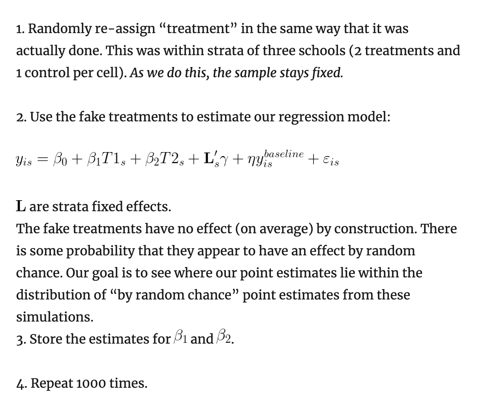

# Hypothesis testing, statistical comparisons and inferences

Note that ['Common statistical tests are linear models'](https://lindeloev.github.io/tests-as-linear/)

Many of the 'univariate' tests presented below can be extended to multiple-variable models (e.g., regression coefficients).

Further discussion, examples, and tables comparing the statistics by [Oska Fentem in his Notion here](https://www.notion.so/Hypothesis-testing-049768b23f3e44de96950121effbfcbe).

## Frequentist

### Parametric

### Nonparametric

## Randomization and permutation-based

Some relevant discussion of the difference between randomization inference and bootstrapping [here](https://jasonkerwin.com/nonparibus/2017/09/25/randomization-inference-vs-bootstrapping-p-values/)



My concern:

> ... we nearly always want to make inferences about the population that the treatment and control groups are taken from (even thinking about a hypothetical super-population), not about the impact on the sampled groups themselves. So, with this in mind, when would I still want to use randomization inference.

## Bayesian and hybrid

Hybrid: See 'Bayes Factor'

### Bayes factor -- what is it, what can it do? {#b-factor}

Anyone use Bayes factors? What I don't understand is which alternative hypothesis is chosen to compare to the null, or how I would be supposed to choose such an alternative hypothesis. Should I choose some minimal effect size of interest (MESOI)?

The Bayes factor is a likelihood ratio of the marginal likelihood of two competing hypotheses, usually a null and an alternative. (Wikipedia)

Don't I need to know which alternative we are considering to compute this?

> Response: Not sure what the MESOI is, but the choice of "null" or "alternative" hypothesis is arbitrary w/ Bayes factors, since you can interpret them in both directions.

DR: I agree about the arbitrariness (and I think that's a good thing) but I am mainly confused because our standard null hypothesis is a point null ('exactly zero effect') while our standard prior puts no mass on any points as far as I know.

Over [here](https://www.statisticshowto.com/bayes-factor-definition/) they say

> the Bayes factor gives us a way to evaluate the data in favor of a null hypothesis, and to use external information to do so. It tells us what the weight of the evidence is in favor of a given hypothesis.

But clearly there can be no way to express the 'evidence in favor of a null hypothesis relative to an alternative' if the alternative is allowed to include 'an extremely small effect'? (Or am I wrong... see further)

[Here](https://easystats.github.io/bayestestR/articles/bayes_factors.html) (more credible) they talk about a 'null region':

> One way of operationalizing the null-hypothesis is by setting a null region, such that an effect that falls within this interval would be practically equivalent to the null (Kruschke, 2010). In our case, that means defining a range of effects we would consider equal to the drug having no effect at all.

Or maybe I am wrong in my statement above. Reading further:

> comparing the estimated model against the a model in which the parameter of interest has been restricted to a point-null: Testing against the point-null (0) What if we don't know what region would be practically equivalent to 0? Or if we just want the null to be exactly zero? Not a problem - as the width of null region shrinks to a point, the change from the prior probability to the posterior probability of the null can be estimated by comparing the density of the null value between the two distributions.1 This ratio is called the Savage-Dickey ratio, and has the added benefit of also being an approximation of a Bayes factor

Tbh I'm confused here. I see how we can compare the density of the prior and posterior at this 'point null' point (e.g., 'B=0'), and see that (e.g.) the evidence suggests we update at least somewhat in favor of (or against) the null.

But I'm not sure how we could meaningfully express the 'posterior odds' if the prior distribution didn't put any point mass on a particular value, including the null.

So perhaps this works if we use a prior that puts some strictly positive probability on the exact effect $B=0$ (say, $pr(B=0)=1/2$) as well as a non-degenerate distribution of probabilities over the other effect sizes (say, normal/2) ?

\

Nik:

> Hmm, so BF are also known as ratios of marginal likelihoods, i.e., where the likelihood is marginalized (integrated over) the prior.

Define terms (notation from Wikipedia "Marginal likelihood')

IID points $\mathbf{X}=(x_1,\ldots,x_n),$ where $x_i \sim p(x_i|\theta)$ and $\theta$ is a random variable described by $\theta \sim p(\theta|\alpha)$

"the marginal likelihood in general asks what the probability $p(\mathbf{X}|\alpha)$ is, where $\theta$ has been ... integrated out"

DR first stab at it, doesn't make sense (unfold)

```{block2,  type='fold'}
"Marginal likelihoods": the sum of the likelihood of the data given each possible value of the parameter, weighted by the prior probability of that parameter. This should yield "the probability of the data given the prior". 

> > If there is a "single prior used for considering the null and alternative hypothesis" this would then be identical for each. So we must be doing something else here. Are we considering H0 and HA as distinct *priors*? I don't think so.

```

This makes more sense I guess:

"Marginal likelihood under H0" = $L_0= p\big(p(\mathbf{X}|\theta \in H_0\big)| \alpha)$ (not sure this notation is correct):

The sum of the likelihood of the data given each possible value of the parameter that is consistent with $H_0$, weighted by the prior probability of that parameter. This should yield "the probability of the data (given the prior) if H0 holds".

"Marginal likelihood under HA" = $L_A$: ...

(replace HA in above). This should yield "the probability of the data (given the prior) if HA holds"

Nik:

> The marginal likelihood is also the denominator term in Bayes theorem, and is basically a normalizing constant, there to re-scale the numerator to make sure everything integrates / sums to 1 according to the law of total probability.

DR: So with my second interpretation above we have "Marginal likelihood under H0" + "Marginal likelihood under HA" $L_0 + L_A= 1$

> In the discrete case, it's just taking the likelihood at every point in the prior, and then averaging them all together, weighted in proportion to the prior mass (in the continuous case, this is an integration step). It's basically giving a value proportional to your probability of observing the data, under the model in question (the model being composed of all the relations between parameters, the priors on those parameters, the distribution from which the data are drawn, etc.).

DR: OK, but how would these be different under H0 and HA... these both 'use the same prior' I presume. Is my take above approximately correct? (Can you correct it if not?)

> Nik: To get posterior odds, you're right that you'd need to have prior odds / probabilities on the models under consideration. Then it's just multiplying things out (and rescaling, if need be). The two (or more) models could indeed be a model that allows a parameter some distribution vs. a model that fixes that parameter to some number (like your B = 0), equivalent to giving the latter a point-mass prior at that value.

DR: Can we replace 'models' in the statement above with 'range of parameters given weight in the null and alternative hypotheses?'

> In that case, you wouldn't need to do do any integration / summation over that point mass prior, since it's not free to vary (and in practice, we're approximating all these integrals / averages numerically through a hodgepodge of algorithms)

DR: But if we were to use a 'point mass prior only' (e.g., we put $P=1$ on $B=0$) for both H0 and HA and H0 were that $B=0$ and HA that $B \neq 0$ this would not make sense. The prior must be something such as

$$Pr(B=0)=1/2$$ $$Pr(B=x \neq 0) \sim N(0,1)/2$$ Is that a reasonable way to frame it?

\

Nik:

> The question being asked by the marginal likelihood is "what is the probability of the data, averaged over the joint prior distribution from which model parameters are drawn", and then these marginal likelihoods can be used in the same way usual likelihoods can be used (it's just when we take their ratio, we call them 'Bayes Factors')

> Calculating a marginal likelihood is not unlike calculating a conventional likelihood in many cases, too, e.g., in models that allow overdispersion, you're averaging a Poisson mass over a Gamma, or a Binomial mass over a Beta, or whatever

DR: By 'conventional likelihood' are you referring to 'the likelihood of the data given a specific parameter' ... the thing that maximum likelihood procedures will express as a function, and then (take the log and) try to find the highest value of?

\

Nik:

> Another way to think about it is just to forget the terms likelihood, prior, posterior, Bayes, etc. Instead, just consider the probability model $M$, and its implied joint distribution of variables.

> Some of these variables are observed, and we call them observations, $X$. Some are unobserved, and we call them parameters, $\theta$.

> We can compute the density or mass of $X$ in this joint distribution, marginalizing / integrating over the unobserved variables $\theta$. Back in jargonland, this is the marginal likelihood of the model $P(X|M)$, though usually the $M$ is implied and we just write $P(X)$ to stick in the denominator of Bayes theorem.

> We can also ask the joint distribution the conditional distribution of $\theta$ given \$X, $P(\theta|X,M)$, or $P(\theta|X)$ for short, in an exactly analogous way to how we might compute, say, the conditional distribution of other joint distributions, like multivariate normals or more exotic stuff. This is also known as the "posterior distribution" of $\theta$, since it's the conditional distribution of $\theta$, i.e. conditional on the observed data. In this particular context though, we're interested in $P(X|M)$, and maybe also the corresponding value for some other model $P(X|M_{other})$. We can take the ratio of these -- a ratio of marginal likelihoods -- to get a Bayes Factor, and interpret it according to some IMO silly table. Or we could multiply them by model priors and rescale so things sum to 1 to get model posterior probabilities.

DR: This makes sense but it seems equivalent to the previous discussion; I don't see the distinction.

But the major question I have is sort of 'what approach will work to meaningfully asses the evidence for and against the null hypothesis'. "Against" -- this is what the standard p-value NHST presents. "For the null"... seems like it might work in a setup involving a prior putting positive probability mass on a point, but I'm not quite there yet.

## Packages: The "Infer" package in R

### Overview {.unnumbered}

Notes from [vignette](https://infer.tidymodels.org/articles/infer.html)

> we start by assuming that the observed data came from some world where "nothing is going on" (i.e. the observed effect was simply due to random chance), and call this assumption our null hypothesis.

> ... If this probability is below some pre-defined significance level $\alpha$, then we can reject our null hypothesis.

-   very much classical frequentist NHST
-   can this tool accommodate more informative measures like Bayes Factors (as I understand them) that do more than just 'accept vs reject' and get at the *strength of evidence*?

> `specify()` allows you to specify the variable, or relationship between variables, that you're interested in.

> `hypothesize()` allows you to declare the null hypothesis. generate() allows you to generate data reflecting the null hypothesis.

> `calculate()` allows you to calculate a distribution of statistics from the generated data to form the null distribution. ...

Vignette uses 'GSS' (a small extract from the US GSS)

```{r}

pacman::p_load(infer)

# load in the dataset
data(gss)

# take a look at its structure
dplyr::glimpse(gss)

```

### `specify()`: Specifying response (and explanatory) variables

**If we care about a single variable...**

```{r}
gss %>%
  specify(response = age)
```

```{r}
gss %>%
  specify(response = age) %>%
  class()

gss %>%
  specify(response = age) %>%
  str()
```

`specify` isn't just selecting a row; it's a special "S3 class object"

> the `infer` class has been appended on top of the dataframe classes

and it stores some extra meta-data. We see above something suggesting a particular null hypothesis test statistic distribution maybe?

\

"If you're interested in [the relationship between] two variables" we can specify this in one of two equivalent ways:

As a formula:

```{r, results='hide', message=FALSE}

gss %>%
specify(age ~ partyid)

```

Or with named arguments

```{r, results='hide', message=FALSE}

gss %>%
  specify(response = age, explanatory = partyid)

```

If we're doing inference on proportions we need to "use the success argument to specify which level of your response variable is a success."

```{r, results='hide', message=FALSE}
gss %>%
  specify(response = college, success = "degree") 

```

Or, with two variables ...

```{r, message=FALSE}

gss %>%
  specify(response = college, explanatory = partyid, success = "degree") %>% str()

```

Here it seems to be choosing a 'Chi-sq test of independence' perhaps?

### `hypothesize()`: Declaring the null hypothesis {.unnumbered}

> supply one of "independence" or "point" to the null argument.

```{r, results='hide', message=FALSE}

gss %>%
  specify(college ~ partyid, success = "degree") %>%
  hypothesize(null = "independence")

```

(This just adds another 'attribute' to the infer object)

> If you're doing inference on a point estimate, you will also need to provide one of $p$ (the true proportion of successes, between 0 and 1), \$mu\$ (the true mean), \`med (the true median), or $\sigma$ (the true standard deviation). For instance, if the null hypothesis is that the mean number of hours worked per week in our population is 40, we would write:

```{r, results='hide', message=FALSE}

gss %>%
  specify(response = hours) %>%
  hypothesize(null = "point", mu = 40)
```

::: {.marginnote}
This adds three attributes: `null`="point", `params`=40, and `names`="mu".
:::

### `generate()`: Generating the null distribution {.unnumbered}

```{block2,  type='note'}

I believe this step is skipped for 'theory-based inference' (where we  the null distribution has been proven with maths, and so we don't need to do any simulation work).

```

> construct a null distribution based on this hypothesis ... using one of several methods, supplied in the type argument:

> `bootstrap`: for each replicate ... a sample of size equal to the input sample size is drawn (with replacement) from the input sample data.

> `permute`: For each replicate, each input value will be randomly reassigned (without replacement) to a new output value in the sample.

> `simulate`: A value will be sampled from a theoretical distribution with parameters specified in `hypothesize()` for each replicate. (... currently only applicable for testing point estimates.)

```{r}

try_point_null_bootstrap <- gss %>%
  specify(response = hours) %>%
  hypothesize(null = "point", mu = 40) %>%
  generate(reps = 1000, type = "bootstrap")

try_point_null_bootstrap %>% filter(replicate<=5) %>% sumtab(hours, replicate)
```

> To generate a null distribution for the independence of two variables, we could also randomly reshuffle the pairings of explanatory and response variables to break any existing association. For instance, to generate 1000 replicates that can be used to create a null distribution under the assumption that political party affiliation is not affected by age:

I did it with only 3 reps and 4 obs just to be able to see it better:

```{r}

gss[1:4,]

try_indep_null_permute <- gss[1:4,] %>%
  specify(partyid ~ age) %>%
  hypothesize(null = "independence") %>%
  generate(reps = 3, type = "permute")

try_indep_null_permute

try_indep_null_permute %>% str()

```

### `calculate()`: ... Summary statistics {.unnumbered}

> Depending on whether you're carrying out computation-based inference or theory-based inference, you will either supply calculate() with the output of generate() or hypothesize, respectively.

As noted above, it seems the `generate` step is skipped when the null distribution is known from theory.

`calculate` takes a `stat` argument

> which is currently one of "mean", "median", "sum", "sd", "prop", "count", "diff in means", "diff in medians", "diff in props", "Chisq", "F", "t", "z", "slope", or "correlation".

> For example, continuing our example above to calculate the null distribution of mean hours worked per week:

```{r}
gss %>%
  specify(response = hours) %>%
  hypothesize(null = "point", mu = 40) %>%
  generate(reps = 1000, type = "bootstrap") %>%
  calculate(stat = "mean")
```

> The output of calculate() here shows us the sample statistic (in this case, the mean) for each of our 1000 replicates.

Note that if we change the point null being tested the replication values and the statistics both change:

```{r}
gss[1:3,] %>%
  specify(response = hours) %>%
  hypothesize(null = "point", mu = 200) %>%
  generate(reps = 10, type = "bootstrap") %>%
  calculate(stat = "mean")
```

I raised this [issue](https://github.com/tidymodels/infer/issues/407)

... continuing and trying to ignore this....

\

> If you're carrying out inference on differences in means, medians, or proportions, or t and z statistics, you will need to supply an order argument, giving the order in which the explanatory variables should be subtracted. For instance, to find the difference in mean age of those that have a college degree and those that don't, we might write:

```{r}
gss %>%
  specify(hours ~ sex) %>%
  hypothesize(null = "independence") %>%
  generate(reps = 100, type = "permute") %>%
  calculate("diff in medians", order = c( "male", "female"))

```

I'm guessing it is doing something like sampling from the empirical deviations from the mean ('residuals) and adding these to the point null? Or maybe estimating a standard error and doing similar?

### Other utilities: `visualize`, `get_p_value`, `get_confidence_interval()`

```{r}

# find the point estimate
point_estimate <- gss %>%
  specify(response = hours) %>%
  calculate(stat = "mean")

point_estimate %>% str()
```

This calculates a single statistic using a similar syntax, creating a similar object... even if we skip the hypothesize (and generate) steps.

```{r}

# generate a null distribution
null_dist <- gss %>%
  specify(response = hours) %>%
  hypothesize(null = "point", mu = 40) %>%
  generate(reps = 1000, type = "bootstrap") %>%
  calculate(stat = "mean")

```

> Our point estimate 41.382 seems pretty close to 40, but a little bit different. We might wonder if this difference is just due to random chance, or if the mean number of hours worked per week in the population really isn't 40.

> Where does our sample's observed statistic lie on this distribution? We can ... visualize the null distribution ... [and] use the obs_stat argument to specify this.

```{r}

null_dist %>%
  visualize() +
  shade_p_value(obs_stat = point_estimate, direction = "two-sided")
```

(Note that visualize() yields a ggplot object; I wonder if we can use ggplot2 more directly?)

Trying another example:

```{r}

null_hours <- gss %>% 
  specify(hours ~ partyid) %>%
  hypothesize(null = "independence") %>%
  generate(reps = 1000, type = "permute") %>%
  calculate("diff in means", order = c( "dem", "rep", "ind"))

point_estimate_hours <- (mean(gss$hours[gss$sex=="male"]) - mean(gss$hours[gss$sex=="female"]))

null_wt %>%
  visualize() +
  shade_p_value(obs_stat = point_estimate_hours, direction = "two-sided")
```

\`\`\`
